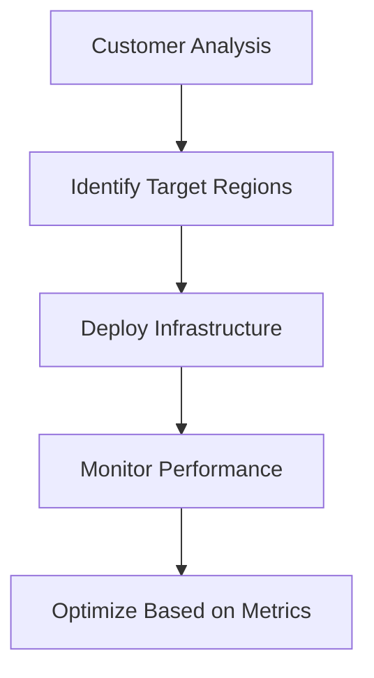
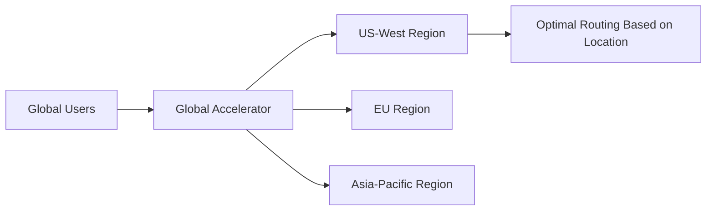

# Session 03: EC2 Remote Access, SOCKS Proxy, and Global Infrastructure

<details open>
<summary><b>Session 03 17th Feb (Opus 4)</b></summary>

## Table of Contents
- [Overview](#overview)
- [EC2 Remote Access Methods](#ec2-remote-access-methods)
- [SSH Protocol Fundamentals](#ssh-protocol-fundamentals)
- [SOCKS Proxy and SSH Tunneling](#socks-proxy-and-ssh-tunneling)
- [AWS Global Infrastructure](#aws-global-infrastructure)
- [Global Accelerator Introduction](#global-accelerator-introduction)
- [Summary](#summary)

## Overview
This session covers essential EC2 remote access methods using SSH protocol, demonstrates practical SOCKS proxy setup for secure tunneling and identity masking, introduces AWS's global infrastructure concepts, and provides an initial overview of the Global Accelerator service for optimizing application performance worldwide.

**Key Concepts**: SSH remote access, SOCKS5 proxy configuration, tunneling concepts, global infrastructure, latency optimization, AWS regions and data centers.

## EC2 Remote Access Methods

### Browser-Based Access Limitations
AWS EC2 provides direct browser connectivity only for specific operating systems:

- **Amazon Linux**: Full browser-based access via AWS console
- **Ubuntu flavors**: Limited browser access support
- **Red Hat Linux**: No browser-based access (requires SSH)
- **Other distributions**: Generally require SSH protocol access

```bash
# Browser access works for Amazon Linux
# For other distributions, SSH is required
```

### Why SSH is Required
When launching EC2 instances with non-supported operating systems:

1. **Security Restrictions**: AWS limits browser access to prevent security vulnerabilities
2. **OS Compatibility**: Only specific Linux distributions support browser connectivity
3. **Network Protocols**: SSH provides encrypted remote access regardless of OS

> [!NOTE]
> Always download and securely store your private key (.pem file) when launching instances, as this serves as your authentication credential.

## SSH Protocol Fundamentals

### SSH Connection Requirements
To establish remote SSH connections, three essential components are required:

| Component | Description | Source |
|-----------|-------------|--------|
| **IP Address** | Public IP of the target EC2 instance | AWS Console |
| **Username** | Account name for authentication | Typically `ec2-user` for Amazon Linux |
| **Authentication** | Password or Private Key | User-provided or downloaded .pem file |

### Basic SSH Command Structure
```bash
# Basic SSH connection syntax
ssh -i <private-key.pem> ec2-user@<public-ip-address>

# Example for connecting to EC2 instance
ssh -i red-hat-key.pem ec2-user@54.123.45.67
```

### SSH Client Tools
Different operating systems provide various SSH clients:

- **Windows Command Prompt**: Built-in SSH client available in modern Windows
- **Git Bash**: Popular third-party SSH client for Windows
- **macOS Terminal**: Native SSH support
- **Linux Terminal**: Native SSH support

### Common SSH Connection Issues
- **Host Key Verification**: First-time connections prompt for host verification
- **Permission Issues**: Ensure .pem file has correct permissions (chmod 400)
- **Network Connectivity**: Verify security group rules allow SSH (port 22)

## SOCKS Proxy and SSH Tunneling

### Understanding SOCKS Proxy Concept
SOCKS (Socket Secure) proxy creates an encrypted tunnel between your local machine and a remote server, enabling:

- **Identity Masking**: Hide original IP address
- **Location Spoofing**: Appear to connect from remote server's location
- **Secure Tunneling**: Encrypted communication channel
- **Testing Scenarios**: Simulate connections from different geographic locations

### Technical Architecture
```
Local Machine (Jaipur) → SSH Tunnel → EC2 Instance (Virginia) → Internet
                                       (Appears as source)
```

### Setting Up SOCKS5 Proxy via SSH

#### Step 1: Launch Target EC2 Instance
```bash
# Key concepts for EC2 instance selection:
# - Choose appropriate region (e.g., us-east-1 for US East)
# - Select suitable AMI (Amazon Linux, Ubuntu, etc.)
# - Download private key securely
```

#### Step 2: Establish SOCKS Tunnel
```bash
# SOCKS5 proxy setup command
ssh -D 9999 -N -i <private-key.pem> ec2-user@<instance-ip>

# Parameters explained:
# -D 9999: Create SOCKS proxy on local port 9999
# -N: Don't execute remote command (tunnel only)
# -i: Specify private key file
```

#### Step 3: Configure Browser Proxy Settings
```bash
# Chrome browser proxy configuration (Windows)
chrome.exe --proxy-server="socks5://127.0.0.1:9999"

# Verify location change by checking IP address
# Visit ip-address detection websites to confirm
```

### SOCKS Proxy Applications

#### Testing and Development
- **Geographic Testing**: Test applications from different regions
- **Performance Analysis**: Measure latency from various locations
- **Compliance Testing**: Verify regional restrictions and regulations

#### Security Considerations
> [!IMPORTANT]
> SOCKS proxy setup should only be used for legitimate purposes such as testing and security research. Misuse for malicious activities is illegal and unethical.

### Practical SOCKS Setup Example
```bash
# Complete SOCKS proxy setup workflow:

# 1. Connect with SOCKS tunnel
ssh -D 1998 -N -i aws-virginia-key.pem ec2-user@52.123.45.67

# 2. Configure Chrome to use proxy on port 1998
# 3. Verify location appears as Virginia, US
# 4. Terminate tunnel with Ctrl+C when done
```

## AWS Global Infrastructure

### Multi-Region Architecture Benefits
AWS maintains data centers worldwide for several strategic reasons:

#### Performance Optimization
- **Latency Reduction**: Deploy applications closer to end users
- **Regional Compliance**: Meet data residency requirements
- **Disaster Recovery**: Geographic redundancy for business continuity

#### Customer-Centric Deployment Strategy


### Key Infrastructure Concepts

#### Regions vs. Availability Zones
| Component | Definition | Purpose |
|-----------|------------|---------|
| **Region** | Geographic area with multiple data centers | High-level deployment unit |
| **Availability Zone** | Isolated data center within a region | Fault tolerance and redundancy |

#### Global View Feature
AWS recently introduced Global View functionality that provides:
- Consolidated view of all regional resources
- Quick identification of running instances across regions
- Cost optimization by identifying forgotten resources

```bash
# Access Global View through AWS Console
# EC2 Dashboard → Global View toggle
# Shows instance counts per region globally
```

## Global Accelerator Introduction

### Problem Statement
Traditional deployment challenges include:
- **High Latency**: Long-distance connections increase response times
- **Poor User Experience**: Distant users experience delays
- **Inconsistent Performance**: Varying network conditions globally

### Solution Overview
Global Accelerator addresses these challenges by:
- **Traffic Direction**: Routes users to optimal regional endpoints
- **Performance Improvement**: Reduces latency for global users
- **Intelligent Routing**: Automatically directs to best-performing regions

### Use Case Example


> [!NOTE]
> Global Accelerator is an advanced AWS service that will be explored in detail in subsequent sessions, building upon the foundational concepts introduced here.

## Summary

### Key Takeaways

```diff
+ EC2 provides multiple remote access methods depending on OS support
+ SSH protocol enables secure remote connections to any Linux instance
+ SOCKS proxy creates encrypted tunnels for identity masking and testing
+ AWS global infrastructure enables optimal geographic deployment
+ Global Accelerator optimizes worldwide application performance
- Browser-based EC2 access is limited to specific operating systems
- SOCKS proxy requires proper SSH tunnel configuration
- Multi-region deployment requires careful planning and monitoring
```

### Quick Reference

#### SSH Connection Commands
```bash
# Basic SSH connection
ssh -i key.pem ec2-user@public-ip

# SOCKS5 proxy tunnel
ssh -D port -N -i key.pem ec2-user@public-ip
```

#### Browser Proxy Configuration
```bash
# Chrome with SOCKS proxy
chrome.exe --proxy-server="socks5://127.0.0.1:port"
```

### Expert Insight

#### Real-world Application
SOCKS proxy tunneling is commonly used in:
- **DevOps Testing**: Simulating global user access patterns
- **Security Auditing**: Testing geographic restrictions and compliance
- **Performance Monitoring**: Measuring application behavior from different regions

#### Expert Path
To master these concepts:
1. Practice SSH connections across different operating systems
2. Experiment with various SOCKS proxy configurations
3. Understand AWS region selection strategies for global applications
4. Explore Global Accelerator configuration and optimization techniques

#### Common Pitfalls
- **Key Permission Issues**: Ensure .pem files have correct permissions (400)
- **Port Conflicts**: Verify SOCKS proxy ports are not in use
- **Security Group Rules**: Configure AWS security groups to allow SSH traffic
- **Resource Cleanup**: Use Global View to identify and stop unused instances

</details>