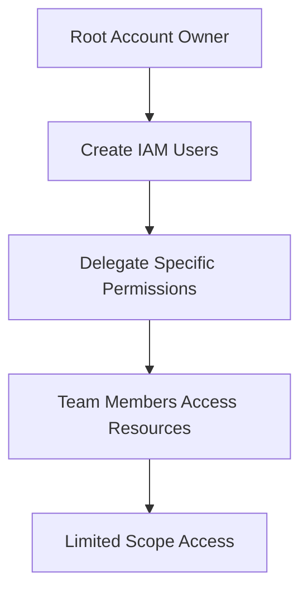
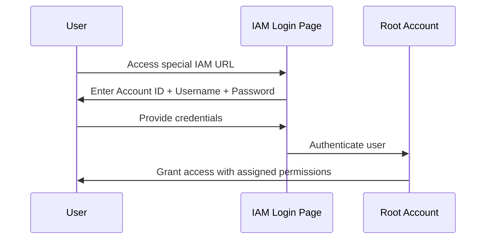
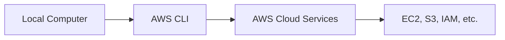

# Session 06: CloudWatch Monitoring, IAM Security, and AWS CLI Fundamentals

<details open>
<summary><b>Session 06 24th Feb (Opus 4)</b></summary>

## Table of Contents
- [Overview](#overview)
- [CloudWatch Monitoring Service](#cloudwatch-monitoring-service)
- [Identity and Access Management (IAM)](#identity-and-access-management-iam)
- [AWS CLI Introduction](#aws-cli-introduction)
- [Summary](#summary)

## Overview
This session introduces three foundational AWS services: CloudWatch for monitoring and metrics collection, IAM for identity and access management with practical user creation and permission assignment, and provides an introduction to AWS Command Line Interface (CLI) as an alternative to the web console for managing AWS resources.

**Key Concepts**: Resource monitoring, metrics collection, user management, access policies, permission delegation, CLI vs GUI interfaces, API concepts.

## CloudWatch Monitoring Service

### Understanding Resource Monitoring
When using AWS services like EC2, multiple physical resources are consumed:

| Resource Type | Examples | Monitoring Need |
|---------------|----------|-----------------|
| **Compute** | CPU utilization, processing power | Track usage percentages |
| **Memory** | RAM allocation (e.g., 10GB) | Monitor free vs used memory |
| **Storage** | EBS volumes, disk I/O | Track read/write operations |
| **Network** | Bandwidth, data transfer | Monitor inbound/outbound traffic |

### Why Monitoring is Essential

#### Cost Optimization
```diff
+ Monitor resource utilization to make cost-effective decisions
+ Identify underutilized resources for downgrading
+ Example: 10GB RAM with only 10% usage → Consider 1GB instance
```

#### Performance Management
```diff
+ Track application performance metrics
+ Identify bottlenecks before user impact
+ Network bandwidth saturation causes slow responses
```

### CloudWatch Core Concepts

#### Metrics Definition
**Metrics** are quantifiable measurements that CloudWatch collects and stores:

- **CPU Utilization**: Percentage of CPU being used
- **Memory Usage**: Available vs. used RAM
- **Network Packets**: Data transfer in/out statistics
- **Disk I/O**: Read/write operations on storage

#### Automatic Monitoring Capabilities
CloudWatch provides built-in monitoring for:
- **EC2 Instances**: CPU, network, disk metrics
- **EBS Volumes**: Storage performance metrics
- **S3 Buckets**: Request and data transfer metrics
- **All AWS Services**: Automatic metric collection where applicable

### CloudWatch Interface Navigation
```bash
# Access CloudWatch through AWS Console
# Navigate to CloudWatch → Metrics tab
# View resource-specific metrics by service
```

#### Key CloudWatch Features (Preview)
- **Metrics**: Quantitative measurements of resources
- **Logs**: Application and system log aggregation
- **Alarms**: Automated responses to metric thresholds
- **Events**: Automated reactions to AWS resource changes
- **X-Ray**: Application performance tracing
- **Dashboards**: Custom visualization of metrics

> [!NOTE]
> This session provides CloudWatch introduction only. Detailed exploration of metrics creation, custom dashboards, and advanced features will be covered in dedicated CloudWatch sessions.

## Identity and Access Management (IAM)

### Understanding Root vs. Sub Accounts

#### Root Account Characteristics
- Created with initial email and payment method
- **Full administrative access** to all AWS services
- **Security risk** when used for daily operations
- Should be reserved for billing and account management only

#### Business Need for Sub Accounts


#### Real-World IAM Use Cases
1. **Team Collaboration**: Multiple developers need AWS access
2. **Role-Based Access**: Different team members need different permissions
3. **Security Best Practices**: Avoid using root credentials daily
4. **Audit Trail**: Track who performed which actions

### IAM Core Concepts

#### Key Terminology
| Term | Definition | AWS Implementation |
|------|------------|-------------------|
| **Identity** | Who you are | Username/password combination |
| **Access** | What you can do | Permissions and policies |
| **Users** | IAM accounts within root account | Sub-accounts with limited scope |
| **Policies** | Permission definitions | JSON documents defining allowed actions |

#### Permission Types
- **Full Access**: Complete control over service (create, read, update, delete)
- **Read-Only Access**: View resources without modification capability
- **Limited Access**: Specific actions only within a service

### Practical IAM Implementation

#### Creating IAM Users

##### Step 1: User Creation
```bash
# Console Navigation: IAM → Users → Add User
# Required Information:
# - Username (e.g., "tom", "eric")
# - Console Access: Enable AWS Management Console access
# - Password: Custom or auto-generated
# - Password Reset: Force change on first login (recommended)
```

##### Step 2: Permission Assignment
```bash
# Attach Policies During Creation:
# Example Policy Options:
# - AmazonEC2ReadOnlyAccess
# - AmazonS3FullAccess
# - AdministratorAccess (use with caution)
```

#### IAM User Login Process


#### Permission Management Best Practices
```diff
+ Create users with minimal required permissions initially
+ Use groups for managing permissions across multiple users
+ Regularly audit and update user permissions
+ Implement password policies and MFA for enhanced security
- Avoid giving AdministratorAccess unless absolutely necessary
- Never share IAM user credentials between individuals
```

### Practical Permission Examples

#### Read-Only EC2 Access
- User can view instances, security groups, and configurations
- Cannot launch, terminate, or modify EC2 resources
- Useful for monitoring and reporting roles

#### Full EC2 Access
- Complete control over EC2 instances
- Can launch, terminate, modify, and configure all EC2 resources
- Appropriate for infrastructure management roles

#### Service-Specific Access Patterns
```yaml
User: Tom
Permissions:
  - Service: EC2
    Access: Read-Only
  - Service: S3
    Access: None

User: Eric
Permissions:
  - Service: EC2
    Access: Full Access
  - Service: S3
    Access: Full Access
  - Service: All Services
    Access: Administrator Access (with caution)
```

### IAM Security Considerations
> [!IMPORTANT]
> AdministratorAccess grants permissions equivalent to root account across all services except billing management. Use sparingly and only for trusted administrators.

## AWS CLI Introduction

### Multiple AWS Access Methods

#### 1. Web Console (GUI)
- **Browser-based interface**
- Point-and-click resource management
- Visual representation of AWS services
- Best for: Learning, occasional use, visual tasks

#### 2. Command Line Interface (CLI)
- **Text-based interface**
- Script automation capabilities
- Bulk operations support
- Best for: Automation, scripting, bulk operations

#### 3. Application Programming Interface (API)
- **Programmatic access**
- Custom application integration
- Mobile and web app development
- Best for: Custom solutions, integration, automation

### CLI Architecture Overview


### CLI Benefits and Use Cases

#### Automation Advantages
```diff
+ Script repetitive tasks for consistency
+ Bulk operations across multiple resources
+ Integration with CI/CD pipelines
+ Infrastructure as Code implementations
```

#### Programmatic Access
```bash
# Examples of CLI operations:
# aws ec2 describe-instances
# aws s3 ls s3://bucket-name
# aws iam list-users
```

### Transition to CLI
> [!NOTE]
> This session introduces AWS CLI concepts. Practical CLI configuration and usage commands will be demonstrated in subsequent sessions, building upon the IAM and monitoring foundations established here.

## Summary

### Key Takeaways

```diff
+ CloudWatch provides essential monitoring capabilities for all AWS resources
+ Metrics enable data-driven decisions for cost optimization and performance tuning
+ IAM enables secure delegation of AWS access without sharing root credentials
+ Permission policies provide granular control over service access
+ AWS CLI offers programmatic alternative to web console for automation
- CloudWatch introduction covers basics only - advanced features require dedicated study
- IAM AdministratorAccess should be granted cautiously
- CLI requires additional setup and configuration (covered in future sessions)
```

### Quick Reference

#### CloudWatch Key Metrics
```bash
# Common EC2 Metrics Monitored:
# - CPUUtilization (%)
# - NetworkIn/Out (bytes)
# - DiskRead/Write (bytes)
# - StatusCheckFailed (count)
```

#### IAM User Creation Workflow
```bash
# 1. Navigate to IAM → Users → Add User
# 2. Configure username and console access
# 3. Attach appropriate policies
# 4. Provide login credentials via IAM URL
# 5. Manage permissions through user policy updates
```

### Expert Insight

#### Real-world Application
**IAM in Enterprise Environments**:
- Implement least-privilege access principles
- Use IAM groups for role-based access control
- Enable AWS CloudTrail for comprehensive audit logging
- Implement MFA for all IAM users with console access

**CloudWatch in Production**:
- Create custom CloudWatch dashboards for team visibility
- Set up CloudWatch Alarms for proactive incident response
- Use CloudWatch Logs Insights for application troubleshooting
- Implement automated remediation through CloudWatch Events

#### Expert Path
To advance your AWS expertise:

1. **CloudWatch Mastery**:
   - Learn custom metric creation
   - Master CloudWatch Logs and Insights
   - Implement comprehensive alerting strategies

2. **IAM Advanced Topics**:
   - Study IAM policy language and JSON structure
   - Implement IAM roles for service-to-service access
   - Explore identity federation and SSO integration

3. **CLI Proficiency**:
   - Master AWS CLI configuration and profiles
   - Learn CLI scripting and automation patterns
   - Integrate CLI with infrastructure-as-code tools

#### Common Pitfalls
- **Over-privileged IAM Users**: Start with minimal permissions
- **Ignoring CloudWatch Costs**: High-resolution metrics increase charges
- **Root Account Daily Use**: Reserve root for billing and emergency access only
- **Missing CLI Prerequisites**: Ensure proper AWS credentials configuration before CLI usage

</details>