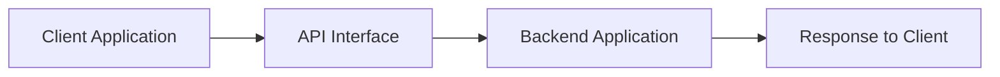
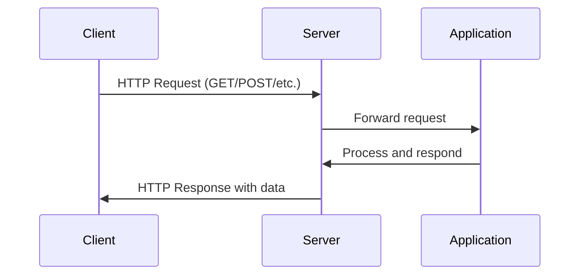
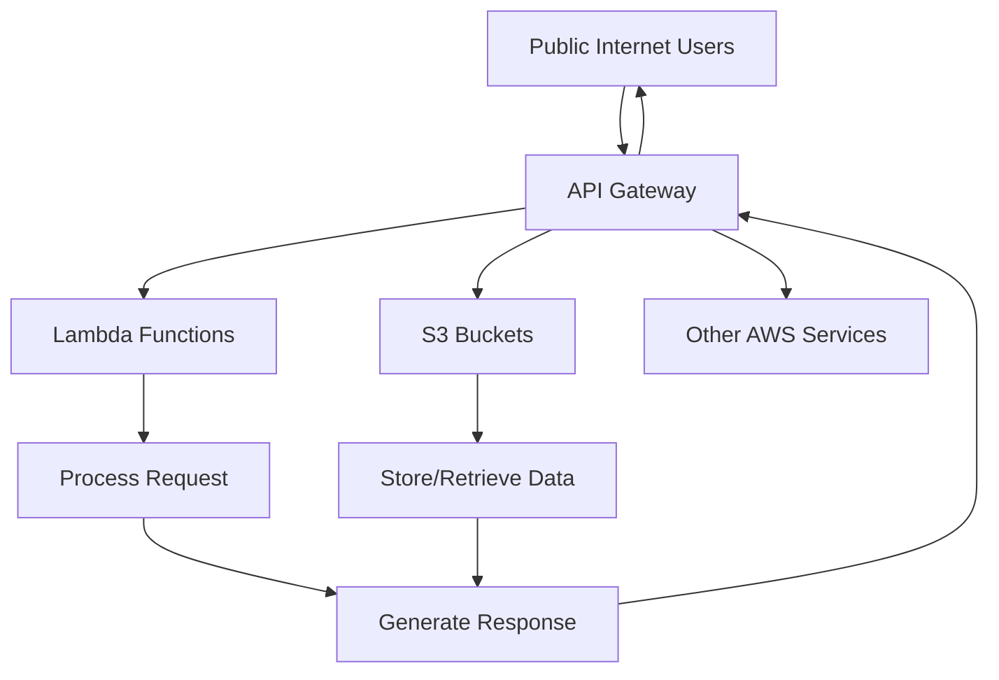
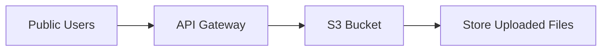
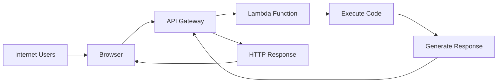
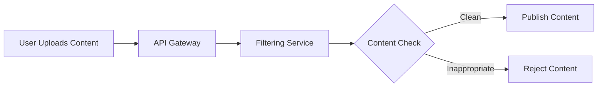
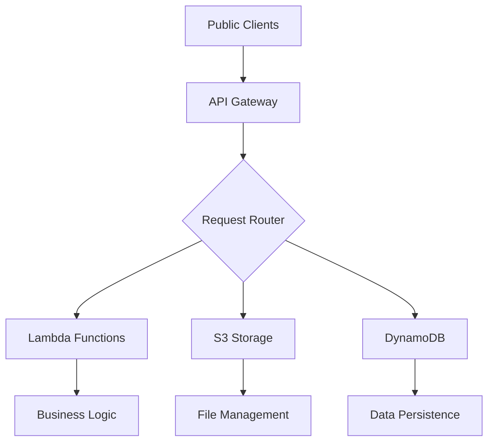

# Session 08: API Gateway - REST API Concepts and Serverless Integration

<details open>
<summary><b>Session 08 26th Feb (Opus 4)</b></summary>

## Table of Contents
- [Overview](#overview)
- [Understanding APIs and REST Concepts](#understanding-apis-and-rest-concepts)
- [HTTP Protocol Fundamentals](#http-protocol-fundamentals)
- [AWS API Gateway Introduction](#aws-api-gateway-introduction)
- [Real-World Use Cases](#real-world-use-cases)
- [Serverless Architecture Integration](#serverless-architecture-integration)
- [Summary](#summary)

## Overview
This session provides a comprehensive introduction to AWS API Gateway, starting with fundamental REST API concepts and HTTP protocol mechanics, then exploring practical serverless integrations with S3 and Lambda services. The session emphasizes real-world use cases where public internet users can access AWS resources without requiring AWS accounts.

**Key Concepts**: API concepts, REST architecture, HTTP methods (GET, POST, PUT, DELETE, PATCH), API Gateway as a proxy service, serverless integration patterns, public access to AWS resources.

## Understanding APIs and REST Concepts

### What is an API?
**API (Application Programming Interface)** is a concept that provides an interface between applications, enabling communication between different software components.



### Lambda Function as an Application
In the context of AWS Lambda:

| Component | Description | AWS Implementation |
|-----------|-------------|-------------------|
| **Function** | Small program performing specific tasks | Lambda function with code |
| **Event** | Input data triggering the function | JSON payload from triggers |
| **Context** | Runtime information provided by AWS | Execution environment details |
| **Response** | Output returned by the function | Data returned via `return` statement |

### Function Code Example
```python
def linux_world(event, context):
    return "I am Linux world"
```

### Application Concept Evolution
```diff
+ Function: Code block that performs a task
+ Application: Function implementing a feature or service
+ API: Interface enabling external access to applications
```

## HTTP Protocol Fundamentals

### URL Structure and Hidden Information
When accessing websites, browsers hide several components from users:

```
https://www.example.com/path
│      │   │         │
│      │   │         └── Path/Resource
│      │   └──────────── Domain
│      └──────────────── Protocol (HTTPS)
└─────────────────────── Protocol Indicator
```

### HTTP Methods (Verbs/Actions)
HTTP methods define the intended action for a request:

| Method | Purpose | Data Flow | Common Use Cases |
|--------|---------|-----------|------------------|
| **GET** | Retrieve/Read data | Client ← Server | Viewing web pages, downloading content |
| **POST** | Create/Send data | Client → Server | Submitting forms, uploading content |
| **PUT** | Update/Replace data | Client ↔ Server | Modifying existing resources |
| **PATCH** | Partial update | Client → Server | Updating specific fields |
| **DELETE** | Remove data | Client → Server | Deleting resources |

### Protocol Headers and Methods
```diff
+ Headers contain metadata about the request
+ HTTP method is specified in the request header
+ Browsers automatically handle method selection for basic interactions
+ Developer tools reveal the actual HTTP communication
```

### Browser Developer Tools Inspection
```javascript
// Access via: Right-click → Inspect → Network tab
// Observe HTTP requests and responses
// Headers show method, protocol, and metadata
```

### Request-Response Pattern


## AWS API Gateway Introduction

### The Proxy Service Concept
API Gateway serves as a **proxy** between external clients and AWS backend services:



### Serverless Characteristics
```diff
+ Fully managed by AWS - no server provisioning required
+ Automatic scaling based on demand
+ Pay-per-use pricing model
+ No infrastructure management overhead
```

### API Gateway Core Functionality
1. **Request Routing**: Direct incoming requests to appropriate backend services
2. **Protocol Translation**: Convert HTTP/HTTPS requests to service-specific calls
3. **Response Formatting**: Transform backend responses to HTTP responses
4. **Authentication**: Validate and authorize incoming requests
5. **Rate Limiting**: Control request frequency and prevent abuse

## Real-World Use Cases

### Use Case 1: Public S3 Access
**Challenge**: Enable public internet users to upload files to S3 without AWS accounts



**Solution Components**:
- API Gateway endpoint accepting HTTP POST requests
- Integration with S3 for file storage
- Security policies allowing controlled public access

### Use Case 2: Lambda Function Invocation
**Challenge**: Allow external users to execute Lambda functions and receive responses



**Implementation**:
- API Gateway REST API creation
- Lambda function integration
- HTTP method configuration (GET/POST)
- Response mapping and formatting

### Use Case 3: Subscription-Based Content Access
**Challenge**: Implement tiered access plans (Basic, Standard, Premium)

```yaml
Access Plans:
  Basic:
    - Videos: 30 days free access
    - Quality: Standard definition
  Standard:
    - Videos: Extended library access
    - Quality: HD format
  Premium:
    - Videos: Full library access
    - Quality: 4K/HD format
    - Speed: Enhanced performance
```

### Use Case 4: Content Filtering and Moderation
**Challenge**: Filter inappropriate content before public display



## Serverless Architecture Integration

### Multi-Service Integration Pattern


### Integration Benefits
```diff
+ Seamless connectivity between serverless services
+ Unified entry point for multiple backend services
+ Consistent authentication and authorization
+ Centralized logging and monitoring
+ Cost-effective scaling for variable workloads
```

### Development and Deployment Strategy
```yaml
Development Phases:
  Phase 1: Basic API Gateway setup and Lambda integration
  Phase 2: S3 integration for public file access
  Phase 3: Authentication and API key management
  Phase 4: Usage plans and rate limiting
  Phase 5: Advanced deployment strategies (canary deployments)
```

## API Gateway Advanced Concepts (Preview)

### Security and Access Control
- **API Keys**: Unique identifiers for API consumers
- **Usage Plans**: Rate limiting and quota management
- **Authentication**: Integration with Cognito, IAM, or custom authorizers
- **CORS Configuration**: Cross-Origin Resource Sharing setup

### Deployment Strategies
- **Canary Deployments**: Gradual rollout of API changes
- **Stage Variables**: Environment-specific configurations
- **Blue-Green Deployments**: Zero-downtime updates

### Monitoring and Analytics
- **Request/Response Logging**: Detailed API usage analytics
- **Performance Metrics**: Latency, error rates, and throughput
- **Usage Analytics**: Client behavior and API consumption patterns

## Summary

### Key Takeaways

```diff
+ API Gateway provides a serverless interface between public clients and AWS services
+ REST API concepts form the foundation of modern web service communication
+ HTTP methods (GET, POST, PUT, DELETE, PATCH) define client intentions
+ API Gateway acts as a proxy, handling protocol translation and request routing
+ Serverless integration enables public access to S3, Lambda, and other AWS services
+ Real-world applications include user-generated content, subscription services, and content moderation
- API Gateway requires understanding of HTTP protocols and REST architecture
- Security considerations are crucial when exposing AWS resources publicly
- Usage plans and authentication mechanisms need careful planning
```

### Quick Reference

#### HTTP Methods Quick Guide
```bash
# GET - Retrieve data
curl -X GET https://api.example.com/users

# POST - Create data
curl -X POST https://api.example.com/users -d '{"name": "John"}'

# PUT - Replace data
curl -X PUT https://api.example.com/users/123 -d '{"name": "Jane"}'

# DELETE - Remove data
curl -X DELETE https://api.example.com/users/123
```

#### API Gateway Integration Patterns
```yaml
Client Request:
  Protocol: HTTPS
  Method: GET/POST/PUT/DELETE
  Endpoint: API Gateway URL

API Gateway Processing:
  - Authentication validation
  - Request transformation
  - Backend service invocation

Backend Response:
  - Lambda execution
  - S3 operations
  - Database queries

Client Response:
  - HTTP status codes
  - JSON/XML data
  - Error handling
```

### Expert Insight

#### Real-world Application
**E-commerce Platform Integration**:
- Product catalog APIs (GET requests to DynamoDB)
- Order processing (POST requests to Lambda functions)
- File uploads for product images (POST to S3 via API Gateway)
- User management and authentication

**Content Management System**:
- Article publishing workflow with content moderation
- Multi-tier subscription access control
- User-generated content with upload capabilities
- Real-time content delivery optimization

#### Expert Path
To master API Gateway and serverless integration:

1. **Foundational Skills**:
   - Deep dive into REST API design principles
   - Master HTTP protocol details and headers
   - Understand authentication and authorization mechanisms

2. **Advanced Topics**:
   - API Gateway request/response mapping templates
   - Custom authorizers and Lambda authorizers
   - API versioning and backward compatibility
   - Performance optimization and caching strategies

3. **Production Considerations**:
   - Monitoring and alerting strategies
   - Cost optimization techniques
   - Security best practices and compliance
   - CI/CD integration for API deployments

#### Common Pitfalls
- **Security Misconfiguration**: Exposing sensitive resources without proper authentication
- **Performance Issues**: Not implementing caching for frequently accessed endpoints
- **Cost Overruns**: Lack of usage plan limits leading to unexpected charges
- **Integration Complexity**: Over-engineering simple use cases without proper planning

</details>