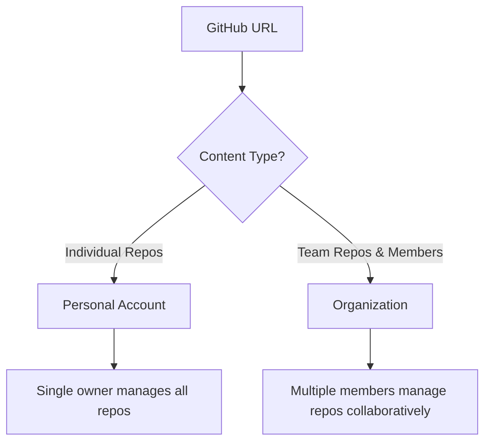

# Section 16: Organizations And Accounts

<details open>
<summary><b>Section 16: Organizations And Accounts (KK-CS45-script-v2-Inst-v1)</b></summary>

## Table of Contents

- [16.1 Understanding GitHub Accounts vs Organizations](#161-understanding-github-accounts-vs-organizations)
- [16.2 Key Differences Between Accounts and Organizations](#162-key-differences-between-accounts-and-organizations)
- [16.3 Real-World Example: Teaching Organization](#163-real-world-example-teaching-organization)
- [16.4 Creating an Organization](#164-creating-an-organization)
- [16.5 Organization Use Cases and Benefits](#165-organization-use-cases-and-benefits)

---

## 16.1 Understanding GitHub Accounts vs Organizations

**Overview**: GitHub accounts and organizations serve different purposes, though their URLs appear identical. Understanding the distinction is crucial for proper repository management and team collaboration.

**Key Concepts**:

- **Account URL Appearance**: The URL format (e.g., github.com/username) doesn't distinguish between personal accounts and organizations
- **Personal Account**: Individual repositories owned and managed by a single user
- **Organization**: Shared workspace for teams, companies, or groups to collaboratively manage repositories

```diff
! Account Type → URL Format → Ownership Model
+ Personal Account → github.com/yourusername → Individual ownership
+ Organization → github.com/organizationname → Team/shared ownership
```

**Visual Identification**:


---

## 16.2 Key Differences Between Accounts and Organizations

**Overview**: While URLs look the same, accounts and organizations differ significantly in their purpose, structure, and use cases.

**Key Differences**:

| Aspect | Personal Account | Organization |
|--------|-----------------|--------------|
| **Ownership** | Individual | Team/Company |
| **Repository Access** | Single user | Multiple team members |
| **Purpose** | Personal projects | Collaborative development |
| **Team Members** | N/A | Can have many members |
| **Repository Count** | Usually fewer | Can have hundreds/thousands |

**Personal Account Characteristics**:
- Shows "your repositories" as the primary focus
- Individual ownership of all content
- Best for personal projects and learning

**Organization Characteristics**:
- Designed for teams and companies
- Supports multiple repositories managed by different people
- Enables collaborative code ownership and management

---

## 16.3 Real-World Example: Teaching Organization

**Overview**: A practical demonstration of how organizations facilitate collaborative development with multiple contributors across numerous repositories.

**Example Organization Details**:
- **Name**: Python/programming/cloud teaching organization
- **Members**: 10 people
- **Repositories**: 265 total repositories
- **Repository Types**: Mix of public templates, private repos, and forks

**Repository Examples in Teaching Org**:
- **Public Templates**: Assignments and course materials accessible to all
- **Collaborative Repos**: Content created by multiple contributors
- **External Contributions**: Repositories from other users (e.g., "Azure Automatic Creating Engine")
- **Private Content**: Internal materials not publicly visible

**Key Insight from Example**:
```diff
+ Multiple users contribute to the same organization
+ Repositories are created by different team members
+ Content ownership is distributed across the team
- Not all content needs to be created by the organization owner
```

---

## 16.4 Creating an Organization

**Overview**: Creating an organization involves accessing account settings and selecting an appropriate plan based on needs.

**Step-by-Step Creation Process**:

1. **Navigate to Account Settings**:
   - Go to your personal GitHub account
   - Scroll to the "Organizations" section
   - Click on "Organizations"

2. **Access Organization Creation**:
   - View list of existing organizations (if any)
   - Option to create a new organization

3. **Plan Selection**:
   - **Enterprise**: Full feature set for large organizations
   - **Team**: Intermediate features for growing teams
   - **Free**: Basic features for individuals and small organizations
     - Includes packages
     - Includes CI/CD minutes for automation

**Creation Requirements**:

```bash
# Organization creation involves:
1. Organization name selection
2. Plan tier selection (enterprise/team/free)
3. Initial setup with included features
```

---

## 16.5 Organization Use Cases and Benefits

**Overview**: Organizations provide a centralized location for team repositories and collaborative development, serving as the primary workspace for companies and teams.

**Primary Use Case**:
- **Team Repository Management**: When multiple people need to create repositories in a shared environment
- **Company Standard**: Most companies use an organization as their primary repository location
- **Centralized Code Management**: All team repositories accessible in one place

**Benefits**:
- ✅ **Collaborative Development**: Multiple team members can create and manage repositories
- ✅ **Centralized Access**: All organizational repositories in one location
- ✅ **Team Scaling**: Easy to add/remove team members as the organization grows
- ✅ **Resource Sharing**: Shared access to packages and CI/CD minutes (based on plan)

**When to Choose Organization Over Personal Account**:

```diff
! Scenario → Recommended Choice
+ Working alone on personal projects → Personal Account
+ Team/Company with multiple developers → Organization
+ Need to share repository ownership → Organization
+ Educational institution or course → Organization
```

---

## Summary Section

### Key Takeaways
```diff
+ Accounts and organizations have identical URL formats but serve different purposes
+ Organizations enable collaborative repository management for teams and companies
+ Creation requires plan selection: Enterprise, Team, or Free with varying features
+ Organizations support hundreds of repositories with multiple contributors
+ Most companies use organizations as their primary code repository location
```

### Quick Reference

| Action | Location |
|--------|----------|
| Create Organization | Account → Organizations → New Organization |
| Plans Available | Enterprise, Team, Free |
| Free Plan Includes | Packages, CI/CD minutes |

### Expert Insight

**Real-world Application**: Organizations are essential for any team-based development. Companies use them as their central code repository, educational institutions use them for course materials, and open-source projects use them for community contributions.

**Expert Path**: Start with the free plan to understand the workflow, then upgrade to Team or Enterprise as your needs grow. Focus on proper repository organization and team member permissions.

**Common Pitfalls**:
- ❌ Confusing personal account with organization for team work
- ❌ Not utilizing the free plan features before upgrading
- ❌ Creating multiple organizations when one would suffice

**Lesser-Known Facts**:
- The URL format provides no visual distinction between accounts and organizations
- Organizations can have forked repositories from external sources
- Free plans still provide valuable CI/CD minutes for automation
- Organizations support both public templates and private repositories simultaneously

</details>