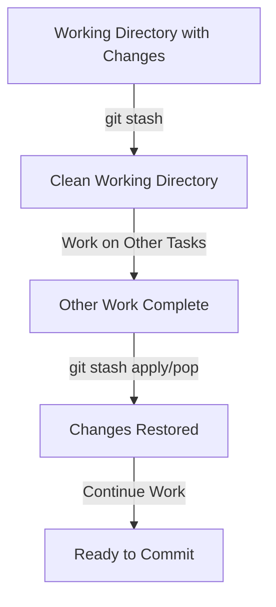

# Section 40: Stashing Changes - Temporarily Saving Work

<details open>
<summary><b>Section 40: Stashing Changes - Temporarily Saving Work (KK-CS45-script-v2-Inst-v1)</b></summary>

## Table of Contents

- [Introduction to Stashing](#introduction-to-stashing)
- [What is Stashing?](#what-is-stashing)
- [Practical Demonstration](#practical-demonstration)
- [Understanding Git Stash Commands](#understanding-git-stash-commands)
- [Stash Management](#stash-management)
- [Key Concepts](#key-concepts)

## Introduction to Stashing

In this demonstration, we explore Git stashing, a powerful feature that allows developers to temporarily save uncommitted changes when needing to switch contexts or handle urgent tasks.

## What is Stashing?

Stashing in Git is like putting unfinished work into a temporary storage box. When you're not ready to commit changes but don't want to lose them, you can stash them instead. This allows you to safely set work aside and return to it later, making it especially useful when you're in the middle of something and suddenly need to switch branches or handle another task.

**Key Benefits:**
- Avoid committing incomplete work
- Safely switch tasks without losing progress
- Restore changes when ready to continue
- Keep working directory clean for other operations

## Practical Demonstration

### Setting Up the Environment

We begin inside a Linux terminal with several repositories available, including `git-demo`, `next-backup`, and `ssh-backup`. For this demonstration, we'll use the `git-demo` repository.

**Initial State Check:**
```bash
ls
git status
```

As expected, the branch is clean and up to date.

### Creating Changes to Stash

**Step 1: Modify a file**
```bash
# Open hello.txt and add a new line
echo "add it for stashing changes" >> hello.txt
```

**Step 2: Verify the changes**
```bash
cat hello.txt
git status
```

**Output shows:**
- `hello.txt` has been modified
- The new line is visible in the file content

### Performing the Stash

**Stash the changes:**
```bash
git stash
```

**Git confirms:**
```
Saved working directory and index state WIP on main: [hash-id]
```

**Verify the stash operation:**
```bash
git status
cat hello.txt
```

**Results:**
- Working directory is now clean
- No pending changes remain
- The extra line in `hello.txt` has been temporarily removed
- Changes are safely stored in the stash

## Understanding Git Stash Commands

### Viewing Stashed Changes

**List all stashes:**
```bash
git stash list
```

**Output shows:**
```
stash@{0}: WIP on main: [hash-id] [message]
```

The stash entry includes:
- A unique ID (`stash@{0}`)
- The branch name (`main`)
- A hash identifier
- A short message describing the stashed changes

### Restoring Stashed Changes

#### Method 1: Git Stash Apply

**Apply the most recent stash:**
```bash
git stash apply
```

**Verification:**
```bash
git status
cat hello.txt
```

**Results:**
- Changes are restored to the working directory
- `hello.txt` is modified with the stashed line
- The stash remains in the list (can be reapplied later)
- Running `git stash list` still shows the same stash

#### Method 2: Git Stash Pop

**Apply and remove the stash in one step:**
```bash
git stash pop
```

**Results:**
- Changes are restored to the working directory
- The stash is removed from the list
- Running `git stash list` shows one less entry

**Key Difference:**
- `git stash apply` → Restores and keeps the stash in the list
- `git stash pop` → Restores and deletes the stash from the list

## Stash Management

### Handling Multiple Stashes

When multiple stashes exist, you can apply a specific one using its ID:

```bash
git stash apply stash@{1}
```

This provides precise control over which stashed changes to restore.

### Stash Characteristics

**Important properties to remember:**
- **Local Only**: Stashes are not pushed to GitHub or shared with others
- **Machine-Specific**: They live on your local machine only
- **Temporary Storage**: Designed for quick personal saves, not collaboration
- **Task Switching**: Ideal for pausing work, switching tasks, and returning without losing progress

## Key Concepts

### Stashing Workflow



### Command Summary

| Command | Purpose | Effect on Stash List |
|---------|---------|---------------------|
| `git stash` | Save current changes | Adds new stash entry |
| `git stash list` | View all stashes | No change |
| `git stash apply` | Restore changes | Keeps stash in list |
| `git stash pop` | Restore and remove | Removes stash from list |
| `git stash apply stash@{n}` | Apply specific stash | Keeps stash in list |

### Best Practices

1. **Use descriptive stash messages** when possible (though not shown in basic usage)
2. **Regular cleanup** of old stashes you no longer need
3. **Remember stashes are local** - don't rely on them for sharing work
4. **Use `pop`** when you're sure you won't need the stash again
5. **Use `apply`** when you might need to reference the same changes multiple times

</details>