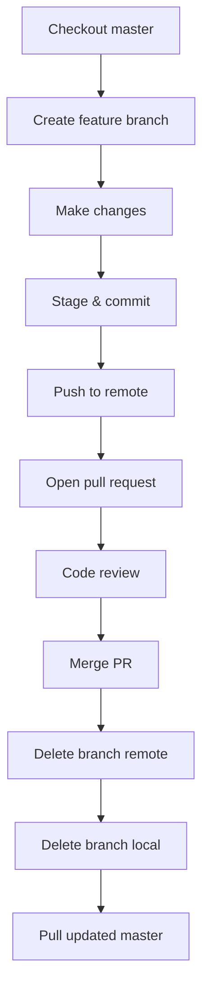

# Section 31: How to Open a Pull Request

<details open>
<summary><b>Section 31: How to Open a Pull Request (KK-CS45-script-v2-Inst-v1)</b></summary>

## Table of Contents
- [Overview](#overview)
- [Understanding Pull Requests](#understanding-pull-requests)
- [Creating a Branch for PR](#creating-a-branch-for-pr)
- [Making Changes](#making-changes)
- [Staging and Committing](#staging-and-committing)
- [Pushing Branch to Remote](#pushing-branch-to-remote)
- [Opening a Pull Request](#opening-a-pull-request)
- [Reviewing Pull Requests](#reviewing-pull-requests)
- [Merging Pull Requests](#merging-pull-requests)
- [Cleaning Up After Merge](#cleaning-up-after-merge)
- [Pull Request Workflow Summary](#pull-request-workflow-summary)
- [Interactive Exercise](#interactive-exercise)
- [Key Takeaways](#key-takeaways)
- [Quick Reference](#quick-reference)
- [Expert Insight](#expert-insight)

## Overview
This module covers the complete workflow of creating and managing pull requests (PRs) in GitHub. You'll learn how to create a feature branch, make changes, push to remote, open a pull request, review changes, merge the PR, and clean up branches afterward. Pull requests are essential for collaborative development and code review processes.

## Understanding Pull Requests
- **Definition**: A pull request is a mechanism for proposing code changes from one branch to another, typically requesting to merge code into the main branch
- **Purpose**: Enables code review, discussion, and controlled integration of changes into the project
- **GitLab vs GitHub terminology**: GitLab calls this a "merge request" while GitHub calls it a "pull request"
- **Core concept**: "You have code you want to incorporate into my code, or I have code I want to incorporate into your code"

## Creating a Branch for PR
- Start from the master branch: `git checkout master`
- Create and switch to a new branch: `git checkout -b pr-test`
- Verify branch creation: `git branch`
- Best practice: Name branches descriptively to indicate the purpose of the PR

## Making Changes
- Edit files in your feature branch (example modifies README.md)
- Example changes shown:
  - Changed title from generic to "Git Essentials / Git for Everybody"
  - Added description: "This is a course to teach you how to use everyday git"
  - Added author attribution
  - Checked status: `git status`
  - Viewed changes: `git diff README.md`

## Staging and Committing
- Stage modified files: `git add README.md`
- Commit changes: `git commit -m "Updated README"`
- The commit message describes what was changed
- Worked on `pr-test` branch ensures changes are isolated from master

## Pushing Branch to Remote
- Push branch to origin: `git push origin pr-test`
- After pushing, GitHub recognizes the new branch
- The branch appears in the repository's branch list on GitHub

## Opening a Pull Request
### Method 1: Quick Compare & Pull Request
- GitHub automatically detects pushed branches
- Click "Compare & pull request" button directly from branch notification

### Method 2: Manual Pull Request Creation
- Navigate to "Pull requests" tab
- Click "New pull request" button
- Select source branch (pr-test) and target branch (master)
- GitHub shows comparison of changes between branches
- Merge conflict detection: GitHub indicates if branches can be merged automatically

### Pull Request Details
- Add a descriptive title
- Include comments explaining the changes
- Option to create as draft or regular PR
- Draft PRs are not ready for review yet
- Mark draft as "Ready for review" when complete

## Reviewing Pull Requests
### Pull Request Overview Page Shows
- Number of commits to be merged
- Source and target branches
- Files changed tab for reviewing individual file modifications
- Commits tab for viewing commit history

### Review Options
- **Comment**: Leave feedback without approval
- **Approve**: Accept the changes
- **Request changes**: Require modifications before merging
- **Note**: PR authors cannot approve their own requests

### Code Review Features
- View rich text or raw code display
- Mark files as "viewed" after review
- Line-by-line code review capability
- Conversation thread for discussions
- Mark review comments as resolved

## Merging Pull Requests
### Merge Options
1. **Create a merge commit**: Default option that preserves complete merge history
2. **Squash and merge**: Combines multiple commits into a single commit (useful for 100+ commits)
3. **Rebase and merge**: Replays commits on top of target branch

### Merge Process
- Click "Merge pull request"
- Add optional merge commit message
- Confirm the merge
- After merging, option to delete the source branch from GitHub

## Cleaning Up After Merge
### Remote Cleanup
- Delete merged branch from GitHub (recommended)
- Branch no longer appears in remote repository

### Local Cleanup
- Branch still exists locally after remote deletion
- Delete local branch: `git branch -d pr-test`
- Force delete if needed: `git branch -D pr-test`
- Verify deletion: `git branch`

### Sync Local Master
- Checkout master: `git checkout master`
- Pull latest changes: `git pull origin master`
- Verify merged content is present in local files

## Pull Request Workflow Summary


## Interactive Exercise
1. Fork the repository at `github.com/calebthejones/git-essentials`
2. Clone your forked repository locally
3. Create a change in your fork
4. Commit the change to your fork
5. Open a pull request from your fork to the original repository
6. The instructor can then merge your contribution

## Key Takeaways
```diff
+ Pull requests enable collaborative code review and controlled merging
+ Always work on feature branches, never directly on master
+ GitHub automatically detects merge conflicts before merging
+ Draft pull requests allow preparation before requesting review
+ Multiple merge strategies available: merge commit, squash, rebase
+ Code review is essential - read through changes line by line
+ Clean up branches after merging to maintain repository hygiene
+ Fork workflow enables contribution to projects you don't own
```

## Quick Reference
```bash
# Complete PR workflow
git checkout master
git checkout -b feature-branch
# Make changes
git add .
git commit -m "Descriptive commit message"
git push origin feature-branch
# Create PR on GitHub...

# After merge cleanup
git checkout master
git pull origin master
git branch -d feature-branch
```

## Expert Insight

### Real-world Application
Pull requests are fundamental to team development workflows in virtually all professional software development environments. They provide:
- Quality gates through code review
- Documentation of changes and rationale
- Audit trails for compliance requirements
- Knowledge sharing among team members

### Expert Path
- Master different merge strategies and when to use each
- Learn to write effective PR descriptions and commit messages
- Practice thorough code reviews focusing on readability, performance, and security
- Understand rebasing workflows for cleaner history
- Explore GitHub features like branch protection rules and required reviews

### Common Pitfalls
- Working directly on master branch instead of feature branches
- Creating PRs with too many unrelated changes
- Not pulling latest master before creating feature branch (causes unnecessary conflicts)
- Skipping code review to "save time"
- Not deleting merged branches leading to repository clutter

### Lesser-Known Facts
- You can open PRs between any two branches, not just feature to master
- PRs maintain their own discussion even after merging
- Draft PRs can be converted to regular PRs at any time
- GitHub Actions can be configured to run automatically on PR events
- PR templates can enforce consistent information gathering

</details>