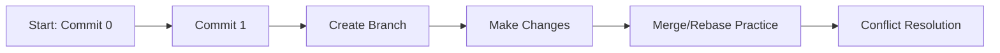

# Section 49: Final Lesson

<details open>
<summary><b>Final Lesson (KK-CS45-script-v2-Inst-v1)</b></summary>

## Table of Contents

- [Course Recap](#course-recap)
- [Daily Git Workflow](#daily-git-workflow)
- [Git vs GitLab/GitHub Ecosystem](#git-vs-gitlabgithub-ecosystem)
- [Continued Learning Resources](#continued-learning-resources)
  - [Interactive Branching Practice](#interactive-branching-practice)
  - [Advanced Reference Materials](#advanced-reference-materials)
  - [Continuous Integration](#continuous-integration)
- [Final Assessment](#final-assessment)
- [Instructor Closing](#instructor-closing)
- [Summary](#summary)

---

## Course Recap

This final lesson provides a comprehensive summary of the Git and GitHub course, reviewing all major concepts covered throughout the training and offering guidance for continued learning.

**Key concepts mastered throughout this course:**

- ✅ Git command-line fundamentals (critical for server environments without GUIs)
- ✅ Installation, configuration, and SSH key setup
- ✅ Repository operations (clone, create, fork)
- ✅ Branch management and pull request workflows
- ✅ Staging operations (add, unstage, stash)
- ✅ Commit management (undo, hard reset, soft reset)
- ✅ History inspection with custom aliases (getit LG)
- ✅ Remote operations (pull, fetch, force push)
- ✅ Documentation with README files
- ✅ File filtering with .gitignore
- ✅ GitHub collaboration features (issues, code reviews)
- ✅ Advanced merging strategies (merge vs rebase)
- ✅ Conflict resolution (merge conflicts, rebase conflicts)
- ✅ Release management with tags

---

## Daily Git Workflow

The course emphasizes that Git skills learned apply to **weekly team workflows**, not necessarily daily usage:

```diff
+ Weekly Git Operations for Team Development:
+ - Branch creation and management
+ - Pull request workflows
+ - Code review processes
+ - Merge/rebase operations
+ - Conflict resolution
+ - Stashing and context switching
+ - Tagging releases
```

> [!IMPORTANT]
> Everything covered in this course represents the **core daily/weekly workflow** for professional development teams.

---

## Git vs GitLab/GitHub Ecosystem

Understanding the broader Git hosting landscape:

| Platform | Focus Area | Key Strength |
|----------|-----------|--------------|
| **GitHub** | Code collaboration | Industry standard for code hosting |
| **GitLab** | DevOps & CI/CD | Superior continuous integration features |
| **Bitbucket** | Enterprise teams | Atlassian integration |

> [!NOTE]
> GitLab pushes continuous integration and DevOps more aggressively than GitHub, which focuses primarily on code collaboration.

---

## Continued Learning Resources

### Interactive Branching Practice

**learninggitbranching.js.org** - Recommended for visual learners:

- ✅ **No GitHub required** - Practice entirely in browser
- ✅ **Visual git flow learning** - See commits and branches graphically
- ✅ **Interactive exercises** - Commit zero, commit one, branching scenarios
- ✅ **Self-paced learning** - Perfect for reinforcing concepts visually



### Advanced Reference Materials

**books.goalkicker.com/getbook** - Free comprehensive Git reference:

- 📚 **61 chapters** covering advanced topics
- 📚 **Topics beyond daily use** - Useful for Git wizard status
- 📚 **Completely free PDF download**
- 📚 **Reference material** - Not all content needed for daily work

> [!NOTE]
> This course covers everything needed for senior-level Git usage. Advanced topics may be "a little bit much" for daily work but valuable for expertise.

### Continuous Integration

To extend Git skills to the next level:

**Recommended CI Tools:**
- **CircleCI** - Popular cloud CI/CD platform
- **Travis CI** - Long-standing CI service

**CI Benefits:**
- Automated code formatting checks
- Comment detection in code
- TODO detection and prevention
- Overall code quality enforcement

---

## Final Assessment

**Skills Verification Checklist:**

| Skill Area | Status | Notes |
|------------|--------|-------|
| Command-line Git proficiency | ✅ Mastered | Essential for server environments |
| Team collaboration workflows | ✅ Mastered | PRs, reviews, merges |
| Advanced operations | ✅ Mastered | Rebase, stash, tags |
| Industry-standard practices | ✅ Current | Matches senior developer usage |

> [!IMPORTANT]
> "You now have enough git skill to go work with a team... You're already up to date with what I would say senior developers are using when it comes to git."

---

## Instructor Closing

**Key philosophical takeaways:**

```diff
! Git is an essential tool
! Git does not have to be complicated
- People overcomplicate Git unnecessarily
+ This course demystifies Git for practical use
```

**Instructor Contact:**
- Name: Caleb Talbert (KalobT)
- Additional courses available across the internet
- Twitter: Follow for updates

---

## Summary

### Key Takeaways

```diff
+ Course Achievement: Complete Git/GitHub workflow mastery
+ Professional Readiness: Senior developer skill level achieved
+ Learning Path: Core skills + optional advanced resources available
+ Next Steps: CI/CD exploration or team integration ready
```

### Quick Reference

**Essential Commands Mastered:**
```bash
# Core workflow
git clone, git add, git commit, git push, git pull

# Branch management
git branch, git checkout, git merge, git rebase

# History and inspection
git log --oneline (customized as 'getit LG')
git stash, git tag

# Remote operations
git fetch, git remote, git fork workflow
```

### Expert Insight

**Real-world Application:**
- Skills directly applicable to any development team workflow
- Command-line proficiency essential for CI/CD servers and remote deployments

**Expert Path:**
1. Master learninggitbranching.js.org for visual reinforcement
2. Explore advanced Git topics in the GoalKicker reference
3. Implement CI/CD with CircleCI or Travis CI
4. Practice force push workflows (with extreme caution)

**Common Pitfalls:**
- ⚠️ Overcomplicating Git unnecessarily
- ⚠️ Force pushing without understanding consequences
- ⚠️ Skipping the fundamentals for advanced features

**Lesser-Known Facts:**
- GitLab offers more DevOps features than GitHub
- Visual tools like learninggitbranching.js.org were used by the instructor during their own learning
- Senior developers tend to use the same core tools repeatedly rather than exotic features

</details>