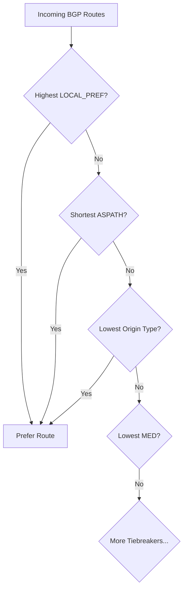

<details open>
<summary><b>Course Contents (KK-CS45-script-v2)</b></summary>

# AWS Certified Advanced Networking Specialty - Course Contents

## Table of Contents
- [1. Introduction](#1-introduction)
- [2. Code & Slides Download](#2-code--slides-download)
- [3. Amazon VPC Fundamentals](#3-amazon-vpc-fundamentals)
- [4. Additional VPC Features](#4-additional-vpc-features)
- [5. VPC DNS and DHCP](#5-vpc-dns-and-dhcp)
- [6. Network Performance and Optimization](#6-network-performance-and-optimization)
- [7. VPC Traffic Monitoring, Troubleshooting & Analysis](#7-vpc-traffic-monitoring-troubleshooting--analysis)
- [8. VPC Private Connectivity: VPC Peering](#8-vpc-private-connectivity-vpc-peering)
- [9. VPC Private Connectivity: VPC Endpoint & PrivateLink](#9-vpc-private-connectivity-vpc-endpoint--privatelink)
- [10. Transit Gateway](#10-transit-gateway)
- [11. Hybrid Network Basics](#11-hybrid-network-basics)
- [12. AWS Site-to-Site VPN](#12-aws-site-to-site-vpn)
- [13. AWS Client VPN](#13-aws-client-vpn)
- [14. Direct Connect (DX)](#14-direct-connect-dx)
- [15. AWS Cloud WAN](#15-aws-cloud-wan)
- [16. VPC Lattice](#16-vpc-lattice)
- [17. CloudFront](#17-cloudfront)
- [18. Elastic Load Balancers](#18-elastic-load-balancers)
- [19. Route 53](#19-route-53)
- [20. AWS Network Security Services](#20-aws-network-security-services)
- [21. Amazon EKS Networking](#21-amazon-eks-networking)
- [22. AWS Networking Management & Governance](#22-aws-networking-management--governance)
- [23. Additional Topics](#23-additional-topics)
- [24. Final Section - Congratulations!](#24-final-section---congratulations)

## 1. Introduction
This opening section provides a comprehensive overview of the AWS Certified Advanced Networking Specialty course, setting the stage for learners to understand the breadth and depth of AWS networking concepts. It covers high-level networking fundamentals, course objectives, and essential prerequisites to ensure participants are prepared for the advanced content ahead.

### Key Concepts
- **Course Introduction**: A brief welcome to the course, outlining what participants will learn and achieve.
- **Overview of AWS Networking**: A bird's-eye view of AWS networking services, emphasizing the "MUST WATCH" nature for foundational understanding.
- **Course Prerequisites**: Important notes on required knowledge, tools, and setup before diving deeper.

**Duration Breakdown**: 1 min for introduction, 25 min overview, 4 min prerequisites (total ~30 minutes).

## 2. Code & Slides Download
This short section focuses on accessing the practical resources needed for hands-on learning throughout the course.

### Key Concepts
- Download links and setup for code samples, lab exercises, and presentation slides used in subsequent modules.

**Duration Breakdown**: Focused on resource accessibility with minimal lecture time.

## 3. Amazon VPC Fundamentals
Building on the introductory networking concepts, this foundational section dives deep into Amazon Virtual Private Cloud (VPC), the core of AWS network isolation. Learners explore VPC creation, addressing, routing, and security components essential for building secure AWS infrastructures.

### Key Concepts
- **VPC Definition and Scope**: Understanding VPC as an AWS account/region/AZ boundary construct.
- **VPC Core Components**: CIDR addressing, subnets, route tables, internet gateways, and NAT solutions.
- **IP Addressing**: IPv4 vs IPv6, public/private/elastic IP concepts.
- **VPC Security**: Security Groups and Network ACLs for traffic control.
- **Practical Implementation**: Hands-on creation of VPCs with public/private subnets, NAT Gateway setup, and default VPC understanding.

**Code/Config Blocks**:
```bash
# Example VPC creation command
aws ec2 create-vpc --cidr-block 10.0.0.0/16
```

**Tables** (VPC Components Comparison):

| Component | Purpose | Example Use Case |
|-----------|---------|------------------|
| Security Groups | Instance-level firewall | Allow SSH from specific IP ranges |
| NACLs | Subnet-level firewall | Deny traffic from problematic IP ranges |

**Lab Demos Included**: Creating VPC with public subnet, adding private subnet, NAT Gateway configuration (total hands-on ~40 minutes).

## 4. Additional VPC Features
Expanding on VPC fundamentals, this section covers advanced VPC features that enhance network functionality and security.

### Key Concepts
- **Outbound IPv6 Traffic**: Egress-only Internet Gateway for secure IPv6 outbound connections.
- **VPC Address Extension**: Adding secondary CIDR blocks to grow VPC address space.
- **Elastic Network Interfaces**: Enabling advanced networking features like multiple network cards per instance.

**Duration Breakdown**: ~40 minutes including hands-on labs for egress-only gateway configuration.

## 5. VPC DNS and DHCP
This section explores how DNS and DHCP services integrate within VPC environments, crucial for cloud-native application resolution and address management.

### Key Concepts
- **DNS Fundamentals**: Understanding DNS server roles in VPC (Amazon Route 53 Resolver).
- **DHCP Option Sets**: Custom DHCP configurations for domain names, DNS servers, and NTP.
- **Hybrid DNS Scenarios**: Setting up DNS with private hosted zones and custom DNS servers.
- **Route 53 Resolver Endpoints**: Enabling DNS resolution between AWS and on-premises networks.

**Hands-On Exercises**:
- VPC DNS with Route 53 Private Hosted Zone
- Custom DNS server configuration

**Duration Breakdown**: ~75 minutes with extensive lab time for DNS resolver configurations.

## 6. Network Performance and Optimization
Focusing on achieving optimal network performance in AWS, this section covers metrics, enhancement technologies, and performance limits.

### Key Concepts
- **Network Metrics**: Bandwidth, latency, jitter, throughput, PPS, and MTU concepts.
- **Performance Optimization**: Placement Groups, EBS Optimized instances, Enhanced Networking with SR-IOV.
- **Advanced Technologies**: DPDK, Elastic Fabric Adapter (EFA) for high-performance computing.
- **AWS Limits**: Bandwidth caps within and outside VPC boundaries.
- **Resource Credits**: Understanding network I/O credits for burst performance.

**Tables** (Network Limits):

| Resource Type | VPC Internal | Outside VPC |
|---------------|--------------|-------------|
| Single Instance (c5.large) | 4.5 Gbps | 0.5 Gbps |
| Availability Zone | Unlimited | Unlimited |

## 7. VPC Traffic Monitoring, Troubleshooting & Analysis
Essential for network operations, this section covers AWS tools for monitoring, analyzing, and troubleshooting VPC traffic flows.

### Key Concepts
- **VPC Flow Logs**: Detailed logging of network traffic for analysis and troubleshooting.
- **VPC Traffic Mirroring**: Packet-level capture for deep inspection.
- **Analysis Tools**: Reachability Analyzer, Network Access Analyzer for connectivity validation.
- **Traffic Monitoring Best Practices**: When to use different analysis methods.

**Walkthrough Demonstrations**:
- VPC Reachability Analyzer configuration and usage
- Network Access Analyzer for security policy validation

## 8. VPC Private Connectivity: VPC Peering
Exploring private network connections between VPCs without internet exposure.

### Key Concepts
- **Peering Fundamentals**: Inter-VPC connectivity using AWS backbone.
- **Limitations**: Invalid peering scenarios and transitive routing considerations.
- **Regional Peering**: Connecting VPCs across AWS regions.
- **Traffic Flow**: "Requester" and "Accepter" VPC roles in peering connections.

**Hands-On**: Cross-region VPC peering setup.

## 9. VPC Private Connectivity: VPC Endpoint & PrivateLink
Advanced private access solutions for AWS services and third-party applications.

### Key Concepts
- **VPC Endpoints**: Gateway and Interface endpoints for private service access.
- **AWS PrivateLink**: Service provider/consumer model for secure connectivity.
- **Endpoint Types**: Gateway (S3/DynamoDB), Interface (most services), Gateway Load Balancer, Resource endpoints (App Mesh).
- **DNS and Security**: Endpoint DNS resolution and access control mechanisms.
- **Architectures**: Centralized endpoints, peered VPC access, on-premises connectivity.

**Extensive Hands-On Labs**:
- Gateway endpoint for S3 access
- Interface endpoint for SQS
- Endpoint service creation and consumption

## 10. Transit Gateway
Scalable network connectivity hub for complex AWS and hybrid networking architectures.

### Key Concepts
- **Transit Gateway (TGW)**: Regional network transit hub connecting VPCs, VPNs, and Direct Connect.
- **Attachments**: VPC, VPN, Direct Connect, Connect, Peering types.
- **Routing**: Association, propagation, and blackhole routes for traffic control.
- **Scaling Features**: Multicast, appliance mode, AZ affinity.
- **Network Patterns**: Centralized egress, traffic inspection, VPC interface endpoints.

**Complex Hands-On**:
- Full routing TGW setup
- Restricted routing configurations

## 11. Hybrid Network Basics
Fundamental concepts for connecting on-premises networks with AWS cloud.

### Key Concepts
- **Routing Types**: Static vs Dynamic routing protocols.
- **BGP**: How Border Gateway Protocol enables dynamic routing in hybrid scenarios.
- **BGP Attributes**: Route selection criteria (ASPATH, LOCAL_PREF, MED).

**BGP Route Selection Flowchart**:


## 12. AWS Site-to-Site VPN
Managed VPN service for secure hybrid connectivity with on-premises networks.

### Key Concepts
- **VPN Fundamentals**: IPSec-based secure connections over public internet.
- **IP Version Support**: IPv4 and IPv6 traffic handling.
- **Performance**: Accelerated VPN using AWS Global Accelerator.
- **Connection Management**: NAT Traversal, route propagation, tunnel modes.
- **Advanced Scenarios**: Transitive routing, CloudHub, Transit VPC architectures.

**Hands-On**: Complete VPN setup and configuration demonstrations.

## 13. AWS Client VPN
End-user VPN service for remote access to AWS networks.

### Key Concepts
- **Client VPN**: OpenVPN-compatible service for user access.
- **Connection Types**: Full-tunnel vs split-tunnel VPN.
- **Connectivity**: Internet Gateway and VPC peering access through Client VPN.

**Hands-On Labs**:
- Client VPN setup
- Split tunnel configuration
- Peering connectivity testing

## 14. Direct Connect (DX)
Dedicated network connections for high-performance, private connectivity to AWS.

### Key Concepts
- **Physical Connections**: Dedicated vs Hosted connection options.
- **Virtual Interfaces**: Public, Private, Transit VIF types.
- **Direct Connect Gateway**: Connecting to multiple VPCs and TGWs.
- **Routing Policies**: BGP Communities for route control.
- **Resiliency**: LAGs, failure detection with BFD, SiteLink for global connectivity.
- **Security and Performance**: MACSec encryption, Jumbo frames, monitoring.

**Depth Coverage**: Public/Private VIF routing scenarios, BGP communities usage.

## 15. AWS Cloud WAN
Managed wide-area networking service for global network management.

### Key Concepts
- **Cloud WAN Architecture**: Core network with segments and policies.
- **Policy Framework**: Traffic control through declarative policies.
- **Connectivity**: VGWs, TGWs, Direct Connect integration.

**Hands-On**: Cloud WAN setup and configuration.

## 16. VPC Lattice
Service networking platform for simplifying microservice connectivity.

### Key Concepts
- **Lattice Components**: Networks, Services, Target Groups, Resources.
- **Networking**: Service network associations, traffic flow.
- **Features**: Service discovery, custom domain support, security.

**Hands-On**: VPC Lattice service access configuration.

## 17. CloudFront
AWS content delivery network for global content distribution.

### Key Concepts
- **Origins and Acceleration**: Origin groups, security headers, HTTPS configuration.
- **Edge Computing**: CloudFront Functions and Lambda@Edge.
- **Geo Features**: Restrictions, end-to-end encryption.
- **Global Accelerator**: TCP/UDP acceleration complementary service.

**Hands-On Demonstrations**:
- Origin Groups setup
- Restrict ALB to CloudFront
- CloudFront Functions implementation

## 18. Elastic Load Balancers
AWS load balancing services for high availability and scalability.

### Key Concepts
- **ELB Types**: Classic, Application, Network Load Balancers.
- **Advanced Features**: Sticky sessions, cross-zone balancing, connection draining.
- **Protocol Support**: SSL/TLS termination, proxy protocol, gRPC.
- **Security**: Managed prefixes, outbound rule management.

**Hands-On Config**:
- ALB X-Forwarded Headers setup
- NLB Proxy Protocol configuration

## 19. Route 53
AWS DNS service with advanced routing capabilities.

### Key Concepts
- **DNS Fundamentals**: CNAME vs Alias, TTL concepts.
- **Routing Policies**: Simple, Weighted, Latency, Failover, Geolocation, Geoproximity, IP-based, Multi-Value.
- **Advanced Features**: DNSSEC, Health Checks, Resolver endpoints.
- **Hybrid DNS**: Route 53 Resolvers for on-premises integration.

**Extensive Hands-On**:
- Health Checks configuration
- Resolver endpoints setup spanning multiple parts

## 20. AWS Network Security Services
Comprehensive network protection services against modern threats.

### Key Concepts
- **Web Application Firewall (WAF)**: XSS and other attack prevention.
- **Shield Services**: DDoS protection (Standard and Advanced).
- **Network Firewall**: VPC-level traffic filtering (surrogate for conventional firewalls).
- **Gateway Load Balancer**: Transparent appliance insertion.
- **Certificate Management**: AWS Certificate Manager (ACM).
- **Firewall Manager**: Multi-account security management.

**Security Demonstration**:
- WAF XSS attack simulation and mitigation

## 21. Amazon EKS Networking
Networking fundamentals for Kubernetes on AWS.

### Key Concepts
- **Kubernetes Architecture**: Nodes, pods, services, networking primitives.
- **EKS Integration**: VPC integration, ClusterIP, NodePort, LoadBalancer, Ingress service types.
- **Pod Networking**: VPC CNI, security groups at pod and node level.
- **Custom Networking**: Extended IPv4 address spaces.

**Chronological Depth**: Following Kubernetes networking evolution and AWS adaptations.

## 22. AWS Networking Management & Governance
Services for managing and monitoring AWS network resources at scale.

### Key Concepts
- **VPC IP Address Manager (IPAM)**: Centralized IP address management and planning.
- **Infrastructure as Code**: AWS CloudFormation for network templating.
- **Service Catalog**: Pre-approved network templates for self-service.
- **Compliance and Auditing**: AWS Config and CloudTrail for governance.

## 23. Additional Topics
Supplementary networking concepts and services.

### Key Concepts
- **VPC Sharing**: Multi-account VPC resource sharing strategies.
- **Private NAT Gateway**: Outbound-only NAT without public IP exposure.
- **Application Networking**: WorkSpaces and AppStream 2.0 network architectures.
- **Edge Computing**: Wavelength and Local Zones network considerations.

## 24. Final Section - Congratulations!
Course completion and preparation resources.

### Key Concepts
- **Exam Preparation**: Walkthrough, signup, cost-saving tips.
- **Timing Extensions**: Extra time for non-native speakers.
- **Career Paths**: AWS certification progression overview.

**Summary**
This comprehensive course covers 307 lectures spanning over 20 main sections, providing a complete journey from AWS networking fundamentals to advanced architectures. The curriculum is designed to prepare candidates for the AWS Certified Advanced Networking Specialty certification through theoretical concepts, practical demonstrations, and real-world scenarios.

### Key Takeaways

```diff
+ Master VPC, the foundation of AWS networking isolation and segmentation
+ Understand hybrid connectivity options including VPN, Direct Connect, and Transit Gateway
+ Apply network security services effectively with WAF, Shield, and Network Firewall
+ Design scalable EKS networking for containerized applications
+ Utilize CloudFront, ELBs, and Route 53 for global application delivery
! Implement comprehensive network monitoring and troubleshooting strategies
```

### Quick Reference

**VPC Core Components**:
```yaml
VPC:
  CIDR: 10.0.0.0/16
  Subnets:
    - Public: 10.0.1.0/24 + IGW
    - Private: 10.0.2.0/24 + NAT Gateway
  Security: Security Groups + NACLs
  Peering: Regional/Inter-regional connections
```

**Load Balancer Types**:
- **ALB**: Layer 7 (HTTP/HTTPS), path-based routing
- **NLB**: Layer 4 (TCP/UDP), ultra-high performance
- **GLB**: Transparent appliance insertion

**DNS Routing Policies**:
- Latency: Route to lowest latency region
- Weighted: Distribute traffic by percentages
- Failover: Active-passive configurations

🏆 **This course prepares you for the coveted AWS Certified Advanced Networking Specialty certification, recognized globally as a pinnacle of cloud networking expertise.**

### Expert Insight

#### Real-world Application
In production environments, these networking concepts enable building secure, scalable, and highly available applications. For example, Transit Gateway allows enterprises to connect thousands of VPCs across regions, while VPC Lattice simplifies microservice communication without IP management overhead.

#### Expert Path
To truly master AWS networking:
- Complete all hands-on labs multiple times
- Experiment with attaching services beyond examples
- Understand billing implications before implementation
- Study AWS architecture patterns for real-world scenarios

#### Common Pitfalls
- Underestimating NAT Gateway costs for high-throughput applications
- Misconfiguring route tables leading to traffic blackholing
- Forgetting to update security groups after VPC changes
- Not designing for multi-region resilience from day one

#### Lesser-Known Facts
- Regional NAT Gateway (announced in reInvent 2025) allows NAT sharing across multiple AZs within a region
- Direct Connect SiteLink can route traffic between on-premises locations via AWS global network
- VPC IPAM integrates with Resource Access Manager for multi-account IP management
- Gateway Load Balancer can insert appliances in traffic paths without changing application architecture

🚀 **Congratulations on completing this comprehensive networking journey! You're now equipped to architect world-class AWS networks.**

</details>