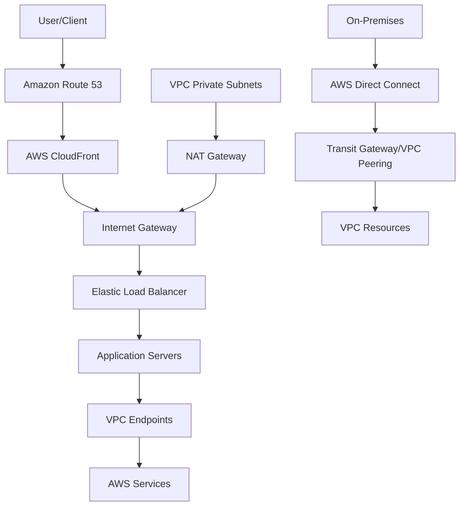

# Section 1: Course Introduction

<details open>
<summary><b>Section 1: Course Introduction (KK-CS45-script-v2)</b></summary>

## Table of Contents
- [1.1 Course Introduction](#11-course-introduction)
- [1.2 Overview of AWS Networking - A Bird's eye view (MUST WATCH)](#12-overview-of-aws-networking---a-birds-eye-view-must-watch)
- [1.3 Before we start the course - Important things to know](#13-before-we-start-the-course---important-things-to-know)
- [Summary](#summary)

## 1.1 Course Introduction

### Overview
This introductory module welcomes students to the AWS Certified Advanced Networking Specialty course and introduces the instructors who will guide the learning journey. The module establishes the course framework, prerequisites, and instructor responsibilities, setting expectations for advanced networking concepts on AWS.

### Key Concepts/Deep Dive

#### Course Prerequisites and Recommendations
- **Networking Experience**: Previous networking experience is highly recommended to effectively grasp advanced AWS networking concepts
- **AWS Certification Requirement**: Students must possess an associate-level AWS certification as a prerequisite
- **Basic Knowledge Assumption**: The course assumes familiarity with foundational AWS services and focuses on in-depth networking discussions

#### Instructor Introduction
- **Stephane Maarek**:

**Co-Instructor Details**:
  - Stephane brings over 8 years of AWS experience
  - He teaches general AWS concepts
  - Specifically covers Load Balancers, CloudFront, and Route 53 in this course

- **Chetan**:
  - AWS Networking expert with over 15 years of experience
  - Specializes in AWS networking services
  - Covers most of the services discussed in the course
  - Brings a different teaching style that complements Stephane's approach

#### Course Structure
- **Co-Instructor Format**: Interactive teaching between two experienced professionals
- **Content Coverage**: Comprehensive coverage of AWS networking from both technical and practical perspectives

#### Instructor Recommendation
- Students are encouraged to engage with both instructors' teaching styles
- The combination of expertise ensures comprehensive understanding
- Previous course participation confirms Chetan's teaching effectiveness

---

## 1.2 Overview of AWS Networking - A Bird's eye view (MUST WATCH)

### Overview
This crucial overview module provides a high-level architecture of AWS networking services and their interactions within cloud environments. It serves as a foundational mental model for understanding how various AWS networking components work together to create robust, scalable, and secure network architectures.

### Key Concepts/Deep Dive

#### Core AWS Networking Architecture

**Global Infrastructure Components**:
- **Amazon Route 53**: Authoritative DNS service providing global traffic routing capabilities
- **AWS CloudFront**: Content delivery network (CDN) for distributing content with low latency
- **AWS WAF**: Web application firewall for protecting against common web exploits

**Regional Networking Services**:
- **AWS Direct Connect**: Dedicated network connection from on-premises to AWS
- **Internet Gateway**: Enables communication between VPC instances and the Internet
- **AWS Transit Gateway**: Connects VPCs and on-premises networks through a central hub
- **VPC Peering**: Direct networking connection between VPCs for resource sharing

**VPC-Level Components**:
- **Virtual Private Cloud (VPC)**: Isolated network segment within AWS
- **Subnets**: Segment VPC into smaller network divisions
- **Route Tables**: Define traffic routing rules within the VPC
- **Network ACLs**: Stateless firewall at subnet level
- **Security Groups**: Stateful firewall at instance level
- **Elastic Load Balancers (ELB)**: Distribute traffic across multiple targets
  - Application Load Balancer (ALB) for HTTP/HTTPS
  - Network Load Balancer (NLB) for TCP/UDP
  - Gateway Load Balancer (GWLB) for transparent proxy layers
- **NAT Gateway**: Enable outbound Internet access from private subnets
- **Bastion Host**: Secure entry point for accessing private resources
- **VPC Endpoints**: Private connections to AWS services without Internet access

#### Networking Traffic Flow Concepts

**Inbound Traffic Patterns**:
- **Internet Gateway Flow**: External requests → Internet Gateway → Load Balancer → Instances
- **Direct Connect Flow**: On-premises → Direct Connect → Transit Gateway → VPC resources

**Outbound Traffic Patterns**:
- **NAT Gateway Flow**: Private subnet instances → NAT Gateway → Internet Gateway → External destinations
- **VPC Endpoint Flow**: VPC resources → VPC Endpoint → AWS services (no Internet exposure)

**East-West Traffic Patterns**:
- **VPC Peering**: Direct cross-VPC communication
- **Transit Gateway**: Multi-VPC routing through centralized routing service
- **Within VPC**: Subnet-to-subnet routing via route tables

### Simplified AWS Networking Architecture



#### Security Layers in AWS Networking

**Defense in Depth Approach**:
- **Perimeter Security**: WAF, Shield, Route 53 Resolver Firewall
- **VPC Security**: Network ACLs, Security Groups
- **Instance Security**: Host-based firewalls and security agents
- **Application Security**: Web application firewalls and intrusion detection

#### Common Service Integration Patterns

**Load Balancing Strategies**:

| Load Balancer Type | Layer | Use Case | Target Types |
|-------------------|-------|----------|-------------|
| Application Load Balancer | Layer 7 | HTTP/HTTPS traffic, content-based routing | IP, Instance ID, Lambda |
| Network Load Balancer | Layer 4 | TCP/UDP traffic, high performance | IP, Instance ID |
| Gateway Load Balancer | Layer 3/4 | Transparent proxy, third-party appliances | IP, Instance ID |

---

## 1.3 Before we start the course - Important things to know

### Overview
This preparatory module provides essential information and prerequisites required to succeed in the AWS Certified Advanced Networking Specialty (ANS-C01) certification journey. It covers certification requirements, preparation strategies, and study recommendations to ensure students are properly equipped for the networking-focused examination.

### Key Concepts/Deep Dive

#### Certification Requirements

**Exam Details**:
- **Exam Code**: ANS-C01
- **Format**: Multiple choice and multiple answer questions
- **Duration**: 170 minutes (approximately 3 hours)
- **Cost**: Approximately $300 USD
- **Validity**: Certification valid for 3 years

**Eligibility Criteria**:
- **Required**: At least one associate-level AWS certification
- **Recommended**: Professional-level certification for better preparation
- **Experience**: Hands-on AWS networking experience strongly recommended

#### Core Knowledge Domains

**Advanced Networking Concepts**:
- **Hybrid Networking**: Connecting on-premises infrastructure with AWS
- **Network Security**: Advanced security controls and threat mitigation
- **Performance Optimization**: Network performance tuning and monitoring
- **Troubleshooting**: Complex network issue diagnosis and resolution
- **Automation**: Infrastructure as Code (IaC) for networking resources

**AWS-Specific Networking Services**:
- **VPC Advanced Features**: Transit Gateway, VPC peering, shared VPCs
- **Direct Connect**: Dedicated connectivity options and configurations
- **Route 53 Advanced**: Traffic policies, health checks, failover routing
- **CloudFront**: Advanced CDN configurations and custom origins
- **Load Balancing**: Advanced ELB configurations and scenarios

#### Preparation Strategies

**Study Materials**:
- **Official Documentation**: AWS whitepapers, service documentation
- **Hands-on Practice**: Lab exercises and real-world implementations
- **Practice Exams**: Multiple practice tests to simulate exam conditions
- **Community Resources**: Discussion forums, expert blogs, case studies

**Hands-on Experience Requirements**:
- **Network Design**: Designing complex VPC architectures
- **Configuration Management**: Implementing networking services via AWS console, CLI, and CloudFormation
- **Troubleshooting Skills**: Diagnosing and resolving network connectivity issues
- **Security Implementation**: Configuring network security controls

#### Exam Preparation Tips

**Time Management**:
- **Study Duration**: Minimum 2-3 months of dedicated preparation
- **Practice Tests**: Take practice exams regularly to build stamina
- **Weak Areas**: Identify and allocate extra time for challenging topics

**Technical Skills Focus**:
- **VPC Architecture**: Deep understanding of subnetting, routing, and security
- **Hybrid Connectivity**: Direct Connect, VPN, and Transit Gateway configurations
- **Global Networking**: Route 53, CloudFront, and multi-region architectures
- **Monitoring and Logging**: CloudWatch, VPC Flow Logs, and network monitoring

> [!IMPORTANT]
> Success in the ANS-C01 exam requires both theoretical knowledge and extensive hands-on experience with AWS networking services. Plan for significant lab practice time.

## Summary

### Key Takeaways
```diff
+ Essential Prerequisites: Associate-level AWS certification and networking experience are mandatory for success
+ Co-Instructor Expertise: Combine Stephane's AWS general knowledge with Chetan's networking specialization
+ Comprehensive Coverage: Course covers all major AWS networking services from foundational to advanced topics
+ Exam-Focused Content: Direct preparation for ANS-C01 certification with practical implementations
+ Hands-on Emphasis: Significant practical experience required for certification success
```

### Quick Reference

**Instructor Expertise Focus Areas**:
- **Chetan**: VPC, Direct Connect, Transit Gateway, Security Groups, NACLs, and most networking services
- **Stephane**: Load Balancers, CloudFront, Route 53

**Study Time Allocation**:
- Networking Theory: 30%
- Hands-on Labs: 50%
- Practice Exams: 20%

### Expert Insight

**Real-world Application**:
In production environments, AWS networking expertise is crucial for designing secure, scalable, and cost-effective cloud architectures. Professionals with ANS-C01 certification can architect enterprise-grade solutions that integrate on-premises infrastructure with AWS, implement sophisticated network security postures, and optimize global application performance through intelligent traffic routing and content delivery strategies.

**Expert Path**:
Master the art of network design by starting with simple VPC deployments and gradually progressing to complex hybrid architectures. Focus on understanding the interplay between security, performance, and cost optimization. Regularly contribute to open-source networking projects and engage with the AWS networking community on forums like Reddit's r/aws and AWS Community Builders.

**Common Pitfalls**:
- **Overlooking Prerequisites**: Attempting the course without associate-level certification leads to confusion with basic AWS services
- **Theory-Only Approach**: Relying solely on documentation without hands-on labs results in poor exam performance
- **Service Isolation**: Studying services individually without understanding their integration points misses the holistic networking picture
- **Neglecting Updates**: AWS networking services evolve rapidly, so always reference current documentation
- **Underestimating Complexity**: The exam tests deep architectural decisions, not just feature memorization

**Lesser-Known Facts**:
- **Certification Validity**: The ANS-C01 certification requires recertification every 3 years, typically through the newer associate-level exam
- **Industry Recognition**: ANS-C01 is recognized as one of the most challenging AWS specialty certifications, often preferred by employers for network architect roles
- **Migration Benefits**: Existing associate holders can pursue specialty certifications without additional associate-level exams
- **Global Perspective**: The certification emphasizes designing networks that span multiple AWS regions and integrate with global infrastructure
- **Automation Emphasis**: Modern AWS networking increasingly focuses on Infrastructure as Code patterns using CloudFormation and CDK for consistent, repeatable deployments

</details>