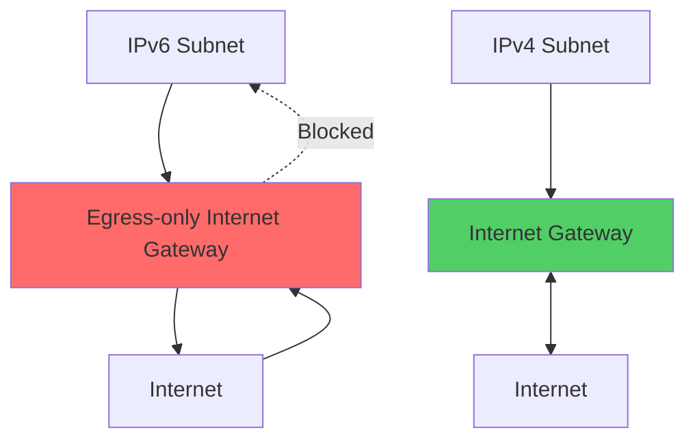
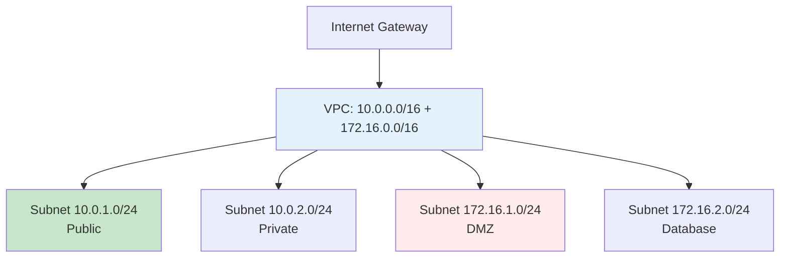
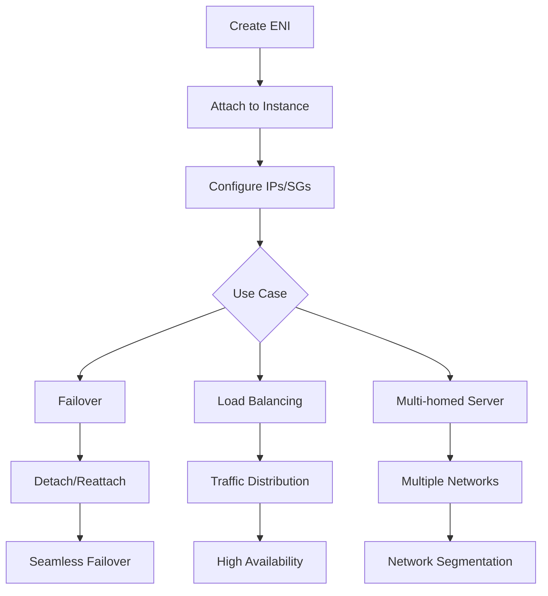
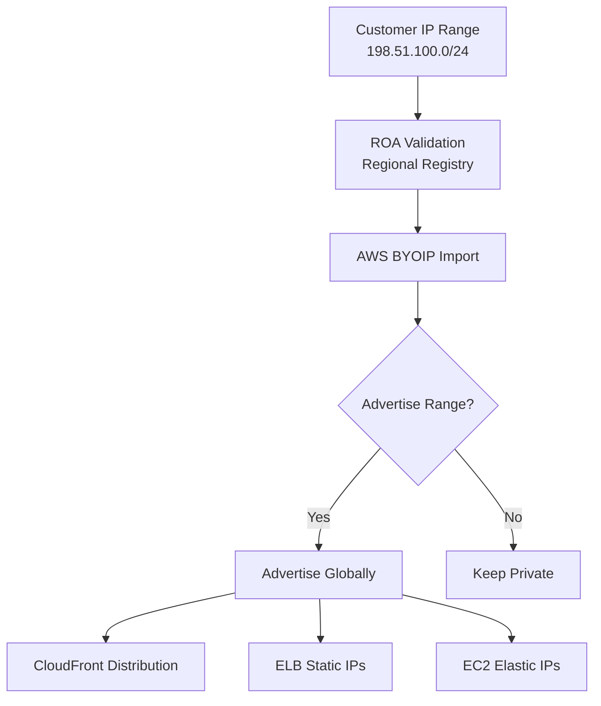

<details open>
<summary><b>Section 4: VPC Advanced Features (KK-CS45-script-v2)</b></summary>

# Section 4: VPC Advanced Features

This section builds upon VPC fundamentals, focusing on exam-relevant topics for AWS Certified Advanced Networking Specialty. It covers IPv6 outbound traffic management, VPC address space expansion, Elastic Network Interface deep dive, and Bring Your Own IP capabilities.

## Table of Contents
- [4.1 Section Introduction](#41-section-introduction)
- [4.2 Egress-only Internet Gateway (IPv6)](#42-egress-only-internet-gateway-ipv6)
- [4.3 Hands-on: Egress-only Internet Gateway for IPv6 Outbound Traffic](#43-hands-on-egress-only-internet-gateway-for-ipv6-outbound-traffic)
- [4.4 Extending VPC Address Space](#44-extending-vpc-address-space)
- [4.5 Elastic Network Interface (ENI) Deep Dive](#45-elastic-network-interface-eni-deep-dive)
- [4.6 Bring Your Own IP (BYOIP)](#46-bring-your-own-ip-byoit)

## 4.1 Section Introduction

### Overview
This lecture introduces Section 4 as a continuation of VPC fundamentals, specifically designed for the AWS Certified Advanced Networking Specialty exam. It outlines the key topics that build upon basic VPC knowledge, assuming prerequisite associate-level understanding while reinforcing essential networking concepts for certification preparation.

### Key Concepts/Deep Dive
📝 **Section Focus and Prerequisites**
- Builds upon previous VPC fundamentals section
- Designed specifically for exam preparation
- Assumes AWS associate-level knowledge
- Covers advanced VPC features critical for certification

💡 **Core Topics Covered**
1. **Egress-only Internet Gateway** - IPv6 outbound traffic management
2. **VPC Address Space Extension** - Adding additional CIDR blocks to existing VPC
3. **Elastic Network Interface Deep Dive** - Advanced ENI functionality beyond basic IP addressing
4. **Bring Your Own IP (BYOIP)** - Importing external IPv4/IPv6 ranges to AWS

⚠ **Exam Importance**
- All topics in this section are essential for certification
- Focuses on practical networking configurations
- Required knowledge for advanced networking scenarios

## 4.2 Egress-only Internet Gateway (IPv6)

### Overview
The Egress-only Internet Gateway is a critical component for IPv6 networking in AWS VPCs, enabling secure outbound-only Internet connectivity for IPv6 traffic. Unlike traditional Internet Gateways that allow both inbound and outbound traffic, this specialized gateway provides stateful filtering that permits outgoing traffic while blocking all inbound connections from the Internet.

### Key Concepts/Deep Dive

#### IPv6 Networking Fundamentals
- IPv6 addresses are 128-bit (vs 64-bit IPv4)
- AWS supports both IPv4 and IPv6 in VPCs
- IPv6 addresses can be assigned to instances alongside IPv4
- Internet connectivity for IPv6 requires specific gateway configuration

#### Egress-only Internet Gateway Characteristics
- **Stateful Gateway**: Tracks outbound connections to allow return traffic
- **Outbound-Only**: Blocks all inbound traffic from Internet
- **IPv6-Specific**: Works exclusively with IPv6 traffic
- **Regional Resource**: Created per region, attached to specific VPCs

#### Architecture and Placement


💡 **Key Difference from Internet Gateway**
- **Internet Gateway (IGW)**: Allows bidirectional IPv4 traffic
- **Egress-only IGW**: Allows outbound IPv6, blocks inbound IPv6

#### Route Table Configuration
- Add route in subnet route table: `::/0` → `egress-only-igw-id`
- Route applies only to local subnet
- Gateway ID references the egress-only IGW instance

#### Use Cases
- **Private IPv6 Subnets**: Enable Internet access without public IP exposure
- **Outbound-Only Applications**: Database servers, internal services needing updates
- **Security-Conscious Deployments**: Prevent unsolicited inbound connections

✅ **Security Benefits**
- Eliminates need for Elastic IPs (which expose instances)
- Prevents inbound traffic while allowing necessary outbound access
- Maintains IPv6 connectivity for updates and external services

## 4.3 Hands-on: Egress-only Internet Gateway for IPv6 Outbound Traffic

### Overview
This hands-on demonstration guides through the complete process of configuring IPv6 outbound connectivity using an Egress-only Internet Gateway. The lab covers VPC creation, IPv6 subnet setup, gateway attachment, and route table configuration to enable secure outbound IPv6 traffic.

### Key Concepts/Deep Dive

#### Prerequisites and Setup
- **VPC Configuration**: Existing VPC or create new one with IPv6 CIDR
- **Subnet Requirements**: At least one IPv6-enabled subnet
- **EC2 Instance**: Instance in IPv6 subnet for testing connectivity

#### Step-by-Step Lab Implementation

**Step 1: Create VPC with IPv6 Support**
```bash
# VPC creation with both IPv4 and IPv6 CIDR blocks
VPC IPv4 CIDR: 10.0.0.0/16
VPC IPv6 CIDR: Amazon-provided IPv6 CIDR (/56)
```

**Step 2: Create IPv6-enabled Subnet**
- Subnet CIDR: IPv6 subset of VPC CIDR (e.g., /64)
- Auto-assign IPv6: Enable
- Placement: Ensure proper AZ selection

**Step 3: Create Egress-only Internet Gateway**
- Navigate to VPC Dashboard → Internet Gateways
- Create "Egress-only Internet Gateway"
- Attach to VPC (select created VPC)

**Step 4: Configure Route Tables**
- Identify subnet route table
- Add IPv6 route:
  - Destination: `::/0`
  - Target: `egress-only-igw-[id]`

**Step 5: Launch and Configure EC2 Instance**
- AMI: Amazon Linux 2 or Ubuntu (IPv6 compatible)
- Instance Type: t2.micro
- Network: Select IPv6-enabled subnet
- Auto-assign IPv6: Enable
- Security Group: Allow outbound all traffic

**Step 6: Test IPv6 Connectivity**
```bash
# From EC2 instance
curl -6 https://ipv6.google.com
ping6 ipv6.google.com

# Verify IPv6 address assignment
ip addr show | grep inet6
```

#### Expected Results
- **Success Indicators**:
  - IPv6 address assigned to instance
  - Outbound HTTPS connections successful
  - Ping to IPv6 hosts works
- **Inbound Blocking Verification**:
  - Direct IPv6 access from Internet fails
  - Only established outbound connections receive return traffic

#### Troubleshooting Common Issues
- **IPv6 not assigned**: Check auto-assign settings, subnet configuration
- **Connectivity fails**: Verify route table, security group rules
- **Gateway not working**: Ensure proper attachment to VPC

✅ **Lab Validation Checklist**
- [ ] VPC created with IPv6 CIDR
- [ ] IPv6 subnet configured
- [ ] Egress-only IGW created and attached
- [ ] Route table updated with ::/0 → egress-only-igw
- [ ] EC2 instance launched in IPv6 subnet
- [ ] Outbound IPv6 connectivity confirmed
- [ ] Inbound IPv6 blocking verified

## 4.4 Extending VPC Address Space

### Overview
AWS VPCs can be extended beyond their initial CIDR allocation by adding secondary IPv4 CIDR blocks. This feature enables network expansion without recreating the VPC, supporting organizational growth, acquisition integration, and complex network architectures requiring multiple address ranges.

### Key Concepts/Deep Dive

#### VPC CIDR Fundamentals
- **Primary CIDR**: Assigned during VPC creation
- **Secondary CIDR Range**: Additional /16 to /28 blocks
- **No Overlap**: All CIDR blocks must be unique, non-overlapping
- **IPv4 Focus**: Secondary CIDR currently supports IPv4 only

#### Adding Secondary CIDR Blocks
```yaml
# Example VPC Configuration
Primary CIDR: 10.0.0.0/16 (65,536 addresses)
Secondary CIDR: 172.16.0.0/16 (65,536 addresses)
```

#### Implementation Process
1. **VPC Selection**: Choose existing VPC to extend
2. **CIDR Specification**: Add new IPv4 CIDR block
3. **Route Table Updates**: Add routes for new subnets
4. **Subnet Creation**: Create subnets in new CIDR range

#### Network Expansion Scenarios

**Organizational Growth**
- Company expansion requiring additional IP addresses
- Departmental network isolation within larger VPC

**Acquisition Integration**
- Merging networks from acquired companies
- Maintaining separate address spaces for compliance

**Complex Architectures**
- Multi-tier applications with distinct address ranges
- Disaster recovery configurations spanning regions

#### Routing Considerations
- **Default Route**: Traffic to secondary CIDR handled internally
- **Internet Access**: IGW routes apply to all CIDR blocks
- **VPC Peering**: Cross-VPC connectivity requires route updates
- **VPN Connections**: Customer gateway configurations may need updates

#### Limitations and Best Practices
- **Maximum CIDR Blocks**: Up to 5 secondary CIDRs per VPC
- **Size Constraints**: Minimum /28, maximum /16
- **Planning**: Reserve address space strategically
- **Documentation**: Track CIDR assignments for management

#### Architecture Diagram


## 4.5 Elastic Network Interface (ENI) Deep Dive

### Overview
Elastic Network Interfaces (ENIs) are virtual network interfaces that serve as the fundamental building blocks for IP addressing in AWS EC2. Beyond basic IP allocation, ENIs provide advanced networking capabilities including multi-IP support, security group flexibility, failover scenarios, and cross-availability zone migration.

### Key Concepts/Deep Dive

#### ENI Core Components
- **Network Interface**: Virtual representation of physical NIC
- **IP Addresses**: Primary + secondary private IPs
- **MAC Address**: Unique hardware identifier
- **Security Groups**: Multiple SG attachment possible

#### ENI Types and Characteristics
| ENI Type | Use Case | IP Limits | Description |
|----------|----------|-----------|-------------|
| **Primary ENI** | Instance boot | 1 primary IP | Created with instance |
| **Secondary ENI** | Additional networking | Multiple IPs | Attached post-creation |
| **Management ENI** | AWS services | Service-specific | Automatically managed |

#### Advanced ENI Features

**Multiple IP Addresses per ENI**
- Primary private IPv4
- Up to 49 secondary private IPv4 addresses
- Elastic IP associations
- Hot-standby configurations

**Security Group Association**
- Each ENI can have up to 5 security groups
- Granular traffic control per interface
- Different security policies for different applications

**Attachment and Migration**
- **Hot Attach/Detach**: Attach to running instances
- **Cross-AZ Migration**: Move ENIs between availability zones
- **Instance Migration**: Preserve networking during migrations

#### ENI Lifecycle Management


#### Practical Use Cases

**High Availability Failover**
```
Instance A (Primary) - ENI with EIP
Instance B (Standby) - Prepared to attach ENI on failure
```

**Multi-Tier Application**
- **Web ENI**: Public subnet, web security group
- **App ENI**: Private subnet, application security group
- **DB ENI**: Database subnet, restricted security group

**Network Appliance Scenarios**
- **Firewall Instances**: Multiple interfaces for inspection zones
- **NAT Gateway**: Public/private interface separation
- **VPN Endpoints**: Secure remote access

#### Key Limitations and Considerations
- **Instance Compatibility**: Not all instance types support multiple ENIs
- **Bandwidth Limitations**: Each ENI has bandwidth constraints
- **Cost Implications**: Additional ENIs incur charges
- **Route Table Impact**: Multiple ENIs can complicate routing

✅ **ENI Best Practices**
- Plan IP address requirements before deployment
- Use descriptive names for management
- Implement monitoring for attachment/detachment
- Document security group associations

## 4.6 Bring Your Own IP (BYOIP)

### Overview
Bring Your Own IP (BYOIP) allows organizations to import their existing IPv4 and IPv6 address ranges into AWS for use with public services. This feature enables maintaining consistent public IPs across hybrid cloud deployments, preserving customer trust, and supporting compliance requirements for specific address ranges.

### Key Concepts/Deep Dive

#### BYOIP Core Functionality
- **IP Range Import**: Move existing public IPs to AWS
- **Address Continuity**: Maintain same IPs across environments
- **Service Integration**: Use with CloudFront, ELB, EC2 EIPs
- **Compliance Support**: Meet regulatory IP address requirements

#### Supported Services
- **Amazon CloudFront**: Custom origin IPs
- **Elastic Load Balancers**: Consistent listener IPs
- **EC2 Elastic IPs**: Direct instance association
- **Global Accelerator**: Static IP endpoints

#### IP Range Requirements
| Aspect | IPv4 Requirements | IPv6 Requirements |
|--------|------------------|-------------------|
| **Size** | /24 to /19 (256-8192 addresses) | /48 to /45 (65,536+ addresses) |
| **Validation** | ROA record in regional registry | ROA record in regional registry |
| **Advertisement** | BGP advertisement capability | BGP advertisement capability |

#### Validation Process
```yaml
# ROA Record Requirements
inetnum: 198.51.100.0 - 198.51.100.255
origin: AS16509  # AWS ASN
route: 198.51.100.0/24
descr: Brought from provider ABC
mnt-by: MAINT-PROVIDER
```

#### Deployment Stages
1. **Range Validation**: Verify ROA records and BGP setup
2. **AWS Provisioning**: Import range into AWS account
3. **Advertisement Control**: Choose advertisement scope
4. **Service Integration**: Assign to supported AWS services

#### Advertisement Options
- **Advertise**: Make IPs publicly routable via AWS
- **Withdraw**: Stop advertisement temporarily
- **Regional Scope**: Advertise in specific regions only

#### Architecture Integration


#### Practical Use Cases
- **Brand Protection**: Maintain consistent IPs for web presence
- **Regulatory Compliance**: Meet IP-based security requirements
- **Migration Projects**: Seamless cloud transition with existing IPs
- **Hybrid Deployments**: Unified IP space across environments

#### Cost and Management
- **No Additional Cost**: BYOIP itself is free
- **Infrastructure Fees**: Standard AWS service charges apply
- **BGP Requirements**: Organization must maintain BGP capability
- **24/7 Support**: AWS manages advertisement infrastructure

## Summary Section

### Key Takeaways
```diff
+ Egress-only IGW enables secure IPv6 outbound traffic while blocking inbound
+ VPC address space can be extended by adding secondary IPv4 CIDR blocks
+ ENIs are fundamental to EC2 networking, supporting multiple IPs and security groups
+ BYOIP allows importing existing IPv4/IPv6 ranges for consistent public addressing
+ IPv6 networking in AWS requires specialized gateways and routing configuration
- Don't assign public IP addresses directly when egress-only IGW provides secure outbound access
- Avoid overlapping CIDR blocks when extending VPC address space
- Each ENI attachment consumes network bandwidth; monitor usage
```

### Quick Reference

**Egress-only Internet Gateway Commands**
```bash
# Create egress-only IGW
aws ec2 create-egress-only-internet-gateway --vpc-id vpc-12345

# Add IPv6 route to subnet route table
aws ec2 create-route --route-table-id rtb-12345 \
  --destination-ipv6-cidr-block ::/0 \
  --egress-only-internet-gateway-id eigw-12345
```

**VPC CIDR Extension**
```bash
# Associate secondary CIDR
aws ec2 associate-vpc-cidr-block --vpc-id vpc-12345 \
  --cidr-block 172.16.0.0/16

# Create subnet in secondary CIDR
aws ec2 create-subnet --vpc-id vpc-12345 \
  --cidr-block 172.16.1.0/24 --availability-zone us-east-1a
```

**ENI Management**
```bash
# Create additional ENI
aws ec2 create-network-interface --subnet-id subnet-12345

# Attach ENI to instance
aws ec2 attach-network-interface --network-interface-id eni-12345 \
  --instance-id i-12345 --device-index 1
```

### Expert Insight

#### Real-world Application
In production environments, egress-only IGWs are crucial for private IPv6 subnets housing databases or internal services that need outbound connectivity for updates, logging, or monitoring while remaining inaccessible from the Internet. ENI flexibility enables complex network architectures where single instances serve multiple network segments with different security postures.

#### Expert Path
Master BYOIP by understanding regional internet registry (RIR) processes and BGP mechanics. Practice route origin authorization (ROA) configuration with your IP provider. Deepen expertise by implementing failover scenarios using ENI reattachment patterns and designing networks that leverage secondary VPC CIDRs for organizational growth.

#### Common Pitfalls
- **IPv6 Misconfiguration**: Forgetting to update route tables when adding IPv6 subnets
- **CIDR Overlap**: Attempting to add overlapping secondary CIDRs to VPCs
- **ENI Bandwidth**: Over-attaching ENIs to underpowered instance types
- **ROA Validation**: Failing to create proper registry entries for BYOIP imports

#### Lesser-Known Facts
- Egress-only IGWs maintain stateful connection tracking similar to security groups
- AWS automatically provisions IPv6 CIDRs from Amazon's address pools when requested
- ENIs can be moved between instances in different availability zones within the same VPC
- BYOIP ranges can be advertised in specific AWS regions to reduce BGP complexity

</details>