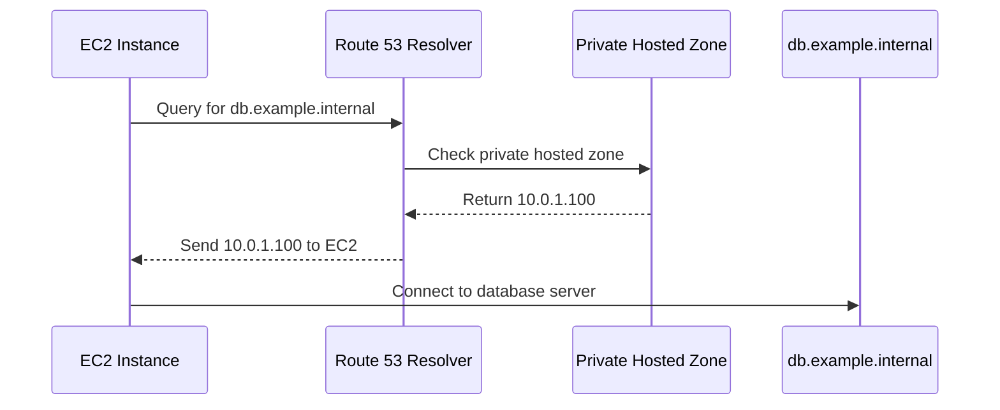
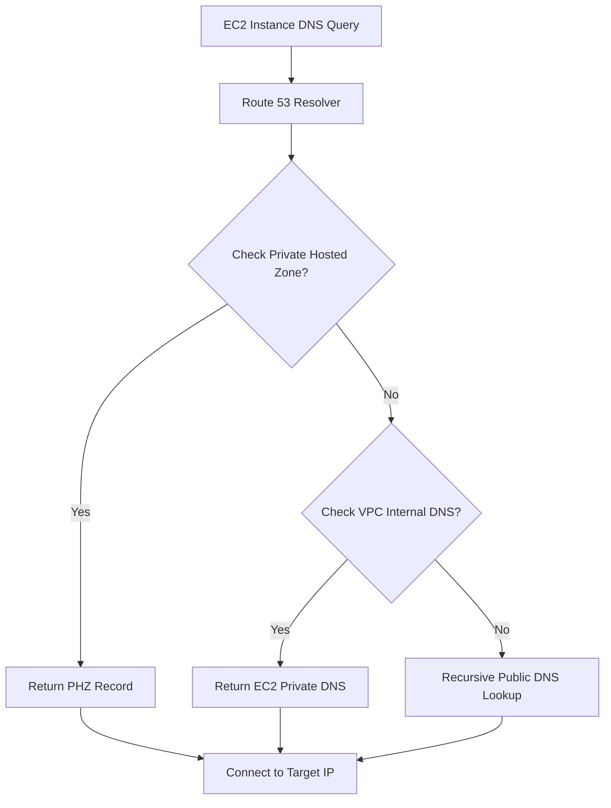

<details open>
<summary><b>Section 5: Section Introduction - How DNS works (KK-CS45-script-v2)</b></summary>

# Section 5: Section Introduction - How DNS works

## Table of Contents
- [5.1 Section Introduction - How DNS works](#51-section-introduction---how-dns-works)
- [5.2 Amazon VPC DNS Server (Route53 Resolver)](#52-amazon-vpc-dns-server-route53-resolver)
- [5.3 VPC DHCP Option sets](#53-vpc-dhcp-option-sets)
- [5.4 Hands on exercises scenarios](#54-hands-on-exercises-scenarios)
- [5.5 Hands On- VPC DNS with Route53 Private Hosted zone](#55-hands-on--vpc-dns-with-route53-private-hosted-zone)
- [5.6 Hands On- VPC DNS with custom DNS server](#56-hands-on--vpc-dns-with-custom-dns-server)
- [5.7 Introduction to Route53 DNS Resolver Endpoints (Hybrid DNS)](#57-introduction-to-route53-dns-resolver-endpoints-hybrid-dns)
- [5.8 Exam Essentials](#58-exam-essentials)

## 5.1 Section Introduction - How DNS works

### Overview
This lecture provides a foundational understanding of DNS and its importance in networking, focusing specifically on VPC DNS resolution rather than the broader public DNS managed by Route 53. It explains how DNS translates human-friendly names to IP addresses and explores the specific DNS challenges and solutions within VPC environments for AWS networking certification.

### Key Concepts and Deep Dive

#### DNS Basics and Functionality 🔍
- **Core Purpose**: Domain Name System translates human-readable domain names (e.g., example.com) into IP addresses for machine communication
- **Essential Role**: Backbone of internet connectivity - without DNS, devices cannot resolve internal or external network addresses
- **Basic Resolution Flow**:
  1. Device queries local DNS server (typically from ISP)
  2. Local server checks cache or forwards to authoritative servers
  3. Domain resolves to IP, enabling direct communication

#### DNS Caching Mechanism ✅
- **Performance Optimization**: First DNS lookup caches results for subsequent requests
- **Cache Storage**: Typically stored at device level and local DNS server level
- **Benefits**: Eliminates repeated lookups for same domain, improving response times

#### VPC DNS Scope and Boundaries 🔒
- **Focused Coverage**: This section covers DNS for VPC resources only
- **Boundaries**:
  - **In Scope**: Private DNS resolution within VPC, DNS for VPC resources accessing internet
  - **Out of Scope**: Public DNS management, Route 53 public hosted zones, load balancers, CloudFront, S3 access

#### VPC DNS Key Areas 📋
- **Amazon VPC DNS Server**: How Route 53 DNS Resolver works within VPC
- **DHCP Options Sets**: Configuration of DNS settings for VPC resources
- **EC2 Instance DNS**: Generation and assignment of private/public DNS names
- **VPC DNS Attributes**: Settings affecting DNS resolution behavior
- **Private VPC DNS**: Custom domain naming for EC2 instances
- **Hybrid DNS**: Route 53 Resolver Endpoints for cross-network DNS resolution

> [!NOTE]
> DNS is fundamental to networking - master these concepts before moving to AWS-specific implementations

## 5.2 Amazon VPC DNS Server (Route53 Resolver)

### Overview
This lecture deep dives into Amazon's VPC DNS infrastructure, clarifying various terminologies for the same service. It explains how the Route 53 Resolver handles three main categories of DNS queries within VPC environments and their resolution precedence.

### Key Concepts and Deep Dive

#### DNS Server Terminology and Identity 🏷️
Various names refer to same AWS service:
- Amazon VPC DNS Server
- Route 53 DNS Resolver
- Local DNS Server for VPC
- Amazon Provided DNS Server

#### Server Location and Accessibility 🌐
- **IP Address**: Runs at VPC base address + 2 (e.g., VPC 10.0.0.0/16 → DNS at 10.0.0.2)
- **Virtual IP**: Also accessible at 169.254.169.253 (VPC-only)
- **Scope**: Operates within VPC boundaries for EC2 instances

#### DNS Resolution Categories 📊
Three main types resolved by Route 53 Resolver:

| DNS Type | Description | Example |
|----------|-------------|---------|
| Private DNS (Route 53 Private Hosted Zone) | Custom domain names within VPC | app.example.internal → 10.0.1.100 |
| AWS Managed DNS (VPC Internal) | AWS-assigned EC2 instance names | ip-10-0-1-100.ec2.internal → 10.0.1.100 |
| Public DNS | Any internet-accessible domain | google.com → 8.8.8.8 |

#### Resolution Precedence and Order 🔢
```diff
! DNS Query Resolution Order:
+ First: Check Route 53 Private Hosted Zone
+ Second: Check VPC Internal DNS records
+ Third: Forward to Public DNS (recursive lookup)
```

> [!IMPORTANT]
> Private hosted zones have precedence - even google.com in private zone overrides public google.com

#### Route 53 Private Hosted Zone Workflow 🎯


#### AWS Ec2 Internal DNS Naming Convention 📝
- **Format**: `ip-{private-ip-without-dots}.{region}.compute.internal`
- **Example**: Private IP 10.0.1.100 in us-east-1 → `ip-10-0-1-100.ec2.internal`
- **Purpose**: AWS-provided automatic DNS naming for instances

#### Public DNS Resolution Flow 🌍
```diff
+ EC2 Instance → Route 53 Resolver → Recursive Public DNS Lookup → IP Address
- NOT directly from local DHCP - Route 53 Resolver handles public queries
```

#### DHCP Integration 💡
- VPC resources receive DNS server information via DHCP
- EC2 instances automatically configured with Route 53 Resolver IP
- No manual DNS configuration needed in typical setups

## 5.3 VPC DHCP Option sets

### Overview
Dynamic Host Configuration Protocol (DHCP) option sets provide the mechanism for AWS VPCs to distribute DNS configuration to all resources. This lecture explores DHCP's role in configuring DNS settings, domain names, and time synchronization parameters within VPC environments.

### Key Concepts and Deep Dive

#### DHCP Option Set Components ⚙️
DHCP configures multiple network parameters:

| Parameter | Purpose | Default Value |
|-----------|---------|---------------|
| Domain Name | Primary DNS suffix for VPC resources | `{region}.compute.internal` |
| Domain Name Servers | DNS server IP(s) for resolution | Route 53 Resolver (VPC+2) |
| NTP Servers | Network Time Protocol for time sync | AWS-provided |

#### DHCP Option Set Lifecycling 🔄
- **Default Behavior**: Every VPC receives automatic default DHCP option set
- **Immutability**: Cannot modify existing DHCP option sets
- **Modification Process**: Create new option set → Associate with VPC → Wait for propagation
- **Association Limit**: Only one DHCP option set per VPC at a time

#### EC2 Instance DNS Configuration 🖥️
When launched, EC2 instances automatically receive:
- **Private Hostname**: Based on DHCP domain name (e.g., `ip-10-0-1-100.ap-south-1.compute.internal`)
- **Public Hostname**: Generated if DNS hostnames enabled + public IP assigned
- **Resolv.conf Setup**: DNS server configuration via DHCP

#### Practical DHCP Configuration Example ⚡

```bash
# resolv.conf on Linux EC2 instance
nameserver 10.0.0.2          # Route 53 Resolver
search ap-south-1.compute.internal  # DHCP domain suffix
```

#### VPC DNS Attributes Configuration 🏗️

Two critical VPC-level attributes:

| Attribute | Description | Default | Impact |
|-----------|-------------|---------|--------|
| `enableDnsSupport` | Enable DNS resolution via AWS DNS server | `true` | Allows VPC resources to resolve DNS |
| `enableDnsHostnames` | Assign public DNS to instances with public IPs | `false` | Controls public hostname assignment |

```diff
+ RECOMMENDED: Both attributes = true when using Route 53 Private Hosted Zones
- WARNING: Route 53 Private Zone resolution fails if either is false
```

#### DHCP Propagation Behavior ⏱️
- **Time to Effect**: Changes typically take hours due to DHCP lease duration
- **Immediate Update**: Force refresh using OS-specific DHCP client commands:
  ```bash
  # Linux: Renew DHCP lease immediately
  sudo dhclient -r eth0 && sudo dhclient eth0

  # Windows: Use ipconfig commands
  ipconfig /release
  ipconfig /renew
  ```

#### EC2 DNS Name Resolution Examples 🔍
```diff
! Private DNS Resolution (within VPC):
+ nslookup ip-10-0-1-100.ap-south-1.compute.internal → 10.0.1.100

! Public DNS Resolution (from VPC to internet):
+ nslookup google.com → 8.8.8.8 (via Route 53 Resolver)

! Public DNS Resolution (from external):
+ nslookup ec2-3-xxx-xxx-xxx.ap-south-1.compute.amazonaws.com → 3.xxx.xxx.xxx
```

#### Custom Domain Configuration 🎨
- **Change Domain Suffix**: Modify DHCP option set domain name
- **DNS Server Override**: Point to custom DNS server via DHCP
- **Hybrid Scenarios**: Custom DNS with Route 53 Resolver Endpoints (covered later)

> [!NOTE]
> DHCP option sets are VPC-wide configuration affecting all instances - plan changes carefully

## 5.4 Hands on exercises scenarios

### Overview
This lecture outlines two comprehensive hands-on scenarios for VPC DNS configuration in AWS. The first scenario demonstrates DNS resolution using Route 53 Private Hosted Zones with default AWS DNS infrastructure, while the second scenario implements custom DNS server configuration for complete DNS control.

### Key Concepts and Deep Dive

#### Scenario 1: AWS-Managed DNS with Route 53 Private Hosted Zone 🎯

**Architecture:**
- VPC with EC2 instances (app server, DB server)
- Domain: `corp.internal`
- DNS Server: Default Route 53 Resolver (DHCP default)
- Record Types: A records mapping names to private IPs

**Configuration Steps:**
1. **VPC Setup**: Create VPC with appropriate subnets
2. **DHCP Configuration**:
   - Change domain name to `corp.internal` in new DHCP option set
   - Keep Route 53 Resolver as DNS server
3. **Private Hosted Zone**: Create Route 53 PHZ named `corp.internal`
4. **DNS Records**:
   - `app.corp.internal` → App server private IP
   - `db.corp.internal` → DB server private IP
5. **Testing**: Resolve DNS from app server to DB server

#### Scenario 2: Custom DNS Server Setup 🛠️

**Architecture:**
- VPC with EC2 instances + Custom DNS server
- Same domain: `corp.internal`
- DNS Server: Custom EC2 instance running BIND
- Zone File: Local DNS records mirroring PHZ

**Configuration Steps:**
1. **Infrastructure Setup**:
   - Launch DNS server EC2 instance within VPC
   - Configure security groups (UDP/TCP 53, SSH, ICMP)
2. **DNS Server Configuration**:
   - Install BIND (`yum install bind bind-utils`)
   - Create zone file with A records
   - Configure named.conf
3. **DHCP Option Set**:
   - Point domain name servers to custom DNS server IP
   - Set domain name to `corp.internal`
4. **DNS Records**:
   - Zone file entries: app/db A records
5. **Testing**: Verify resolution from all instances

#### Security Group Requirements 🛡️
```diff
+ SSH: Port 22 from admin IP
+ DNS: UDP/TCP 53 from VPC CIDR (10.0.0.0/16)
+ ICMP: All protocols from VPC CIDR for testing
```

#### Performance Comparison ⚖️
| Aspect | Scenario 1 (AWS DNS) | Scenario 2 (Custom DNS) |
|--------|---------------------|-------------------------|
| Management | AWS-managed, HA | Self-managed, single instance |
| Cost | Route 53 pricing | EC2 instance costs |
| Customization | Limited | Full control |
| Availability | Multi-AZ, scalable | Single instance (add redundancy) |

## 5.5 Hands On- VPC DNS with Route53 Private Hosted zone

### Overview
This hands-on exercise demonstrates implementing private DNS resolution using Route 53 Private Hosted Zones within a VPC while maintaining AWS's default DNS infrastructure. The lab configures a custom domain namespace accessible only within the VPC boundaries.

### Lab Demo Setup and Execution

#### Prerequisites 📋
- AWS Account with VPC access
- Basic understanding of Route 53 Hosted Zones
- Terminal/SSH client for instance access

#### Step-by-Step Configuration

**1. VPC and Subnet Creation:**
```bash
# Create VPC
aws ec2 create-vpc --cidr-block 10.0.0.0/16

# Create subnets (public and private)
aws ec2 create-subnet --vpc-id vpc-xxxxx --cidr-block 10.0.1.0/24
aws ec2 create-subnet --vpc-id vpc-xxxxx --cidr-block 10.0.2.0/24
```

**2. DHCP Option Set Configuration:**
```diff
+ Create new DHCP option set:
- Domain name: corp.internal
- Name servers: AmazonProvidedDNS
+ Associate with VPC
```

**3. Route 53 Private Hosted Zone Setup:**
```bash
# Create private hosted zone
aws route53 create-hosted-zone \
  --name corp.internal \
  --vpc VPCRegion=us-east-1,VPCId=vpc-xxxxx \
  --hosted-zone-config Comment="Private zone for corp VPC",PrivateZone=true
```

**4. EC2 Instance Deployment:**
```diff
+ Launch app server in public subnet with public IP
+ Launch DB server in private subnet (no public IP)
+ Security groups: Allow SSH and ICMP from VPC CIDR
```

**5. DNS Record Creation:**
```json
{
  "Comment": "Create A record for app server",
  "Changes": [
    {
      "Action": "CREATE",
      "ResourceRecordSet": {
        "Name": "app.corp.internal",
        "Type": "A",
        "TTL": 300,
        "ResourceRecords": [
          {
            "Value": "10.0.1.100"
          }
        ]
      }
    }
  ]
}
```
Repeat for DB server with `db.corp.internal` → DB private IP

#### Testing and Verification ✅
```bash
# Connect to app server via SSH
ssh -i key.pem ec2-user@public-ip

# Verify resolv.conf configuration
cat /etc/resolv.conf
# Expected: nameserver 10.0.0.2, search corp.internal

# Test DNS resolution
nslookup db.corp.internal
# Expected: 10.0.2.100

# Test connectivity
ping db.corp.internal
# Success indicates DNS + routing working
```

#### Advanced Resolution Techniques 🔍
```diff
! Short name resolution using search domains:
+ ping db → Resolves to db.corp.internal
- ping db.otherdomain.com → Doesn't use search suffix
```

#### Console Verification Steps 📊
1. **DNS Resolution Test**: Use instance terminal to nslookup records
2. **Private Hosted Zone**: Check Route 53 console for record propagation
3. **VPC Attributes**: Verify enableDnsSupport=true, enableDnsHostnames=true
4. **DHCP Association**: Confirm VPC uses corp.internal DHCP option set

> [!IMPORTANT]
> Private hosted zones override public DNS - test thoroughly to avoid resolution conflicts

#### Cleanup Commands 🧹
```bash
# Terminate instances to avoid charges
aws ec2 terminate-instances --instance-ids i-xxxxx i-yyyyy

# Delete hosted zone (optional, keep for persistence)
aws route53 delete-hosted-zone --id /hostedzone/ZXXXXXXXXXXXXXX
```

## 5.6 Hands On- VPC DNS with custom DNS server

### Overview
This advanced hands-on exercise demonstrates complete DNS sovereignty by deploying and configuring a custom BIND DNS server within the VPC. The lab replaces AWS's managed Route 53 Resolver with a self-hosted DNS infrastructure using zone files for domain resolution.

### Lab Demo Setup and Execution

#### Infrastructure Architecture 🏗️
```
VPC (10.0.0.0/16)
├── DNS Server (10.0.1.179) - BIND on Linux
├── App Server (10.0.1.180) - Uses custom DNS
└── DB Server (10.0.2.214) - Private subnet
```

#### Step-by-Step DNS Server Configuration

**1. Launch and Prepare DNS Server:**
```bash
# Launch EC2 instance for DNS server
aws ec2 run-instances \
  --image-id ami-xxxxx \
  --instance-type t2.micro \
  --subnet-id subnet-public \
  --security-group-ids sg-dns \
  --key-name my-key
```

**2. BIND Installation and Configuration:**
```bash
# Update system and install BIND
sudo yum update -y
sudo yum install bind bind-utils -y

# Create forward zone file
sudo vi /var/named/corp.internal.zone

# Zone file content
$TTL 86400
@   IN  SOA     ns1.corp.internal. admin.corp.internal. (
        2023010101 ; Serial
        3600       ; Refresh
        1800       ; Retry
        604800     ; Expire
        86400      ; Minimum TTL
)
@       IN  NS      ns1.corp.internal.
ns1     IN  A       10.0.1.179
app     IN  A       10.0.1.180   ; App server private IP
db      IN  A       10.0.2.214   ; DB server private IP
```

**3. BIND Configuration Files:**
```bash
# Edit /etc/named.conf
sudo vi /etc/named.conf

# Add zone definition
zone "corp.internal" IN {
    type master;
    file "corp.internal.zone";
    allow-update { none; };
};

# Configure BIND to listen only on loopback (internal only)
listen-on port 53 { 127.0.0.1; };
```

**4. DNS Service Management:**
```bash
# Start named service
sudo systemctl start named
sudo systemctl enable named

# Test BIND configuration
sudo named-checkconf
sudo named-checkzone corp.internal /var/named/corp.internal.zone

# Verify service status
sudo systemctl status named
```

#### DHCP Option Set Modification 🔧
```diff
+ Create new DHCP option set:
- Domain name: corp.internal
- Domain name servers: 10.0.1.179 (custom DNS server IP)
+ Associate with VPC
```

#### Instance Reboot for Configuration Propagation 🔄
```bash
# Reboot all instances to pick up new DHCP settings
aws ec2 reboot-instances --instance-ids i-app i-db i-dns

# Wait 2-3 minutes for DHCP lease renewal
```

#### Testing and Validation ✅
```bash
# Connect to app server
ssh -i key.pem ec2-user@app-public-ip

# Verify DNS configuration
cat /etc/resolv.conf
# Expected: nameserver 10.0.1.179, search corp.internal

# Test DNS resolution
nslookup app.corp.internal    # Should resolve to self
nslookup db.corp.internal     # Should resolve to DB IP
ping db.corp.internal         # Test connectivity
ping db                       # Short name resolution
```

#### Troubleshooting Commands 🛠️
```bash
# Check DNS server logs
sudo journalctl -u named -f

# Test local DNS resolution from DNS server
dig @localhost app.corp.internal

# Verify BIND is listening
netstat -tulpn | grep :53

# Force DHCP renewal (Linux)
sudo dhclient -r eth0 && sudo dhclient eth0
```

#### Security Considerations 🛡️
- **Firewall**: Ensure DNS UDP/TCP 53 open within VPC CIDR
- **Isolation**: Custom DNS server should be protected from external access
- **Backup**: Zone files should be backed up and version controlled
- **Logging**: Enable DNS query logging for troubleshooting

> [!NOTE]
> Custom DNS servers provide full control but require manual management and maintenance

#### Cost and Performance Comparison 📊
| Metric | Custom DNS | Route 53 Resolver |
|--------|------------|-------------------|
| Management Overhead | High | Low |
| Cost | EC2 instance + storage | Route 53 queries |
| Performance | Single instance | Multi-AZ, global |
| Features | Basic DNS | Advanced routing, health checks |

## 5.7 Introduction to Route53 DNS Resolver Endpoints (Hybrid DNS)

### Overview
Route 53 Resolver Endpoints solve the critical challenge of DNS resolution across hybrid cloud environments. This lecture introduces inbound and outbound endpoints that enable secure DNS queries between on-premises networks and VPC-based resources, extending Route 53 DNS Resolver capabilities beyond VPC boundaries.

### Key Concepts and Deep Dive

#### The Hybrid DNS Problem 🤝
Traditional AWS networking limitations:
- Route 53 Resolver only accessible within VPC
- DNS queries from on-premises → VPC blocked
- DNS queries from VPC → on-premises blocked
- VPN/Direct Connect provides network connectivity but not DNS resolution

#### Route 53 Resolver Endpoints Solution 🛠️
```diff
+ Inbound Endpoints: Receive DNS queries from outside VPC → Route to Resolver
+ Outbound Endpoints: Send DNS queries from VPC → External DNS servers
- Both use VPC-based ENIs for secure, hybrid DNS resolution
```

#### Inbound Resolver Endpoints Concept 🔄

**Purpose**: Allow on-premises networks to query AWS-managed DNS (Route 53 Public/Private zones)

**Architecture**:
```
On-Premises Network → VPN/Direct Connect → Inbound ENI IPs → Route 53 Resolver → DNS Resolution
```

**Use Cases**:
- Manage all DNS in AWS Route 53
- On-premises devices query AWS-hosted zones
- Hybrid applications resolving cross-network DNS

#### Outbound Resolver Endpoints Concept ↗️

**Purpose**: Enable VPC resources to query external DNS servers (on-premises or other clouds)

**Architecture**:
```
VPC EC2 → Route 53 Resolver → Outbound ENI → Conditional Forwarding → External DNS Server
```

**Use Cases**:
- Centralized DNS management in on-premises data center
- VPC resources resolving corporate DNS zones
- Cross-cloud DNS resolution scenarios

#### Endpoint Components and Features 🏗️

| Component | Description | Details |
|-----------|-------------|---------|
| ENI (Elastic Network Interface) | Network interface created in VPC | Provides IP for DNS queries |
| High Availability | Multi-AZ deployment | ENIs in multiple subnets |
| Security | VPC Security Groups | Control inbound/outbound DNS traffic |
| Scalability | Multiple ENIs per endpoint | Handle increasing DNS query loads |

#### Bidirectional DNS Resolution Patterns 🔄

**Scenario 1: AWS as DNS Authority**
```
Corp DNS Server → Forward to Inbound Endpoint IP → Route 53 Private Zone → Resolution
```

**Scenario 2: On-Premises as DNS Authority**
```
EC2 Instance → Outbound Endpoint → On-Premises DNS Server → Corporate Zone → Resolution
```

**Scenario 3: Split DNS Authority**
- Public domains: Route 53 Public Zones
- Corporate domains: Private Zones
- Conditional forwarding based on domain patterns

#### Practical Implementation Flow 📋

**Configuring Inbound Endpoint:**
```diff
1. Create Route 53 Resolver Endpoint (Inbound)
2. Select VPC and subnets for ENI creation
3. Receive IP addresses assigned to ENIs
4. Configure on-premises DNS servers to forward queries to ENI IPs
5. Test resolution from on-premises network
```

**Configuring Outbound Endpoint:**
```diff
1. Create Route 53 Resolver Endpoint (Outbound)
2. Configure forwarding rules based on domain names
3. Point rules to target DNS servers (IP addresses)
4. EC2 instances automatically use Route 53 Resolver
5. Test resolution from VPC resources
```

#### Benefits Over Legacy Approaches ✅
```diff
+ Simplified hybrid DNS setup vs. DHCP option set modifications
+ Secure ENI-based connectivity
+ Multi-AZ resilience
+ No need to deploy custom DNS forwarders
- Eliminates complex VPN tunnel configurations for DNS
```

#### Security and Compliance 🔐
- ENIs respect VPC security groups
- DNS queries can be logged and monitored
- Supports encrypted DNS (DoT/DoH) configurations
- Integration with AWS Network Firewall for DNS protection

> [!IMPORTANT]
> Resolver Endpoints are the recommended approach for hybrid DNS - they provide security, scalability, and simplified management compared to custom DNS forwarding solutions

## 5.8 Exam Essentials

### Overview
This lecture provides a comprehensive summary of VPC DNS concepts critical for AWS Advanced Networking Specialty certification. It consolidates key takeaways, configuration requirements, and exam-relevant patterns for VPC DNS resolution scenarios.

### Key Concepts and Deep Dive

#### Route 53 Resolver Fundamentals 🔍
- **Identity**: Amazon VPC DNS Server = Route 53 DNS Resolver = Amazon Provided DNS
- **Location**: VPC base address + 2 (e.g., 10.0.0.2 for VPC 10.0.0.0/16)
- **Virtual Access**: 169.254.169.253 (VPC-only)
- **Capabilities**: Resolves Private Hosted Zones, VPC DNS, and Public DNS

#### DNS Resolution Hierarchy 🔢
```diff
! Query Resolution Order (Critical for exam):
+ 1. Route 53 Private Hosted Zone (highest priority)
+ 2. VPC Internal DNS records (EC2 instance names)
+ 3. Public DNS (recursive lookups)
- Note: Private zones override public domains
```

#### DHCP Option Sets Management ⚙️
```diff
+ Cannot edit: Existing DHCP option sets are immutable
+ Create new: Always create new option set and associate with VPC
+ Single assocation: Only one DHCP option set per VPC
+ Propagation: Changes take hours (DHCP lease) or reboot
```

#### VPC DNS Attributes Configuration 📊
```table
| Attribute | Purpose | Default | Required for PHZ |
|-----------|---------|---------|------------------|
| enableDnsSupport | Use AWS DNS server | true | Yes |
| enableDnsHostnames | Public DNS for EC2 instances | false | Yes |

**Critical Rule**: Both must be `true` when using Route 53 Private Hosted Zones
```

#### EC2 DNS Naming Conventions 📝
- **Private DNS**: `ip-{private-ip}.{region}.compute.internal`
- **Example**: IP 10.0.1.100 in us-east-1 → `ip-10-0-1-100.ec2.internal`
- **Public DNS**: Only assigned if public IP + `enableDnsHostnames = true`

#### Hybrid DNS with Resolver Endpoints 🌉
```diff
+ Inbound Endpoints: On-premises → VPC DNS queries
+ Outbound Endpoints: VPC → On-premises DNS queries
- Purpose: Extend Route 53 Resolver across network boundaries
+ Implementation: ENIs in multiple subnets for high availability
```

#### Private Hosted Zone Resolution Flow 🎯


#### Common Exam Scenarios and Answers 💡

**Scenario**: EC2 instance cannot resolve Route 53 Private Hosted Zone records
**Solution**: Verify `enableDnsSupport = true` AND `enableDnsHostnames = true`

**Scenario**: Custom domain resolution needed within VPC
**Solution**: Create Route 53 Private Hosted Zone + appropriate A records

**Scenario**: Hybrid environment DNS resolution required
**Solution**: Configure Route 53 Resolver Endpoints (Inbound/Outbound)

**Scenario**: Public instances need public DNS names
**Solution**: Enable `enableDnsHostnames` VPC attribute

## Summary

### Key Takeaways
```diff
+ Route 53 Resolver resolves DNS in hierarchy: Private Zone → VPC DNS → Public DNS
+ DHCP option sets configure DNS servers and domain names for VPC resources
+ VPC DNS attributes must both be true for Private Hosted Zone resolution
+ Route 53 Resolver Endpoints enable hybrid DNS across on-premises and VPC boundaries
+ EC2 instances receive DNS configuration automatically via DHCP
- DHCP option sets cannot be edited - always create new and associate
```

### Quick Reference
```bash
# Check DNS resolution on Linux EC2
cat /etc/resolv.conf
nameserver 10.0.0.2        # Route 53 Resolver
search example.internal   # DHCP domain

# Test Private Hosted Zone resolution
nslookup app.example.internal

# Force DHCP renewal
sudo dhclient -r eth0 && sudo dhclient eth0

# Route 53 Private Zone creation
aws route53 create-hosted-zone --name example.internal --vpc VPCId=vpc-12345
```

### Expert Insight

#### Real-world Application
In enterprise environments, VPC DNS is crucial for establishing consistent naming conventions across cloud resources. Private Hosted Zones enable seamless application connectivity using meaningful names like `database.prod.internal` rather than IP addresses, improving application portability and reducing configuration errors in automated deployments.

#### Expert Path
Master DNS resolution by implementing hands-on labs combining multiple AWS DNS services. Create architectures using Route 53 Resolver Endpoints for hybrid scenarios, combining with Transit Gateway for multi-VPC connectivity. Understand DNS delegation patterns for complex, multi-account AWS environments.

#### Common Pitfalls
Never forget that Private Hosted Zones override public DNS - test applications using public domain names after implementing private zones. DHCP changes require instance reboots or manual DHCP renewal. Always verify both VPC DNS attributes are enabled when troubleshooting Private Hosted Zone resolution failures.

#### Lesser-Known Facts
Route 53 Resolver integrates natively with many AWS services like Lambda@Edge, enabling dynamic DNS-based routing decisions. The 169.254.169.253 virtual IP is optimized for VPC-resident services and provides latency benefits over direct ENI communication. DNS queries through Resolver Endpoints can leverage AWS Shield for DDoS protection.

</details>