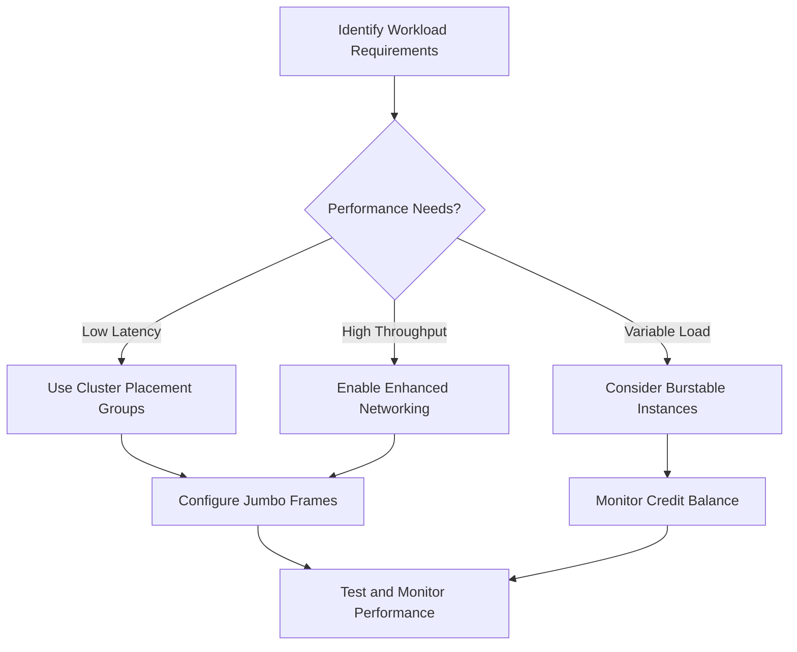

# Section 6: Basics of Network Performance

<details open>
<summary><b>Section 6: Basics of Network Performance (KK-CS45-script-v2)</b></summary>

## Table of Contents
- [6.1 Basics of Network Performance](#61-basics-of-network-performance---bandwidth-latency-jitter-throughput-pps-mtu)
- [6.2 Placement Groups and EBS Optimized EC2 Instances](#62-placement-groups-and-ebs-optimized-ec2-instances)
- [6.3 Enhanced Networking](#63-enhanced-networking)
- [6.4 DPDK and Elastic Fabric Adapter (EFA)](#64-dpdk-and-elastic-fabric-adapter-efa)
- [6.5 Bandwidth Limits Inside and Outside of VPC](#65-bandwidth-limits-inside-and-outside-of-vpc)
- [6.6 Network I/O Credits](#66-network-io-credits)
- [6.7 Network Performance Summary](#67-network-performance-summary)
- [6.8 Exam Essentials](#68-exam-essentials)
- [Summary](#summary)

## 6.1 Basics of Network Performance - Bandwidth, Latency, Jitter, Throughput, PPS, MTU

### Overview
Network performance in AWS VPC involves optimizing configurations to achieve optimal data transfer between sources and destinations. This module covers fundamental networking concepts including bandwidth, latency, jitter, throughput, packets per second (PPS), and maximum transmission unit (MTU). Understanding these metrics is crucial for making informed decisions to enhance network performance in exam scenarios.

### Key Concepts/Deep Dive

#### Bandwidth
- **Definition**: Maximum rate of transfer over a network, measured in bits per second (bps).
- **Common Units**: 25 Gbps, 1 Gbps, typically expressed as bits (not bytes).
- **Context**: Represents theoretical maximum data transfer capacity, but actual performance depends on other factors.

#### Latency
- **Definition**: Delay between two points in a network, including:
  - **Propagation Delay**: Time for signals to travel across physical medium (cannot achieve speed of light).
  - **Processing Delay**: Additional delays from network devices like routers processing packets.
- **Measurement**: Typically measured in time units (milliseconds).

#### Jitter
- **Definition**: Variation in inter-packet delays.
- **Impact**: Causes inconsistent network experience, problematic for real-time applications like video streaming.
- **Example**: Watching video with jitter results in inconsistent frame rates and quality issues.

#### Throughput
- **Definition**: Rate of successful data transfer, measured in bits per second.
- **Influencing Factors**: Bandwidth, latency, and packet loss all affect throughput.
- **Important Note**: Having 1 Gbps bandwidth doesn't guarantee 1 Gbps throughput due to latency and retransmissions.

#### Packets Per Second (PPS)
- **Definition**: Number of packets a machine/CPU can process per second.
- **Relationship to Bandwidth**: Even with high bandwidth (e.g., 25 Gbps), insufficient CPU power limits packet processing capabilities.
- **Impact**: Network performance is limited by both network capacity and compute power.

#### Maximum Transmission Unit (MTU)
- **Definition**: Largest packet size that can be sent over a network, varies based on network devices.
- **Impact**: Higher MTU = more data per packet = higher potential throughput.
- **Standard MTU**: 1500 bytes over internet.

**Jumbo Frames Deep Dive:**

- **Definition**: Packets larger than 1500 bytes, can be up to 9000-9001 bytes in AWS.
- **Benefits**:
  - Send more data per packet (6x more in 9001-byte vs 1500-byte packets).
  - Fewer transmissions for same data volume.
  - Reduced processing overhead per bit transferred.
  - More efficient for high-throughput scenarios.

**Jumbo Frame Mechanics:**

- **MTU Path Discovery**: Process to determine maximum MTU between hosts.
- **Don't Fragment (DF) Flag**: When DF=1, intermediary routers cannot break packets into smaller sizes.
- **ICMP Responses**: If router can't handle large packet with DF=1, responds with "change MTU to X" message.
- **Requirements**: ICMP must be allowed between hosts for path discovery.

**AWS Jumbo Frame Support:**

| Scenario | MTU Supported | Notes |
|----------|---------------|-------|
| Within VPC (EC2 to EC2) | 9001 bytes | Enabled by default, configured per instance |
| VPC Endpoints | 8500 bytes | For AWS services like S3, DynamoDB |
| Internet via IGW | 1500 bytes | Standard internet limitation |
| Same region VPC peering | 9001 bytes | Full jumbo support |
| Cross-region VPC peering | 8500 bytes | Reduced from 1500 to 8500 in 2023 |
| VPN connections | 1500 bytes | VGW and TGW limitations |
| Direct Connect Private VIF | 9001 bytes | Highest performance |
| Direct Connect Transit VIF | 8500 bytes | Via Direct Connect Gateway |
| Direct Connect Public VIF | 1500 bytes | Public service access |

**EC2 Instance Configuration:**

- **Instance Type Support**: Most current generation EC2 instances support jumbo frames.
- **Interface-Level Control**: For instances with multiple ENIs, MTU configurable per interface.
- **Path Discovery Commands**:
  - Use `tracepath` for MTU discovery.
- **Interface Commands**:
  ```bash
  # Check current MTU
  ip link show eth0

  # Set MTU (requires root)
  ip link set dev eth0 mtu 9001
  ```

### Lab Demo: MTU Path Discovery

1. **Launch Setup**: Two EC2 instances in same VPC (can be same or different subnets).

2. **Check Private IP Communication**:
   ```bash
   # From instance A to instance B private IP
   tracepath 10.0.1.100  # Private IP of target instance
   # Expected: MTU 9001 (jumbo frames supported within VPC)
   ```

3. **Check Internet Communication**:
   ```bash
   # From instance A to instance B public IP
   tracepath 54.123.45.67  # Public IP of target instance
   # Expected: MTU 1500 (standard internet limitation)
   ```

4. **Verify Interface MTU**:
   ```bash
   # Check current interface MTU setting
   ip link show eth0
   # Output should show: mtu 9001 (default for supported instances)
   ```

> [!IMPORTANT]
> Jumbo frames are enabled by default within VPC, but ensure no packet loss by configuring receiving applications to handle larger packets.

## 6.2 Placement Groups and EBS Optimized EC2 Instances

### Overview
Placement Groups provide control over EC2 instance placement to optimize specific workloads, while EBS optimization ensures dedicated bandwidth between instances and EBS volumes. This module covers how these features enhance networking performance by reducing latency and increasing throughput for demanding applications.

### Key Concepts/Deep Dive

#### Placement Groups

**Cluster Placement Groups:**
- **Purpose**: Places instances in close physical proximity within a single Availability Zone.
- **Benefits**:
  - Low network latency between instances.
  - High network throughput.
  - Ideal for tightly coupled node-to-node communication.
- **Use Cases**: High-performance computing (HPC), distributed computing, cluster computing.
- **Network Topology**: Instances in same rack or adjacent racks for minimal network hops.

**Partition Placement Groups:**
- **Purpose**: Spreads instances across different partitions/racks to maximize fault tolerance.
- **Benefits**:
  - Ensures instances don't share common points of failure.
  - Up to 7 partitions per AZ (more than 100 EC2 limit? No, instances per partition are limited).
- **Use Cases**: Applications needing fault isolation like Hadoop, Cassandra, Kafka.
- **Network Performance**: No specific network optimization - focuses on reliability.

**Spread Placement Groups:**
- **Purpose**: Distributes instances across different hardware to minimize correlated failures.
- **Benefits**:
  - Maximum failure isolation.
  - Automatic distribution across racks.
- **Limitations**: Maximum 7 instances per AZ.
- **Use Cases**: Small-scale applications requiring high availability (e.g., critical applications with few instances).

**Placement Group Best Practices:**
- **Naming**: Unique across AWS account (per region).
- **Deletion**: Only empty placement groups can be deleted.
- **Instance Launch**:
  - Cluster: Use Auto Scaling groups with mixed instance types for flexibility.
  - Can only be specified during launch (existing instances can't be moved into placement groups).
- **Best Instance Types**: Latest generation instances (e.g., C5, M5, R5) for optimal performance.

#### EBS Optimized EC2 Instances

**Core Concept:**
- **Dedicated Bandwidth**: Ensures consistent throughput and latency between instances and EBS volumes.
- **Traffic Separation**: EBS traffic doesn't compete with other network traffic.

**EBS-Optimized Instance Types:**
- **Included by Default**:
  - General Purpose: M6g, M5
  - Compute Optimized: C6g, C5, C5n
  - Memory Optimized: R6g, R5, R5n, X2gd, Z1d
  - Storage Optimized: I3, I3en, D2, D3, H1
- **Additional Cost for Older Generations**: Manual optimization required for C1, M1, M2, R3, T1.

**Dedicated Throughput Values:**

| Instance Type | Baseline Throughput | Max Burst Throughput |
|---------------|---------------------|----------------------|
| c5.large | 200 Mbps | 350 Mbps |
| c5.xlarge | 400 Mbps | 700 Mbps |
| c5.2xlarge | 700 Mbps | 1,250 Mbps |
| c5.4xlarge | 1,250 Mbps | 2,000 Mbps |
| m5.large | 212 Mbps | 318 Mbps |
| r5.large | 212 Mbps | 3,079 Mbps |

**Multiple Volume Performance:**
- **10k Provisioned IOPS Volume**: Max throughput 320 Mbps per volume.
- **IO1 with 256k IOPS**: 4 Gbps max for large instances.
- **Mathematics**: Throughput = min(Instance limit, Sum of individual volume limits).

**Monitoring and Optimization:**
- **CloudWatch Metrics**: Track `VolumeReadBytes`, `VolumeWriteBytes` vs EBS limits.
- **Bottleneck Identification**: Compare instance utilization vs EBS-io-balance% (should not reach 0).

### Lab Demo: Creating and Using Placement Groups

1. **Create Cluster Placement Group**:
   ```bash
   aws ec2 create-placement-group \
     --group-name my-cluster-group \
     --strategy cluster
   ```

2. **Launch Instances in Placement Group**:
   ```bash
   aws ec2 run-instances \
     --image-id ami-12345678 \
     --count 2 \
     --instance-type c5.xlarge \
     --placement GroupName=my-cluster-group,Tenancy=default
   ```

3. **Verify Placement**:
   ```bash
   aws ec2 describe-instances \
     --filters "Name=placement.group-name,Values=my-cluster-group" \
     --query 'Reservations[*].Instances[*].{ID:InstanceId,AZ:Placement.AvailabilityZone}'
   ```

> [!NOTE]
> Placement groups cannot be changed after instance launch. Delete and recreate instances to move between groups.

## 6.3 Enhanced Networking

### Overview
Enhanced Networking provides higher network performance through specialized hardware and drivers, significantly improving packet processing capabilities. This module explores how AWS leverages SR-IOV and Intel 82599 VF interfaces to deliver low latency and high throughput network virtualization.

### Key Concepts/Deep Dive

#### Core Architecture
**SR-IOV (Single Root I/O Virtualization):**
- **Purpose**: Allows multiple virtual machines to share physical network interface efficiently.
- **Benefits**:
  - Reduced CPU overhead compared to traditional virtualization.
  - Direct hardware access for VMs.
  - Higher throughput and lower latency.

**Intel 82599 VF Interfaces:**
- **Hardware Basis**: Intel 82599 10 Gigabit Ethernet controller with virtualization support.
- **Virtual Functions**: Multiple VFs created from single physical function (PF).

#### Performance Improvements
**Throughput Enhancement:**
- Up to 10 Gbps baseline (vs 1 Gbps with regular instances).
- Burst up to 25 Gbps depending on instance type.
- Consistent network performance without CPU contention.

**Latency Reduction:**
- Lower CPU processing overhead for packet handling.
- Direct hardware path reduces virtualization layer bottlenecks.
- Microsecond-level latency improvements.

**PPS Improvements:**
- Capability to handle significantly higher packets per second (PPS).
- Critical for applications requiring many small packets (e.g., databases, real-time systems).

#### Instance Type Support
**Supported Instance Families:**
- C4, C5, C5n, C6n
- D2, M4, M5, M6
- P3, R4, R5
- T3, T3a
- X1, X1e (enhanced with ENA)

**ENA Required Minimum**:
- Elastic Network Adapter (ENA) driver required for most modern instances.
- Earlier generations used Intel 82599 VF.

#### Elastic Network Adapter (ENA)
**Features:**
- Next-generation networking interface from AWS.
- Successor to Intel 82599 VF technology.
- Advanced packet processing capabilities.

**Performance Capabilities:**
- Up to 100 Gbps networking on specialized instances.
- Enhanced reliability and performance monitoring.
- Support for advanced networking features.

#### Cluster Placement Group Enhancement
- **Combined Effect**: Enhanced Networking + Cluster Placement Groups = Maximum network performance.
- **Use Case**: Ultra-low latency communications between tightly coupled instances.

#### Network Performance Testing
**CloudWatch Metrics:**
- `NetworkPacketsIn`: Monitor incoming packet rate.
- `NetworkPacketsOut`: Monitor outgoing packet rate.
- `NetworkIn`: Monitor incoming bandwidth.
- `NetworkOut`: Monitor outgoing bandwidth.

**Comparison: Regular vs Enhanced Networking**

| Metric | Regular Networking | Enhanced Networking |
|--------|-------------------|---------------------|
| Throughput | Up to 1 Gbps | Up to 25 Gbps+ |
| Latency | Higher CPU overhead | Lower virtualization latency |
| PPS | Limited by software | Hardware-accelerated processing |
| Reliability | Software-based | Hardware-assisted |

### Lab Demo: Enabling Enhanced Networking

1. **Install ENA Driver (Amazon Linux)**:
   ```bash
   sudo yum update -y
   sudo yum install -y kernel-devel-$(uname -r)
   sudo modprobe ena
   ```

2. **Verify ENA Support**:
   ```bash
   # Check network adapter
   ethtool -i eth0

   # Should show 'ena' driver
   driver: ena
   ```

3. **Test Network Performance**:
   ```bash
   # Install network tools
   sudo yum install -y iperf3

   # Run performance test between instances
   iperf3 -c <target-private-ip> -t 30
   ```

> [!IMPORTANT]
> Enhanced Networking requires specific instance types and proper driver configuration. Ensure compatibility before migration.

## 6.4 DPDK and Elastic Fabric Adapter (EFA)

### Overview
Data Plane Development Kit (DPDK) and Elastic Fabric Adapter (EFA) represent advanced networking technologies for high-performance computing workloads. DPDK provides userspace networking for low-latency packet processing, while EFA enables OS-bypass communication for HPC applications requiring sub-microsecond latency.

### Key Concepts/Deep Dive

#### Data Plane Development Kit (DPDK)
**Core Concept:**
- **Userspace Networking**: Moves network packet processing from kernel space to user space.
- **Benefits**:
  - Eliminates kernel context switches.
  - Reduces latency from microseconds to nanoseconds range.
  - Increases PPS processing capability dramatically.

**Architecture:**
- ** librte_eal**: Environment Abstraction Layer handles initialization.
- **librte_mempool**: Manages packet buffers.
- **librte_ether**: Ethernet packet manipulation.
- **Poll Mode Drivers (PMDs)**: Handle I/O without interrupts.

**Use Cases:**
- Network function virtualization (NFV).
- Software-defined networking (SDN).
- High-frequency trading systems.
- Real-time analytics platforms.

#### Elastic Fabric Adapter (EFA)
**AWS HPC Innovation:**
- **OS-Bypass Technology**: Bypasses operating system entirely for direct hardware communication.
- **Scalability**: Supports up to thousands of instances in HPC clusters.
- **Protocol**: Uses Scalable Reliable Datagram (SRD) protocol for RDMA-like capabilities.

**Performance Capabilities:**
- **Latency**: Sub-microsecond communication times.
- **Throughput**: Up to 400 Gbps per instance (on largest types).
- **Scalability**: 16x better scaling than TCP/IP for large node counts.

**Supporting Technologies:**
- **RDMA over Converged Ethernet (RoCE)**: Ethernet-based RDMA implementation.
- **Libfabric**: Low-level communication library for high-performance networks.

#### Instance Type Support
**EFA-Compatible Instances:**
- C6gn, C6i, C5n, C5
- Hpc6a, Hpc6id
- M6i, M6a, M5n, M5
- P5, P4d, P4de, P3
- R6i, R6a, R5, R5n
- X2i, X2idn, X2iedn
- Z1d

**HPC-Specific Types:**
- hpc6a.48xlarge: Up to 400 Gbps networking.
- hpc6id.32xlarge: High performance with local NVMe storage.

#### EFA vs Traditional Networking

| Aspect | Traditional TCP/IP | EFA |
|--------|-------------------|-----|
| Latency | Microseconds | Nanoseconds |
| Throughput | Up to 100 Gbps | Up to 400 Gbps |
| CPU Overhead | High | Minimal |
| Scalability | Good | Excellent for MPI |
| Use Case | General computing | HPC, ML training |

#### Setup and Configuration
**Requirements:**
- EFA-enabled security groups.
- Libfabric and Open MPI installation for MPI applications.

**Development Focus Areas:**
- **MPI Applications**: Message Passing Interface optimization.
- **NCCL**: NVIDIA Collective Communications Library for distributed training.

### Lab Demo: Setting Up DPDK

1. **Install DPDK Dependencies**:
   ```bash
   sudo yum groupinstall -y "Development Tools"
   sudo yum install -y numactl-devel
   ```

2. **Download and Build DPDK**:
   ```bash
   wget http://fast.dpdk.org/rel/dpdk-21.11.1.tar.xz
   tar xf dpdk-21.11.1.tar.xz
   cd dpdk-21.11.1
   make config T=x86_64-native-linux-gcc
   make -j$(nproc)
   ```

3. **Bind Network Interface to DPDK**:
   ```bash
   # List network devices
   ./usertools/dpdk-devbind.py --status

   # Bind interface to vfio-pci driver
   ./usertools/dpdk-devbind.py -b vfio-pci 00:06.0
   ```

4. **Run DPDK Application**:
   ```bash
   # Example: packet forwarding application
   ./build/examples/dpdk-helloworld -l 0-1 -n 2
   ```

> [!NOTE]
> DPDK and EFA require specialized hardware and software configurations. Consult AWS documentation for production deployments.

## 6.5 Bandwidth Limits Inside and Outside of VPC

### Overview
Understanding VPC bandwidth limitations is crucial for architecting high-performance network solutions. This module details the bandwidth caps within AWS networking components, both inside VPCs and when communicating with external resources, helping you design systems that maximize available throughput.

### Key Concepts/Deep Dive

#### VPC Internal Bandwidth Limits
**EC2 Instance Network Bandwidth:**
- **Baseline vs Burst**: Most instances have baseline bandwidth with burst capability.
- **Network Credits**: Similar to CPU credits, accumulate during low usage.

**Network Bandwidth by Instance Family:**

| Instance Family | Examples | Baseline (Gbps) | Burst (Gbps) |
|----------------|----------|-----------------|--------------|
| T3 | t3.micro, t3.small | 0.4-2.1 | 5 |
| M5 | m5.large, m5.2xlarge | 0.75-4.75 | 10 |
| C5 | c5.large, c5.4xlarge | 0.75-4.75 | 10 |
| R5 | r5.large, r5.4xlarge | 0.75-4.75 | 10 |
| M6g | m6g.medium, m6g.16xlarge | 0.75-9.5 | 19 |

#### Network Interface Limits
**Elastic Network Interfaces (ENIs):**
- **Bandwidth Sharing**: Multiple ENIs on same instance share total instance bandwidth.
- **Dedicated Interfaces**: Some instances have dedicated network cards.

**Enhanced Networking Limits:**
- **ENA Support**: Up to 25 Gbps on supported instances.
- **Multi-Flow**: Better performance with multiple concurrent flows.

#### External Connectivity Bandwidth

**Internet Gateway (IGW) Limits:**
- Instance bandwidth capped at instance's network limit.
- No additional VPC-level throttling for outbound traffic.
- Subject to general AWS service limits.

**VPC Peering Limitations:**
- **Intra-region**: Same 10 Gbps limits as direct instance communication.
- **Cross-region**: Bandwidth limited by region interconnect capacity.
- Subject to standard network limits per instance.

**Direct Connect Bandwidth Options:**
- **Dedicated Connections**: 50 Mbps - 100 Gbps.
- **Hosted Connections**: 50 Mbps - 10 Gbps.
- **Multiple Connections**: Aggregate bandwidth possible.

**VPN Limitations:**
- **Site-to-Site VPN**: Up to 1.25 Gbps per tunnel, up to 4 tunnels per connection.
- **Transit Gateway VPN**: 2.5 Gbps aggregate per AZ for VPN attachments.

#### Network Address Translation (NAT) Limits
**NAT Gateway Bandwidth:**
- **Small**: 5 Gbps, bursts to 6.1 Gbps.
- **Medium**: 10 Gbps, bursts to 12.3 Gbps.
- **Large**: 45 Gbps, bursts to 55 Gbps.
- Scalable with multiple AZs and gateways.

**NAT Instance Limitations:**
- Limited by underlying EC2 instance network bandwidth.
- Usually lower throughput than NAT Gateway.
- Not recommended for high-throughput configurations.

#### VPC Endpoints Bandwidth
- **Interface Endpoints**: Limited by ENI and instance bandwidth.
- **Gateway Endpoints**: Direct integration, subject to instance limits.
- **PrivateLink Services**: Up to 100 Gbps depending on configuration.

#### Monitoring and Optimization
**CloudWatch Metrics:**
- Monitor `NetworkIn` and `NetworkOut`.
- Track packet counts with `NetworkPacketsIn/Out`.
- Compare against instance limits.

**Optimization Strategies:**
- **Multiple Interfaces**: Spread traffic across ENIs.
- **Traffic Shaping**: Use application-level load balancing.
- **Instance Sizing**: Right-size instances for network requirements.

### Lab Demo: Monitoring Network Bandwidth

1. **Install Monitoring Tools**:
   ```bash
   sudo yum install -y sysstat nload
   ```

2. **Monitor Real-time Bandwidth**:
   ```bash
   nload -u M eth0
   ```

3. **Check CloudWatch Metrics**:
   ```bash
   aws cloudwatch get-metric-statistics \
     --namespace AWS/EC2 \
     --metric-name NetworkOut \
     --dimensions Name=InstanceId,Value=i-1234567890abcdef0 \
     --start-time 2023-01-01T00:00:00Z \
     --end-time 2023-01-02T00:00:00Z \
     --period 3600 \
     --statistics Maximum
   ```

> [!IMPORTANT]
> Bandwidth limits are instance-specific and additive. Plan architecture to avoid bottlenecks at any layer.

## 6.6 Network I/O Credits

### Overview
Network I/O credits provide burstable networking for T-instance families, allowing temporary network performance increases above baseline levels. Understanding the credit system is essential for optimizing cost and performance in variable-workload scenarios.

### Key Concepts/Deep Dive

#### Credit System Fundamentals
**Basic Mechanism:**
- **Earn Rate**: Credits accumulate during periods of low network usage.
- **Spend Rate**: Credits consumed during high network usage.
- **Credit Balance**: Maximum 1440 credits stored.

**T3 Instance Networking:**
- **Baseline Performance**: Varies by instance size (e.g., 0.256 Gbps for t3.small).
- **Burst Performance**: Up to 5 Gbps possible with sufficient credits.

**Credit Accumulation:**
- **Rate**: 0.064 credits per minute baseline.
- **Maximum Balance**: 144 credits (allows ~1 hour at full burst).
- **Steady State**: No burst capability without credit accumulation.

#### Instance-Specific Limits

| Instance Type | vCPUs | Baseline (Gbps) | Burst (Gbps) | Credit Earn/Hour | Max Credits |
|---------------|-------|-----------------|--------------|------------------|-------------|
| t3.nano | 2 | 0.032 | 5 | 3.84 | 96 |
| t3.micro | 2 | 0.064 | 5 | 7.68 | 144 |
| t3.small | 2 | 0.128 | 5 | 15.36 | 288 |
| t3.medium | 2 | 0.256 | 5 | 30.72 | 576 |
| t3.large | 2 | 0.512 | 5 | 61.44 | 864 |
| t3.xlarge | 4 | 1.024 | 5 | 122.88 | 1296 |
| t3.2xlarge | 8 | 2.048 | 5 | 245.76 | 2304 |

#### Credit Exhaustion Behavior
**Throttle Mechanism:**
- When credits deplete, performance drops to baseline rate.
- No "debt" accumulation - simply throttled until credits rebuild.

**Monitoring Credits:**
- **CloudWatch Metric**: `CPUCreditBalance` (note: actually network credits).
- **API Access**: Available via EC2 API and CloudWatch.
- **Alert Threshold**: Set alerts when credit balance drops below threshold.

#### CPU Credit Confusion
> [!WARNING]
> AWS CloudWatch shows `CPUCreditBalance` but this actually represents network I/O credits for T3 instances, not CPU credits.

#### Optimization Strategies
**Burst-Aware Applications:**
- Schedule burst activities during low-traffic periods.
- Implement exponential backoff for retries.
- Use CloudWatch alarms to monitor credit balance.

**Sizing Considerations:**
- **Unpredictable Workloads**: Consider M5, C5 instances for consistent performance.
- **Burstable vs Fixed**: Choose based on traffic patterns cost requirements.

#### Unlimited Mode Considerations
**T3 Unlimited:**
- Additional cost for sustained high performance.
- Automatic credit borrowing beyond normal limits.
- Ideal for applications with variable predictable burst patterns.

### Lab Demo: Monitoring Network Credits

1. **View Current Credit Balance**:
   ```bash
   aws cloudwatch get-metric-statistics \
     --namespace AWS/EC2 \
     --metric-name CPUCreditBalance \
     --dimensions Name=InstanceId,Value=i-1234567890abcdef0 \
     --start-time $(date -u -d '1 hour ago' +%Y-%m-%dT%H:%M:%SZ) \
     --end-time $(date -u +%Y-%m-%dT%H:%M:%SZ) \
     --period 300 \
     --statistics Maximum
   ```

2. **Set CloudWatch Alarm**:
   ```bash
   aws cloudwatch put-metric-alarm \
     --alarm-name "LowNetworkCredits" \
     --alarm-description "Network credits running low" \
     --metric-name CPUCreditBalance \
     --namespace AWS/EC2 \
     --statistic Minimum \
     --period 300 \
     --threshold 50 \
     --comparison-operator LessThanThreshold \
     --dimensions Name=InstanceId,Value=i-1234567890abcdef0 \
     --evaluation-periods 2 \
     --alarm-actions arn:aws:sns:us-east-1:123456789012:network-alerts
   ```

3. **Monitor with sar**:
   ```bash
   sar -n DEV 1 5
   ```

> [!NOTE]
> Network credits work similarly to CPU credits but are tracked separately. Monitor both for complete performance visibility.

## 6.7 Network Performance Summary

### Overview
This module consolidates the network performance optimization techniques covered in the section. It provides a comprehensive framework for choosing the right combination of AWS networking features to achieve optimal performance for specific workload requirements.

### Key Concepts/Deep Dive

#### Performance Hierarchy
1. **Instance Selection**: Choose instance types with required baseline/burst network capacity.
2. **Enhanced Networking**: Enable SR-IOV/ENA for hardware acceleration.
3. **Placement Groups**: Use cluster groups for low-latency requirements.
4. **MTU Configuration**: Implement jumbo frames where supported.
5. **EBS Optimization**: Enable for consistent storage I/O.
6. **EFA/DPDK**: For extreme low-latency HPC workloads.

#### Workload-Specific Recommendations

**High-Performance Computing (HPC):**
- Elastic Fabric Adapter (EFA) for OS-bypass communication.
- Cluster Placement Groups for physical proximity.
- Latest generation compute instances with high networking.

**Database Workloads:**
- Enhanced Networking with ENA.
- Provisioned IOPS EBS storage with optimization.
- Multi-AZ deployments with synchronous replication.

**Content Delivery:**
- Jumbo frames for large file transfers.
- NAT Gateway scaling for outbound traffic.
- Direct Connect for dedicated bandwidth.

**Real-Time Applications:**
- Low-latency placement groups.
- Enhanced networking instances.
- Network monitoring with sub-minute granularity.

#### Cost-Performance Trade-offs
**Burstable Instances:**
- Suitable for variable workloads with credit monitoring.
- Monitor credit depletion to avoid performance drops.

**Fixed-Performance Instances:**
- Predictable costs and performance.
- Better for consistent high-throughput needs.

#### Monitoring and Troubleshooting
**Key Metrics to Monitor:**
- NetworkPacketsIn/Out
- NetworkIn/Out
- CPUCreditBalance (for T3)
- VolumeReadBytes/WriteBytes (for EBS)

**Common Performance Issues:**
- MTU mismatches causing packet fragmentation.
- Security group rules blocking jumbo frames (need ICMP allow).
- Instance type limitations on maximum throughput.
- Cross-region latency penalties.

**Optimization Workflow:**


#### Best Practices Checklist

✅ **Instance Selection**: Choose network-optimized instance types
✅ **Placement Strategy**: Use appropriate placement groups for requirements
✅ **Network Configuration**: Enable enhanced networking and EBS optimization
✅ **MTU Optimization**: Implement jumbo frames for high-throughput intra-VPC traffic
✅ **Monitoring Setup**: Configure CloudWatch alarms for performance metrics
✅ **Security Consideration**: Ensure ICMP permits for path MTU discovery
✅ **Cost Monitoring**: Evaluate fixed vs burstable pricing models

## 6.8 Exam Essentials

### Overview
Understanding the exam essentials for network performance optimization is critical for AWS Advanced Networking Specialty certification. This module highlights key concepts, decision-making scenarios, and configuration requirements commonly tested in the exam.

### Key Concepts/Deep Dive

#### Core Performance Concepts
**Bandwidth Definitions:**
- **Bandwidth**: Theoretical maximum transfer rate (bits/second).
- **Throughput**: Actual successful data transfer rate.
- **Latency**: End-to-end delay measurement.
- **Jitter**: Variation in packet inter-arrival times.

**MTU Critical Values:**
- **VPC Internal**: 9001 bytes for jumbo frames.
- **Internet Traffic**: 1500 bytes maximum.
- **VPC Peering**: 9001 bytes (same region), 8500 bytes (cross-region).
- **Direct Connect**: Varies by virtual interface type.

#### Instance Type Selection Criteria
**Network-Optimized Families:**
- C5/C6: Compute optimized with high network performance.
- R5/R6: Memory optimized with strong networking.
- M5/M6: General purpose with solid network capabilities.
- **EFA Support**: Required for HPC workloads needing OS-bypass.

#### Placement Group Scenarios
**Cluster Groups:**
- Best for low-latency, high-throughput inter-instance communication.
- Required for EFA-enabled HPC clusters.
- Instances launched within same group maintain proximity.

**Spread Groups:**
- Maximum failure isolation across hardware.
- Limited to 7 instances per Availability Zone.
- Ideal for critical applications with small instance counts.

#### Enhanced Networking Configuration
**ENA Implementation:**
- Required for most current-generation instances.
- Provides hardware-accelerated networking.
- Supports up to 100 Gbps on specialized instances.

**SR-IOV Understanding:**
- Single Root I/O Virtualization for efficient hardware sharing.
- Bypasses software-based virtualization overhead.
- Critical for high-packet-rate applications.

#### EBS Performance Optimization
**Optimization Requirements:**
- Included by default on most current instances.
- Provides dedicated EBS bandwidth.
- Prevents EBS traffic from competing with VPC traffic.

**Performance Limits:**
- Instance-level bandwidth ceilings.
- Per-volume IOPS and throughput limits.
- Aggregate limits across attached volumes.

#### Bandwidth Limit Awareness
**VPC Internal Limits:**
- Determined by instance type baseline/burst capabilities.
- Enhanced Networking significantly increases throughput.
- Multiple ENIs share total instance bandwidth.

**External Connection Limits:**
- Internet Gateway: Subject to per-instance limits.
- VPN: Capped at 1.25 Gbps per tunnel.
- Direct Connect: Dedicated bandwidth provisioning.

#### Network I/O Credits
**T3 Instance Mechanics:**
- Earn credits at defined rates during low usage.
- Spend credits for burst performance up to 5 Gbps.
- Maximum credit balance limits burst duration.

**Monitoring Note:**
- `CPUCreditBalance` metric actually tracks network credits.
- Critical for applications requiring predictable performance.

#### Exam Scenario Patterns

**High-Performance Database:**
> [!IMPORTANT]
> For RDS instances requiring high throughput, recommend Enhanced Networking instances with EBS optimization in Cluster Placement Groups.

**HPC ML Training:**
> [!NOTE]
> Elastic Fabric Adapter (EFA) on hpc6a instances within Cluster Placement Groups for minimal latency distributed training workloads.

**Content Delivery Network:**
> [!IMPORTANT]
> NAT Gateway with multiple AZs for horizontal scaling, Direct Connect for predictable bandwidth to on-premises content sources.

**Variable-Traffic Applications:**
> [!NOTE]
> T3 instances with Unlimited mode for cost-effective variable workloads, with CloudWatch alarms on credit balance.

#### Configuration Decision Framework
```diff
! Evaluate workload requirements: latency, throughput, fault tolerance
+ Choose instance family: C/R/M with appropriate size
+ Select placement strategy: cluster for low latency, spread for isolation
+ Configure networking: enable enhanced networking, set MTU
+ Optimize storage: enable EBS optimization, provision IOPS
+ Monitor performance: set CloudWatch alarms on key metrics
- Avoid over-provisioning: match instance capabilities to actual needs
```

#### Common Exam Pitfalls
❌ **Confusing bandwidth with throughput** - Bandwidth is theoretical maximum, throughput is actual measured performance.
❌ **MTU misconfiguration** - Jumbo frames not supported for internet traffic or certain VPN connections.
❌ **Placement group limitations** - Cannot move existing instances into placement groups.
❌ **Credit misunderstanding** - CPUCreditBalance tracks network credits on T3, not CPU credits.
❌ **EFA applicability** - Only for HPC workloads; standard networking sufficient for most applications.

**Quick Reference Commands:**

```bash
# Check network interface MTU
ip link show eth0

# Set jumbo frames
ip link set dev eth0 mtu 9001

# Test MTU path discovery
tracepath <target-ip>

# Monitor network performance
sar -n DEV 1 5

# Check placement group
aws ec2 describe-placement-groups --group-names my-cluster-group
```

## Summary

### Key Takeaways
```diff
+ Network performance optimization requires combined use of multiple AWS features
+ Instance selection is foundational - choose types supporting required throughput and features
+ Enhanced Networking (ENA) provides hardware acceleration for low latency and high PPS
+ Placement Groups control instance physical distribution for latency or fault isolation needs
+ Jumbo frames (MTU 9001) maximize VPC internal throughput but limited externally
+ EFA enables sub-microsecond latency for HPC applications with OS-bypass technology
+ Bandwidth limits are instance-specific with burstable and baseline capacities
+ Network I/O credits on T3 instances enable cost-effective variable performance
- Single feature optimization rarely achieves maximum performance - use integrated approaches
```

### Quick Reference Guide

**Instance Network Capabilities:**
- T3: Burstable up to 5 Gbps (credit-limited)
- M5/C5/R5: Up to 10-25 Gbps (ENA)
- HPC6a: Up to 400 Gbps (EFA)

**Key MTU Values:**
- VPC Internal: 9001 bytes
- Internet: 1500 bytes
- VPC Peering: 9001 (same), 8500 (cross-region)
- Direct Connect: 9001 (private), 1500 (public)

**Placement Group Types:**
- Cluster: Low latency, high throughput
- Spread: Maximum fault isolation (max 7 instances)
- Partition: Balanced distribution with fault tolerance

### Expert Insight

**Real-world Application**: In production environments, start with Enhanced Networking as baseline, add Placement Groups for latency-critical workloads, implement Jumbo Frames for data-intensive transfers, and use EFA only for extreme HPC requirements. Monitor performance continuously and scale instance sizes before adding complexity.

**Expert Path**: Master the interaction between different optimization techniques. Understand that 10 Gbps instance bandwidth doesn't guarantee 10 Gbps application throughput due to protocol overhead, TCP windowing, and application processing limits. Learn to use network diagnostic tools like `iperf3`, `netperf`, and AWS Network Analyzer for troubleshooting.

**Common Pitfalls**: Avoid assuming bandwidth equals throughput, forgetting MTU limitations for external traffic, using placement groups incorrectly for existing instances, and neglecting ICMP requirements for path MTU discovery. Don't over-rely on credit-based bursting for consistent performance needs.

**Lesser-Known Facts**: EBS optimization doesn't just improve EBS performance—it also prevents EBS traffic from contending with VPC traffic on non-optimized instances. Cross-region VPC peering MTU increased from 1500 to 8500 bytes in 2023 due to customer demand, but still less than same-region peering. Network credits on T3 instances actually accrue based on utilized bandwidth, not just time elapsed.

</details>
