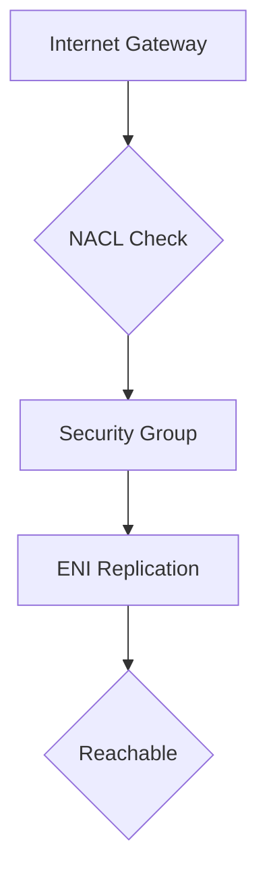

<details open>
<summary><b>Section 7: VPC Traffic Monitoring, Troubleshooting and Analysis (KK-CS45-script-v2)</b></summary>

# Section 7: VPC Traffic Monitoring, Troubleshooting and Analysis

## Table of Contents
- [7.1 Section Introduction](#71-section-introduction)
- [7.2 VPC Traffic Monitoring with VPC Flow logs](#72-vpc-traffic-monitoring-with-vpc-flow-logs)
- [7.3 VPC Traffic Mirroring](#73-vpc-traffic-mirroring)
- [7.4 VPC features for Network Analysis](#74-vpc-features-for-network-analysis)
- [7.5 VPC Reachability Analyzer](#75-vpc-reachability-analyzer)
- [7.6 Walkthrough- VPC Reachability Analyzer](#76-walkthrough--vpc-reachability-analyzer)
- [7.7 Walkthrough- VPC Network Access Analyzer](#77-walkthrough--vpc-network-access-analyzer)
- [Summary](#summary)

## 7.1 Section Introduction
### Overview
This module introduces the fundamental concepts of VPC traffic monitoring, troubleshooting, and analysis in AWS. It outlines the key AWS services used for capturing, monitoring, and analyzing network traffic in VPCs, focusing on tools for debugging connectivity issues, ensuring compliance, and maintaining security. The section covers VPC Flow Logs, Traffic Mirroring, Reachability Analyzer, and Network Access Analyzer, providing a comprehensive framework for network management.

### Key Concepts
- **Purpose of VPC Traffic Monitoring**: Essential for troubleshooting connectivity problems, detecting malicious activities, and analyzing traffic patterns in cloud environments.
- **Key Services Covered**:
  - VPC Flow Logs: Captures IP traffic metadata for monitoring ENIs.
  - VPC Traffic Mirroring: Duplicates traffic for real-time inspection.
  - VPC Reachability Analyzer: Verifies end-to-end connectivity without sending actual packets.
  - VPC Network Access Analyzer: Identifies unintended network paths for compliance.

> [!NOTE]
> These tools help in automating monitoring and troubleshooting tasks, reducing manual effort and improving response times to network issues.

## 7.2 VPC Traffic Monitoring with VPC Flow logs
### Overview
VPC Flow Logs enable detailed logging of IP traffic flowing through ENIs, subnets, or VPCs, providing insights into network behavior for security analysis and troubleshooting. Logs can be sent to CloudWatch, S3, or Kinesis Firehose for storage and analysis. This module covers log formats, enabling flow logs, and practical use cases like identifying blocked traffic due to Security Groups or NACLs.

### Key Concepts
- **Enabling VPC Flow Logs**:
  - Available at VPC, Subnet, or ENI level.
  - Does not impact network performance.
  - Supports sending logs to CloudWatch Logs or S3.

- **Log Formats**:
  - **Default Format (Version 2)**: Includes version, account ID, ENI ID, source/destination IP, ports, protocol, packets, bytes, timestamps, action, and status.
  - **Custom Format (Versions 3-5)**: Allows inclusion of additional fields like instance ID, subnet ID, VPC ID, VLAN ID, flow direction, and traffic path.

| Field | Description |
|-------|-------------|
| version | Flow log version (e.g., 2, 3, 5) |
| start_time/end_time | Timestamps for the flow |
| action | ACCEPT or REJECT |
| flow_direction | ingress or egress |

> [!IMPORTANT]
> Flow logs do not capture traffic to AWS DNS (VPC base + 2), EC2 metadata service (169.254.169.254), DHCP, or Windows activation servers.

- **Analysis with CloudWatch Logs Insights**:
  - Use queries to filter on source/destination IPs, ports, or actions.
  - Examples: Identify malicious IPs or troubleshoot rejected traffic.

```diff
! Client Request → NACL Check → SG Check → ENI
+ For inbound REJECT: Check NACL/SG rules
- For accepted inbound but rejected outbound: NACL issue (stateless)
+ SG is stateful, automatically allows return traffic
```

- **Limitations**:
  - No capture for ICMPjent, Time Sync, DHCP, or mirrored traffic.
  - Charges apply for CloudWatch storage.

## 7.3 VPC Traffic Mirroring
### Overview
VPC Traffic Mirroring duplicates network traffic from ENIs for real-time inspection, routing copies to monitoring appliances. Useful for security analysis, threat detection, and compliance without impacting live traffic pathways. Source traffic must originate from ENIs, with targets being other ENIs or NLBs.

### Key Concepts
- **Components**:
  - **Mirror Sources**: ENIs attached to EC2 instances.
  - **Mirror Targets**: ENIs, EC2 instances, or Network Load Balancers (UDP port 4789 required).
  - **Mirror Sessions**: Define traffic filters and destinations.

- **Traffic Filters**:
  - Supports L4 protocols (TCP, UDP).
  - Parameters: inbound/outbound, protocol, source/destination CIDR/ports.

```yaml
# Example Mirror Session Configuration
mirror_target: nl-b1234567890abcdef
filter:
  direction: inbound
  protocol: tcp
  source_cidr: 10.0.0.0/16
  destination_port: 80-443
```

- **Cross-VPC/Account Support**:
  - Mirrors work across VPCs via peering or Transit Gateway.
  - Supports different AWS accounts for source and target.

> [!NOTE]
> UDP port 4789 must be open on NLB targets.

## 7.4 VPC features for Network Analysis
### Overview
AWS provides VPC Reachability Analyzer and VPC Network Access Analyzer for advanced network analysis. Reachability Analyzer checks if traffic can flow from source to destination based on configurations, while Network Access Analyzer identifies unintended paths to ensure compliance with security policies.

### Key Concepts
- **Reachability Analyzer**:
  - Analyzes network configurations without sending packets.
  - Supports sources/destinations: IGW, VPC endpoints, EC2 instances, etc.
  - Use cases: Troubleshooting connectivity, automating tests in CI/CD.

- **Network Access Analyzer**:
  - Scans for compliant network paths (e.g., traffic through specific devices).
  - Defines scopes to block unwanted connectivity (e.g., dev-prod isolation).

| Tool | Primary Purpose | Key Output |
|------|-----------------|------------|
| Reachability Analyzer | Path verification | Hop-by-hop reachability report |
| Network Access Analyzer | Compliance checks | Flagged unintended paths |

## 7.5 VPC Reachability Analyzer
### Overview
VPC Reachability Analyzer simulates and analyzes network paths to verify connectivity between sources and destinations, providing detailed hop-by-hop breakdowns and identifying blockers like Security Groups or NACLs. It supports IPv4 traffic and works across AWS accounts within the same organization.

### Key Concepts
- **Supported Components**:
  - Sources/Destinations: Internet Gateways, VPC Endpoints, EC2 Instances, Load Balancers, etc.
  - Connectivity: Via peering, Transit Gateway.

- **Output**:
  - Detailed path maps showing components and blockers.
  - No actual traffic sent – configuration-based analysis.



> [!IMPORTANT]
> Currently supports only IPv4; ensure sources and destinations are in the same region.

## 7.6 Walkthrough- VPC Reachability Analyzer
### Overview
This walkthrough demonstrates using VPC Reachability Analyzer to troubleshoot connectivity issues, such as unreachable EC2 instances due to route table misconfigurations or restrictive rules. It covers scenario setups and analysis outputs, highlighting blocker identification for quick resolution.

### Key Concepts
- **Scenario Examples**:
  - Private subnet without IGW route: Analyzer shows route table lacking internet route.
  - NACL blocking: Flags inbound NACL denial.
  - SG mismatch: Indicates no matching inbound rule.

- **Steps**:
  1. Create VPC with subnet, route table, IGW.
  2. Launch EC2 in private subnet.
  3. Run analyzer with IGW as source, EC2 as destination.
  4. Review results for blockers and fix routes/SGs.

> [!NOTE]
> Analysis incurs charges per execution; plan demos accordingly.

## 7.7 Walkthrough- VPC Network Access Analyzer
### Overview
VPC Network Access Analyzer identifies unintended network paths violating security policies, such as unauthorized interconnectivity between VPCs. It uses scopes to define unwanted connections and flags violations based on route tables and configurations.

### Key Concepts
- **Scopes and Analysis**:
  - Define match conditions (e.g., VPCs to isolate).
  - Analyze for findings like unrestricted internet access.

- **Use Cases**:
  - VPC isolation (e.g., dev-prod separation).
  - Controlling internet reachability for databases.
  - Trusted paths via specific devices.

- **Demo Steps**:
  1. Create isolated VPCs.
  2. Set up VPC peering; update routes.
  3. Configure scope; run analysis for violations.

```diff
+ Define non-compliant paths (e.g., no direct dev-prod traffic)
- Analyzer flags: VPC peering allowing unintended flow
+ Solution: Remove/modify routes to enforce isolation
```

> [!WARNING]
> Small charges per ENI analyzed; terminate resources after testing.

## Summary
### Key Takeaways
```diff
+ VPC Flow Logs: Essential for capturing and analyzing traffic metadata without performance impact
- Traffic Mirroring: Enables real-time inspection but adds complexity via filters and targets
+ Reachability Analyzer: Validates end-to-end paths for troubleshooting connectivity issues
- Network Access Analyzer: Ensures compliance by identifying unintended network exposures
!! Tools complement each other for comprehensive VPC monitoring and troubleshooting
```

### Quick Reference
- **VPC Flow Logs**: `aws ec2 create-flow-logs --resource-ids <vpc-id> --resource-type VPC --traffic-type REJECT --max-aggregation-interval 60 --destination arn:aws:s3:::bucket/`
- **Traffic Mirroring Session**: Targets UDP 4789 on NLB.
- **Reachability Analysis**: Source IGW → Destination ENI, check for SG/NACL blockers.
- **Network Access Scope**: Match on resource type (VPC), identity (ID), avoid CIDR/port filters.

### Expert Insight
**Real-world Application**: In production, integrate Reachability Analyzer into IaC pipelines to validate network changes automatically, preventing downtime from misconfigurations.

**Expert Path**: Master CloudWatch Logs Insights for advanced traffic queries; combine with custom metrics for proactive monitoring.

**Common Pitfalls**: Forgetting to allow ICMP for ping tests in SGs/NACLs; failing to terminate resources post-analysis to avoid charges; assuming IPv6 support in analyzers.

**Lesser-Known Facts**: Traffic Mirroring supports cross-account setups via IAM trust; Flow Logs versions offer granular fields like traffic paths for advanced debugging.

</details>