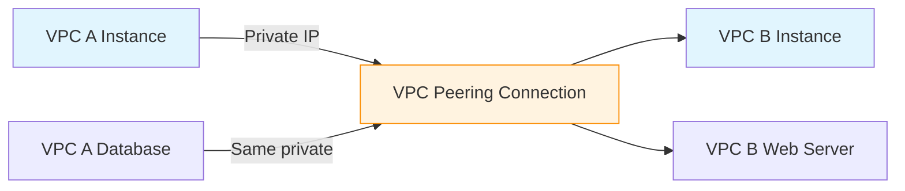

# Section 8: Introduction to VPC Private Connectivity Options

<details open>
<summary><b>Section 8: Introduction to VPC Private Connectivity Options (KK-CS45-script-v2)</b></summary>

## Table of Contents
- [8.1 Introduction to VPC Private Connectivity Options](#81-introduction-to-vpc-private-connectivity-options)
- [8.2 VPC Peering](#82-vpc-peering)
- [8.3 Hands On- VPC Peering Across AWS Regions](#83-hands-on--vpc-peering-across-aws-regions)
- [8.4 VPC Peering Invalid Scenarios](#84-vpc-peering-invalid-scenarios)
- [Summary](#summary)

## 8.1 Introduction to VPC Private Connectivity Options

### Overview
This lecture introduces the concept of expanding VPC networking beyond individual VPC boundaries, covering private connectivity options for connecting VPCs to other VPCs, on-premises networks, and accessing AWS services using private IPs instead of public IPs. It explains the importance of private connectivity for security, performance, and cost optimization, setting the foundation for understanding AWS networking components like VPC peering, endpoints, and PrivateLink.

### Key Concepts/Deep Dive

#### The Need for Private Connectivity
In enterprise networking, applications running within VPCs often need to communicate with resources outside their VPC boundary without exposing traffic to the public internet. AWS provides several networking constructs to enable this private connectivity:

**Traffic Flow Without Private Connectivity:**
- Traffic flows over the public internet
- Requires exposing applications to public IPs
- Security vulnerabilities due to internet exposure
- Additional overhead for encryption (HTTPS, etc.)
- Inconsistent bandwidth and latency
- Additional costs for NAT Gateway/Internet Gateway usage

#### Benefits of Private Connectivity

✅ **Enhanced Security**: Traffic remains within AWS backbone network, eliminating internet exposure and reducing attack surface

✅ **Performance Consistency**: Guaranteed bandwidth and lower latency since traffic doesn't traverse multiple internet hops

✅ **Cost Optimization**: Bypass expensive NAT Gateway charges when connecting VPC resources

✅ **Reduced Blast Radius**: Minimize public exposure of internal applications

#### Major Private Connectivity Options
This section introduces three primary AWS services for private connectivity:

1. **VPC Peering**: Simplest option for direct VPC-to-VPC connectivity
2. **VPC Endpoints**: Access AWS services privately without internet/NAT gateways
3. **VPC PrivateLink**: Expose your services privately to other VPCs via service endpoints

> [!IMPORTANT]
> Private connectivity bypasses the need for NAT/Internet Gateways for specific use cases, reducing costs and improving security posture.

> [!NOTE]
> Transit Gateway is excluded from this section and covered separately in hybrid networking contexts, as it serves as a central hub connecting multiple networks.

#### Architecture Consideration
When designing private connectivity, consider:
- Whether resources are in the same AWS region or cross-region
- Ownership model (same account vs. cross-account)
- Traffic patterns and security requirements
- Performance and cost implications

## 8.2 VPC Peering

### Overview
VPC peering enables direct, private connectivity between two VPCs, allowing instances in different VPCs to communicate as if they were part of the same network. This lecture explains how VPC peering works, its basic architecture, and the key requirements for implementation, positioning it as the simplest private connectivity option within the AWS ecosystem.

### Key Concepts/Deep Dive

#### VPC Peering Fundamentals

VPC peering establishes a private network connection between two VPCs using AWS's managed backbone network. Once peered, instances in both VPCs can communicate using private IPs without traversing the public internet.

**Connection Characteristics:**
- Completely managed by AWS
- Traffic flows over AWS backbone (not internet)
- Low latency and high bandwidth
- Secure (isolated from public internet)

#### Architectural Benefits



The peering connection makes both VPCs behave as a single logical network, enabling seamless cross-VPC communication.

#### VPC Peering Scenarios

VPC peering supports multiple connectivity patterns:

| Scenario | Same Region | Cross-Region | Cross-Account |
|----------|-------------|--------------|---------------|
| Support | ✅ Available | ✅ Available | ✅ Available |
| Use Case | Multi-VPC architectures within region | Global applications | Service provider integrations |

**Regional Evolution:**
- Initially: Same-region only
- Current capability: Cross-region and cross-account peering
- Eliminates complex VPN setups for regional connectivity

#### Implementation Requirements

##### Network Configuration
- **Non-overlapping CIDR blocks**: Both VPCs must have unique IP ranges
- Example valid configuration:
  - VPC A: `10.10.0.0/16`
  - VPC B: `10.20.0.0/16`

❌ **Invalid**: Both VPCs with `10.0.0.0/16` range

##### Route Table Updates
Both VPCs require manual route table configuration:
```yaml
# VPC A Route Table
vpc-a-routes:
  - destination: 10.20.0.0/16  # VPC B CIDR
    target: pcx-123456789      # Peering connection ID

# VPC B Route Table
vpc-b-routes:
  - destination: 10.10.0.0/16  # VPC A CIDR
    target: pcx-123456789      # Same peering connection ID
```

#### Common Business Use Cases
- **Service Integration**: Customer VPC accesses service provider VPC
- **Application Architecture**: Multi-tier applications across multiple VPCs
- **Development Environments**: Separate dev/test/production VPCs requiring connectivity

> [!NOTE]
> While VPC peering enables direct VPC-to-VPC communication, it's not suitable for all connectivity scenarios. Alternative options like Transit Gateway are better for complex hub-and-spoke architectures.

## 8.3 Hands On- VPC Peering Across AWS Regions

### Overview
This hands-on lecture demonstrates the practical steps for establishing VPC peering connections between VPCs in different AWS regions. Through the demonstration, you'll learn the complete workflow of creating cross-region peering interfaces and configuring the necessary routing to enable private connectivity across geographically distributed VPCs.

### Key Concepts/Deep Dive

#### Cross-Region Peering Setup Process

The demonstration covers end-to-end VPC peering establishment between two regions.

##### Step 1: VPC and Route Table Preparation
- Create or identify existing VPCs in different regions
- Verify non-overlapping CIDR blocks
- Prepare route tables for peering routes

##### Step 2: Peering Connection Creation
- Navigate to VPC service in AWS Management Console
- Select "Create VPC Peering Connection"
- Configure:
  ```yaml
  peering-config:
    name: cross-region-peering-demo
    vpc_id: vpc-abcdef123456789   # Requester VPC
    peer_vpc_id: vpc-fedcba987654321 # Accepter VPC (different region)
    peer_owner_id: 123456789012     # If cross-account
  ```

##### Step 3: Connection Acceptance
- Region context switching for cross-region peering
- Requester initiates, accepter approves
- Monitor connection status transitions

##### Step 4: Route Table Configuration
- Add routes in requester VPC route table
- Add routes in accepter VPC route table
- Destination: Peer VPC CIDR block
- Target: Peering connection ID

#### Connectivity Testing Lab Steps

##### Instance Deployment
1. Launch EC2 instances in both VPCs
   - Configure security groups for SSH access
   - Assign appropriate IAM roles
   - Place instances in private subnets

##### Connectivity Verification
2. SSH into instance in requester VPC
3. Ping or SSH to instance in peer VPC
4. Verify bidirectional communication

##### Troubleshooting Checklist
- Route table entries verification
- Security group rules validation
- Instance status and network configuration
- Peering connection status confirmation

#### AWS CLI Alternative Commands

For infrastructure as code approaches:
```bash
# Create VPC peering connection
aws ec2 create-vpc-peering-connection \
    --vpc-id vpc-abcdef123456789 \
    --peer-vpc-id vpc-fedcba987654321 \
    --peer-region us-west-2 \
    --profile my-profile

# Accept peering connection (in accepter account/region)
aws ec2 accept-vpc-peering-connection \
    --vpc-peering-connection-id pcx-123456789

# Update route tables
aws ec2 create-route \
    --route-table-id rtb-123456789 \
    --destination-cidr-block 10.20.0.0/16 \
    --vpc-peering-connection-id pcx-123456789
```

> [!IMPORTANT]
> For cross-region peering, AWS CLI commands must be executed in the respective regions, requiring proper profile configuration and region specification.

#### Cost and Performance Considerations

- **Pricing**: Cross-region peering has additional data transfer costs
- **Latency**: Intra-region typically lower latency than cross-region
- **Bandwidth**: AWS backbone ensures consistent performance

## 8.4 VPC Peering Invalid Scenarios

### Overview
This lecture covers scenarios where VPC peering is not applicable or cannot be implemented, helping you understand the limitations and constraints of peering connections. Understanding these invalid scenarios is crucial for making appropriate architectural decisions when designing private connectivity solutions in AWS.

### Key Concepts/Deep Dive

#### Network Architecture Limitations

##### Overlapping CIDR Blocks
❌ **Cannot peer VPCs with overlapping IP ranges**
- Both VPCs must have unique, non-conflicting CIDR blocks
- Common mistake in enterprise environments with standardized IP schemes

**Impact:**
- Impossible to route traffic deterministically
- Both `192.168.0.0/16` subnets become unreachable from each other

##### Routing Table Conflicts
❌ **Existing conflicting routes**
- VPCs with routes that conflict with peering destinations
- Route table entries that would create ambiguity

**Example problematic configuration:**
```yaml
# Conflict scenario
vpc-a-routes:
  - destination: 10.0.0.0/8      # Overly permissive
    target: igw-123456789       # Internet Gateway

vpc-b-cidr: 10.10.0.0/16        # Falls within 10.0.0.0/8
```

#### Scalability and Complexity Issues

##### One-to-One Limitation
❌ **Not suitable for complex mesh topologies**
- Connecting multiple VPCs in full mesh becomes exponentially complex
- Managing route tables across many VPCs becomes unmaintainable

**Better alternatives:**
- AWS Transit Gateway for large-scale connectivity
- Hub-and-spoke architectures

##### Security and Control Challenges
❌ **Lack of centralized control**
- No central point for traffic inspection
- Difficult to implement consistent security policies
- No built-in monitoring or logging capabilities

#### Vendor Lock-In Considerations

##### AWS-Only Connectivity
❌ **Cannot peer with non-AWS networks**
- Exclusive to AWS VPCs
- No direct peering to on-premises networks
- No hybrid cloud connectivity without VPN/Direct Connect

**Hybrid scenarios requiring:**
- AWS VPN Gateway
- AWS Direct Connect Gateway
- Third-party networking solutions

#### Performance and Operational Constraints

##### Latency Sensitivity
⚠️ **Not optimal for very latency-sensitive workloads**
- Cross-region peering adds network hops
- Performance varies by geographic distance
- Unpredictable congestion during peak times

##### Traffic Monitoring Limitations
⚠️ **Limited observability**
- No built-in traffic monitoring
- Difficult to troubleshoot connectivity issues
- No flow logs at peering connection level

#### Architectural Anti-Patterns

##### Excessive Peering Connections
❌ **Overusing peering for complex architectures**
- More than 10-15 peering connections per VPC
- Creates management complexity
- Route table becomes cluttered

**Recommended approach:**
- Use AWS Transit Gateway for >5 VPCs
- Consider consolidation strategies

##### Misconceived Security Models
❌ **Assuming peering provides security**
- Peering connects networks at L3
- No inherent security controls
- Still requires NACLs and Security Groups

> [!CAUTION]
> Many organizations fall into the trap of believing peering connections are automatically secure. Security groups, NACLs, and possibly VPC endpoints are still required.

#### Economic Considerations

##### Cost Inefficiencies
⚠️ **Not always most cost-effective**
- Cross-region data transfer fees
- Becoming obsolete with Transit Gateway pricing
- Hidden costs in operational complexity

## Summary

### Key Takeaways
```diff
+ VPC peering enables direct private connectivity between VPCs
+ Three main private connectivity options: Peering, Endpoints, PrivateLink
+ Peering supports same/cross-region and same/cross-account scenarios
+ Non-overlapping CIDR blocks are mandatory for peering
+ Route table updates required in both VPCs for traffic flow
+ Excellent for simple 1:1 VPC connections
+ Consider alternatives for complex mesh topologies or hybrid connectivity
- Cannot connect overlapping IP ranges
- Not suitable for large-scale (>5 VPCs) architectures
- Limited monitoring and security controls
- Cross-region adds data transfer costs
! Always test connectivity after route table configuration
! Verify security group rules for intended traffic
```

### Quick Reference

#### VPC Peering Setup Commands (AWS CLI)
```bash
# Same region peering
aws ec2 create-vpc-peering-connection \
    --vpc-id vpc-xxxxx \
    --peer-vpc-id vpc-yyyyy

# Cross-region peering
aws ec2 create-vpc-peering-connection \
    --vpc-id vpc-xxxxx \
    --peer-vpc-id vpc-yyyyy \
    --peer-region us-west-2

# Accept connection
aws ec2 accept-vpc-peering-connection \
    --vpc-peering-connection-id pcx-xxxxx

# Add route to VPC
aws ec2 create-route \
    --route-table-id rtb-xxxxx \
    --destination-cidr-block 10.0.0.0/16 \
    --vpc-peering-connection-id pcx-xxxxx
```

#### Common Route Table Configurations
```yaml
# Requester VPC routes
routes:
  - destination: 10.0.0.0/16  # Peer VPC CIDR
    target: pcx-12345        # Peering connection ID

# Accepter VPC routes
routes:
  - destination: 10.10.0.0/16 # Requester VPC CIDR
    target: pcx-12345        # Same peering connection ID
```

### Expert Insight

#### Real-World Application
- **Microservices Architecture**: Use VPC peering to connect application VPCs while maintaining security isolation
- **Multi-Account Landing Zone**: Connect shared services VPC with workload VPCs across different AWS accounts
- **Hybrid Bursting**: Enable private connectivity between on-premises data centers (via Direct Connect) and AWS environments

#### Expert Path
- Start with simple same-account, same-region peering for proof-of-concepts
- Gradually move to cross-region scenarios for disaster recovery setups
- Implement automated route table management using Infrastructure as Code (Terraform/CloudFormation)
- Monitor peering connections using AWS Network Manager and CloudWatch metrics

#### Common Pitfalls
- **Overlooking CIDR Overlap**: Always verify IP range conflicts before creating peering connections
- **Route Table Misconfiguration**: Test connectivity after route updates; incorrect destination CIDRs cause black-holing
- **Security Group Neglect**: Remember that fragmentation exists; configure security groups on ENIs, not peering connections
- **Scalability Issues**: Avoid creating too many peering connections; use Transit Gateway for >3 VPCs

#### Lesser-Known Facts
- **Transitive Peering**: Routing isn't transitive - if VPC A peers with VPC B, and VPC B peers with VPC C, VPC A cannot reach VPC C directly
- **Bandwidth Considerations**: No explicit bandwidth limits, but cross-region peering may have regional capacity constraints
- **China Regions**: Peering connections to/from China regions have additional regulatory and connectivity considerations
- **Global Accelerator**: Can accelerate performance over peered connections when used with AWS Global Accelerator endpoints

</details>