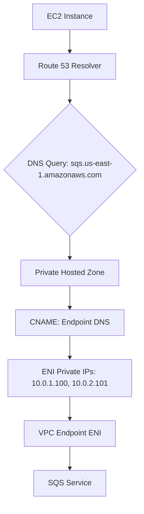
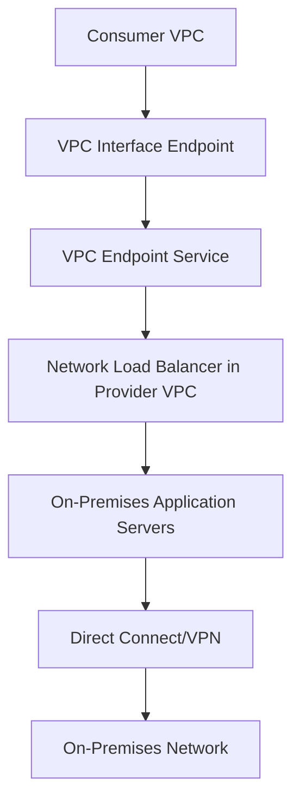
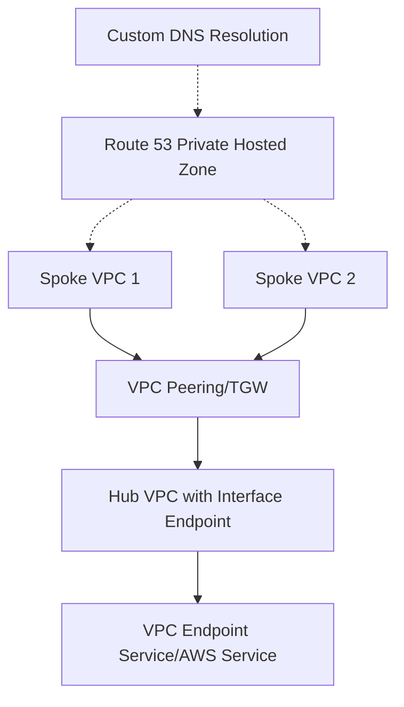
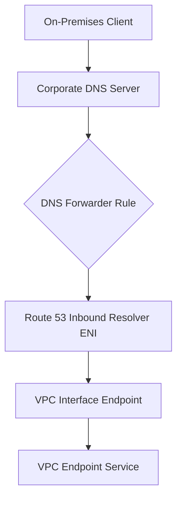
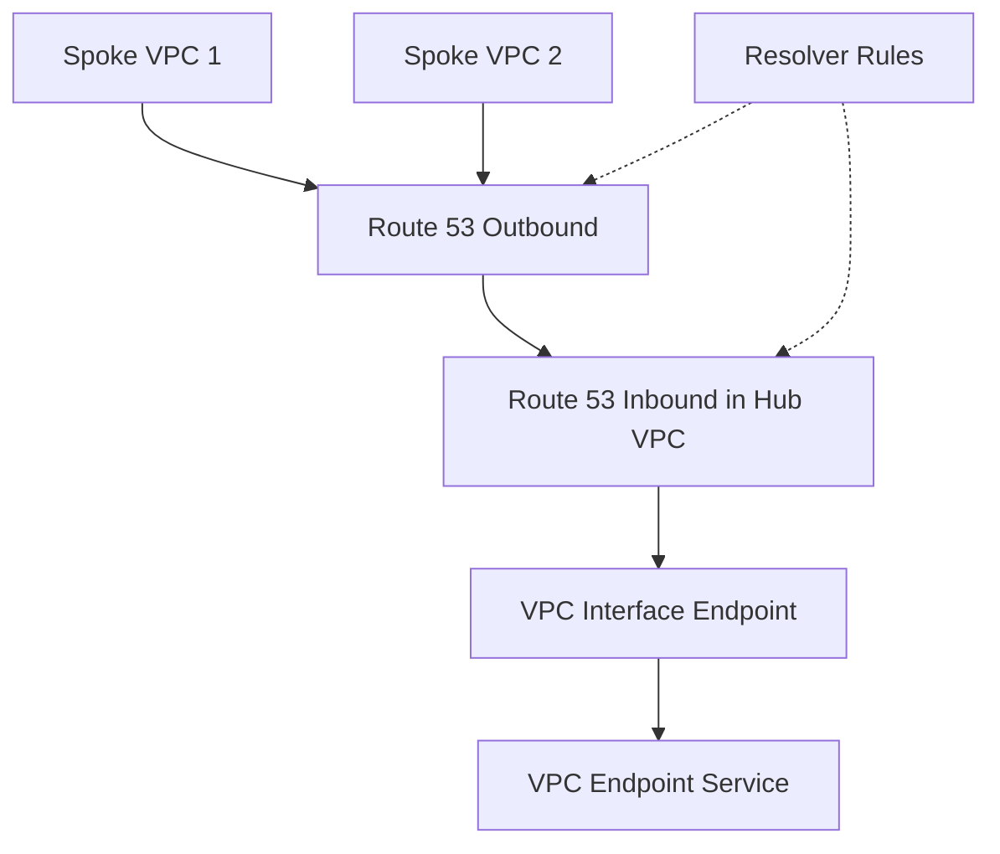
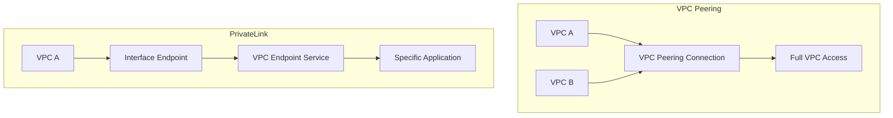

# Section 9: Introduction to VPC Endpoint and PrivateLink

<details open>
<summary><b>Section 9: Introduction to VPC Endpoint and PrivateLink (KK-CS45-script-v2)</b></summary>

## Table of Contents

- [9.1 Introduction to VPC Endpoint and PrivateLink](#91-introduction-to-vpc-endpoint-and-privatelink)
- [9.2 VPC Gateway Endpoint](#92-vpc-gateway-endpoint)
- [9.3 Hands On- VPC Gateway endpoint to access S3 bucket](#93-hands-on--vpc-gateway-endpoint-to-access-s3-bucket)
- [9.4 Introduction to VPC PrivateLink powered endpoints](#94-introduction-to-vpc-privatelink-powered-endpoints)
- [9.5 VPC PrivateLink - Important to know features](#95-vpc-privatelink---important-to-know-features)
- [9.6 VPC endpoint DNS](#96-vpc-endpoint-dns)
- [9.7 Hands On- VPC interface endpoint to access Amazon SQS queue](#97-hands-on--vpc-interface-endpoint-to-access-amazon-sqs-queue)
- [9.8 VPC Endpoint Service](#98-vpc-endpoint-service)
- [9.9 Hands On- Create VPC endpoint service and access through VPC endpoint](#99-hands-on--create-vpc-endpoint-service-and-access-through-vpc-endpoint)
- [9.10 Hands On- Accessing VPC endpoint service using Custom Domain Name (DNS)](#910-hands-on--accessing-vpc-endpoint-service-using-custom-domain-name-dns)
- [9.11 VPC endpoints security](#911-vpc-endpoints-security)
- [9.12 Other VPC endpoint types - Gateway Load Balancer, Resource, Service-network](#912-other-vpc-endpoint-types---gateway-load-balancer-resource-service-network)
- [9.13 VPC Endpoint architectures - Accessing on-premises services](#913-vpc-endpoint-architectures---accessing-on-premises-services)
- [9.14 VPC Endpoint architectures - Accessing from peered or connected VPC](#914-vpc-endpoint-architectures---accessing-from-peered-or-connected-vpc)
- [9.15 VPC Endpoint architectures - Accessing from on-premises network](#915-vpc-endpoint-architectures---accessing-from-on-premises-network)
- [9.16 VPC Endpoint architectures - Centralized VPC endpoints](#916-vpc-endpoint-architectures---centralized-vpc-endpoints)
- [9.17 VPC Peering vs VPC Endpoints](#917-vpc-peering-vs-vpc-endpoints)
- [9.18 Exam Essentials](#918-exam-essentials)

## 9.1 Introduction to VPC Endpoint and PrivateLink

### Overview

This module provides a high-level introduction to VPC endpoints and AWS PrivateLink, explaining their purpose, benefits, and fundamental differences. It establishes the foundation for understanding private connectivity between VPCs and AWS services or customer-managed services without requiring internet access.

### Key Concepts/Deep Dive

**Why VPC Endpoints?**
- Traditionally, traffic between EC2 instances in private subnets and AWS services like S3 flows through NAT Gateway → Internet Gateway → public S3 endpoints
- Problems: Security risks, NAT costs, bandwidth limitations, complex security policies
- Solution: Private connectivity between VPC and AWS services using AWS-managed devices

**Core Benefits:**
- **Security**: Traffic remains within AWS region, no exposure to internet
- **Cost**: No NAT Gateway charges, interface endpoints add small cost but cheaper than NATs
- **Architecture Simplification**: Removes need for IGWs/NATs for accessing AWS services
- **Reliability**: Managed by AWS, horizontally scaled, redundant, highly available

**VPC PrivateLink Overview:**
- Enables private connectivity between services
- Works for AWS services, customer-owned services in VPCs, or third-party SaaS services
- Creates private connection between consumer VPC and provider network

**Types of VPC Endpoints:**
- **VPC Gateway Endpoint**: Specific to S3 and DynamoDB
- **Interface Endpoints**: Powered by PrivateLink, for all other AWS services and custom services
- **Additional Types**: Gateway Load Balancer, Resource, Service Network endpoints

**Gateway Endpoint vs Interface Endpoint:**
- Gateway Endpoint: Route table modification only, free to use
- Interface Endpoint: ENI creation with private IP, small charge
- Both eliminate need for NAT/IGW devices

**Use Cases:**
- Gateway: Private access to S3/DynamoDB from within same VPC
- Interface: Private access to S3/DynamoDB from remote networks (peered VPCs, on-premises)

**When to Use VPC Endpoints:**
- Reduce security risks (no internet traffic)
- Eliminate NAT Gateway costs and high availability concerns
- Improve network architecture simplicity
- Access AWS services and customer services privately

**Architecture Simplification:**
Without endpoints: Public subnet EC2 → internet traffic to AWS services
With endpoints: Private subnet EC2 → direct private connection to AWS services
- No IGW or NAT devices needed
- Maintains private, secure connectivity

### Lab Demos

None in this introductory module.

## 9.2 VPC Gateway Endpoint

### Overview

This module explores VPC Gateway Endpoints in detail, focusing on their specific use case for accessing Amazon S3 and DynamoDB privately from within the same VPC. It covers the technical implementation, limitations, and key differences from interface endpoints.

### Key Concepts/Deep Dive

**Gateway Endpoint Functionality:**
- Enables private connection between VPC and S3/DynamoDB in the same region
- Uses AWS-managed IP address ranges grouped into prefix lists
- No ENI creation - only route table modifications required
- Completely free to use
- Cannot be accessed from remote networks (peered VPCs, VPN, DX)

**Route Table Configuration:**
- Add entry with destination as AWS-managed prefix list identifier (e.g., pl-xxxxxxxx)
- Target is the VPC Gateway Endpoint
- Entry modifications affect only the specific subnet's route table

**Security Group Considerations:**
- Since no ENI, no security group for endpoint itself
- Configure outbound rules on EC2 instance security groups:
  - Allow HTTPS/HTTP traffic (ports 443/80)
  - Use prefix list as destination to restrict traffic to S3/DynamoDB only

**Availability Zone Considerations:**
- Create endpoint across multiple AZs for high availability
- Each AZ gets its own IP addresses from endpoint subnets

**DNS Resolution:**
- Use standard S3/DynamoDB public DNS names
- Resolves to private IP addresses through gateway endpoint
- No DNS modifications needed

**Limitations and Scope:**
- **Regional only**: Same region for VPC and services
- **VPC-only access**: Cannot be accessed from:
  - Peered VPCs via peering connections
  - Transit Gateway connected VPCs
  - On-premises networks via VPN/DX
- **Service limitation**: Only S3 and DynamoDB
- **Remote access workaround**: Use Interface Endpoints if remote access needed

**Comparison with Interface Endpoints:**
- No ENI/IP address management
- Route table only vs SG + ENI
- Remote network access: Interface allows, Gateway does not

**Best Practice:**
- Always prefer Gateway Endpoint for S3/DynamoDB access within same VPC
- Free service with no operational overhead
- Perfect for cost-optimized, private AWS service access

### Lab Demos

Prepares for hands-on implementation in following modules.

## 9.3 Hands On- VPC Gateway endpoint to access S3 bucket

### Overview

This practical demonstration shows how to implement VPC Gateway Endpoint to access S3 buckets privately. The lab uses Amazon Linux with AWS CLI to test connectivity and demonstrates alternative connection methods without bastion hosts.

### Key Concepts/Deep Dive

**Lab Setup Requirements:**
- Demo VPC with private subnets
- EC2 instance in private subnet
- IAM role with S3 access permissions
- Alternative connectivity without public subnets using EC2 Instance Connect Endpoint

**EC2 Instance Connect Endpoint Architecture:**
- Creates ENI in private subnet with public IP-like connectivity
- No actual public IP - uses AWS-managed connectivity
- Allows direct connections from AWS console without bastion hosts
- Free service usage
- Security group configuration:
  - Outbound: Allow SSH to VPC CIDR or EC2 security group
  - Inbound: Allow SSH from VPC CIDR or EC2 Connect Endpoint SG

**VPC Gateway Endpoint Creation:**
```json
{
  "Service Name": "com.amazonaws.[region].s3",
  "Type": "Gateway",
  "VPC": "demo-vpc",
  "Route Tables": "private-subnet-route-table"
}
```
- Automatically adds prefix list route to selected route tables
- Route destination: S3 prefix list (pl-xxxxxxx)
- Route target: vpce-[gateway-endpoint-id]

**IAM Configuration:**
- Create IAM role with S3FullAccess policy
- Attach role to EC2 instance
- Avoid customizing policies unless specific bucket restrictions needed

**Testing Access:**
- Connect via EC2 Instance Connect Endpoint
- Test internet connectivity: `ping google.com` (should fail)
- S3 operations with regular commands work:
  ```bash
  aws s3 cp sample.txt s3://your-bucket/
  aws s3 ls s3://your-bucket/
  ```

**Route Table Verification:**
- Endpoint creation adds prefix list entry automatically
- Verify route table shows:
  - Destination: pl-xxxxxxx
  - Target: vpce-[id]
  - Status: active

### Lab Demos

**Step-by-Step S3 Access with Gateway Endpoint:**

1. **Setup VPC Infrastructure:**
   ```bash
   # Create VPC, subnets, and route tables
   # Configure security groups for EC2 and EC2 Connect Endpoint
   ```

2. **Create IAM Role:**
   ```bash
   # Define S3 full access policy
   # Create role for EC2 service
   ```

3. **Launch EC2 Instance:**
   ```bash
   # Use Amazon Linux 2 AMI
   # Private IP only
   # Attach IAM role
   # Use restrictive security group
   ```

4. **Create EC2 Instance Connect Endpoint:**
   ```bash
   # Service: EC2 Instance Connect
   # Select private subnet
   # Configure security group rules
   # Enable SSH outbound access
   ```

5. **Create VPC Gateway Endpoint:**
   ```bash
   aws ec2 create-vpc-endpoint \
     --vpc-id vpc-xxxxxx \
     --service-name com.amazonaws.us-east-1.s3 \
     --vpc-endpoint-type Gateway \
     --route-table-ids rtb-xxxxxx
   ```

6. **Verify Route Table Update:**
   ```bash
   aws ec2 describe-route-tables --route-table-ids rtb-xxxxxx
   # Check for added prefix list route
   ```

7. **Test S3 Connectivity:**
   ```bash
   # Connect to EC2 via Instance Connect
   # Upload file: aws s3 cp sample.txt s3://bucket/
   # Verify in S3 console
   ```

8. **Cleanup:**
   ```bash
   # Terminate EC2 instance
   # Delete VPC endpoint
   # Keep EC2 Connect Endpoint for future labs
   ```

## 9.4 Introduction to VPC PrivateLink powered endpoints

### Overview

This module introduces VPC endpoints powered by AWS PrivateLink, covering the evolution of endpoint types and the expansion beyond traditional interface endpoints to modern resource-level connectivity options.

### Key Concepts/Deep Dive

**PrivateLink Evolution:**
- Originally: Only VPC Interface Endpoints for AWS services
- Current: Multiple endpoint types powered by PrivateLink:
  - Interface Endpoints
  - Gateway Load Balancer Endpoints
  - Resource Endpoints
  - Lattice Service Network Endpoints

**Recent Enhancements:**
- IPv4 and IPv6 traffic support (dual-stack native support)
- Cross-region VPC Endpoint access
- UDP protocol support (previously only TCP)
- Reduced latency through private networking

**Interface Endpoint Basics:**
- Creates ENI in consumer VPC with private IP
- Enables private access to AWS services and custom applications
- Supported architectures:
  - AWS services (S3, SQS, API Gateway, etc.)
  - Customer services behind Network Load Balancer
  - Third-party SaaS applications

**Additional Endpoint Types:**
- **Gateway Load Balancer Endpoint**: Access Gateway Load Balancers for traffic inspection
- **Resource Endpoint**: Direct access to VPC resources (RDS databases, etc.)
- **Service Network Endpoint**: Access VPC Lattice service networks

**Interface vs Custom Services:**
- **For AWS Services**: Direct interface endpoint creation
- **For Custom Services**: Requires VPC Endpoint Service creation first

**Provider Network Requirements:**
- Services hosted behind Network Load Balancers
- Available as VPC Endpoint Services in AWS marketplace
- Private connectivity without NAT/IGW exposure

## 9.5 VPC PrivateLink - Important to know features

### Overview

This module dives deep into the critical features and operational characteristics of PrivateLink-powered VPC endpoints, covering ENI management, security, availability, and cross-VPC access scenarios.

### Key Concepts/Deep Dive

**ENI and IP Management:**
- Each interface endpoint creates ENI with private IP from subnet CIDR
- ENI supports security groups for traffic control
- Supports overlapping CIDRs across consumer/provider VPCs
- Private IP enables remote network access

**High Availability Design:**
- Deploy across multiple Availability Zones
- Each AZ gets dedicated ENI with unique IP addresses
- Enables traffic distribution and fault tolerance
- Prevents cross-AZ charges within consumer VPC

**Security Group Configuration:**
- ENI uses security groups for inbound filtering
- Allow client IP ranges or VPC CIDR
- Configure outbound rules on consuming EC2 instances
- Enable bidirectional traffic flow

**IP Protocol Support:**
- IPv4 and IPv6 native support
- Dual-stack endpoint creation
- Automatic protocol negotiation
- End-to-end IPv6 support without translation

**Network Protocol Support:**
- TCP and UDP protocols
- TLS termination capabilities
- Port-based service exposure

**Remote Network Access:**
- **Peered VPCs**: Direct ENI access via peering connections
- **Transit Gateway**: Access through TGW attachments
- **On-premises**: Via DX or VPN connections to VPC

**Traditional Limitation Bypass:**
- Eliminates NAT Gateway dependencies
- Bypasses overlapping CIDR restrictions
- Provides unicast routing without BGP complexities

**DNS Resolution Flexibility:**
- Supports regional and zonal DNS names
- Express zones routing for minimal latency
- Regional resolution for round-robin distribution

**Cross-AZ Traffic Optimization:**
- Zonal DNS ensures same-zone routing
- Prevents unnecessary data transfer charges
- Enables 100% intra-AZ traffic flow

**Security Controls:**
- VPC-level isolation
- Security group enforcement
- Endpoint policy restrictions

## 9.6 VPC endpoint DNS

### Overview

This module thoroughly explains DNS resolution for VPC endpoints, covering regional/zonal DNS names, private DNS hosted zones, and seamless AWS CLI/SDK integration without application changes.

### Key Concepts/Deep Dive

**DNS Name Structure:**
- **Regional DNS**: `vpce-[id].vpce-svc-[service-id].region.vpce.amazonaws.com`
- **Zonal DNS**: `vpce-[id]-az.vpce-svc-[service-id].region.vpce.amazonaws.com`
- Publicly resolvable to ENI private IP addresses
- Enables connectivity from any IP-routable location

**Private DNS Configuration:**
- **Without Private DNS**: Must manually specify endpoint URLs
- **With Private DNS**: Automatic resolution via Route 53 Private Hosted Zone
- Route 53 PHZ associates with consumer VPC
- Contains CNAME record: AWS service DNS → Endpoint DNS

**DNS Resolution Flow:**
1. Application queries AWS service DNS
2. Route 53 PHZ intercepts and returns endpoint DNS
3. Endpoint DNS resolves to ENI private IPs
4. Traffic routes privately to service

**CLI/SDK Behavior:**
- **Default (no private DNS)**: Uses public endpoints, requires internet access
- **With private DNS**: Transparent resolution to private endpoints
- Applications unchanged, use standard AWS service endpoints

**Prerequisites:**
- VPC must have DNS hostname and DNS resolution enabled
- Route 53 PHZ creation and VPC association
- Private DNS name configuration during endpoint creation

**Regional vs Zonal DNS:**
- **Regional**: Load-balancing across all AZs
- **Zonal**: Traffic stays within same AZ (recommended)
- Cross-AZ traffic incurs data transfer charges

**Mermaid Diagram: DNS Resolution with Private DNS**



## 9.7 Hands On- VPC interface endpoint to access Amazon SQS queue

### Overview

This hands-on module demonstrates VPC interface endpoint creation for Amazon SQS access, showcasing ENI configuration, DNS resolution with and without private DNS, and security group management for private AWS service connectivity.

### Key Concepts/Deep Dive

**Architecture Prerequisites:**
- VPC with multiple private subnets across AZs
- EC2 instance in dedicated subnet
- SQS queue for testing
- IAM role with SQS permissions
- DNS support enabled in VPC

**Security Configuration:**
- **Endpoint Security Group**: Inbound HTTPS from VPC CIDR
- **EC2 Security Group**: Outbound HTTPS, Inbound SSH
- **IAM Role**: SQS full access permissions

**Endpoint Creation Process:**
```bash
aws ec2 create-vpc-endpoint \
  --vpc-id vpc-xxxxxx \
  --service-name com.amazonaws.us-east-1.sqs \
  --vpc-endpoint-type Interface \
  --subnet-ids subnet-xxxxxx subnet-yyyyyy \
  --security-group-ids sg-xxxxxx
```

**DNS Resolution Testing:**
- **Without Private DNS**: Endpoint DNS resolves to ENI IPs
- **Manual CLI Usage**:
  ```bash
  aws sqs send-message \
    --queue-url https://queue.amazonaws.com/123456789012/my-queue \
    --message-body "Test message" \
    --endpoint-url https://vpce-xxxxxx.sqs.us-east-1.vpce.amazonaws.com
  ```
- **With Private DNS**: Standard commands work transparently

### Lab Demos

**Complete SQS Interface Endpoint Setup:**

1. **Configure VPC DNS:**
   ```bash
   aws ec2 modify-vpc-attribute \
     --vpc-id vpc-xxxxxx \
     --enable-dns-hostnames
   aws ec2 modify-vpc-attribute \
     --vpc-id vpc-xxxxxx \
     --enable-dns-support
   ```

2. **Create Security Groups:**
   ```bash
   # EC2 SG: Inbound SSH, Outbound HTTPS
   # Endpoint SG: Inbound HTTPS from VPC CIDR
   ```

3. **Create SQS Queue:**
   ```bash
   aws sqs create-queue --queue-name my-test-queue
   # Note the queue URL
   ```

4. **Create Interface Endpoint:**
   ```bash
   aws ec2 create-vpc-endpoint \
     --service-name com.amazonaws.us-east-1.sqs \
     --vpc-id vpc-xxxxxx \
     --subnet-ids subnet-1 subnet-2 \
     --security-group-ids sg-endpoint
   ```

5. **Test Connectivity (Without Private DNS):**
   ```bash
   # Get endpoint DNS name
   aws ec2 describe-vpc-endpoints --vpc-endpoint-ids vpce-xxxxxx

   # Send message with endpoint URL
   aws sqs send-message \
     --queue-url [QUEUE_URL] \
     --message-body "Test" \
     --endpoint-url [ENDPOINT_DNS]
   ```

6. **Enable Private DNS:**
   ```bash
   aws ec2 modify-vpc-endpoint \
     --vpc-endpoint-id vpce-xxxxxx \
     --private-dns-enabled
   ```

7. **Test Transparent Access:**
   ```bash
   # Standard command now works without --endpoint-url
   aws sqs send-message \
     --queue-url [QUEUE_URL] \
     --message-body "Transparent test"
   ```

8. **Cleanup:**
   ```bash
   aws ec2 delete-vpc-endpoints --vpc-endpoint-ids vpce-xxxxxx
   aws sqs delete-queue --queue-url [QUEUE_URL]
   ```

## 9.8 VPC Endpoint Service

### Overview

This module explains VPC Endpoint Services creation, enabling private connectivity to customer-managed services hosted behind Network Load Balancers, scaling to thousands of consumer VPCs without VPC peering limitations.

### Key Concepts/Deep Dive

**Endpoint Service Composition:**
- Customer-hosted services behind Network Load Balancer (NLB)
- NLB exposes services as VPC Endpoint Service
- Consumer VPCs access via Interface Endpoints
- Supports cross-account access via whitelist

**NLB Requirements:**
- Internal NLB (not internet-facing)
- Distributes to target groups (EC2 instances/containers)
- Cross-zone load balancing for high availability
- Private IP targets in provider VPC

**Service Registration:**
- Create VPC Endpoint Service referencing NLB ARN
- Automatically discovers NLB target availability zones
- Supports IPv4/IPv6, acceptance requirements
- Allows cross-region access

**Consumer Authentication:**
- **Acceptance Required**: Manual approval for connections
- **Auto-Accept**: Automatic connection (less secure)
- Service owner controls consumer access

**Cross-Account Scaling:**
- Provider: White-list allowed AWS account IDs
- Consumer: Discover service by name
- Connection requires provider approval
- No VPC peering network expansion

**Availability Zone Mapping:**
- NLB in multiple AZs for redundancy
- Consumer endpoints align AZs when possible
- Use AZ IDs (us-east-1a) not names for consistency
- Avoid cross-AZ charges through proper AZ alignment

**On-Premises Integration:**
- NLB targets can be IP addresses from on-premises
- Requires VPC to on-premises connectivity (VPN/DX)
- Enables hybrid service consumption
- Maintains private end-to-end traffic

**SaaS Provider Advantages:**
- Zero VPC peering management
- Scalable consumer connections
- Controlled service exposure
- Billing/account isolation maintained

## 9.9 Hands On- Create VPC endpoint service and access through VPC endpoint

### Overview

This extensive hands-on demonstration builds complete VPC Endpoint Service infrastructure, including provider-side NLB setup, AMI customization for web services, and consumer-side endpoint configuration with cross-account simulation.

### Key Concepts/Deep Dive

**Provider VPC Architecture:**
- Separate VPCs for provider and consumer
- NLB across multiple AZs
- EC2 instances with web service (HTTP/80)
- AMI with pre-installed HTTPD service

**AMI Customization:**
```bash
#!/bin/bash
yum update -y
yum install -y httpd
service httpd start
chkconfig httpd on
echo "VPC Endpoint Demo Service" > /var/www/html/index.html
```

**Provider Network Setup:**
- NLB in provider VPC across multiple AZs
- Target Groups with EC2 instances
- HTTP listener on port 80
- Private subnets for NLB and targets

### Lab Demos

**Complete Endpoint Service Creation:**

1. **AMI Preparation:**
   ```bash
   # Launch EC2 with User Data script
   # Create AMI from running instance
   # Terminate source instance
   ```

2. **Provider VPC Setup:**
   ```bash
   # Create VPC, 4 subnets (2 NLB, 2 EC2)
   # Launch web servers using custom AMI
   # Associate with private route table
   ```

3. **Network Load Balancer Creation:**
   ```bash
   aws elbv2 create-load-balancer \
     --name vpc-endpoint-nlb \
     --subnets subnet-nlb-1 subnet-nlb-2 \
     --scheme internal \
     --type network
   ```

4. **Target Group Configuration:**
   ```bash
   aws elbv2 create-target-group \
     --name nlb-targets \
     --protocol TCP \
     --port 80 \
     --vpc-id vpc-provider
   ```

5. **VPC Endpoint Service Creation:**
   ```bash
   aws ec2 create-vpc-endpoint-service-configuration \
     --network-load-balancer-arns arn:aws:elasticloadbalancing:... \
     --acceptance-required
   ```

6. **Consumer VPC Endpoint Creation:**
   ```bash
   aws ec2 create-vpc-endpoint \
     --service-name [provider-service-name] \
     --vpc-id vpc-consumer \
     --subnet-ids subnet-1 subnet-2 \
     --security-group-ids sg-endpoint
   ```

7. **Connection Approval (Provider Side):**
   ```bash
   aws ec2 describe-vpc-endpoint-connections \
     --filters Name=service-id,Values=[service-id]
   aws ec2 accept-vpc-endpoint-connections \
     --service-id [service-id] \
     --vpc-endpoint-ids [endpoint-id]
   ```

8. **Connectivity Testing:**
   ```bash
   # Test with curl/wget using endpoint DNS
   curl http://vpce-xxxxxx.vpce.amazonaws.com/
   ```

9. **Cross-Region Extension:**
   ```bash
   # Modify endpoint service to allow cross-region
   aws ec2 modify-vpc-endpoint-service-configuration \
     --service-id [service-id] \
     --allowed-principals *
   ```

## 9.10 Hands On- Accessing VPC endpoint service using Custom Domain Name (DNS)

### Overview

This advanced hands-on module demonstrates custom domain implementation for VPC endpoint services, involving Route 53 private hosted zones, domain ownership verification, and domain-specific DNS resolution for production-ready private services.

### Key Concepts/Deep Dive

**Domain Ownership Requirements:**
- Must own domain in Route 53 or external registrar
- TXT record verification for AWS ownership validation
- Supports subdomains (app.example.com, api.example.com)

**Private DNS Name Configuration:**
- Configure during VPC Endpoint Service creation
- Route 53 Private Hosted Zone auto-creation
- Associates with consumer VPC during endpoint setup

**DNS Resolution Chain:**
- Provider: Private DNS name assignment
- Consumer: Private Hosted Zone creation with CNAME records
- Resolution: Custom domain → Endpoint DNS → ENI IPs

### Lab Demos

**Custom Domain Implementation:**

1. **Domain Preparation:**
   ```bash
   # Verify domain ownership in existing Route 53 zone
   # Domain: example.com (or awstrainingcenter.com)
   ```

2. **Route 53 TXT Record Creation:**
   ```bash
   # Add verification TXT record
   aws route53 change-resource-record-sets \
     --hosted-zone-id [zone-id] \
     --change-batch '{
       "Changes": [{
         "Action": "CREATE",
         "ResourceRecordSet": {
           "Name": "_vpce.example.com",
           "Type": "TXT",
           "TTL": 300,
           "ResourceRecords": [{"Value": "\"[verification-key]\""}]
         }
       }]
     }'
   ```

3. **VPC Endpoint Service Modification:**
   ```bash
   aws ec2 modify-vpc-endpoint-service-configuration \
     --service-id [service-id] \
     --private-dns-name "app.example.com"
   ```

4. **Domain Verification:**
   ```bash
   aws ec2 describe-vpc-endpoint-service-configurations \
     --service-ids [service-id]
   # Check verification status
   ```

5. **Consumer Endpoint Creation:**
   ```bash
   aws ec2 create-vpc-endpoint \
     --service-name [provider-service-name] \
     --vpc-id vpc-consumer \
     --private-dns-enabled
   ```

6. **Custom Domain Testing:**
   ```bash
   # Test with custom domain
   curl http://app.example.com/

   # Verify DNS resolution
   nslookup app.example.com
   ```

7. **Route 53 Private Zone Verification:**
   ```bash
   aws route53 list-hosted-zones \
     --query 'HostedZones[?Name==`app.example.com.`]'
   aws route53 list-resource-record-sets \
     --hosted-zone-id [phz-id]
   ```

## 9.11 VPC endpoints security

### Overview

This module covers comprehensive VPC endpoint security, detailing network-level security groups, IAM endpoint policies, resource-based policies (S3 bucket policies), and the interactions between different security layers.

### Key Concepts/Deep Dive

**Security Layers:**
1. **Network Level**: Security Groups and Route Tables
2. **IAM Level**: VPC Endpoint Policies and Resource-based Policies

**Network Security for Interface Endpoints:**
- **ENI Security Groups**: Control inbound traffic
- **Client Outbound Rules**: Allow traffic to endpoint ENI IPs
- Gateway endpoints: Route table restrictions only

**VPC Endpoint Policies:**
- IAM-like policies attached to endpoints
- Define allowed principals (users/roles/accounts)
- Specify resource restrictions (e.g., specific S3 buckets)
- Applies to supported AWS services (check via CLI)

**Service Compatibility Check:**
```bash
aws ec2 describe-vpc-endpoint-services \
  --query 'ServiceDetails[?VpcEndpointPolicySupported==`true`]'
```

**Resource-Based Policies:**
- **S3 Bucket Policies**: Restrict access to specific endpoints
- **DynamoDB Policies**: Similar granular controls
- Additional security layer beyond endpoint policies

**Endpoint Policy Examples:**
```json
{
  "Version": "2012-10-17",
  "Statement": [
    {
      "Effect": "Allow",
      "Principal": "*",
      "Action": "s3:GetObject",
      "Resource": "arn:aws:s3:::my-bucket/*",
      "Condition": {
        "StringEquals": {
          "aws:sourceVpce": "vpce-123456789"
        }
      }
    }
  ]
}
```

**S3 Bucket Policy Integration:**
```json
{
  "Version": "2012-10-17",
  "Statement": [
    {
      "Effect": "Deny",
      "NotPrincipal": {
        "AWS": "arn:aws:iam::123456789012:root"
      },
      "Action": "s3:*",
      "Resource": [
        "arn:aws:s3:::my-bucket/*",
        "arn:aws:s3:::my-bucket"
      ],
      "Condition": {
        "StringNotEquals": {
          "aws:sourceVpce": "vpce-123456789"
        }
      }
    }
  ]
}
```

**Security Best Practices:**
- Layer multiple security controls
- Use endpoint policies for granular service access
- Leverage resource policies for cross-account security
- Maintain security group hygiene
- Regularly audit endpoint configurations

## 9.12 Other VPC endpoint types - Gateway Load Balancer, Resource, Service-network

### Overview

This module introduces advanced VPC endpoint types beyond interface endpoints, covering Gateway Load Balancer endpoints for traffic inspection, resource endpoints for direct VPC resource access, and VPC Lattice service network endpoints.

### Key Concepts/Deep Dive

**Gateway Load Balancer Endpoints:**
- Purpose: Access Gateway Load Balancers (GWLB) for traffic inspection
- Use case: Security appliances, firewall insertion
- Architecture: Consumer VPC → GWLB Endpoint → Provider VPC GWLB
- Traffic flow: Client traffic → Inspection appliances → Forwarded to destinations

**Resource Endpoints:**
- Purpose: Private access to individual VPC resources (RDS databases, etc.)
- Direct resource connectivity without NLB
- Eliminates extra hop through load balancers
- Supports cross-account resource sharing via RAM

**Service Network Endpoints:**
- Purpose: Access VPC Lattice service networks
- Enables private connectivity to Lattice-authenticated applications
- Multiple services grouped under single network
- Consumer endpoints access entire service collections

**Common Characteristics:**
- All powered by AWS PrivateLink
- Create ENIs with private IPs
- Support security groups and endpoint policies
- Enable overlapping VPC CIDR connectivity

**Comparison Table:**

| Type | Target | Load Balancer | Use Case |
|------|--------|---------------|----------|
| Gateway LB | GWLB for inspection | Gateway Load Balancer | Security/traffic inspection |
| Resource | RDS, VPC resources | None - direct resource | Database/private resource access |
| Service Network | VPC Lattice services | Lattice service network | Application-to-application networking |

## 9.13 VPC Endpoint architectures - Accessing on-premises services

### Overview

This module demonstrates hybrid cloud architectures using VPC endpoints to privately access on-premises services through Network Load Balancers, enabling seamless extension of enterprise services into AWS without public exposure.

### Key Concepts/Deep Dive

**Hybrid Service Access Pattern:**
- On-premises applications registered as NLB targets
- NLB hosted in AWS VPC
- Endpoint Service exposes NLB privately
- Consumer VPCs access via Interface Endpoints

**Network Requirements:**
- Private connectivity between VPC and on-premises (VPN/DX)
- NLB as IP targets (on-premises server IPs)
- Cross-connectivity ensures privacy

**Mermaid Diagram: On-Premises Service Access**



**Use Cases:**
- Legacy application modernization
- Database access without public exposure
- Secure API consumption from cloud
- Cost optimization (no full data center migration)

## 9.14 VPC Endpoint architectures - Accessing from peered or connected VPC

### Overview

This module explores advanced DNS configuration for remote VPC access to centralized endpoint services through VPC peering or Transit Gateway using private hosted zones and Route 53 resolver forwarding.

### Key Concepts/Deep Dive

**Layer 3 Connectivity:**
- ENI IPs accessible via VPC peering/Transit Gateway
- No protocol restrictions for routed traffic
- Support for cross-account VPC connections

**DNS Resolution Challenges:**
- Standard AWS endpoint DNS resolves within consumer VPC only
- Remote VPCs cannot resolve without DNS configuration

**Solution 1: Manual Endpoint URLs**
- Applications specify full endpoint URLs
- Endpoint DNS resolves across networks
- Inconvenient for large-scale deployments

**Solution 2: Custom Route 53 Private Hosted Zones**
- Create PHZ with CNAME: AWS DNS → Endpoint DNS
- Associate PHZ with remote VPCs
- Enables standard domain resolution

**Mermaid Diagram: centralized Endpoint Access**



**DNS Architecture Options:**
1. **Per-Service PHZ**: Separate zones for each service
2. **Shared PHZ**: Multiple records in single zone
3. **Associated VPCs**: Multiple spoke VPCs per zone

**Drawbacks of Custom DNS:**
- Manual PHZ creation and management
- Remote VPC association overhead
- Complex for multi-account/multi-region setups

## 9.15 VPC Endpoint architectures - Accessing from on-premises network

### Overview

This module extends on-premises access through Route 53 inbound resolvers, enabling private DNS resolution for VPC endpoints from corporate networks without requiring endpoint URL modifications.

### Key Concepts/Deep Dive

**Route 53 Inbound Resolver:**
- Accepts DNS queries from on-premises networks
- Processes queries against VPC private hosted zones
- Enables seamless endpoint resolution

**DNS Forwarder Configuration:**
- On-premises DNS servers forward specific domains
- Example: Forward "*.amazonaws.com" to resolver IP
- Maintains corporate DNS hierarchy

**Mermaid Diagram: On-Premises Endpoint Access**



**Configuration Steps:**
1. Create Route 53 Inbound Resolver in VPC
2. Configure on-premises DNS forwarders
3. Test resolution and connectivity
4. Verify private traffic flow

**Advantages:**
- No application code changes
- Transparent endpoint access
- Secure private connectivity

## 9.16 VPC Endpoint architectures - Centralized VPC endpoints

### Overview

This module presents centralized VPC endpoint architectures using shared Route 53 resolver endpoints and private hosted zones across multiple spoke VPCs, eliminating individual endpoint deployments and reducing management complexity.

### Key Concepts/Deep Dive

**Centralization Benefits:**
- Single endpoint serves multiple consumer VPCs
- Reduced endpoint management overhead
- Lower costs and simplified operations
- Scalable access pattern

**DNS Resolution Options:**

**Option 1: Route 53 Resolver Forwarding**
- Outbound resolver in central VPC
- Sharing rules via Resource Access Manager
- Forwarding rules direct queries to central resolver

**Option 2: Private Hosted Zones**
- PHZ in central VPC with endpoint CNAME
- Association with spoke VPCs
- Manual management but full control

**Mermaid Diagram: Centralized Architecture**



**Implementation Considerations:**
- Cross-account rule sharing
- Resolver endpoint scalability
- Monitoring and logging

**Cost Optimization:**
- Fewer endpoints to manage
- Potential data transfer cost savings
- Network simplification ROI

## 9.17 VPC Peering vs VPC Endpoints

### Overview

This module provides a comprehensive comparison between VPC peering, Transit Gateway, and PrivateLink approaches, helping architects choose the right connectivity solution based on use case requirements.

### Key Concepts/Deep Dive

**Connectivity Patterns:**

**VPC Peering/Transit Gateway:**
- Full VPC-to-VPC wide connectivity
- Bidirectional traffic
- Requires non-overlapping CIDRs
- Scale limits: Up to 125 peerings, TGW for unlimited

**PrivateLink:**
- Application-specific connectivity
- Unidirectional (consumer to provider)
- Supports overlapping CIDRs
- Unlimited connections (thousands)

**Decision Framework:**

| Factor | VPC Peering | PrivateLink |
|--------|-------------|-------------|
| Scale | Limited connections | Unlimited consumers |
| Direction | Bidirectional | Unidirectional |
| CIDR Requirements | Non-overlapping | Overlapping OK |
| On-Premises Access | DNS configuration | Route 53 resolver |
| Traffic Pattern | Wide/full connectivity | Specific applications |

**Mermaid Diagram: Architecture Comparison**



**Use Case Guidance:**
- **Multiple applications**: VPC Peering/Transit Gateway
- **SaaS sharing**: PrivateLink
- **Hybrid on-premises**: PrivateLink with resolver
- **Cost optimization**: PrivateLink (no NAT costs)

## 9.18 Exam Essentials

### Overview

This modular summary consolidates all key VPC endpoint and PrivateLink concepts critical for the AWS Advanced Networking Specialty certification exam, organized by topic areas.

### Key Concepts/Deep Dive

**VPC Endpoints Fundamentals:**
- Enable private connectivity to AWS services without NAT/IGW
- Reduce security risks and costs
- Support overlapping CIDRs across VPCs
- Managed by AWS (highly available, redundant)

**Gateway Endpoints:**
- S3 and DynamoDB only
- Route table modifications only
- Free to use
- Regional scope (same region, same VPC access only)

**Interface Endpoints (PrivateLink):**
- ENI creation with private IPs
- Cross-region, cross-account support
- IPv4/IPv6, TCP/UDP support
- Security groups required
- Small hourly charges

**DNS Mechanics:**
- Regional/zonal endpoint DNS names
- Private DNS for transparent AWS CLI/SDK usage
- Route 53 private hosted zones for custom domains
- Resolver endpoints for remote VPC/on-premises access

**VPC Endpoint Services:**
- Expose services behind NLBs
- Cross-account whitelisting
- Acceptance requirements for security
- Unlimited consumer connections

**Security Considerations:**
- Security groups for network filtering
- VPC endpoint policies (where supported)
- Resource-based policies (S3 bucket, DynamoDB)
- Multi-layer security approach

**Architecture Patterns:**
- On-premises service access
- Cross-VPC centralized endpoints
- Remote network connectivity via resolvers
- Overlapping CIDR scenarios

**Comparison Chart - Peering vs Endpoints:**

| Aspect | VPC Peering | VPC Endpoints |
|--------|-------------|----------------|
| Traffic Direction | Bidirectional | Unidirectional (consumer→provider) |
| Scale | Limited (125 connections) | Unlimited |
| CIDR Requirements | Non-overlapping | Overlapping supported |
| Use Case | Full VPC connectivity | Application-specific access |
| Cost | Data transfer charges | Endpoint hourly charges + data transfer |

### Quick Reference

**Gateway Endpoint Commands:**
```bash
aws ec2 create-vpc-endpoint \
  --service-name com.amazonaws.region.s3 \
  --vpc-endpoint-type Gateway \
  --vpc-id vpc-id \
  --route-table-ids rtb-id
```

**Interface Endpoint Commands:**
```bash
aws ec2 create-vpc-endpoint \
  --service-name com.amazonaws.region.sqs \
  --vpc-endpoint-type Interface \
  --vpc-id vpc-id \
  --subnet-ids subnet-1 subnet-2 \
  --security-group-ids sg-id
```

**Endpoint Service Commands:**
```bash
aws ec2 create-vpc-endpoint-service-configuration \
  --network-load-balancer-arns nlb-arn \
  --acceptance-required
```

### Expert Insights

**Real-world Application:**
- Production environments: Use PrivateLink for SaaS access, centralized endpoints for cost optimization
- Hybrid deployments: Extend on-premises services via NLB endpoint services
- Multi-account strategies: Centralized endpoints with shared Route 53 rules

**Common Pitfalls:**
- Gateway endpoints not accessible from remote networks
- Missing security group rules for ENI communication
- DNS resolution failures without proper Route 53 configuration
- Cross-AZ charges when zonal DNS not used

**Lesser-Known Facts:**
- IPv6 support in dual-stack VPCs
- UDP protocol availability
- Cross-region endpoint services
- Resolver endpoint sharing across accounts via RAM

---

## Summary

### Key Takeaways
```
+ VPC Endpoints enable PRIVATE connectivity to AWS services without IGW/NAT
+ Gateway Endpoints: FREE, S3/DynamoDB only, route table changes only
+ Interface Endpoints: Charge, ENI creation, all AWS services + custom
+ Endpoint Services: Expose your services via NLB for PrivateLink access
+ DNS: Private hosted zones enable transparent application access
+ Security: Multi-layer with SGs, endpoint policies, and resource policies
- Remote access: Requires Route 53 resolvers for cross-VPC/on-premises
! Peering: Wide connectivity, Endpoints: Application-specific access
```

### Quick Reference
- **Gateway Endpoint**: `vpc-endpoint-type: Gateway, free, route tables`
- **Interface Endpoint**: `vpc-endpoint-type: Interface, ENI, sg, charge`
- **Endpoint Service**: `network-load-balancer-arns, acceptance-required`
- **Private DNS**: `private-dns-enabled, route53 phz auto-created`
- **Cross-Network Access**: `route53 inbound resolver for remote resolution`

### Expert Insight

**Real-world Application**: Implement centralized VPC endpoints in shared services VPCs to serve multiple application VPCs via Transit Gateway, reducing endpoint management overhead by 70% while maintaining private connectivity and cost efficiency.

**Expert Path**: Master Route 53 resolver patterns for hybrid cloud DNS resolution, enabling seamless private service discovery across on-premises, AWS, and multi-cloud environments without application changes.

**Common Pitfalls**: Never assume automatic DNS resolution across VPC boundaries; always implement proper Route 53 configurations and test AZ alignments to avoid unexpected cross-zone charges.

**Lesser-Known Facts**: VPC endpoints support IPv6-only endpoints for modern IPv6-native applications, and interface endpoints can be used for custom ports beyond standard AWS service ports through endpoint service configurations.

</details>
