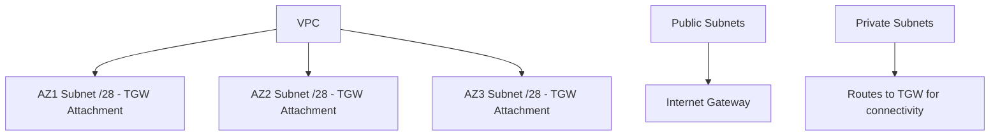
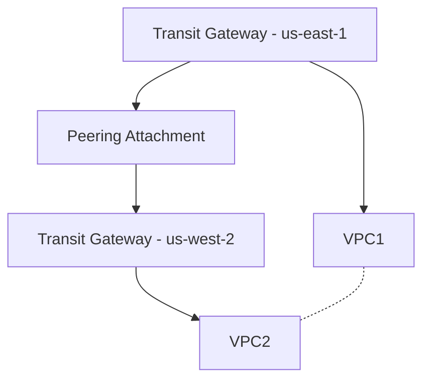

# Section 10: Introduction to Transit Gateway

<details open>
<summary><b>Section 10: Introduction to Transit Gateway (KK-CS45-script-v2)</b></summary>

## Table of Contents
- [10.1 Introduction to Transit Gateway](#101-introduction-to-transit-gateway)
- [10.2 Transit Gateway VPC Attachments and Routing](#102-transit-gateway-vpc-attachments-and-routing)
- [10.3 Hands On- Transit Gateway & VPCs with full routing](#103-hands-on--transit-gateway--vpcs-with-full-routing)
- [10.4 Hands On- Transit Gateway & VPCs with restricted routing](#104-hands-on--transit-gateway--vpcs-with-restricted-routing)
- [10.5 Transit Gateway VPC Network Patterns](#105-transit-gateway-vpc-network-patterns)
- [10.6 Transit Gateway AZ Considerations](#106-transit-gateway-az-considerations)
- [10.7 Transit Gateway AZ Affinity & Appliance Mode](#107-transit-gateway-az-affinity--appliance-mode)
- [10.8 Transit Gateway Peering](#108-transit-gateway-peering)
- [10.9 Transit Gateway Connect Attachment](#109-transit-gateway-connect-attachment)
- [10.10 Transit Gateway VPN Attachment](#1010-transit-gateway-vpn-attachment)
- [10.11 Transit Gateway & Direct Connect](#1011-transit-gateway--direct-connect)
- [10.12 Transit Gateway Multicast](#1012-transit-gateway-multicast)
- [10.13 TGW Architecture- Centralized Egress Internet](#1013-tgw-architecture--centralized-egress-internet)
- [10.14 TGW Architecture- Centralized Traffic Inspection with Gateway Load Balancer](#1014-tgw-architecture--centralized-traffic-inspection-with-gateway-load-balancer)
- [10.15 TGW Architecture- Centralized VPC Interface Endpoints](#1015-tgw-architecture--centralized-vpc-interface-endpoints)
- [10.16 Transit Gateway vs VPC Peering](#1016-transit-gateway-vs-vpc-peering)
- [10.17 Transit Gateway Sharing](#1017-transit-gateway-sharing)

## 10.1 Introduction to Transit Gateway

### Overview
This lecture introduces AWS Transit Gateway, a regional service introduced in 2018 to simplify networking for multiple VPCs and hybrid connectivity. It acts as a central hub for connecting VPCs, VPNs, Direct Connect, and third-party SD-WANs, enabling simplified inter-VPC communication and on-premises connectivity.

### Key Concepts and Deep Dive
Transit Gateway addresses the complexity of VPC peering, which requires pairwise connections and lacks transitive routing. Without Transit Gateway, connecting six VPCs via peering requires 15 connections, whereas Transit Gateway provides full-mesh connectivity centrally.

**Key Benefits:**
- Simplifies inter-VPC networking.
- Supports various attachment types: VPC attachments, peering connections, VPNs, Direct Connect Gateways, and third-party software-defined WANs.
- Enables transit peering across regions for cross-region VPC connectivity, similar to VPC peering.
- Supports centralized architectures for internet egress, traffic inspection, and VPC endpoint access.

**Attachment Types:**
- **VPC Attachments:** Connect VPCs within the same region.
- **Peering Attachments:** Peer Transit Gateways across regions.
- **VPN Attachments:** Connect to on-premises via site-to-site VPNs.
- **Direct Connect Gateway Attachments:** Connect via Direct Connect.
- **Connect Attachments (SD-WAN):** Extend third-party SD-WAN networks.

**Features Covered:**
- Multi-cast routing.
- Maximum transmission unit (MTU) considerations.
- Appliance mode for AZ affinity.
- Cross-region peering.
- Centralized architectures for egress internet, packet inspection, and VPC interface endpoints.
- Sharing Transit Gateways across AWS accounts.

Exam Importance: Transit Gateway is critical for the AWS Certified Advanced Networking Specialty exam, along with VPN and Direct Connect.

**Architectural Examples:**
- Peer Transit Gateways for cross-region connectivity.
- Connect on-premises via VPN or Direct Connect.
- Enable centralized traffic inspection with virtual appliances in spoke VPCs.

## 10.2 Transit Gateway VPC Attachments and Routing

### Overview
This lecture explains attaching VPCs to Transit Gateway and managing routing. Attachments allow VPCs to connect to the Transit Gateway, with restrictions like non-overlapping CIDRs. Routing involves both Transit Gateway route tables and VPC/subnet route tables for bidirectional connectivity.

### Key Concepts and Deep Dive
**VPC Attachments:**
- Create an attachment specifying the VPC and subnets.
- Restrictions: CIDRs must not overlap.

**Routing Mechanism:**
- Transit Gateway has a default route table.
- VPC CIDRs are automatically propagated to the Transit Gateway route table upon attachment.
- For VPCs to route traffic, add static routes to VPC/subnet route tables directing traffic (e.g., 10.0.0/8) to the Transit Gateway attachment.
- This enables full-mesh connectivity: VPC A routes to VPC B via the Transit Gateway.

**Routing Flow Example:**
- Packet from EC2 in VPC A to VPC B.
- VPC route table sends traffic via Transit Gateway attachment.
- Transit Gateway route table forwards via attachment B.

**Key Points:**
- Propagation is automatic to Transit Gateway route table.
- Manual static routes required in VPC route tables.
- Similar to managing routes in VPN or BGP setups.

## 10.3 Hands On- Transit Gateway & VPCs with full routing

### Overview
This hands-on lab demonstrates creating a Transit Gateway with full mesh connectivity for three VPCs. It covers creating VPCs, subnets, EC2 instances, Transit Gateway, attachments, and configuring routes for inter-VPC communication.

### Key Concepts and Deep Dive
**Lab Setup:**
- Three VPCs: VPC A (10.0.0.0/16), VPC B (10.1.0.0/16), VPC C (10.2.0.0/16).
- Each VPC has one private subnet.
- EC2 instances in private subnets for testing.
- One jump host in VPC A public subnet with Internet Gateway.

**Steps:**
1. Create VPCs, subnets, and EC2 instances.
2. Create Transit Gateway with default route table association and propagation enabled.
3. Attach VPCs to Transit Gateway.
4. Configure VPC/subnet route tables with aggregated routes (e.g., 10.0.0.0/8) to Transit Gateway attachment.
5. Test connectivity: Verify EC2 instances can ping each other.

**Command Examples:**
- SSH into jump host: `ssh -i key.pem ec2-user@<public-ip>`
- From jump host SSH to private EC2: `ssh -i key.pem ec2-user@<private-ip>`
- Ping test: `ping <private-ip>`

**Configurations:**
```yaml
# VPC A Route Table (private subnet)
Routes:
  - 10.0.0/8 -> Transit Gateway Attachment
  - 0.0.0.0/0 -> igw-xxx (for jump host public subnet)
```

**Key Output:** Full mesh connectivity achieved; all VPCs communicate via Transit Gateway.

## 10.4 Hands On- Transit Gateway & VPCs with restricted routing

### Overview
This lab builds on the previous by restricting routing so VPC A connects to VPC B but not VPC C, while VPC B connects to both VPC A and VPC C, and VPC C connects only to VPC B. It uses attachment-specific route tables for controlled connectivity.

### Key Concepts and Deep Dive
**Lab Setup:**
- Same three VPCs and EC2 instances as previous lab.
- Jump host for testing.

**Steps:**
1. Create Transit Gateway without default route table association and propagation.
2. Attach VPCs to Transit Gateway.
3. Create attachment-specific route tables and associate each with one attachment.
4. Configure propagations: VPC A → VPC B; VPC B → VPC A and VPC C; VPC C → VPC B.
5. Update VPC/subnet route tables with aggregated routes to Transit Gateway.

**Configurations:**
```yaml
# Route Tables Association and Propagation
- TGW Route Table A: Associated to VPC A Attachment, Propagated to VPC B Attachment
- TGW Route Table B: Associated to VPC B Attachment, Propagated to VPC A and VPC C Attachments
- TGW Route Table C: Associated to VPC C Attachment, Propagated to VPC B Attachment

# VPC Subnet Route Tables
- 10.0.0.0/8 -> Transit Gateway Attachment (for all private subnets)
```

**Testing:**
- VPC A ping VPC B: Success
- VPC A ping VPC C: Failure
- VPC B ping VPC A and VPC C: Success
- VPC C ping VPC B: Success

**Key Point:** Attachment-specific route tables provide granular control; propagations auto-add routes, but static routes can also be used.

## 10.5 Transit Gateway VPC Network Patterns

### Overview
This lecture discusses routing domains (route tables) for controlling traffic flow in Transit Gateway. It covers flat network (full mesh) and segmented network patterns, allowing restricted connectivity patterns.

### Key Concepts and Deep Dive
**Routing Domains:**
- Default route table enables full connectivity.
- Attachment-specific route tables create segments.

**Flat Network Pattern:**
- Connect all VPCs to default Transit Gateway route table.
- Routes propagated automatically.
- VPC route tables: Static routes (e.g., 10.0.0.0/8) to Transit Gateway.
- Result: Any VPC communicates with any other VPC.

**Segmented Network Pattern:**
- VPCs communicate with on-premises via VPN but not with each other.
- Two routing domains:
  - Domain for VPCs: Routes to on-premises CIDR via VPN attachment (propagated).
  - Domain for VPN: Propagated VPC routes to attachments.
- VPC route tables: Static routes to on-premises CIDR via Transit Gateway.
- Traffic flow: VPC traffic hits Transit Gateway but drops if no route to target VPC.

**Key Benefits:**
- Control east-west traffic without full mesh.
- Suitable for SaaS with isolated tenant VPCs.

## 10.6 Transit Gateway AZ Considerations

### Overview
This lecture covers designing VPCs and subnets for Transit Gateway, focusing on Availability Zone (AZ) limitations and best practices for attachments across multiple AZs.

### Key Concepts and Deep Dive
**AZ Limitations:**
- Attach Transit Gateway to one subnet per AZ per attachment.
- Only subnets in enabled AZs can route traffic through the attachment.
- Resources in non-attached AZs cannot reach Transit Gateway directly.

**Best Practices:**
- Dedicate one private /28 subnet per AZ for Transit Gateway attachments (conserves IP addresses).
- Enable all AZs for redundancy and full connectivity.
- Place ENIs in dedicated subnets for Transit Gateway.

**Diagram (Conceptual):**


**Key Consideration:** For cross-AZ connectivity, create attachments in each AZ; traffic not routed to subnets outside attached AZ.

## 10.7 Transit Gateway AZ Affinity & Appliance Mode

### Overview
This lecture discusses Transit Gateway's appliance mode for ensuring symmetric routing through virtual appliances and AZ affinity for restricting traffic to specific Availability Zones. These features control how traffic flows through appliances like firewalls or load balancers.

### Key Concepts and Deep Dive
**Appliance Mode:**
- Enabled per Transit Gateway attachment.
- Ensures both forward and return traffic flow through the same AZ and appliance, enabling symmetric routing.
- Critical for stateful appliances (e.g., firewalls) that require return traffic through the same path.
- Routes traffic based on source AZ; forward and return traffic use the same AZ attachment.

**AZ Affinity:**
- Forces all traffic from an attachment to use a specific AZ, even across multiple attached AZs.
- Useful when virtual appliances are deployed in only one AZ.

**Configuration Requirements:**
- Set Transit Gateway MTU to 8500 (instead of default 1500) to avoid fragmentation and packet loss.
- Configure at attachment level; modify existing attachments to enable/disable.

**Traffic Flow Examples:**
- **Without Modes:** Forward traffic through AZ1, return through AZ2 (asymmetric).
- **Appliance Mode:** Source AZ determines path; both directions use same AZ (e.g., AZ1 source → appliance in AZ1).
- **AZ Affinity:** All traffic forced to specific AZ (e.g., AZ1) regardless of source.

**Use Cases:**
- Centralized traffic inspection architectures.
- Firewalls, NAT gateways, load balancers requiring symmetric flows.

**Table Comparison:**

| Feature | Appliance Mode | AZ Affinity |
|---------|----------------|-------------|
| Purpose | Symmetric routing (forward/return same path) | Force all traffic to one AZ |
| When to Use | Stateful appliances needing same-path returns | Appliances in single AZ only |
| Traffic Distribution | Based on source AZ | Forced to specific AZ |

## 10.8 Transit Gateway Peering

### Overview
This lecture explains Transit Gateway peering for enabling cross-region connectivity between VPCs, allowing Transit Gateways in different AWS regions to communicate without VPN setup.

### Key Concepts and Deep Dive
**Peering Basics:**
- Creates a peering attachment between Transit Gateways in different regions.
- Regional service: Transit Gateway is region-specific, but peering enables cross-region traffic.
- No CIDR overlap restrictions.
- Similar to VPC peering but for Transit Gateways.

**Routing:**
- Accept peering request in the remote region.
- Propagate routes to route tables to allow communication.
- Supports BGP routing capabilities.

**Key Features:**
- Full-mesh connectivity across regions.
- Pricing: Intra-region traffic lower cost than inter-region.

**Architecture Example:**


**Use Cases:**
- Global architectures spanning multiple regions.

## 10.9 Transit Gateway Connect Attachment

### Overview
This lecture discusses Connect attachments for extending third-party SD-WAN (Software-Defined WAN) networks into AWS using Transit Gateway, supporting GRE tunnels and BGP for hybrid connectivity.

### Key Concepts and Deep Dive
**Connect Attachment:**
- Extends SD-WAN networks to AWS.
- Supports GRE (Generic Routing Encapsulation) with BGP or static routing.
- Deploys SD-WAN appliances (e.g., Cisco SD-WAN) in a dedicated VPC connected to Transit Gateway.

**Configuration:**
1. Deploy SD-WAN appliances in VPC.
2. Create Connect attachment to Transit Gateway.
3. Configure GRE tunnels with BGP peering.
4. Advertise routes using /64512 no-export community to prevent propagation outside.

**Routing Options:**
- GRE tunnels for encapsulation.
- BGP for dynamic route advertisement.
- Static routes for simple setups.

**Use Cases:**
- Hybrid SD-WAN deployments.
- Centralized traffic inspection with SD-WAN appliances.

**Architecture:**
```
On-premises SD-WAN → GRE Tunnel → Transit Gateway → VPCs
```

## 10.10 Transit Gateway VPN Attachment

### Overview
This lecture covers attaching Transit Gateway to site-to-site VPN connections for secure on-premises connectivity, including routing configurations and high-availability considerations.

### Key Concepts and Deep Dive
**VPN Attachment:**
- Connect Customer Gateway to Transit Gateway via site-to-site VPN.
- Supports BGP for dynamic routing.

**Routing:**
- VPN routes propagated to Transit Gateway route table.
- Use default or custom route tables.
- Advertise VPC CIDRs to on-premises.

**High Availability:**
- Deploy VPN connections across multiple AZs.
- Use multiple Customer Gateways for redundancy.
- Leverage ECMP for bandwidth aggregation.

**Configuration Steps:**
1. Create VPN attachment (select VPN from attachment options).
2. Configure Customer Gateway and VPN connections.
3. Propagate routes and advertise prefixes.

**Example:**
- On-premises networks connect to Transit Gateway.
- Traffic routed via VPN to AWS VPCs.

## 10.11 Transit Gateway & Direct Connect

### Overview
This lecture explains integrating Transit Gateway with AWS Direct Connect for private, high-bandwidth, low-latency connectivity to on-premises networks.

### Key Concepts and Deep Dive
**Direct Connect Gateway Attachment:**
- Attach Direct Connect Gateway to Transit Gateway.
- Routes VPC CIDRs via Direct Connect.
- Supports BGP routing.

**Key Features:**
- Private connection enables low-latency communication.
- Allows multiple VPCs to connect via single Direct Connect Gateway.
- Supports up to 100 prefixes by default.

**Configuration:**
1. Create Direct Connect Gateway.
2. Associate with Transit Gateway.
3. Propagate routes in TGW route table.
4. Advertise VPC CIDRs to on-premises.

**Use Cases:**
- High-bandwidth applications requiring consistent latency.
- Multi-region connectivity through DX Gateway.

## 10.12 Transit Gateway Multicast

### Overview
This lecture covers Transit Gateway multicast capabilities for multi-to-many communication across VPCs and on-premises networks via Direct Connect or VPN, enabling broadcast-like traffic.

### Key Concepts and Deep Dive
**Multicast Features:**
- Supported on Transit Gateway (unavailable on other AWS networking components).
- Create multicast domains with groups and sources.
- Supports IGMP (Internet Group Management Protocol) for source discovery.
- Bandwidth: Up to 40Gbps.

**Configuration:**
- Enable multicast support during TGW creation.
- Create multicast domain, add groups/sources.
- Associate with attachments.

**Use Cases:**
- Financial services (market data distribution).
- Live streaming to multiple recipients.
- Applications requiring one-to-many communication.

**Routing:** Routes multicast traffic across attachments in the domain.

## 10.13 TGW Architecture- Centralized Egress Internet

### Overview
This architecture centralizes internet outbound traffic through a shared VPC connected via Transit Gateway, enabling centralized security and monitoring of egress traffic from spoke VPCs.

### Key Concepts and Deep Dive
**Setup:**
- Central egress VPC with NAT Gateway in private subnets across AZs.
- Attach central VPC to Transit Gateway.
- Configure TGW routes to direct internet-bound traffic to central VPC attachment.
- Use blackhole routes to prevent unauthorized direct internet access.

**Routing:**
- Spoke VPCs: Default route (0.0.0.0/0) via TGW to NAT Gateway.
- Security: All outbound traffic funneled through central VPC for inspection.

**Benefits:**
- Single point for internet access control.
- Cost optimization (fewer NAT Gateways).
- Compliance: Centralized logging/monitoring.

**Architecture Example:**
```
Spoke VPCs → TGW → Central VPC (NAT Gateway) → Internet
```

## 10.14 TGW Architecture- Centralized Traffic Inspection with Gateway Load Balancer

### Overview
This architecture uses AWS Gateway Load Balancer (GLB) with Transit Gateway for centralized traffic inspection, routing north-south and east-west traffic through virtual appliances for security.

### Key Concepts and Deep Dive
**Components:**
- Gateway Load Balancer in inspection VPC.
- Virtual appliances (firewalls, IDS/IPS) as targets.
- Appliance mode enabled for symmetric routing.

**Routing:**
- Traffic from/to spoke VPCs routed via TGW to inspection VPC.
- GLB distributes to appliances.
- Appliance mode ensures forward/return traffic through same appliance.

**Use Cases:**
- Centralized security for multi-VPC environments.
- Inspection of traffic between VPCs (east-west) and to internet (north-south).

**Benefits:**
- Scalable inspection without appliances in every VPC.
- Leverages AWS-managed GLB for high availability.

## 10.15 TGW Architecture- Centralized VPC Interface Endpoints

### Overview
This architecture centralizes VPC interface endpoints using Transit Gateway, allowing all VPCs to access AWS services (e.g., S3, DynamoDB) via shared endpoints in a dedicated VPC.

### Key Concepts and Deep Dive
**Setup:**
- Create interface endpoints in a central VPC.
- Connect endpoints via TGW to spoke VPCs.
- Regional endpoints accessed via private DNS.

**Benefits:**
- Single set of endpoints reduces costs and management.
- Private connectivity without NAT or internet exposure.
- Centralized access for thousands of VPCs.

**Key Point:** Endpoints are regional; cross-region via TGW peering if needed.

## 10.16 Transit Gateway vs VPC Peering

### Overview
This lecture compares Transit Gateway and VPC Peering for AWS networking connectivity, highlighting scalability, routing, and use cases.

### Key Concepts and Deep Dive
**Key Comparisons:**

| Aspect | Transit Gateway | VPC Peering |
|--------|----------------|-------------|
| Scalability | Supports hundreds of VPCs | Pairwise connections (quadratic complexity) |
| Transitive Routing | Yes, full mesh via TGW | No, requires mesh of peerings |
| Cross-Region | Via TGW peering | Yes, direct cross-region peering |
| Cost | Per-attachment charge | Data transfer based, free for same AZ |
| Routing Control | Advanced via route tables/domains | Simple yes/no connectivity |
| Hybrid Connectivity | Supports VPN, DX directly | Limited to VPCs only |

**When to Choose TGW:**
- Complex networks (>10 VPCs).
- Hybrid connectivity needs.
- Centralized architectures.

**When to Choose Peering:**
- Simple, direct VPC-to-VPC connectivity.
- Cost-sensitive small-scale networks.

## 10.17 Transit Gateway Sharing

### Overview
This lecture explains sharing Transit Gateway across AWS accounts using AWS Resource Access Manager (RAM), enabling centralized networking management in multi-account setups.

### Key Concepts and Deep Dive
**Sharing Process:**
1. Create RAM share in owner account.
2. Specify accounts to share with.
3. Accept share invitations in member accounts.
4. Attach VPCs to shared TGW.

**Key Features:**
- Cross-account VPC connectivity.
- Centralized TGW management.
- Maintains ownership and billing in originating account.

**Steps:**
- Use RAM to share TGW resource.
- Manage permissions for attachment creation.

**Use Cases:**
- Multi-account AWS environments (AWS Organizations).
- Shared networking infrastructure.

---

## Summary

### Key Takeaways
```diff
+ Transit Gateway simplifies multi-VPC and hybrid networking with hub-and-spoke architecture.
+ Supports various attachments for VPCs, VPNs, DX, and peering.
+ Use route domains for controlled routing; attachment-specific tables for restrictions.
+ AZ considerations: Attach per AZ for full connectivity.
+ Appliance mode and affinity for traffic symmetry and AZ specificity.
+ Centralized architectures enable egress, inspection, and endpoints.
- Avoid overlapping CIDRs; manual routes needed in VPCs.
- Peering adds cost for cross-region; multicast limited to specialists.
```

### Quick Reference
- Create TGW: `aws ec2 create-transit-gateway --options=<default-route-table-association=enable,etc>`
- Attach VPC: `aws ec2 create-transit-gateway-vpc-attachment --transit-gateway-id <id> --vpc-id <vpc>`
- Propagation: Automatic via route tables.
- Testing: Use SSH and ping for connectivity.

### Expert Insight

**Real-world Application:**
- Large enterprises use Transit Gateway for hub-and-spoke: Centralized security VPC for NAT and firewalls, spokes for application VPCs.

**Expert Path:**
- Master route tables: Understand propagation vs. static routes; practice with cross-account sharing.
- Integrate with DX and VPN for full hybrid setups.

**Common Pitfalls:**
- Forgetting VPC route updates: Traffic won't flow without manual routes to TGW.
- Overlapping CIDRs: Prohibited; test before attaching.
- AZ limitations: Ensure attachments cover needed AZs; use dedicated subnets.

**Lesser-Known Facts:**
- Multicast supports IGMP for source discovery.
- Appliance mode ensures flow symmetry but may limit high availability; pair with design.

</details>