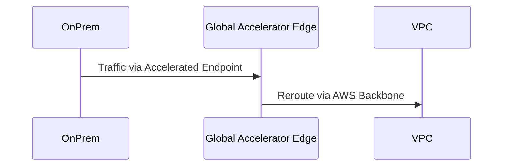
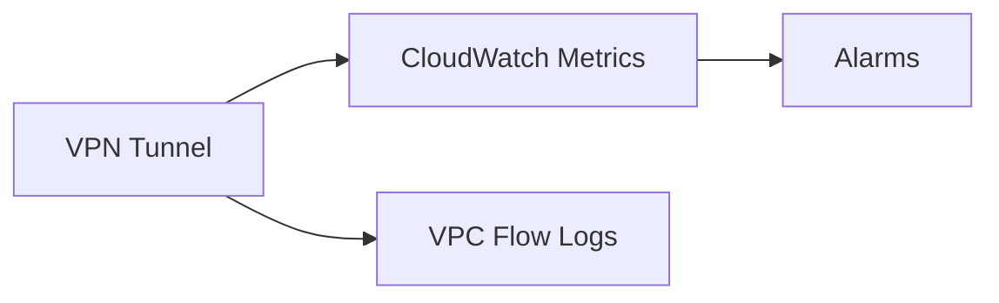

<details open>
<summary><b>Section 12: Introduction to AWS Site-to-Site VPN (KK-CS45-script-v2)</b></summary>

# Section 12: Introduction to AWS Site-to-Site VPN

## Table of Contents
- [12.1 Introduction to AWS Site-to-Site VPN](#121-introduction-to-aws-site-to-site-vpn)
- [12.2 IPv4 and IPv6 traffic over AWS Site-to-Site VPN](#122-ipv4-and-ipv6-traffic-over-aws-site-to-site-vpn)
- [12.3 Hands On- Setup AWS Site-to-Site VPN](#123-hands-on--setup-aws-site-to-site-vpn)
- [12.4 Accelerated Site-to-Site VPN (Using AWS Global Accelerator)](#124-accelerated-site-to-site-vpn-using-aws-global-accelerator)
- [12.5 VPN NAT Traversal (NAT-T)](#125-vpn-nat-traversal-nat-t)
- [12.6 VPN Route Propagation (Static vs Dynamic)](#126-vpn-route-propagation-static-vs-dynamic)
- [12.7 VPN Transitive Routing scenarios](#127-vpn-transitive-routing-scenarios)
- [12.8 VPN Tunnels - Active-Passive Mode](#128-vpn-tunnels---active-passive-mode)
- [12.9 VPN Dead Peer Detection (DPD)](#129-vpn-dead-peer-detection-dpd)
- [12.10 VPN Monitoring](#1210-vpn-monitoring)
- [12.11 AWS Site-to-Site VPN Architectures](#1211-aws-site-to-site-vpn-architectures)
- [12.12 AWS VPN CloudHub](#1212-aws-vpn-cloudhub)
- [12.13 EC2 based VPN](#1213-ec2-based-vpn)
- [12.14 AWS Transit VPC architecture using VPN connections](#1214-aws-transit-vpc-architecture-using-vpn-connections)
- [Summary](#summary)

## 12.1 Introduction to AWS Site-to-Site VPN
### Overview
AWS Site-to-Site VPN provides secure, private connectivity between your on-premises network and AWS VPCs, encrypting traffic over the internet. It supports IPsec protocol for layer 3 VPN, allowing hosts in corporate data centers to communicate with AWS resources like EC2 instances and databases using private IPs. This lecture covers fundamentals, components, and the difference from AWS Client VPN and Direct Connect.

### Key Concepts/Deep Dive
AWS Site-to-Site VPN enables private access to AWS resources without exposing them publicly over the internet. Key differences include:
- **Site-to-Site VPN**: Connects corporate networks to AWS VPCs.
- **Client VPN**: Connects individual devices (e.g., laptops) to VPCs.
- **Direct Connect**: Uses dedicated, private connections for higher bandwidth and lower latency.

Architecture involves:
- **Virtual Private Gateway (VPN Gateway)**: Attached to VPC for VPN termination.
- **AWS Transit Gateway**: Alternative for hub-and-spoke routing across multiple VPCs.

VPN connections consist of two tunnels for high availability:
- Active-active or active-passive modes possible.
- Terminates on VPG or Transit Gateway.

VPN features:
- **Layer 3 IPsec VPN**: Unicast only, uses encryption for secure traffic.
- Other VPN types (e.g., GRE for multicast, DMVPN for dynamic spoke-to-spoke) require EC2-based solutions.
- VPG attached to one VPC per region.
- **Routing**: Supports static and dynamic (BGP) routing.
- **ASN for BGP**: Default is 64512; configure 2-byte or 4-byte ASNs.
- **Authentication**: Pre-shared keys or AWS Private CA certificates.

Diagram of basic setup:

```mermaid
graph LR
    A[Corporate Data Center] --> B[Customer Gateway]
    B --> C[VPN Tunnels (2)]
    C --> D[AWS Region: VPC with VPG]
```

> [!IMPORTANT]
> Site-to-Site VPN goes over the internet but is encrypted and considered private connectivity.

## 12.2 IPv4 and IPv6 traffic over AWS Site-to-Site VPN
### Overview
AWS Site-to-Site VPN supports both IPv4 and IPv6 traffic based on tunnel IP configurations, using inside (private) and outside (public) IPs. Tunnels have two sets of IPs: outside IPs (e.g., public IPs for connection) and inside IPs (from 169.254.0.0/16 for traffic routing). Different combinations determine IPv4/IPv6 support, ranging from IPv4-only to mixed or full IPv6 setups.

### Key Concepts/Deep Dive
Tunnel structure:
- **Outside IPs**: Public IPs for tunnel establishment (AWS assigns two per tunnel).
- **Inside IPs**: Private IPs from 169.254.0.0/16 for IP packet transmission.

IPv4/IPv6 support variations:
1. **IPv4 Outside + IPv4 Inside**: Default; supports IPv4 traffic. Works on VPG, Transit Gateway, and Cloud WAN.
2. **IPv4 Outside + IPv6 Inside**: Supports IPv6 traffic within IPv4 tunnels. Only on Transit Gateway and Cloud WAN.
3. **IPv6 Outside + IPv6 Inside**: Full IPv6 support for IPv6-based applications.
4. **IPv6 Outside + IPv4 Inside**: Supports IPv6 routing with IPv4 tunnel traffic. Only on Transit Gateway and Cloud WAN.

Each tunnel supports either IPv4 or IPv6 traffic exclusively; for both, create separate VPN connections.

```diff
+ IPv4 tunnels (default): Supports IPv4 workloads without global IPv6.
- Full IPv6 tunnels: For IPv6-only environments.
```

> [!NOTE]
> Outside IPs are public for connectivity; inside IPs are private for actual routing.

## 12.3 Hands On- Setup AWS Site-to-Site VPN
### Overview
This hands-on lab demonstrates setting up an AWS Site-to-Site VPN connection between a VPC and a simulated on-premises network using IPv4 tunnels. It covers creating a VPG, Customer Gateway, VPN connection, and configuring tunnels with pre-shared keys. The lab highlights tunnel setup, routing, and verification without actual routing table changes shown due to simulation limits.

### Key Concepts/Deep Dive
Steps for setup:
1. **Create VPC**: Deploy in desired region with CIDR (e.g., 10.0.0.0/16).
2. **Attach VPG**: Create Virtual Private Gateway and attach to VPC.
3. **Customer Gateway**: Simulate on-premises router with public IP.
4. **VPN Connection**: Establish connection; AWS generates two tunnels with outside/inside IPs.

Tunnel configuration:
- **Tunnel 1 and 2**: Each with outside public IP and inside /30 CIDR (e.g., 169.254.X.X/30).
- **Pre-shared Keys**: Use for authentication; download config for customer router.
- **BGP Peering**: Optional for dynamic routing.
- **High Availability**: Change VPC route tables to use VPN CIDRs; add static routes if needed.

```bash
# Example Terraform for VPG (conceptual):
resource "aws_vpn_gateway" "example" {
  vpc_id = aws_vpc.example.id
}

# Actual AWS CLI steps in console are manual.
```

> [!IMPORTANT]
> Disable source/dest checks if using EC2 for customer gateway simulation.

## 12.4 Accelerated Site-to-Site VPN (Using AWS Global Accelerator)
### Overview
Accelerated Site-to-Site VPN uses AWS Global Accelerator to reduce latency by routing traffic through AWS's global network. It attaches an accelerator to serve as the public IP endpoint, minimizing hops over the internet. Suitable for regions with long distances or multiple internet providers, differing from standard VPN which uses direct internet paths.

### Key Concepts/Deep Dive
How it works:
- **Global Accelerator**: Provides static Anycast IPs; traffic enters AWS network via closest edge, traverses private backbone.
- **Integration**: Attach accelerator to VPN connection for accelerated tunnels.
- **Benefits**: Reduces latency, improves reliability; separate from Direct Connect speed.
- **Limitations**: Increases AWS network hops; not for all scenarios.
- **Cost**: Additional charges for accelerator.

Comparison with standard VPN:
- **Standard**: Direct internet routing.
- **Accelerated**: Via Global Accelerator edge locations.



> [!NOTE]
> Use when internet distance causes high latency; monitor against VPN tunnel constraints.

## 12.5 VPN NAT Traversal (NAT-T)
### Overview
NAT Traversal (NAT-T) enables VPN tunnels through NAT devices, common for customers behind firewalls or routers. It encapsulates ESP packets in UDP (port 4500) to allow NAT traversal, ensuring IPSec tunnels work even with NAT. AWS VPN automatically detects and enables NAT-T as needed during tunnel establishment.

### Key Concepts/Deep Dive
Why NAT-T:
- Many customer gateways are behind NAT.
- Without NAT-T, IPSec ESP packets get blocked.
- NAT-T solution: Encapsulate in UDP payloads for firewall traversal.

How it works:
- AWS detects NAT during IKE negotiation.
- Switches to NAT-T mode (UDP port 4500).
- Updates outside IPs if customer public IP changes.

```diff
+ Enables VPN through NAT devices.
- Older devices may require manual configuration.
```

> [!IMPORTANT]
> Void if customer gateway supports IPSec NAT Traversal extensions.

## 12.6 VPN Route Propagation (Static vs Dynamic)
### Overview
VPN route propagation supports static and dynamic (BGP) routing. Static involves manual route tables; dynamic uses BGP for automatic exchange. Dynamic requires ASN (default 64512); static needs manual VPN CIDR entries. Choose based on network size and automation needs.

### Key Concepts/Deep Dive
- **Static Routing**: Manually add CIDR blocks to route tables; simple for small networks.
- **Dynamic Routing (BGP)**: Automatic sync via ASN; includes subnet masks and metrics.
- **ASN**: 2-byte/4-byte; default 64512 for VPG.
- **Propagation**: Dynamic enables VPC route table updates; static requires config.

Table: Static vs Dynamic

| Feature          | Static               | Dynamic (BGP)        |
|------------------|----------------------|---------------------|
| Route Exchange   | Manual               | Automatic           |
| Complexity       | Low                  | High                |
| Best For         | Small networks       | Large, dynamic networks |

> [!NOTE]
> Use dynamic for transitive routing or multiple VPNs.

## 12.7 VPN Transitive Routing scenarios
### Overview
Transitive routing allows traffic from on-premises to cross VPC boundaries via IGW, NAT, or peered VPCs. However, AWS Site-to-Site VPN blocks transitive routing from VPN; traffic can't reach internet or peered resources unless routed through IGW first. EC2-VPN supports it since traffic terminates in VPC.

### Key Concepts/Deep Dive
Transit Routing Limitations with VPG:
- VPN → VPC: Allowed.
- VPN → IGW/NAT/Peering: Blocked; no default route.
- Workarounds: Use AWS Transit Gateway for full transit.

Scenarios:
- On-prem to VPC: Direct.
- On-prem to internet: Not supported; send to IGW first.
- Peered VPC access: Transit Gateway required.

With EC2-VPN:
- Traffic terminates in ENI; full routing.

```mermaid
graph TD
    A[On-Prem] --> B[VPN]
    B --> C[VPC Resources]
    B -.-> D[Internet/Peered] (Blocked)
```

> [!IMPORTANT]
> Use Transit Gateway for advanced routing needs.

## 12.8 VPN Tunnels - Active-Passive Mode
### Overview
VPN tunnels operate in active-active or active-passive modes. Active-active uses both tunnels for load balancing and redundancy. Active-passive designates one active, one passive for failover. Configuration affects high availability and DR.

### Key Concepts/Deep Dive
Modes:
- **Active-Active**: Both tunnels up; equal cost multipath (ECMP) for load balancing.
- **Active-Passive**: One active, one passive; passive for failover.

Configuration:
- Via tunnel IP priorities.
- BGP required for ECMP.

Benefits:
- **HA**: Failover in seconds.
- **Load Balancing**: Active-active distributes traffic.

> [!NOTE]
> Ensure customer gateway supports modes.

## 12.9 VPN Dead Peer Detection (DPD)
### Overview
Dead Peer Detection (DPD) monitors tunnel health by sending keepalive messages. If no response, marks tunnel down for failover. Enabled by default in AWS VPN for reliability. Uses periodic probes to detect failures.

### Key Concepts/Deep Dive
How DPD Works:
- Sends DPD messages (IKE keepalives).
- If unreplied, tunnel marked dead.
- Failover to other tunnel.

Defaults and Config:
- Threshold: 40 seconds.
- Period: 10 seconds.

Benefits:
- Detects silent failures.
- Ensures uptime.

```diff
+ Automatic failover on tunnel issues.
- May cause false positives if network congestion.
```

> [!NOTE]
> DPD not configurable per tunnel in AWS.

## 12.10 VPN Monitoring
### Overview
AWS VPN monitoring uses CloudWatch metrics, logs, and events for tunnel status, traffic, and errors. Metrics include tunnel state, data in/out. Network interface for packet monitoring. Use CloudWatch alarms for health.

### Key Concepts/Deep Dive
Metrics:
- TunnelState: Up/Down.
- TunnelDataIn/Out.
- Other: CPU, Memory (for related resources).

Logs:
- Via VPC Flow Logs on ENIs.

Events:
- Tunnel status changes.

Tools:
- AWS CLI/API for status.
- CloudWatch dashboards.



> [!IMPORTANT]
> Monitor DPD and route propagation for troubleshooting.

## 12.11 AWS Site-to-Site VPN Architectures
### Overview
Common architectures include single VPG per VPC, hub-and-spoke with Transit Gateway, and hybrid with Cloud WAN. Choose based on scale: single VPC for VPG, multi-VPC for Transit Gateway. Each supports static/dynamic routing and tunnel modes.

### Key Concepts/Deep Dive
Architectures:
- **Basic**: VPG attached to VPC; customer gateway connects.
- **Hub-and-Spoke**: Transit Gateway connects multiple VPCs and on-prem.
- **Hybrid**: Cloud WAN for global hybrid unification.

Table: Architecture Comparison

| Architecture     | Use Case                 | Pros               | Cons               |
|------------------|--------------------------|---------------------|-------------------|
| Basic (VPG)      | Single VPC               | Simple             | Limited routing  |
| Hub-and-Spoke    | Multi-VPC                | Full routing       | More complex     |
| Cloud WAN        | Enterprise hybrid        | MPLS-like          | Requires Cloud WAN |

> [!NOTE]
> Transit Gateway enables transitive routing across VPCs.

## 12.12 AWS VPN CloudHub
### Overview
AWS VPN CloudHub allows secure, low-cost communication between on-prem sites without full mesh VPN. Uses single VPN connection to VPG, with BGP advertising routes. Spokes connect via shared connection, enabling spoke-to-spoke via AWS cloud.

### Key Concepts/Deep Dive
How it works:
- Each spoke has VPN to CloudHub.
- Routes advertised via BGP.
- Traffic routes through AWS for spoke-to-spoke.

Benefits:
- No full mesh.
- Cost-effective for multiple sites.

Limitations:
- Requires BGP.
- No encryption for spoke-to-spoke (over AWS network).

> [!IMPORTANT]
> Suitable for spoke-to-spoke over VPN hub.

## 12.13 EC2 based VPN
### Overview
EC2-based VPN provides flexibility beyond IPsec, supporting GRE/DMVPN, overlapping CIDRs, and transitive routing. Terminates VPN on EC2, enabling custom software and NAT. Ideal for advanced protocols, threat protection, or bandwidth over 1.25 Gbps.

### Key Concepts/Deep Dive
Reasons to Use:
- Non-IPsec protocols (GRE/DMVPN).
- Overlapping CIDRs with IP table NAT.
- Transitive routing (access internet/peering).
- Advanced features (threat protection).
- Bandwidth >1.25 Gbps (EC2 up to 5 Gbps).

Configuration:
- Disable source/dest check.
- Enable IP forwarding.
- Use CloudWatch for auto recovery.
- Horizontal scaling for higher bandwidth.

Architectures:
- Single EC2 with auto recovery.
- Multiple EC2 with load balancing (update routes on failure).

> [!WARNING]
> NLB not supported for IPsec.

## 12.14 AWS Transit VPC architecture using VPN connections
### Overview
Transit VPC uses an EC2-based VPN hub for connecting multiple VPNs and AWS resources. Acts as a transit point for on-prem to VPC traffic, supporting peering and internet access. Combines benefits of EC2-VPN with hub architecture.

### Key Concepts/Deep Dive
Architecture:
- VPC with EC2 VPN instances.
- Connects to multiple VPNs and internal resources.
- Enable transitive routing via hub.

Benefits:
- Transit for multiple sites.
- Consolidation point for routing.

Limitations:
- Scaling via instances.
- Monitoring for HA.

> [!NOTE]
> Alternative to full Transit Gateway for simpler setups.

## Summary
### Key Takeaways
```diff
+ Site-to-Site VPN: Secure, encrypted connectivity over internet using IPsec.
+ Routing: Static for simplicity, dynamic for automation; Transit Gateway for transit.
+ Architectures: VPG for basic, Transit Gateway for advanced hub-and-spoke.
+ Alternatives: EC2-VPN for custom protocols or high bandwidth.
- Limitations: No native transitive routing; separates IPv4/IPv6 support.
! Security: Use monitored tunnels with DPD and acceleration for reliability.
```

### Quick Reference
- **Default ASN**: 64512 for VPG.
- **Tunnel Modes**: Active-active with ECMP or active-passive for HA.
- **Configs**: Pre-shared keys or certificates for auth; inside IPs for routing.
- **Commands**: Use AWS CLI for status; CloudWatch for alerts.

### Expert Insight
- **Real-world Application**: Deploy Transit Gateway for enterprise hybrid clouds with full routing control.
- **Expert Path**: Master BGP troubleshooting and tunnel failover for production readiness.
- **Common Pitfalls**: Assuming transitive routing works with VPG; ignoring NAT-T behind firewalls.
- **Lesser-Known Facts**: CloudHub enables spoke-to-spoke without full mesh; DPD helps detect silent failures faster than absent alarms.

</details>