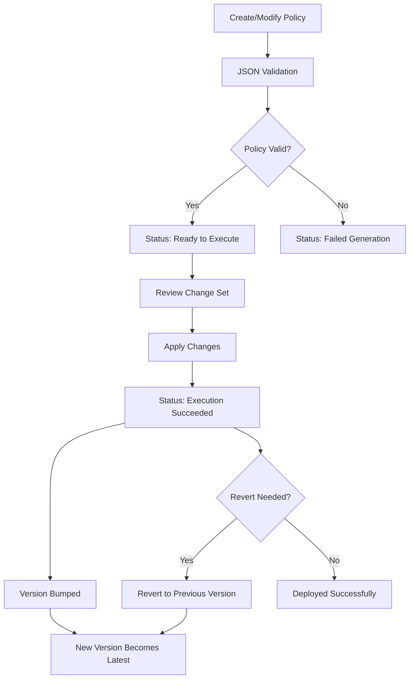
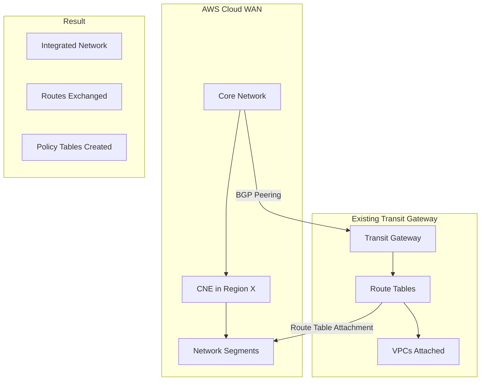

<details open>
<summary><b>Section 15: What is AWS Cloud WAN (KK-CS45-script-v2)</b></summary>

# Section 15: What is AWS Cloud WAN

## Table of Contents
- [15.1 What is AWS Cloud WAN](#151-what-is-aws-cloud-wan)
- [15.2 Core Network Policy](#152-core-network-policy)
- [15.3 Hands-On- Set up AWS Cloud WAN network, Segments & VPC attachments](#153-hands-on--set-up-aws-cloud-wan-network-segments--vpc-attachments)
- [15.4 Connecting Transit Gateway & Direct Connect](#154-connecting-transit-gateway--direct-connect)
- [15.5 AWS Cloud WAN Summary](#155-aws-cloud-wan-summary)
- [Summary](#summary)

## 15.1 What is AWS Cloud WAN

### Overview
AWS Cloud WAN is a global network management service that enables building, managing, and monitoring global networks across AWS and on-premises environments. It provides a single pane of glass dashboard through AWS Network Manager for centralized network control, using policy-driven architecture similar to software-defined networks. This service addresses the complexity of managing large-scale enterprise networks that span multiple regions and include legacy on-premises infrastructure.

### Key Concepts/Deep Dive

#### Core Problem Solved by AWS Cloud WAN
AWS Cloud WAN addresses scaling challenges in traditional networking approaches:

##### Complexity with Traditional Approaches
- **VPC Peering Limitations**: Creates N*(N-1)/2 peering connections for N VPCs, becomes unwieldy with many VPCs
- **Transit Gateway Scaling**: Requires peering between regional transit gateways for cross-region connectivity, creating exponential complexity
- **Hybrid Network Integration**: Complicating factors include:
  - Direct Connect gateways and transit VIFs
  - VPN connections
  - SD-WAN appliances requiring connect attachments and GRE tunnels
  - Manual route table management for static routes (transit gateway peering doesn't support dynamic routes)

#### AWS Cloud WAN Architecture

**Core Components:**
- **Global Network**: Contains core network and transit gateway network components
- **Core Network**: The primary Cloud WAN implementation
  - **Core Network Edges (CNE)**: Regional routers deployed in each desired AWS region
  - **Network Segments**: Routing domains for network segmentation (development, production, shared services)
  - **Attachments**: Connect VPCs, VPNs, SD-WAN networks, and existing transit gateways
  - **Core Network Policy**: JSON-based configuration defining network behavior

**Key Features:**
- **Policy-Driven Management**: Define network policy once, apply globally
- **Centralized Management**: Single dashboard via AWS Network Manager
- **Dynamic Home Region**: Metadata stored in Oregon (us-west-2), regardless of deployment regions

**Network Segmentation Examples:**
- **Development Segment**: Isolated development VPCs
- **Production Segment**: Isolated production VPCs
- **Shared Services Segment**: Hybrid connectivity components

**Routing Policies Between Segments:**
- Isolated segments (default behavior)
- Explicit route sharing between specific segments
- Prevent direct development ↔ production communication while allowing both to access shared services

**Home Region Requirements:**
- All network metadata stored in Oregon region
- Not required to deploy core network edge in Oregon
- ASN ranges: 64512-65534 (default)

### AWS Cloud WAN Infrastructure Flow

```mermaid
graph TD
    A[AWS Cloud WAN Global Network] --> B[Core Network]
    A --> C[Transit Gateway Network]

    B --> D[Core Network Policy]
    B --> E[Core Network Edges (CNE)]

    E --> F[Edge Location: Mumbai]
    E --> G[Edge Location: North Virginia]
    E --> H[Edge Location: London]

    D --> I[Network Segments]
    I --> J[Development Segment]
    I --> K[Production Segment]
    I --> L[Shared Services Segment]

    I --> M[Segment Attachments]
    M --> N[VPC Attachments]
    M --> O[VPN Attachments]
    M --> P[Connect Attachments (SD-WAN)]

    D --> Q[Segment Routing Policies]
    Q --> R[Share Dev ↔ Shared]
    Q --> S[Share Prod ↔ Shared]

    A --> T[AWS Network Manager]
    T --> U[Centralized Dashboard]
    T --> V[Global Monitoring]
```

## 15.2 Core Network Policy

### Overview
The core network policy is a JSON document that defines the entire AWS Cloud WAN configuration, enabling complete network management through policy-driven architecture. It includes network configurations, segment definitions, routing policies, and attachment rules that determine how network components interact and connect.

### Key Concepts/Deep Dive

#### Core Network Policy Structure

**High-Level Elements:**
- **Network Configuration**: Global settings for the entire Cloud WAN
- **Segments**: Define routing domains with specific policies
- **Attachment Policies**: Automation rules for connecting attachments to segments

#### Network Configuration Parameters

**ASN Ranges:**
- 16-bit or 32-bit Autonomous System Numbers
- Used for CNE and BGP peering
- Default range: 64512-65534

**Edge Locations:**
- AWS regions where CNE will be deployed
- Critical selection based on operational regions
- Example: us-east-1, eu-west-1, ap-south-1

**Inside CIDR Blocks:**
- Required for Connect attachments (SD-WAN)
- Defines GRE tunnel IP ranges
- Can be specified at core network or per-region level

**VPN Equal Cost Multi-Path (ECMP):**
- Optional enable/disable for VPN attachments
- Allows load balancing across multiple paths

#### Segment Configuration

**Required Parameters:**
- **Segment Name**: Unique identifier for the routing domain

**Optional Parameters:**
- **Edge Locations**: Limit segment to specific regions (subset of core network regions)
- **Isolate Attachments**: Prevent intra-segment communication (default: false)

**Attachment Acceptance:**
- **Required Attachment Acceptance**: Enable manual approval for attachments (default: true)
- Provides governance control over network changes

**Segment Sharing Policies:**
- **Allow/Deny Lists**: Control which segments can share routes
  - Mutually exclusive (can't specify both)
  - Only applies when segments are actively shared

#### Segment Actions (Route Sharing)

**Purpose:** Enable route exchange between specified segments
- Define source segment and list of target segments
- Routes are bi-directional between shared segments
- Transitive routing not automatic (A shares with B,C doesn't make B,C share with each other)

**Example Policy:**
```json
{
  "segment-actions": [
    {
      "action": "share",
      "mode": "attachment-route",
      "segment": "shared",
      "share-with": ["development", "production"]
    }
  ]
}
```

#### Static Routes Override

**Purpose:** Create specific connectivity rules outside of segment sharing
- Override default isolation behavior
- Manually define routes between segments or individual attachments
- More granular control than automatic segment sharing

#### Attachment Types and Policies

**Supported Attachment Types:**
- **VPC**: Connect EC2 subnets to network segments
- **VPN**: Site-to-Site VPN connections
- **Connect**: SD-WAN appliance connections (supports GRE and tunnel-less protocols)
- **Connect Peer**: BGP session establishment for Connect attachments
- **Transit Gateway Route Table**: Connect existing transit gateway to core network

**Attachment Policy Features:**
- **Rule-Based Automation**: Automatic attachment assignment via tags or conditions
- **Rule Precedence**: Lower numbered rules take priority
- **Rule Conditions**: Match on VPC ID, region, tags, AWS account
- **Association Methods**:
  - Constant: Explicit segment assignment
  - Tag-based: Dynamic segment assignment via tag values

**Example Attachment Policy:**
```json
{
  "attachment-policies": [
    {
      "rule-number": 1,
      "conditions": [
        {
          "type": "tag-exists",
          "key": "Environment",
          "operator": "equals",
          "value": "Development"
        }
      ],
      "action": {
        "association-method": "constant",
        "segment": "development"
      }
    }
  ]
}
```

#### Policy Deployment Process



**Policy States:**
- **Pending Generation**: Policy being validated
- **Ready to Execute**: Valid policy ready for deployment
- **Failed Generation**: Syntax or parameter errors
- **Execution Succeeded/Failed**: Deployment result

## 15.3 Hands-On- Set up AWS Cloud WAN network, Segments & VPC attachments

### Overview
This hands-on demonstration creates a complete AWS Cloud WAN network spanning three AWS regions (Mumbai, North Virginia, London) with three network segments (development, production, shared services). The hands-on covers core network creation, segment configuration, VPC attachments, routing policies, and end-to-end connectivity testing between EC2 instances across regions while enforcing network segmentation rules.

### Key Concepts/Deep Dive

#### Lab Architecture and Requirements

**Target Setup:**
- **Regions**: Mumbai (ap-south-1), North Virginia (us-east-1), London (eu-west-1)
- **VPNs per Region**: Development VPC (10.0.0.0/16), Production VPC (172.16.0.0/16)
- **Shared Services**: London region with Shared Services VPC (192.168.0.0/16)
- **Connectivity Rules**:
  - ✅ Development instances can communicate with other development instances + shared services
  - ✅ Production instances can communicate with other production instances + shared services
  - ❌ Development and production instances cannot communicate directly

#### Hands-On Steps: Core Network Creation

**Step 1: Create AWS Cloud WAN Global Network**
```bash
# Navigate to AWS Network Manager
# Global Networks -> Create global network
Name: demo-global-network
Description: Demo Cloud WAN network for multi-region connectivity
```

**Step 2: Create Core Network**
```bash
# Within Global Network, create core network
Name: demo-core-network
Description: Core network with multi-region coverage

# ASN Ranges: Use default (64512-65534)

# Edge Locations (Critical Selection):
- ap-south-1 (Mumbai)
- us-east-1 (North Virginia)
- eu-west-1 (London)

# Create initial shared segment
Segment Name: shared
# Leave other settings default
```

**Network Creation Timeline:** ⏱️ ~5-10 minutes for initial deployment

#### Hands-On Steps: Segment Configuration

**Step 3: Edit Core Network Policy - Add Segments**
```bash
# Select core network -> Edit policy -> Segments section

# Add Development Segment
Segment Name: development
Isolate Attachments: false
Require Attachment Acceptance: false

# Add Production Segment
Segment Name: production
Isolate Attachments: false
Require Attachment Acceptance: false

# Modify Shared Segment
Segment Name: shared
Isolate Attachments: false
Require Attachment Acceptance: false
```

**Step 4: Configure Segment Routing Policies**
```bash
# Routing Policies Section

# Development Segment Policy
Action: Allow selected segments
Allow list: ["shared"]

# Production Segment Policy
Action: Allow selected segments
Allow list: ["shared"]

# Shared Segment Policy
Action: Allow selected segments
Allow list: ["development", "production"]
```

**Segment Sharing Actions:**
```json
{
  "segment-actions": [
    {
      "action": "share",
      "segment": "shared",
      "share-with": ["development", "production"]
    }
  ]
}
```

#### Configuration Process Timeline
- Policy Edit: ~2 minutes
- Change Application: ~5 minutes (segment creation)
- Final Execution: ~1 minute

#### Hands-On Steps: Attachment Policies

**Step 5: Define Attachment Policies for Automation**
```bash
# Attachment Policies Section

# Rule 1: Development Segment Tag-Based
Rule Number: 1
Condition: Tag "Environment" equals "development"
Action: Associate with segment "development"

# Rule 2: Production Segment Tag-Based
Rule Number: 2
Condition: Tag "Environment" equals "production"
Action: Associate with segment "production"

# Rule 100: Default Fallback
Rule Number: 100
Condition: Any (catch-all)
Action: Associate with segment "shared"
```

#### Hands-On Steps: Create VPC Attachments

**Pre-requisites:** Created VPCs and EC2 instances in each region
- Mumbai: Dev VPC (10.0.0.0/16), Prod VPC (172.16.0.0/16), EC2 instances
- North Virginia: Dev VPC (10.0.0.0/16), Prod VPC (172.16.0.0/16), EC2 instances
- London: Shared VPC (192.168.0.0/16), EC2 instance

**Step 6: Create Five VPC Attachments**
```bash
# Create attachments with appropriate tags

# Mumbai Development
Name: mumbai-development
Region: ap-south-1
VPC ID: [Mumbai Dev VPC ID]
Tag: Environment = development
# Automatically associates with development segment via policy

# Mumbai Production
Name: mumbai-production
Region: ap-south-1
VPC ID: [Mumbai Prod VPC ID]
Tag: Environment = production
# Automatically associates with production segment

# North Virginia Development
Name: virginia-development
Region: us-east-1
VPC ID: [Virginia Dev VPC ID]
Tag: Environment = development

# North Virginia Production
Name: virginia-production
Region: us-east-1
VPC ID: [Virginia Prod VPC ID]
Tag: Environment = production

# London Shared Services (no tag - uses rule 100)
Name: london-shared
Region: eu-west-1
VPC ID: [London Shared VPC ID]
# No tag specified - uses default rule 100
```

**Attachment Creation Timeline:** ⏱️ ~5-10 minutes total

#### Network Visualization

**Cloud WAN Topology View:**
```
Core Network Edges:
├── Mumbai (ap-south-1)
├── North Virginia (us-east-1)
└── London (eu-west-1)

Segments & Attachments:
├── Development Segment
│   ├── Mumbai Dev VPC (10.0.0.0/16)
│   └── North Virginia Dev VPC (10.0.0.0/16)
├── Production Segment
│   ├── Mumbai Prod VPC (172.16.0.0/16)
│   └── North Virginia Prod VPC (172.16.0.0/16)
└── Shared Segment
    └── London Shared VPC (192.168.0.0/16)
```

**Route Propagation:**
- Development segment routes shared with shared segment
- Production segment routes shared with shared segment
- No sharing between development and production segments

#### Hands-On Steps: Configure VPC Route Tables

**Step 7: Update VPC Route Tables for Cross-Region Connectivity**
```bash
# Target ARN: [Core Network ARN]
# Example: arn:aws:networkmanager::123456789012:core-network/core-network-id

# Mumbai Development VPC Route Table
Routes to add:
- 10.0.0.0/8 → [Core Network ARN] (enables Dev-to-Dev + Dev-to-Shared)
- 192.168.0.0/16 → [Core Network ARN]

# North Virginia Development VPC Route Table
Routes to add:
- 10.0.0.0/8 → [Core Network ARN]
- 192.168.0.0/16 → [Core Network ARN]

# Mumbai Production VPC Route Table
Routes to add:
- 172.16.0.0/12 → [Core Network ARN] (enables Prod-to-Prod + Prod-to-Shared, covers 172.x.x.x)
- 192.168.0.0/16 → [Core Network ARN]

# North Virginia Production VPC Route Table
Routes to add:
- 172.16.0.0/12 → [Core Network ARN]
- 192.168.0.0/16 → [Core Network ARN]

# London Shared Services VPC Route Table
Routes to add:
- 10.0.0.0/8 → [Core Network ARN] (Dev ranges)
- 172.16.0.0/12 → [Core Network ARN] (Prod ranges)
```

> [!IMPORTANT]
> Use core network ARN as target, not gateway IDs. Longest prefix matching applies (more specific routes take precedence).

#### Hands-On Steps: Connectivity Testing

**Test Case 1: Development to Development Connectivity**
```bash
# From Mumbai Dev EC2 instance (10.0.x.x)
ping [North Virginia Dev EC2 Private IP]
# Expected: ✅ Successful (segments shared via hub-and-spoke, routes configured)

ping [North Virginia Prod EC2 Private IP]
# Expected: ❌ Failed (segments isolated, no route sharing)
```

**Test Case 2: Development to Shared Services Connectivity**
```bash
# From Mumbai Dev EC2 instance
ping [London Shared EC2 Private IP]
# Expected: ✅ Successful (Dev ↔ Shared segment sharing + routes)
```

**Test Case 3: Production to Shared Services Connectivity**
```bash
# From North Virginia Prod EC2 instance
ping [London Shared EC2 Private IP]
# Expected: ✅ Successful (Prod ↔ Shared segment sharing + routes)
```

**Connectivity Troubleshooting:**
- **No connectivity after setup**: Verify route tables have core network ARN as target
- **Visualization**: Use Network Manager Topology views to verify segments and propagated routes
- **Route Propagation**: Check "Routes" tab in Cloud WAN console for next-hop verification

#### Cleanup Process
```bash
# Critical: Clean up all resources to avoid costs

# Delete attachments (all 5)
# Delete core network
# Delete global network
# Terminate EC2 instances
# Delete VPCs and subnets
```

> [!NOTE]
> Core network edges are billed per hour per region. Ensure full cleanup after lab completion.

## 15.4 Connecting Transit Gateway & Direct Connect

### Overview
This lecture demonstrates how to integrate existing AWS networking infrastructure (Transit Gateway and Direct Connect) with AWS Cloud WAN. It covers scenarios where enterprises want to migrate gradually to Cloud WAN while maintaining existing network investments, using peering connections and route table attachments to bridge the two architectures.

### Key Concepts/Deep Dive

#### Transit Gateway Integration Scenarios

**Migration Context:**
- **Existing Architecture**: Regional transit gateways with VPCs, routing tables for network segmentation
- **New Cloud WAN**: Fresh implementation with segments and core network edges
- **Integration Goal**: Connect legacy transit gateway setups to Cloud WAN without disruption

**Integration Options:**
- **Option 1 (Recommended for new deployments)**: Reconfigure VPCs directly to Cloud WAN segments
- **Option 2 (Brownfield migration)**: Integrate existing transit gateway via peering

#### Transit Gateway to Cloud WAN Peering Process

**Step 1: Create Transit Gateway Peering**
```bash
# From Cloud WAN console or Network Manager

# Navigate to Cloud WAN Global Network
# Core Network → Peerings → Create Peering

Transit Gateway ID: [Existing Transit Gateway ID]
Transit Gateway Region: [AWS Region]
Transit Gateway ASN: [TGW ASN]

# Creates BGP peering at switch level
# Establishes dynamic routing between TGW and core network
# Creates policy table in transit gateway
```

**Step 2: Map Transit Gateway Route Tables to Cloud WAN Segments**
```bash
# After peering establishment

# Navigate to Core Network → Attachments
# Create Transit Gateway Route Table Attachment

Attachment Type: Transit Gateway Route Table
Transit Gateway: [TGW ID]
Route Table: [Specific TGW Route Table ID]
Segment: [Target Cloud WAN Segment, e.g., "production"]

# Maps TGW route table to Cloud WAN segment
# Enables VPCs attached to TGW route table to join Cloud WAN segment
```

#### Architecture After Integration



**Post-Integration Behavior:**
- Dynamic routing established via BGP peering
- Transit gateway policy table created for Cloud WAN integration
- VPCs attached to mapped route table become part of Cloud WAN segment
- Can communicate with other attachments in same segment according to segment policies

#### Direct Connect Integration with Cloud WAN

**Limitation:** Cloud WAN doesn't support Direct Connect attachments directly
**Solution:** Route through Transit Gateway as intermediary

**Integration Architecture:**
```
On-Premises Network → Direct Connect → Transit VIF → Direct Connect Gateway → Transit Gateway
                                                   ↓
Transit Gateway ↔ Cloud WAN Peering → Core Network Segments
```

**Step-by-Step Integration:**

**Step 1: Establish Direct Connect to Transit Gateway**
```bash
# Use existing Direct Connect infrastructure or create new

# Create Transit Virtual Interface (VIF)
# Connect to Direct Connect Gateway
# Attach Direct Connect Gateway to Transit Gateway

Direct Connect Location → DX Connection → Transit VIF
                                               ↓
Direct Connect Gateway → Transit Gateway Attachment
```

**Step 2: Peer Transit Gateway with Cloud WAN**
```bash
# Same process as TGW-to-Cloud WAN peering above

# Create peering between TGW and core network
# Enable BGP routing and policy table creation
```

**Step 3: Map Transit Gateway Route Table to Segment**
```bash
# Create route table attachment

Attachment Type: Transit Gateway Route Table
Target Segment: [hybrid-segment or shared-services-segment]

# Routes Direct Connect traffic into appropriate Cloud WAN segment
```

#### Complete Integration Flow

**End-to-End Connection Path:**
1. **On-Premises** → Direct Connect physical connection
2. **DX Connection** → Transit VIF (VLAN-tagged interface)
3. **DX VIF** → Direct Connect Gateway (cross-region aggregation)
4. **DX Gateway** → Transit Gateway attachment
5. **Transit Gateway** → Cloud WAN peering (BGP session)
6. **Core Network** → Route table attachment to segment
7. **Network Segment** → Connectivity to other VPC attachments

**Benefits of This Architecture:**
- **Gradual Migration**: Don't need to touch existing Direct Connect infrastructure
- **Hybrid Integration**: Connect legacy on-premises networks to Cloud WAN
- **Centralized Management**: Bring Direct Connect under Cloud WAN policy control
- **Consistent Segmentation**: Apply Cloud WAN policies to hybrid traffic

**Cost and Performance Considerations:**
- **Additional Hop**: Transit Gateway adds one routing hop
- **Cost**: Transit Gateway per-hour cost + Direct Connect costs
- **Performance**: BGP-based routing provides optimal paths

## 15.5 AWS Cloud WAN Summary

### Overview
AWS Cloud WAN Summary consolidates the key benefits and use cases of AWS Cloud WAN as a managed global networking service. It emphasizes Cloud WAN as a complete replacement for complex Transit Gateway and Direct Connect architectures, providing centralized policy-based network management with deep integration capabilities for both greenfield and brownfield deployments.

### Key Concepts/Deep Dive

#### Core Benefits of AWS Cloud WAN

**Global Network Management:**
- Single pane of glass for worldwide network operations
- Centralized monitoring and troubleshooting across all regions
- Policy-driven automation eliminates manual configuration errors

**Scalability Advantages:**
- Eliminates exponential complexity of multiple Transit Gateway peerings
- Horizontal scaling across unlimited AWS regions without architecture redesign
- Segments provide logical isolation while enabling controlled connectivity

**Operational Benefits:**
- **Policy-as-Code**: Infrastructure changes through JSON/Console updates
- **Centralized Visibility**: AWS Network Manager dashboards and topology views
- **Automated Provisioning**: Attachment policies for zero-touch network expansion
- **Change Management**: Version-controlled policy deployment with rollback capabilities

#### Cloud WAN vs Traditional Networking

**Traditional Approach Challenges:**
- Manual Transit Gateway peering for each region pair
- Static route configuration and maintenance
- No declarative network policy definition
- Siloed management per AWS region
- Complex troubleshooting across distributed components

**Cloud WAN Advantages:**
- Declarative policy drives actual network provisioning
- Dynamic route propagation and policy enforcement
- Centralized change management and auditing
- Automated attachment placement via tagging
- Integrated monitoring and health dashboards

**Migration Strategies:**
- **Greenfield**: Design network around Cloud WAN from inception
- **Brownfield**: Integrate existing Transit Gateways via peering attachments
- **Hybrid**: Selective adoption for specific business units or applications

#### AWS Cloud WAN Ecosystem Integration

**Compatible Network Components:**
- **VPCs**: Direct attachment with tag-based segment assignment
- **Transit Gateways**: Peering connections with route table attachments
- **Direct Connect**: Via Transit Gateway intermediary connections
- **SD-WAN Appliances**: Connect attachments with GRE/tunnel-less protocols
- **Site-to-Site VPNs**: Standard VPN attachments with ECMP support

**Third-Party Integration:**
- SD-WAN vendors certified for Cloud WAN connectivity
- Network management tools integration via APIs
- Cloud monitoring stacks compatibility

#### Best Practices for Cloud WAN Implementation

**Design Principles:**
- Plan segment strategy around organizational boundaries (dev/prod/shared)
- Define comprehensive attachment policies for automated scaling
- Implement least-privilege segment routing policies
- Use descriptive tagging conventions for attachment automation

**Operational Excellence:**
- Implement policy versioning and change approval workflows
- Establish monitoring dashboards and alerting rules
- Document segment naming conventions and attachment rules
- Conduct regular policy reviews and updates

**Security Considerations:**
- Leverage segment isolation for network security boundaries
- Implement attachment acceptance requirements for production segments
- Use VPC routing policies to restrict cross-segment communication
- Monitor network topology changes through Network Manager

**Cost Optimization:**
- Right-size core network edge deployments per region
- Implement automated cleanup procedures for test environments
- Monitor utilization metrics for unused network components
- Design segment policies to minimize unnecessary route propagation

## Summary

### Key Takeaways

```diff
+ AWS Cloud WAN is a policy-driven global networking service that replaces complex Transit Gateway architectures with centralized management through AWS Network Manager

+ Core components include Global Network, Core Network, Core Network Edges (deployed per region), Network Segments (routing domains), and Attachments (VPC, VPN, Connect, Transit Gateway)

+ Core Network Policy is a JSON document defining network configurations, segments with routing policies, and attachment rules for automated network provisioning

+ Network segments provide isolation by default, with explicit sharing required for inter-segment communication - supporting hub-and-spoke architectures (shared services access)

+ Hands-on implementation involves creating global network, core network across regions, defining segments with routing rules, and creating attachments with proper tagging

+ Existing Transit Gateway and Direct Connect infrastructure can integrate via peering attachments and route table mappings without disrupting current operations

+ Attachment policies enable automation through tag-based rules, automatically placing VPCs/VPNs into appropriate segments based on metadata

+ Core network edges are billed per hour per region with ASN range allocation (64512-65534 default), requiring careful cost management and cleanup

+ Dynamic routing via BGP peers with static route overrides provides flexibility for complex connectivity requirements across global networks

+ Centralized monitoring through topology graphs, route propagation views, and Network Manager dashboards enables comprehensive network observability
```

### Quick Reference

**Core Commands & Configurations:**

**Network Creation:**
```bash
# Create Global Network
aws networkmanager create-global-network \
  --description "Global network for enterprise connectivity"

# Create Core Network
aws networkmanager create-core-network \
  --global-network-id $GLOBAL_NETWORK_ID \
  --policy-document file://core-policy.json
```

**Policy Example:**
```json
{
  "version": "2021.12",
  "core-network-configuration": {
    "asn-ranges": ["64512-64513"],
    "edge-locations": ["us-east-1", "eu-west-1", "ap-south-1"],
    "vpn-ecmp-support": true
  },
  "segments": [
    {
      "name": "shared",
      "isolate-attachments": false,
      "require-attachment-acceptance": false,
      "allow-to-share": ["development", "production"]
    }
  ],
  "segment-actions": [
    {
      "action": "share",
      "segment": "shared",
      "share-with": ["development", "production"]
    }
  ],
  "attachment-policies": [
    {
      "rule-number": 1,
      "conditions": [{
        "type": "tag-value",
        "key": "Environment",
        "operator": "equals",
        "value": "development"
      }],
      "action": {
        "association-method": "constant",
        "segment": "development"
      }
    }
  ]
}
```

**Attachment Creation:**
```bash
# VPC Attachment
aws networkmanager create-vpc-attachment \
  --core-network-id $CORE_NETWORK_ID \
  --vpc-arn $VPC_ARN \
  --subnet-arns $SUBNET_ARNS \
  --tags Key=Environment,Value=production
```

**Monitoring & Troubleshooting:**
```bash
# List network resources
aws networkmanager get-core-network \
  --core-network-id $CORE_NETWORK_ID

# View topology
aws networkmanager get-network-telemetry \
  --global-network-id $GLOBAL_NETWORK_ID \
  --region-code us-east-1
```

### Expert Insight

#### Real-World Application
AWS Cloud WAN excels in multi-region enterprises requiring global network consistency. Financial services firms leverage it for dev/prod isolation with shared services access; retail companies use it for E-commerce platform segmentation across production, staging, and PCI-compliant payment environments. Media streaming services deploy Cloud WAN for content distribution networks with region-specific segments while maintaining global monitoring and policy enforcement through Network Manager.

#### Expert Path
Master Cloud WAN by starting with single-region policies, then expand to multi-region with complex routing rules. Learn to design segment strategies based on organizational boundaries (teams, environments, compliance zones). Deep dive into Network Manager APIs for programmatic network management and integration with infrastructure-as-code tools. Study BGP fundamentals for troubleshooting connectivity issues and understand ASN allocation for large-scale deployments.

#### Common Pitfalls
Avoid over-segmentation that creates unnecessary complexity in policy management. Don't ignore attachment tagging conventions, leading to misaligned resources. Watch for cost accumulation from unused core network edges - implement automated cleanup in CI/CD pipelines. Remember that attachment acceptance requirements can block automation, so balance security with operational efficiency.

#### Lesser-Known Facts
Cloud WAN uses tunnel-less Connect attachments for better performance than GRE tunnels with SD-WAN appliances. The service supports 99.9% uptime SLA for core network edges. Cross-region latency optimization occurs automatically through intelligent BGP route selection. Network Manager provides real-time topology visualization, including attachment health status and route propagation status across all connected resources.

</details>