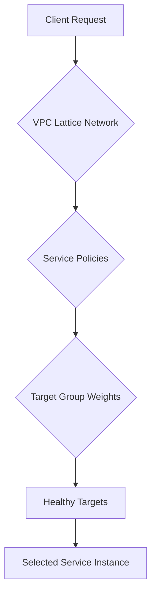

# Section 16: VPC Lattice Introduction

<details open>
<summary><b>Section 16: VPC Lattice Introduction (KK-CS45-script-v2)</b></summary>

## Table of Contents
- [16.1 VPC lattice introduction](#161-vpc-lattice-introduction)
- [16.2 VPC lattice components - Lattice Network, Service, Resource and more](#162-vpc-lattice-components---lattice-network-service-resource-and-more)
- [16.3 VPC lattice network associations](#163-vpc-lattice-network-associations)
- [16.4 VPC lattice traffic flow](#164-vpc-lattice-traffic-flow)
- [16.5 Hands on- VPC lattice service access with custom domain name](#165-hands-on--vpc-lattice-service-access-with-custom-domain-name)
- [16.6 VPC lattice features - Good to know](#166-vpc-lattice-features---good-to-know)
- [16.7 VPC lattice common architectures](#167-vpc-lattice-common-architectures)
- [16.8 VPC lattice section summary](#168-vpc-lattice-section-summary)

## 16.1 VPC lattice introduction

### Overview
Amazon VPC Lattice is an application networking service launched by AWS in 2023 to simplify service-to-service communication in microservices architectures. Unlike traditional network-to-network connectivity services like VPC peering or Transit Gateway, VPC Lattice provides secure, point-to-point application connectivity that works across AWS accounts and VPCs.

### Key Concepts/Deep Dive

#### Application Networking vs Network Connectivity
VPC Lattice addresses the limitations of traditional networking approaches for microservices:

**Network-to-Network Limitations:**
- VPC peering creates full connectivity between VPCs, potentially allowing unwanted traffic
- Transit Gateway simplifies architecture but still enables network-level communication
- VPC endpoints require complex endpoint creation across VPCs without proper service discovery

```diff
+ VPC Lattice: Point-to-point application connectivity
- Traditional: Network-to-network connectivity
+ Enables services to communicate irrespective of location
- Allows any host to communicate with any other host
```

#### Core Features of VPC Lattice
- **Secure Connectivity**: Eliminates need for VPC peering or Transit Gateway
- **Service Discovery**: Automatic DNS name generation for services
- **Dynamic Routing**: Path-based and weighted routing capabilities
- **Zero Trust Architecture**: IAM-based authentication and authorization

#### Microservices Use Case
VPC Lattice excel in environments where:
- Services are deployed in different VPCs
- Services span multiple AWS accounts
- Different teams build and manage services
- Services run on various compute platforms (EC2, ECS, EKS, Lambda)

**Typical Architecture:**
- Microservices across EC2, ECS/EKS, Lambda functions
- Different domain names per service
- Distributed across multiple VPCs and accounts

#### Personas in VPC Lattice Implementation
1. **Administrator**: Creates service network and defines access controls
2. **Developer**: Creates individual services and enables connectivity

> [!IMPORTANT]
> VPC Lattice implements a developer-friendly service where administrators provide the network infrastructure, while developers can independently deploy and connect services.

## 16.2 VPC lattice components - Lattice Network, Service, Resource and more

### Overview
VPC Lattice consists of five core components: Service Network, Service, Resource, Service Discovery, and Auth Policies. These components work together to create a logical boundary for secure, discoverable, and authorized service-to-service communication across distributed environments.

### Key Concepts/Deep Dive

#### Service Network
**Definition**: A logical boundary that encompasses a collection of services, resources, and VPC configurations.

**Key Purpose**: Connects all associated services and resources together within a unified application network.

**Connections**:
- Associates VPCs (VPC associations)
- Associates services (service associations)
- Associates resources (resource associations)

#### Service
**Definition**: An independently deployable unit of software that performs a specific function.

**Supported Hosts**:
- EC2 instances
- Application Load Balancer (ALB)
- ECS/EKS clusters
- Lambda functions
- IP addresses

**Configuration Components**:
- **Listener**: Handles incoming traffic
- **Rules**: Routing logic with priorities and conditions
- **Target Groups**: Destinations for traffic (supports weights)

> [!NOTE]
> Service configuration mirrors Application Load Balancer setup but operates at the VPC Lattice layer.

#### Resource
**Definition**: Entities that can be accessed via VPC Lattice (broader than traditional services).

**Types**:
- Amazon RDS databases
- Auto Scaling Groups
- EC2 instances
- Application endpoints
- Domain names
- IP addresses
- On-premises servers

**Access Configuration**:
- **Resource Gateway**: Ingress endpoint for the resource
- **Resource Configuration Association**: Links resource gateway to service network

#### Auth Policies
**Purpose**: Fine-grained authorization for VPC Lattice services.

**Auth Types**:
- `none`: No authorization policies (default allows communication)
- `aws_iam`: IAM-based authentication (default denies all requests)

**Policy Evaluation**:
- **Identity-based policies**: Requester must have IAM permissions to access service
- **Resource-based policies**: Service network/service must allow specific principals

> [!IMPORTANT]
> IAM resource-based policies require explicit principals to grant access, following AWS IAM's default deny approach.

**Example Policies**:

```json
{
  "Version": "2012-10-17",
  "Statement": [
    {
      "Effect": "Allow",
      "Principal": "*",
      "Action": "vpc-lattice:Get",
      "Resource": "*",
      "Condition": {
        "StringEquals": {
          "aws:PrincipalOrgID": "o-xxxxxxxxxxxxx"
        }
      }
    }
  ]
}
```

**Targeted Access Policy**:
```json
{
  "Version": "2012-10-17",
  "Statement": [
    {
      "Effect": "Allow",
      "Principal": {
        "AWS": "arn:aws:iam::123456789012:role/ServiceRole"
      },
      "Action": "vpc-lattice:Get",
      "Resource": "arn:aws:vpc-lattice:us-east-1:123456789012:service/svc-12345/*"
    }
  ]
}
```

## 16.3 VPC lattice network associations

### Overview
VPC Lattice network associations define how VPCs, services, and resources connect to the service network. These associations determine traffic visibility and accessibility across different AWS environments and accounts.

### Key Concepts/Deep Dive

#### Association Types

##### VPC Association
**Purpose**: Attaches a VPC to the service network, defining which resources can be accessed by VPC resources.

**Configuration**:
- Defines allowed VPCs for traffic access
- Automatically manages security group rules
- Enables traffic flow between VPC resources and network services

##### Service Association
**Purpose**: Associates a VPC Lattice service with the service network.

**Key Benefit**: Enables seamless inter-service communication within the network boundary.

##### Resource Association
**Purpose**: Integrates resources into the VPC Lattice network via resource configuration associations.

**Flow**: Resource Gateway → Resource Configuration → Service Network

#### Traffic Flow Implications
- **VPC-Scoped Access**: Services in attached VPCs can communicate only with authorized network services
- **Resource Access**: Configured resources become discoverable through the service network
- **Cross-Boundary Communication**: Services across different VPCs/accounts can interact securely

> [!NOTE]
> Network associations establish the foundational connectivity framework, enabling VPC Lattice's application networking capabilities.

## 16.4 VPC lattice traffic flow

### Overview
VPC Lattice implements an intelligent traffic routing mechanism that dynamically distributes requests across healthy targets based on configured weights and health checks. The service supports multiple protocols and optional transport layer security.

### Key Concepts/Deep Dive

#### Routing Capabilities
- **Dynamic Routing**: Intelligent target selection based on capacity and availability
- **Weighted Routing**: Traffic distribution between target groups (e.g., 10% to blue, 90% to green)
- **Health-Based Routing**: Automatic fail-over from unhealthy targets

#### Supported Protocols
- HTTP
- HTTPS
- gRPC

#### Network-Level Traffic Flow
**Direct AWS Communication**:
- Authenticated requests bypass intermediaries in the same AWS region
- Reduces network hops and minimizes security overhead
- Optimizes performance for regional communication

> [!NOTE]
> Requests from external networks (non-AWS) require gateway processing, ensuring consistent routing regardless of source location.

#### Authorization Integration
- **Network-Level Policies**: Applied when traffic enters VPC Lattice network
- **Service-Level Policies**: Enforce authorization at individual service boundaries
- **IAM-Based Access Control**: Supports granular permission management

#### Traffic Distribution Logic


## 16.5 Hands on- VPC lattice service access with custom domain name

### Overview
This lab demonstrates how to configure VPC Lattice service access using a custom domain name. The process involves creating a service with target groups, configuring security groups, setting up cross-account access, and enabling service discovery through DNS configuration.

### Key Concepts/Deep Dive

#### Service Configuration Steps
1. **Create Target Group**: Define backend targets with IP addresses and ports
2. **Configure Service**: Set up listeners, rules, and routing logic
3. **Security Group Management**: Configure auto-generated security group rules
4. **Cross-Account Setup**: Enable metadata sharing between accounts

#### DNS Configuration
- **Custom Domain Integration**: Associate custom domain with VPC Lattice service
- **Route 53 Integration**: Configure DNS records for service access
- **SSL/TLS Support**: Enable secure communication with custom domains

#### Best Practices for Custom Domain Setup
- **Certificate Management**: Ensure proper HTTPS certificate configuration
- **DNS Propagation**: Allow time for DNS changes to propagate globally
- **Access Logging**: Configure CloudWatch logging for monitoring

> [!IMPORTANT]
> Custom domain configuration requires careful planning of security groups and DNS resolution for optimal service access.

## 16.6 VPC lattice features - Good to know

### Overview
VPC Lattice introduces several advanced features that distinguish it from traditional networking services, including configuration flexibility, monitoring capabilities, and dynamic scaling options.

### Key Concepts/Deep Dive

#### Decentralized Networking Model
- **Beyond Traditional Boundaries**: Breaks traditional data center/zone limitations
- **Universal Connectivity**: Seamless access across accounts, VPCs, and compute platforms

#### Runtime Configuration Changes
- **Dynamic Network Updates**: Network modifications without downtime
- **IP Range Management**: Runtime addition/removal of VPC CIDR blocks
- **Flexible Scaling**: Adapt to changing infrastructure requirements

#### Monitoring and Observability
- **CloudWatch Integration**: Comprehensive logging and metrics
- **Synthetic Traffic Capabilities**: Health checks and availability testing

#### Advanced Security Features
- **Fine-Grained Access Control**: Service-level policies rather than network-level
- **IAM Identity Propagation**: Maintains user context through service calls
- **Policy-Based Networking**: Least privilege principle implementation

#### Service Discovery Enhancements
- **Dynamic Registration**: Automatic service endpoint updates
- **Health-Based Selection**: Automatic exclusion of unhealthy endpoints

#### Routing Capabilities
- **Weighted Target Groups**: Traffic distribution control (e.g., blue-green deployments)
- **Priority-Based Rules**: Higher precedence routing controls
- **Protocol Support**: HTTP, HTTPS, gRPC compatibility

> [!NOTE]
> These features make VPC Lattice particularly suitable for modern, dynamic application architectures requiring frequent changes and complex routing requirements.

## 16.7 VPC lattice common architectures

### Overview
VPC Lattice serves as a networking layer supporting diverse AWS application architectures, particularly useful for microservices, multi-VPC deployments, and cross-account service interactions.

### Key Concepts/Deep Dive

#### Microservices Architecture
- **Service Mesh Equivalent**: Provides application layer networking without sidecars
- **Cross-Environment Communication**: EC2, ECS, EKS, Lambda service interconnectivity
- **Developer Autonomy**: Independent service management with centralized network control

#### Multi-VPC Communication Models
- **Shared Service Network**: Common lattice network across VPCs
- **Isolated Service Networks**: Separate networks for regulatory compliance
- **Hybrid Connectivity**: VPC Lattice and Transit Gateway integration where needed

#### Cross-Account Service Discovery
- **Federated Service Discovery**: DNS-based service location across accounts
- **Consistent Access Patterns**: Uniform service naming conventions
- **Automated Metadata Exchange**: Simplifies multi-account configurations

> [!NOTE]
> VPC Lattice enables "service discovery as a service" where traditional networking complexities are abstracted away.

## 16.8 VPC lattice section summary

### Overview
VPC Lattice fundamentally transforms application connectivity in cloud environments, shifting from network-centric to application-centric communication models while maintaining robust security and discovery capabilities.

### Key Concepts/Deep Dive

#### Architectural Transformation
**From Traditional Networking:**
- Network-to-network connectivity (any-to-any)
- Manual endpoint management
- Complex security enforcement

**To Application Networking:**
- Service-to-service direct connectivity
- Automated service discovery
- Policy-based access control

#### Unified Application Layer
- **Compute Platform Agnostic**: Supports EC2, containers, serverless automatically
- **Account Boundary Transparent**: Seamless cross-account service communication
- **VPC Boundary Flexible**: Configurable VPC-to-service association models

#### Security Architecture Improvements
- **Zero Trust Implementation**: Explicit authorization for all service interactions
- **IAM Integration**: Leverages existing AWS authentication frameworks
- **Fine-Grained Controls**: Per-service, per-method access policies

#### Operational Advantages
- **Reduced Complexity**: Eliminates manual network configuration
- **Auto-Scaling Integration**: Automatic route updates with compute scaling
- **Observability**: Built-in monitoring and troubleshooting capabilities

> [!IMPORTANT]
> VPC Lattice redefines how applications communicate in AWS, making microservices architectures significantly simpler to deploy and manage.

## Summary

### Key Takeaways
```diff
+ VPC Lattice enables point-to-point service-to-service communication across VPCs and accounts
+ Consists of 5 core components: Network, Service, Resource, Discovery, Auth Policies
+ Provides IAM-based zero trust authorization with fine-grained access controls
+ Supports dynamic weighted routing and health-based target selection
+ Enables runtime configuration changes without service interruption
+ Facilitates microservices architectures with developer-friendly service management
```

### Quick Reference

**Core Components:**
- **Service Network**: Logical boundary for services, resources, VPCs
- **Service**: Deployable unit (EC2, ECS, Lambda, etc.) with listeners/rules/target groups
- **Resource**: Databases, ASGs, endpoints accessible via resource gateway
- **Auth Policies**: `none` or `aws_iam` with resource-based policies required for access

**Association Types:**
- VPC Association: Attaches VPCs for traffic visibility
- Service Association: Enables inter-service communication
- Resource Association: Integrates external resources

**Key Commands:**
```bash
# Create service network
aws vpc-lattice create-service-network --name my-network

# Create service with custom domain
aws vpc-lattice create-service --name my-service --custom-domain-name my-service.example.com

# Configure auth policy
aws vpc-lattice put-auth-policy --resource-identifier svc-12345 --policy-type RESOURCE_POLICY
```

### Expert Insight

#### Real-World Application
VPC Lattice is particularly valuable in enterprise microservices migrations where services are built by different teams and deployed across multiple VPCs. It eliminates the complexity of maintaining VPC peering connections or complex PrivateLink endpoints while providing native service discovery and IAM-based security.

#### Expert Path
- Start by mapping your current microservices communication patterns
- Design service networks around business domains rather than technical boundaries
- Implement least-privilege IAM policies for cross-service communication
- Use weighted routing for canary deployments and testing
- Monitor service communication patterns using CloudWatch Lattice metrics

#### Common Pitfalls
- **Auth Policy Default Behavior**: Using `aws_iam` auth without proper resource-based policies results in all traffic being denied
- **IP-based Target Groups**: Failing to properly configure security groups for IP targets causes connectivity issues
- **DNS Resolution**: Not accounting for VPC Lattice DNS propagation time during deployments
- **Resource Gateway Configuration**: Expecting direct VPC Lattice connectivity for resources without proper gateways and associations

#### Lesser-Known Facts
- VPC Lattice DNS names are region-specific with cross-region connectivity supported
- Auth policies support conditional access based on IAM roles, users, or even AWS organization membership
- Target groups support TCP health checks in addition to HTTP-based ones
- VPC Lattice automatically handles SSL termination for custom domains

</details>