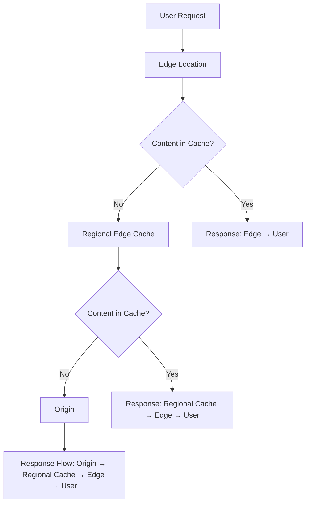

# Section 17: CloudFront Overview

## Table of Contents
- [17.1 CloudFront Overview](#171-cloudfront-overview)
- [17.2 CloudFront Origins](#172-cloudfront-origins)
- [17.3 Hands On- CloudFront Origin Groups](#173-hands-on--cloudfront-origin-groups)
- [17.4 CloudFront Origin Headers](#174-cloudfront-origin-headers)
- [17.5 CloudFront Origin Security](#175-cloudfront-origin-security)
- [17.6 Hands On- Restrict an ALB to CloudFront](#176-hands-on--restrict-an-alb-to-cloudfront)
- [17.7 CloudFront and HTTPS](#177-cloudfront-and-https)
- [17.8 End-to-End Encryption in CloudFront](#178-end-to-end-encryption-in-cloudfront)
- [17.9 CloudFront Geo Restrictions](#179-cloudfront-geo-restrictions)
- [17.10 CloudFront Functions and Lambda@Edge](#1710-cloudfront-functions-and-lambdaedge)
- [17.11 Hands On- CloudFront Functions](#1711-hands-on--cloudfront-functions)
- [17.12 CloudFront Cleanup](#1712-cloudfront-cleanup)
- [17.13 AWS Global Accelerator](#1713-aws-global-accelerator)
- [17.14 Hands On- AWS Global Accelerator](#1714-hands-on--aws-global-accelerator)
- [Summary](#summary)

## 17.1 CloudFront Overview

### Overview
CloudFront is Amazon Web Services' Content Delivery Network (CDN) solution that improves website performance by caching content at edge locations worldwide. With over 225 points of presence globally, including 215+ edge locations and 13 regional edge caches, it accelerates content delivery while providing additional security benefits. The service caches static and dynamic content closer to end users, significantly reducing latency and improving user experience.

### Key Concepts/Deep Dive

#### CloudFront Architecture
- **Points of Presence (PoPs)**: 225+ globally distributed locations
  - 215+ Edge Locations for content caching and delivery
  - 13 Regional Edge Caches for larger cache storage
- **Content Distribution**:
  - Users access content from nearest edge location
  - First request fetches from origin (S3, HTTP endpoint, etc.)
  - Subsequent requests served from edge cache
  - Reduces load on origin servers

#### Cache Hierarchy


**Benefits**:
- 🚀 Faster content delivery through global caching
- 🛡️ DDoS protection via distributed caching
- 🔒 Integration with AWS Shield, WAF, and Route 53
- 🔐 HTTPS support for secure connections
- 🌐 WebSocket protocol compatibility

#### Components
- **Distribution**: Identified by domain name for accessing websites
  - Route 53 integration (CNAME for non-root, Alias for root/non-root)
- **Origins**: Content sources (S3, ALB, custom HTTP endpoints)
- **Cache Behaviors**: Define TTL, invalidation policies, etc.

> [!IMPORTANT]
> CloudFront reduces origin load by caching content at edges and provides security layers against malicious traffic.

## 17.2 CloudFront Origins

### Overview
CloudFront supports various origin types including S3 buckets, VPC resources, and custom HTTP endpoints. Origins can be grouped for high availability and failover scenarios. The choice of origin type depends on content type, accessibility requirements, and security needs.

### Key Concepts/Deep Dive

#### Origin Types

| Origin Type | Use Case | Security | Example |
|-------------|----------|----------|---------|
| **S3 Bucket** | Static content, media files | OAC (Origin Access Control) | Static websites, file distribution |
| **VPC Origin** | Private applications | Private subnets | ALB, NLB, EC2 in private subnets |
| **Custom Origin** | Public HTTP endpoints | Public IP whitelisting | On-premises servers, API Gateway |
| **MediaStore/MediaPackage** | Video delivery | AWS media services | VOD, live streaming |

#### S3 as Origin
- **Origin Access Control (OAC)**: Restricts S3 access to CloudFront only
- **Bucket Policy**: Denies direct S3 access, forces CloudFront routing
- **Architecture**:
  ```
  User → Edge Location → Regional Cache → Origin (S3)
  ```
- **Advanced Setup**: CloudFront as ingress for S3 uploads

#### VPC Origins (Recommended)
- **Private Origins**: ALB, NLB, EC2 in private subnets
- **VPC Origin Configuration**: Enables secure private access
- **Benefits**: Optimal security, direct private connectivity

#### Public Origins (Legacy)
- **EC2 Instances**: Must be public-facing
- **Security Groups**: Whitelist CloudFront IP ranges
  - IP ranges available at: `https://ip-ranges.amazonaws.com/ip-ranges.json`
- **Application Load Balancer**: Public ALB with private backend instances
- **Setup**: ALB security group must allow CloudFront IPs

#### Multiple Origins
- **Path-Based Routing**:
  - `/images/*` → S3 bucket
  - `/api/*` → Custom HTTP origin (ALB)
  - `/*` → Default S3 bucket
- **Cache Behaviors**: Different caching rules per route

#### Origin Groups for High Availability
- **Failover Mechanism**: Primary origin → Secondary origin (if primary fails)
- **Use Cases**:
  - Multi-region redundancy
  - S3 bucket replication between regions
  - EC2 instance failover across AZs
- **Configuration**:
  ```json
  {
    "Origins": [
      {"Primary": true, "ID": "primary-s3"},
      {"Secondary": true, "ID": "secondary-s3"}
    ]
  }
  ```

> [!NOTE]
> Origin Groups provide automatic failover but increase latency slightly due to health checks.

## 17.3 Hands On- CloudFront Origin Groups

### Overview
This hands-on section demonstrates creating origin groups in CloudFront for high availability and failover. Origin groups combine multiple origins (primary and secondary) to ensure continuous content delivery even if the primary origin becomes unavailable.

### Key Concepts/Deep Dive

#### Hands-On Setup
- **Scenario**: Two S3 buckets (primary and secondary) with replication
- **Steps**:
  1. Create primary S3 bucket
  2. Create secondary S3 bucket in different region
  3. Enable cross-region replication between buckets
  4. Create CloudFront distribution with origin group
  5. Configure primary and secondary origins
  6. Test failover by disabling primary origin

#### Origin Group Configuration
```yaml
OriginGroups:
  - Id: primary-failover-group
    Origins:
      - Primary: true
        DomainName: primary-bucket.s3.amazonaws.com
      - Secondary: true
        DomainName: secondary-bucket.s3.amazonaws.com
    FailoverCriteria:
      StatusCodes:
        - 500
        - 502
        - 503
        - 504
```

#### Testing Failover
- **Health Check Status**: CloudFront monitors origin health
- **Automatic Switchover**: Routes to secondary when primary fails
- **Manual Testing**:
  1. Block primary bucket policy
  2. Verify traffic routes to secondary
  3. Restore primary and confirm switchback

> [!TIP]
> Use origin groups for critical applications requiring 99.9%+ availability.

## 17.4 CloudFront Origin Headers

### Overview
CloudFront allows adding custom and dynamic headers to requests sent to origins. These headers enhance security controls and provide request context to origin servers.

### Key Concepts/Deep Dive

#### Custom Headers
- **Static Headers**: Fixed values added to all requests
- **Per-Origin Configuration**: Different headers for each origin
- **Security Use Case**: Verify requests originate from CloudFront
  - Origin responds only if specific header present
- **Identification**: Distinguish requests from different distributions
- **Configuration**:
  ```json
  {
    "CustomHeaders": [
      {
        "HeaderName": "X-CloudFront-Distribution",
        "HeaderValue": "distribution-id"
      }
    ]
  }
  ```

#### Dynamic Origin Headers
- **Viewer Information**:
  - Device Type: `CloudFront-Is-Android`, `CloudFront-Is-Mobile`
  - Location: `CloudFront-Viewer-Country`, `CloudFront-Viewer-City`
  - Protocol: `CloudFront-Forwarded-Proto`, `CloudFront-Viewer-HTTP-Version`
- **Use Cases**:
  - Cache key customization
  - Origin-based personalization
  - Geographic content delivery

#### Cache Key and Behavior
- **Headers in Cache Key**: Include headers for object variations
- **Origin Header Forwarding**: Choose which headers reach origin
- **Performance Impact**: More headers may reduce cache hit ratios

> [!IMPORTANT]
> Custom headers enable origin access restrictions, essential for security.

## 17.5 CloudFront Origin Security

### Overview
Origin security in CloudFront involves restricting access to origins, ensuring only authorized requests from CloudFront can reach them. This prevents direct access bypassing CloudFront.

### Key Concepts/Deep Dive

#### Origin Access Control (OAC) for S3
- **Policy**:
  - S3 bucket policy denies access except from CloudFront
  - Requires proper OAC setup
- **Benefits**:
  - Prevent direct S3 URL access
  - Force all traffic through CloudFront
  - Enhanced security and control

#### Custom Origin Security
- **Header-Based Authentication**:
  - Custom headers verify CloudFront origin
  - Origin configures to expect specific headers
- **IP Whitelisting**:
  - Whitelist CloudFront IP ranges in security groups
  - Applicable for public ALBs, EC2 instances
- **Resource Policy**: IAM policies for authenticated origins

#### VPC Origin Security
- **Private Accessibility**: Origins in private subnets
- **No Public Exposure**: Direct access impossible from internet
- **Recommended Approach**: Most secure configuration

#### Security Best Practices
- ✅ Use OAC for S3 origins
- ✅ Implement custom headers for custom origins
- ✅ Prefer private origins over public ones
- ❌ Avoid exposing origins directly to internet

> [!WARNING]
> Failing to secure origins can lead to data exposure and increased costs.

## 17.6 Hands On- Restrict an ALB to CloudFront

### Overview
This practical demonstration shows how to restrict an Application Load Balancer (ALB) to accept traffic only from CloudFront, enhancing security by blocking direct access to the origin.

### Key Concepts/Deep Dive

#### Setup Process
1. **Create ALB**:
   - Deploy in private subnets
   - Configure target groups
   - Set up security groups

2. **CloudFront Distribution**:
   - Add ALB as origin
   - Configure custom headers for authentication

3. **Security Restriction**:
   - ALB security group allows only CloudFront IPs
   - Origin request policy requires custom header

#### Hands-On Steps
**Step 1: Create VPC and ALB**
```bash
# Create VPC, subnets, ALB components
aws elbv2 create-load-balancer --name cf-demo-alb \
  --subnets subnet-123 subnet-456 \
  --security-groups sg-789 \
  --scheme internal
```

**Step 2: Configure CloudFront**
```yaml
Origins:
  - DomainName: internal-alb-123.region.elb.amazonaws.com
    CustomHeaders:
      - HeaderName: X-Custom-Auth
        HeaderValue: cloudfront-only-traffic
```

**Step 3: ALB Security Group**
```bash
# Add CloudFront IPs to ALB security group
aws ec2 authorize-security-group-ingress \
  --group-id sg-alb-id \
  --ip-protocol tcp \
  --port 80 \
  --cidr 13.32.0.0/15  # Example CloudFront IP range
```

**Step 4: Test Restrictions**
- Access works through CloudFront
- Direct ALB URL returns 403 Forbidden

> [!NOTE]
> This setup ensures ALB only accepts traffic from authorized CloudFront distributions.

## 17.7 CloudFront and HTTPS

### Overview
CloudFront provides comprehensive HTTPS support for secure connections between clients and origins. Configuration involves viewer protocols, origin protocols, custom domains, and SSL certificates.

### Key Concepts/Deep Dive

#### Viewer Protocol Policy
- **HTTP and HTTPS**: Accepts both protocols
- **Redirect HTTP to HTTPS**: Automatically redirects HTTP to HTTPS
- **HTTPS Only**: Forces all connections to use HTTPS

#### Origin Protocol Policy
- **HTTP Only**: Edge connects via HTTP
- **HTTPS Only**: Edge connects via HTTPS
- **Match Viewer**: Mirrors viewer's protocol choice

#### SSL/TLS Certificate Management

| Certificate Type | Scope | Management | Cost |
|------------------|-------|------------|------|
| Default CloudFront | *.cloudfront.net | Automatic | Free |
| Custom ACM | Your domains | AWS ACM | Free |
| Custom IAM | Your domains | Manual upload | Free |
| Dedicated IP | Your domains | Higher cost | Paid |

#### Alternate Domain Names
- **Custom Domains**: Use your own domain instead of CloudFront URL
- **Configuration**: Add domain names in distribution settings
- **Certificate Requirements**: Must cover all alternate domain names
- **Wildcard Support**: Single certificate for multiple subdomains

#### Certificate Sources
- **AWS Certificate Manager (ACM)**: Recommended for CloudFront
- **Third-Party Certificates**: Upload to IAM or ACM
- **Region Requirement**: Certificates must be in us-east-1

#### Security Policies
- **Minimum TLS Version**: Set minimum acceptable TLS version
- **Supported Ciphers**: Customize allowed cipher suites
- **SNI vs Dedicated IP**: SNI recommended for cost efficiency

> [!IMPORTANT]
> Configure "Redirect HTTP to HTTPS" for security compliance.

## 17.8 End-to-End Encryption in CloudFront

### Overview
End-to-end encryption ensures data remains encrypted throughout its journey from client to origin. CloudFront supports field-level encryption and HTTPS enforcement.

### Key Concepts/Deep Dive

#### Encryption Architecture
```
Client (HTTPS) → CloudFront (Decrypt) → Origin (HTTPS)
```
- **Client to CloudFront**: Standard HTTPS
- **CloudFront to Origin**: Second layer of HTTPS encryption

#### Field-Level Encryption (Deprecated)
- **Sensitive Data Protection**: Encrypt specific fields before origin
- **CloudFront Functions**: Used for field-level encryption
- **RSA Keys**: Public keys for encryption, private for decryption

#### Origin Encryption Requirements
- **SSL/TLS Certificate**: Valid certificate on origin
- **HTTPS Enforcement**: Origin Protocol Policy set to HTTPS Only
- **Certificate Validity**: Recognized by CloudFront

#### Configuration Steps
1. **Upload SSL Certificate**: To ACM in us-east-1
2. **Distribution SSL Settings**: Configure security policy
3. **Origin Protocol**: Set to HTTPS Only
4. **Custom Headers**: Add authentication headers if needed

#### Security Benefits
- ✅ Protects data in transit end-to-end
- ✅ Prevents intermediate decryption attacks
- ✅ Meets compliance requirements (PCI, HIPAA, etc.)

> [!NOTE]
> Field-level encryption adds complexity but protects sensitive fields like credit cards.

## 17.9 CloudFront Geo Restrictions

### Overview
Geo restrictions allow or block content delivery based on user geographic location. CloudFront uses MaxMind GeoIP databases to determine user locations.

### Key Concepts/Deep Dive

#### Restriction Types
- **Whitelist (Allow)**: Only specified countries can access content
- **Blacklist (Deny)**: Specified countries blocked from content
- **Use Cases**: Compliance, licensing restrictions, cost control

#### Configuration Methods
- **Country Codes**: Use two-letter ISO country codes
- **Distribution-Level**: Apply to entire distribution
- **Behavior-Level**: Different restrictions per cache behavior

#### Setup in Console
1. Navigate to CloudFront distribution
2. Select "Restrictions" tab
3. Choose "Whitelist" or "Blacklist"
4. Select country codes
5. Save and wait for deployment (15-20 minutes)

#### HTTP Status Codes
- **Whitelist Violation**: 403 Forbidden
- **Custom Error Pages**: Possible but limited
- **WAF Integration**: More granular controls available

#### Considerations
- **Accuracy**: GeoIP database not perfect
- **VPN Bypass**: Users can circumvent with VPNs
- **Legal Compliance**: Ensure compliance with laws

> [!TIP]
> Use geo restrictions for content licensing and regional compliance.

## 17.10 CloudFront Functions and Lambda@Edge

### Overview
CloudFront provides serverless compute capabilities at edge locations for content processing and request/response manipulation. CloudFront Functions offer lightweight processing, while Lambda@Edge provides full Lambda functionality.

### Key Concepts/Deep Dive

#### CloudFront Functions
- **Lightweight**: Millisecond execution
- **Languages**: JavaScript only
- **Use Cases**:
  - URL rewriting
  - Header manipulation
  - Request validation
  - CORS handling
- **Phases**: Viewer Request/Response, Origin Request/Response

#### Lambda@Edge
- **Full Lambda**: Up to 5 minutes execution
- **Languages**: Node.js, Python, Go
- **Regional Replication**: Deploy to CloudFront regions
- **Advanced Features**:
  - External service integration
  - Complex logic
  - Custom authentication
- **Pricing**: Per request + duration

#### Function Types Comparison

| Feature | CloudFront Functions | Lambda@Edge |
|---------|----------------------|-------------|
| Runtime | JavaScript only | Node.js, Python, Go |
| Max Execution Time | < 1 second | Up to 5 minutes |
| Code Size | 10 KB | 50 MB |
| Triggers | All events | All events |
| Pricing | Lower cost | Higher cost |

#### Deployment Process
1. **Create Function**: In CloudFront console or Lambda
2. **Associate with Distribution**: Attach to specific behaviors
3. **Test in Staging**: Use CloudFront functions testing
4. **Deploy**: Promote to production

#### Use Cases
- **Authentication**: Custom auth headers, JWT validation
- **Personalization**: Geographic content, A/B testing
- **Security**: Bot detection, rate limiting
- **Performance**: Dynamic compression, format conversion

> [!IMPORTANT]
> Use CloudFront Functions for simple tasks, Lambda@Edge for complex processing.

## 17.11 Hands On- CloudFront Functions

### Overview
This hands-on demonstrates creating and deploying CloudFront Functions for header manipulation and request processing.

### Key Concepts/Deep Dive

#### Function Creation
**Step 1: Create Function**
```javascript
function handler(event) {
    var request = event.request;

    // Add custom header
    request.headers['x-origin-custom'] = {
        value: 'cloudfront-function'
    };

    return request;
}
```

**Step 2: Associate with Distribution**
```yaml
# CloudFront Distribution Config
Functions:
  - FunctionARN: arn:aws:cloudfront::123456789:function/my-function
    EventType: viewer-request
    IncludeBody: false
```

**Step 3: Test Function**
- Use CloudFront test interface
- Verify headers in request/response
- Check function logs

#### Advanced Examples
**Header Manipulation**
```javascript
// Remove sensitive headers
delete request.headers['authorization'];

// Add geolocation-based headers
request.headers['x-user-country'] = event.viewer.country;
```

**URL Rewriting**
```javascript
// Rewrite URLs for A/B testing
if (request.uri.startsWith('/api/')) {
    request.uri = '/v2' + request.uri;
}
```

> [!TIP]
> Test functions thoroughly before production deployment.

## 17.12 CloudFront Cleanup

### Overview
This section covers proper cleanup procedures for CloudFront distributions to avoid ongoing costs and resource waste.

### Key Concepts/Deep Dive

#### Cleanup Steps
1. **Disable Distribution**: Set state to "Disabled"
2. **Wait for Propagation**: Allow 15-30 minutes for disable
3. **Delete Distribution**: Remove the distribution
4. **Remove Origins**: Delete S3 buckets, ALBs if no longer needed
5. **Delete SSL Certificates**: ACM certificates not automatically removed
6. **Invalidate CloudFront Functions**: Delete unused functions

#### Important Considerations
- **Costs Continue**: Even disabled distributions incur some costs
- **Origin Access Control**: Delete OAC before removing S3 buckets
- **Custom Domains**: Remove DNS records pointing to CloudFront
- **Lambda@Edge Replicas**: Automatically cleaned up with function deletion

#### CLI Commands for Cleanup
```bash
# Disable distribution
aws cloudfront update-distribution --id DISTRIBUTION-ID --distribution-config file://disable-config.json

# Delete distribution
aws cloudfront delete-distribution --id DISTRIBUTION-ID --if-match ETAG

# Delete CloudFront function
aws cloudfront delete-function --name function-name --if-match ETAG
```

> [!WARNING]
> Always disable distributions before deletion to prevent 403 errors.

## 17.13 AWS Global Accelerator

### Overview
AWS Global Accelerator is a networking service that improves application performance and availability using AWS's global network infrastructure. Unlike CloudFront (focused on content delivery), Global Accelerator optimizes routing for TCP/UDP applications.

### Key Concepts/Deep Dive

#### Core Components
- **Accelerators**: Global entry points for applications
- **Listeners**: Accept incoming connections (TCP/UDP)
- **Endpoint Groups**: Regional collections of endpoints
- **Endpoints**: Application endpoints (ALBs, NLBs, EC2, EIPs)

#### How It Works
```
User → Anycast IPs → Nearest Edge Location → Optimized Routing → Endpoint
```
- **Anycast IPs**: Two IPv4 addresses route to nearest point
- **Intelligent Routing**: Follows AWS backbone for optimal path
- **Failover**: Automatic traffic shifting if endpoints fail

#### Use Cases
- **Gaming**: Reduced latency for multiplayer games
- **IoT**: Global device communication optimization
- **Voice/Video**: Real-time communication applications
- **API Acceleration**: Microservices with global users

#### Comparison with CloudFront

| Aspect | CloudFront | Global Accelerator |
|--------|------------|-------------------|
| Content | Cached content delivery | All TCP/UDP traffic |
| Optimization | Content + API responses | Network routing only |
| Cache | Yes | No |
| Protocol | HTTP/HTTPS/WebSocket | Any TCP/UDP |
| Cost | Based on requests/data | Fixed per accelerator |

#### Configuration
- **Standard Accelerator**: For public IPs (free)
- **Custom Routing**: Deterministic routing to specific instances
- **Client Affinity**: Sticky sessions for stateful applications

> [!NOTE]
> Global Accelerator works at transport layer, CloudFront at application layer.

## 17.14 Hands On- AWS Global Accelerator

### Overview
This hands-on section demonstrates setting up AWS Global Accelerator to accelerate a global application using ALBs in multiple regions.

### Key Concepts/Deep Dive

#### Setup Process
**Step 1: Create Application**
- Deploy web application in two regions (us-east-1, eu-west-1)
- Use Application Load Balancers in each region

**Step 2: Create Accelerator**
```bash
# Create standard accelerator
aws globalaccelerator create-accelerator \
    --name my-app-accelerator \
    --enabled
```

**Step 3: Configure Listeners and Groups**
```bash
# Add listener
aws globalaccelerator create-listener \
    --accelerator-arn arn:aws:globalaccelerator::123456789:accelerator/123 \
    --protocol TCP \
    --port-ranges FromPort=80,ToPort=80 FromPort=443,ToPort=443

# Create endpoint groups
aws globalaccelerator create-endpoint-group \
    --listener-arn listener-arn \
    --endpoint-group-region us-east-1 \
    --endpoint-configurations EndpointId=alb-arn,Weight=100
```

**Step 4: Test Global Routing**
- Access application using Global Accelerator IP
- Verify traffic routes to nearest region
- Test failover by disabling endpoints

#### Monitoring and Management
- **CloudWatch Metrics**: Traffic flow, endpoint health
- **Traffic Dial**: Adjust traffic distribution (0-100% per endpoint group)
- **Health Checks**: Automatic failover based on health

> [!TIP]
> Global Accelerator improves TCP connection establishment latency significantly.

## Summary

### Key Takeaways
```diff
+ CloudFront provides global content delivery with edge caching for improved performance
+ Origins can be S3, VPC private resources, or custom HTTP endpoints
+ Origin Groups enable high availability through automatic failover
+ Custom headers and OAC provide origin security restrictions
+ HTTPS configuration supports end-to-end encryption policies
+ Geo restrictions control content access by geographic location
+ CloudFront Functions add lightweight processing at edges
+ Lambda@Edge offers full serverless compute capabilities
+ Global Accelerator optimizes TCP/UDP routing without caching
- Don't expose origins directly without security restrictions
! Always test functions and configurations before production deployment
```

### Quick Reference
**CloudFront IP Ranges**: Download from `https://ip-ranges.amazonaws.com/ip-ranges.json`

**Distribution Creation**:
```bash
aws cloudfront create-distribution --distribution-config file://config.json
```

**Function Deployment**:
```bash
aws cloudfront create-function --name my-function --function-config file://config.json --function-code file://function.js
```

### Expert Insight

#### Real-world Application
- **E-commerce**: CloudFront caches product images, Global Accelerator speeds checkout APIs
- **Media Streaming**: Use MediaStore with CloudFront for low-latency video delivery
- **Global SaaS**: Lambda@Edge for regional compliance and localization

#### Expert Path
- Master cache behaviors and invalidation strategies
- Learn Lambda@Edge for advanced personalization logic
- Study Global Accelerator health checks and traffic dials
- Implement comprehensive monitoring with CloudWatch metrics

#### Common Pitfalls
- Forgetting to configure origin security (direct S3 access bypass)
- Not testing geo restrictions thoroughly (VPN circumvention)
- Using Lambda@Edge for simple tasks (higher cost than Functions)
- Ignoring propagation times during configuration changes

#### Lesser-Known Facts
- CloudFront caches 404 responses by default (use error pages)
- Global Accelerator supports both IPv4 and IPv6 traffic
- CloudFront Functions support up to 100 custom origins per distribution
- Regional Edge Caches store content for up to 24 hours by default