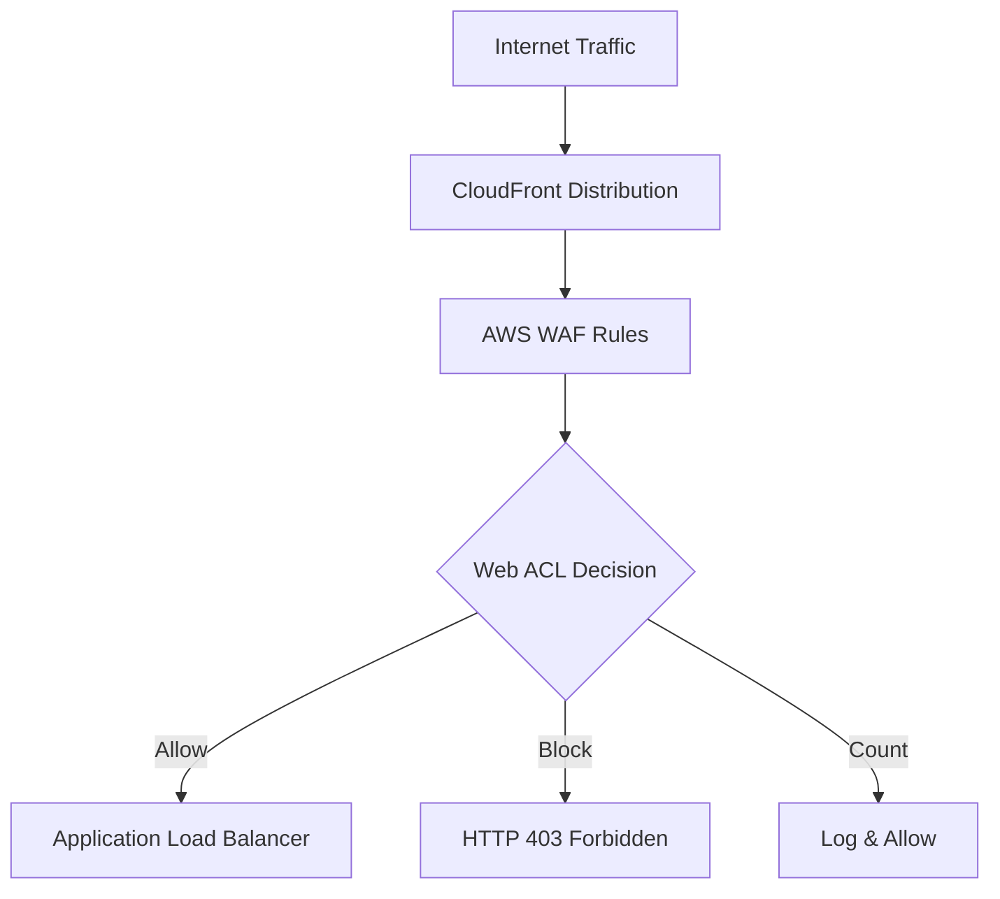
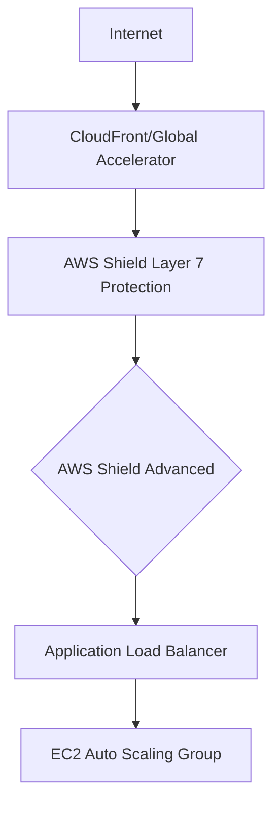
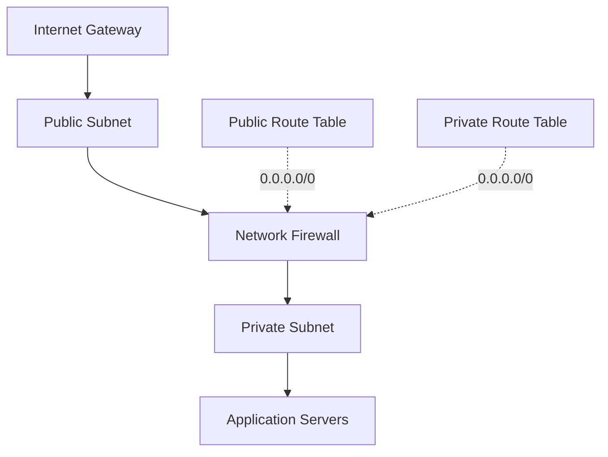
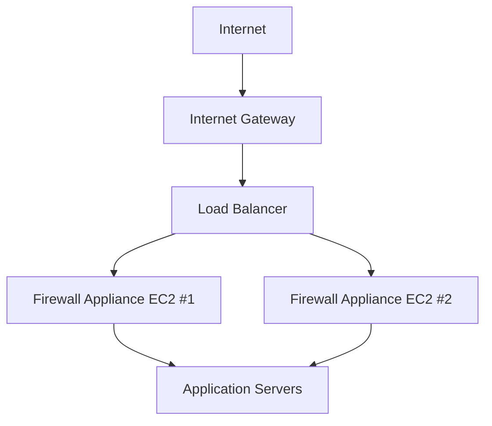
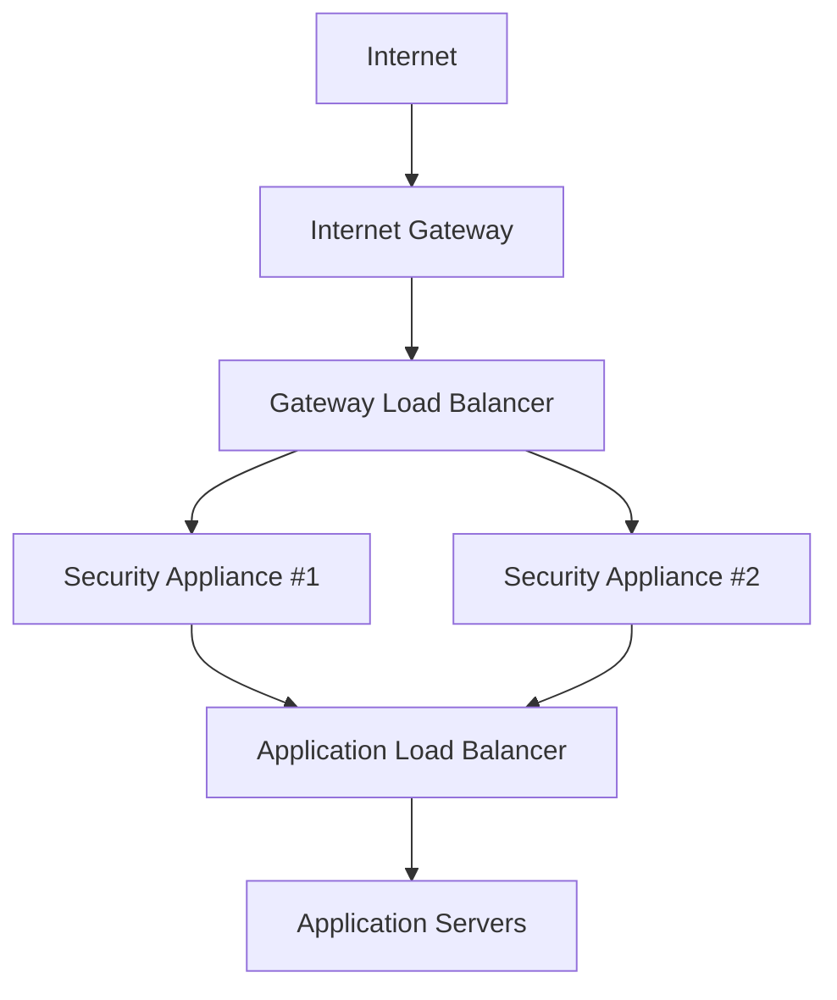

# Section 20: Introduction to AWS Network Security Services

<details open>
<summary><b>Section 20: Introduction to AWS Network Security Services (KK-CS45-script-v2)</b></summary>

## Table of Contents
- [20.1 Introduction to AWS Network Security Services](#201-introduction-to-aws-network-security-services)
- [20.2 Recap - Security Groups and Network ACL](#202-recap---security-groups-and-network-acl)
- [20.3 AWS Web Application Firewall (WAF)](#203-aws-web-application-firewall-waf)
- [20.4 Hands On- Cross-Site Scripting (XSS) attack simulation and prevention with WAF](#204-hands-on--cross-site-scripting-xss-attack-simulation-and-prevention-with-waf)
- [20.5 AWS Shield and Shield Advanced (DDoS protection)](#205-aws-shield-and-shield-advanced-ddos-protection)
- [20.6 Introduction to AWS Network Firewall](#206-introduction-to-aws-network-firewall)
- [20.7 AWS Network Firewall - VPC and Route tables](#207-aws-network-firewall---vpc-and-route-tables)
- [20.8 AWS Network Firewall Components & Rule groups](#208-aws-network-firewall-components--rule-groups)
- [20.9 Hands On- AWS Network Firewall](#209-hands-on--aws-network-firewall)
- [20.10 The legacy way of using the Network appliances](#2010-the-legacy-way-of-using-the-network-appliances)
- [20.11 Gateway Load Balancer and Traffic flow](#2011-gateway-load-balancer-and-traffic-flow)
- [20.12 Hands On- Gateway Load Balancer](#2012-hands-on--gateway-load-balancer)
- [20.13 Summary- Gateway Load Balancer](#2013-summary--gateway-load-balancer)
- [20.14 Gateway Load Balancer - Exam Essentails](#2014-gateway-load-balancer---exam-essentails)
- [20.15 AWS Certificate Manager (ACM)](#2015-aws-certificate-manager-acm)
- [20.16 AWS Firewall Manager](#2016-aws-firewall-manager)
- [Summary](#summary)

## 20.1 Introduction to AWS Network Security Services

### Overview
This module introduces AWS Network Security Services, covering essential security components for protecting cloud infrastructure. The focus is on understanding how different AWS security services work together to provide comprehensive network protection at various levels of the OSI model. These services help protect against web application threats, DDoS attacks, and unauthorized network traffic patterns.

### Key Concepts/Deep Dive

**Network Security in AWS:**
- **Layer 3 (Network Layer)**: Controls IP packet routing and basic network connectivity filtering
- **Layer 4 (Transport Layer)**: Manages TCP/UDP port-level traffic control and stateful packet inspection
- **Layer 7 (Application Layer)**: Protects against complex application-specific threats and web attacks

**Core AWS Network Security Services:**
1. **Security Groups**: Instance-level firewalls providing VPC-internal traffic control
2. **Network Access Control Lists (NACLs)**: Subnet-level firewalls for traffic entering/leaving subnets
3. **AWS Web Application Firewall (WAF)**: Protects web applications from Layer 7 threats like XSS, SQL injection
4. **AWS Shield**: DDoS protection service with Standard (automatic) and Advanced (managed) tiers
5. **AWS Network Firewall**: VPC-wide network security with stateful inspection capabilities
6. **AWS Firewall Manager**: Centralized management for security policies across multiple accounts

**Security Service Hierarchical Protection:**

```
Internet Traffic
     ↓
[Layer 7] AWS WAF (HTTP/HTTPS)
     ↓
[Layer 4] AWS Shield (DDoS Protection)
     ↓
[Layer 3/4] Network Firewalls
     ↓
[Layer 3/4] NACLs (Subnet Level)
     ↓
Application/EC2 Instances
```

**Deployment Patterns:**
- **Web Application Protection**: WAF sits between CloudFront/API Gateway and web servers
- **Infrastructure Protection**: Network Firewall integrates with VPC route tables for transparent traffic inspection
- **DDoS Mitigation**: Shield provides automatic protection against volumetric attacks

## 20.2 Recap - Security Groups and Network ACL

### Overview
This module reviews fundamental AWS network security controls, focusing on Security Groups and Network ACLs as the base layer of network defense. These services provide essential protection at the instance and subnet levels respectively, forming the foundation for building secure AWS architectures.

### Key Concepts/Deep Dive

**Security Groups:**
- **Function**: Virtual firewalls attached to EC2 instances, ENIs, and other AWS resources
- **Default Behavior**: Deny all inbound traffic by default, allow all outbound traffic by default
- **Stateful Operation**: Automatically allows return traffic for established connections
- **Rules Structure**:
  - Protocol (TCP, UDP, ICMP, or ALL)
  - Port range (single port or range, e.g., 80-443)
  - Source (IP address/CIDR, Security Group ID, or prefix list)

**Security Group Rule Examples:**
```json
{
  "Inbound Rules": [
    {
      "Type": "SSH",
      "Protocol": "TCP",
      "Port": "22",
      "Source": "203.0.113.0/24"
    },
    {
      "Type": "HTTPS",
      "Protocol": "TCP",
      "Port": "443",
      "Source": "0.0.0.0/0"
    }
  ]
}
```

**Network Access Control Lists (NACLs):**
- **Function**: Subnet-level security controls that act as firewalls for subnets
- **Stateless Operation**: Must explicitly allow both inbound and outbound traffic
- **Evaluation Order**: Rules processed in ascending order by rule number
- **Default Behavior**: Allow all inbound/outbound traffic by default

**NACL Rule Structure:**
| Rule # | Type | Protocol | Port Range | Source | Allow/Deny |
|--------|------|----------|------------|---------|------------|
| 100 | HTTP | TCP | 80 | 0.0.0.0/0 | ALLOW |
| 110 | HTTPS | TCP | 443 | 0.0.0.0/0 | ALLOW |
| 120 | SSH | TCP | 22 | 10.0.0.0/16 | ALLOW |
| * | All Traffic | All | All | 0.0.0.0/0 | DENY |

**Key Differences:**

Security Groups vs NACLs
| Feature | Security Groups | Network ACLs |
|---------|-----------------|--------------|
| Stateful | Yes | No |
| Resource Level | Instance/ENI | Subnet |
| Rule Default | Deny inbound | Allow all |
| Performance Impact | Minimal | Processing order dependent |

**Best Practices:**
- Use Security Groups for most use cases (simpler, stateful)
- Apply NACLs for subnet-level traffic control or compliance requirements
- Keep Security Groups focused on application requirements
- Use descriptive rule names and regular cleanup of unused rules

## 20.3 AWS Web Application Firewall (WAF)

### Overview
AWS Web Application Firewall (WAF) provides protection against common web application threats at Layer 7. This essential security service filters HTTP/HTTPS requests to prevent attacks like cross-site scripting (XSS), SQL injection, and other web-based vulnerabilities. WAF integrates seamlessly with CloudFront, API Gateway, Application Load Balancers, and other AWS services.

### Key Concepts/Deep Dive

**WAF Core Components:**
- **Rules**: Individual conditions that identify malicious traffic patterns
- **Rule Groups**: Collections of rules organized by threat type or vendor
- **Web ACLs**: Main containers that combine rules and define actions (Allow, Block, Count)
- **Resources**: Protected AWS services (CloudFront distributions, ALBs, etc.)

**Rule Categories:**
1. **AWS Managed Rules**: Pre-built rules for common threats
2. **Custom Rules**: User-defined conditions based on specific requirements
3. **Rate-based Rules**: Protect against excessive requests from single sources
4. **IP Reputation Lists**: Block traffic from known malicious sources

**Common WAF Rule Examples:**

**SQL Injection Protection:**
- Detects patterns like `'; DROP TABLE users; --`
- Blocks requests containing SQL injection payloads

**Cross-Site Scripting (XSS):**
- Identifies JavaScript injection attempts
- Filters out `<script>` tags and malicious JavaScript

**Rate Limiting:**
- Limits requests per IP address per 5-minute window
- Helps prevent brute force and credential stuffing attacks

**WAF Integration Points:**


**Web ACL Configuration:**
- **Default Action**: What to do when no rules match (typically Allow)
- **Rules Priority**: Order in which rules are evaluated (lowest number first)
- **Rule Actions**: Allow, Block, Count, or CAPTCHA challenges

**Deployment Architectures:**
1. **CloudFront Integration**: Protects global applications with edge filtering
2. **ALB Protection**: Shields applications behind load balancers
3. **API Gateway Security**: Protects REST API endpoints
4. **Regional Deployment**: Protects resources in specific AWS regions

**Monitoring and Logging:**
- Integration with AWS CloudWatch for metrics and alerts
- Detailed logging via Amazon Kinesis Data Firehose
- Real-time insights into blocked requests and threat patterns

## 20.4 Hands On- Cross-Site Scripting (XSS) attack simulation and prevention with WAF

### Overview
This hands-on module demonstrates the practical implementation of AWS WAF for preventing cross-site scripting (XSS) attacks. Through simulated attacks and real-time protection, learners understand how WAF rules effectively identify and block malicious JavaScript injection attempts in web applications.

### Key Concepts/Deep Dive

**XSS Attack Simulation:**
- **Attack Vector**: Malicious JavaScript injection through user input fields
- **Target**: Website vulnerability where user input isn't properly sanitized
- **Payload Examples**:
  ```javascript
  <script>alert('XSS Attack!')</script>
  
  <iframe src="javascript:alert('XSS')"></iframe>
  ```

**WAF XSS Protection Setup:**

Create a Web ACL to protect a CloudFront distribution:

1. **Web ACL Creation:**
   - Name: `XSS-Protection-WACL`
   - Region: US East (N. Virginia)
   - Resource Type: CloudFront distributions

2. **XSS Rule Configuration:**
   - Rule Name: `Cross-Site-Scripting-Rule`
   - Statement Type: XSS Attack Rule
   - Field to inspect: All query parameters, headers, and body
   - Text Transformation: None (URL decode, lowercase, etc.)
   - Action: Block with custom response

**Terraform Configuration:**
```hcl
resource "aws_wafv2_web_acl" "xss_protection" {
  name        = "xss-protection-acl"
  description = "ACL to block XSS attacks"
  scope       = "CLOUDFRONT"

  default_action {
    allow {}
  }

  rule {
    name     = "xss-rule"
    priority = 1

    statement {
      xss_match_statement {
        field_to_match {
          all_query_arguments {}
        }
        text_transformation {
          priority = 1
          type     = "NONE"
        }
      }
    }

    action {
      block {
        custom_response {
          response_code = 403
          response_header {
            name  = "X-WAF-Block-Reason"
            value = "XSS_Attack_Detected"
          }
        }
      }
    }

    visibility_config {
      cloudwatch_metrics_enabled = true
      metric_name               = "XSSRule"
      sampled_requests_enabled  = true
    }
  }
}
```

**Testing XSS Protection:**

1. **Valid Request Testing:**
   ```bash
   curl -X GET "https://your-domain.com/search?q=legitimate+query"
   # Should return: 200 OK
   ```

2. **XSS Attack Simulation:**
   ```bash
   curl -X GET "https://your-domain.com/search?q=<script>alert('xss')</script>"
   # Should return: 403 Forbidden
   # Headers: X-WAF-Block-Reason: XSS_Attack_Detected
   ```

**WAF Logging Analysis:**
- Enable CloudWatch Logs integration
- Monitor blocked requests with `terminatingRule` showing XSS rule
- Analyze `httpRequest` field for attack patterns
- Set up CloudWatch alarms for excessive blocks

**Advanced XSS Rule Configurations:**
1. **Field-Specific Inspection:**
   - Query parameters only
   - Request headers
   - URI path
   - Request body (for POST requests)

2. **Text Transformations:**
   - URL_DECODE: Decode URL-encoded characters
   - LOWERCASE: Convert to lowercase
   - CMD_LINE: Remove command line escape sequences
   - COMPRESS_WHITE_SPACE: Remove extra whitespace

**Production Deployment Considerations:**
- Start in "Count" mode to observe impact
- Gradually move blocking rules after testing
- Implement rate-based rules for additional protection
- Regular rule updates from AWS managed rule sets

## 20.5 AWS Shield and Shield Advanced (DDoS protection)

### Overview
AWS Shield provides comprehensive DDoS protection for AWS applications with two service tiers. Shield Standard offers automatic protection for all AWS customers, while Shield Advanced provides enhanced capabilities for mission-critical applications requiring 24/7 DDoS response team support.

### Key Concepts/Deep Dive

**Shield Standard (Included Free):**
- **Protection Scope**: Layer 3/4 DDoS attacks (SYN Flood, UDP Flood, etc.)
- **Target Resources**: All AWS resources (EC2, ELB, CloudFront, Route 53)
- **Automatic Activation**: Enabled by default for all AWS accounts
- **Integration**: Works with CloudFront and Route 53 automatically

**Shield Advanced Features:**
- **24/7 DDoS Response Team (DRT)**: Direct access to AWS DDoS experts
- **Advanced Detection**: Layer 7 protection (HTTP Flood, Slowloris)
- **Cost Protection**: Guards against DDoS-related cost spikes
- **Visibility**: Detailed DDoS attack insights and reporting
- **Automatic Application Layer DDoS Mitigation**: Real-time traffic analysis

**Shield Advanced Pricing Model:**
- **Base Fee**: $3,000/month per organization
- **Data Transfer Fee**: $0.050/GB for protected resources during attack
- **Web Application Firewall Integration**: No additional WAF costs

**DDoS Attack Types Protected:**

**Layer 3/4 Attacks:**
- SYN Flood: Exhaust server TCP connections
- UDP Flood: Overwhelm with UDP packets
- ICMP Flood (Ping Flood): Excessive ICMP echo requests
- NTP/SSDP/DNS Amplification: Reflected attack amplification

**Layer 7 Attacks (Shield Advanced only):**
- HTTP Flood: Massive legitimate-looking HTTP requests
- Slowloris: Keep-alive connections with minimal data
- DNS Query Flood: Target DNS resolvers

**Shield Integration Architecture:**



**Route 53 Protection:**
- **Domain Hijacking Protection**: Prevents DNS record modifications during attacks
- **Health Check Integration**: Works with Route 53 health checks for failover
- **Anycast DNS**: Distributed DNS resolution for resilience

**Shield Advanced Management:**
1. **Protected Resources**: Explicitly add resources to Shield Advanced protection
2. **Attack Visibility**: Detailed attack information via Shield console and APIs
3. **DRT Engagement**: Web-based case management for urgent DDoS incidents
4. **Attack Patterns**: Historical attack data and trends

**Cost Protection Mechanisms:**
- **Eligible Costs Protected**: Covers increased usage during DDoS (EC2, ELB, data transfer)
- **Service Credits**: AWS credits issued for DDoS-related costs
- **Exclusions**: CloudFront data transfer and third-party charges not covered

**Best Practices:**
- **Layered Defense**: Combine Shield with WAF for comprehensive protection
- **Auto Scaling**: Configure scaling policies to handle traffic surges
- **Health Checks**: Implement Route 53 health checks for failover
- **Monitoring**: Set CloudWatch alarms for Shield metrics

## 20.6 Introduction to AWS Network Firewall

### Overview
AWS Network Firewall is a managed service that provides VPC-wide network security with stateful inspection capabilities. Unlike traditional firewalls that require custom appliance deployment, Network Firewall integrates directly with VPC route tables for transparent, scalable traffic filtering. This service enables fine-grained control over network traffic patterns and provides protection against sophisticated attacks.

### Key Concepts/Deep Dive

**Network Firewall Core Concepts:**
- **Managed Service**: Fully managed by AWS, eliminating appliance maintenance
- **VPC Integration**: Transparent insertion via route tables, no application changes required
- **Stateful Inspection**: Tracks connection state and application protocols
- **High Availability**: Automatic failover and cross-AZ redundancy

**Deployment Architecture:**



**Key Features:**
1. **Rule Groups**: Collections of firewall rules organized by function
2. **Stateless Rules**: Simple packet filtering (like NACLs)
3. **Stateful Rules**: Advanced filtering with connection tracking
4. **Suricata Compatibility**: Industry-standard threat detection language

**Traffic Flow Inspection:**
- **Full Packet Inspection**: Examines packet contents, not just headers
- **Protocol Awareness**: Understands HTTP, TLS, FTP, and other protocols
- **Application Layer Filtering**: Can block specific HTTP methods or user agents
- **Intrusion Prevention**: Blocks known malicious patterns

**Integration With VPC:**
- **Endpoint Creation**: Firewall endpoints created in each AZ for high availability
- **Route Table Integration**: Firewall endpoints become next hop for traffic
- **Transparent Operation**: Applications unaware of firewall presence
- **Logging Integration**: Detailed traffic logs to S3, CloudWatch, or Kinesis

## 20.7 AWS Network Firewall - VPC and Route tables

### Overview
This module focuses on integrating AWS Network Firewall with VPC architecture and route table configurations. The key is understanding how to modify routing to force traffic through firewall endpoints for comprehensive inspection and control.

### Key Concepts/Deep Dive

**Network Firewall Deployment Steps:**

1. **Firewall Endpoint Creation:**
   ```bash
   aws network-firewall create-firewall \
     --firewall-name my-firewall \
     --vpc-id vpc-12345 \
     --subnet-mappings SubnetId=subnet-abc123,SubnetId=subnet-def456 \
     --firewall-policy-arn arn:aws:network-firewall:us-east-1:123456789012:firewall-policy/my-policy
   ```

2. **Route Table Modifications:**
   - Identify route tables for subnets requiring firewall protection
   - Create routes with firewall endpoint as next hop
   - Ensure return traffic flows back through firewall

**Route Table Configuration Example:**

Before Firewall:
```
Destination     Target
0.0.0.0/0       igw-12345 (Internet Gateway)
10.0.0.0/8      local
```

After Firewall:
```
Destination     Target
0.0.0.0/0       vpc-endpoint-id (Network Firewall)
10.0.0.0/8      local
```

**VPC Subnet Planning:**
- **Firewall Subnets**: Dedicated subnets in each AZ for firewall endpoints
- **Protected Subnets**: Application subnets with routes through firewall
- **Security Groups**: Minimal rules needed (firewall handles traffic control)

**High Availability Considerations:**
- **Cross-AZ Deployment**: Firewall endpoints in each Availability Zone
- **Route Table Consistency**: Same routing rules across all protected subnets
- **Monitoring**: Health checks on firewall endpoints

**Traffic Flow Patterns:**

**Inbound Traffic (Internet to Application):**
1. Internet Gateway receives traffic
2. Route table sends to Network Firewall endpoint
3. Firewall inspects traffic according to policies
4. Approved traffic forwarded to application subnets

**Outbound Traffic (Application to Internet):**
1. Application generates outbound traffic
2. Route table directs through Network Firewall
3. Firewall applies outbound rules and NAT if configured
4. Traffic exits via Internet Gateway

**Troubleshooting Common Issues:**
- **Asymmetric Routing**: Ensure both directions route through firewall
- **Route Table Conflicts**: Avoid overlapping route entries
- **Security Group Interactions**: Firewall can coexist with Security Groups

## 20.8 AWS Network Firewall Components & Rule groups

### Overview
AWS Network Firewall uses a modular architecture with rule groups and firewall policies. This design enables flexible security policies that can be organized by threat type, application requirements, and compliance standards. Understanding these components is crucial for effective firewall configuration in enterprise environments.

### Key Concepts/Deep Dive

**Firewall Policy Structure:**
- **Container for Rules**: Combines multiple rule groups into cohesive policies
- **Default Actions**: Defines what to do when no rules match
- **Stateful Engine Options**: Choose between Suricata and AWS custom engines
- **Logging Configuration**: Specify log destinations and formats

**Rule Group Types:**

1. **Stateless Rule Groups:**
   - Basic packet filtering similar to NACLs
   - No connection state awareness
   - Simple allow/deny decisions based on packet headers
   - High performance, low resource usage

2. **Stateful Rule Groups:**
   - Connection-aware filtering
   - Protocol parsing capabilities
   - Application layer inspection
   - Can block malicious content and patterns

**Supported Stateful Rule Formats:**

**Suricata Rules (Industry Standard):**
```
alert tcp any any -> any 80 (msg:"HTTP GET request"; content:"GET"; sid:1000001;)
drop tls any any -> any any (msg:"Block TLS 1.0"; tls.version:1.0; sid:1000002;)
```

**AWS Custom Rules:**
```json
{
  "RulesSource": {
    "RulesString": "pass tcp 10.0.0.0/8 any -> any any (msg:\"Allow internal traffic\"; sid:1001;)"
  }
}
```

**Firewall Rule Categories:**

| Category | Purpose | Example Rules |
|----------|---------|---------------|
| **Access Control** | Allow/Deny traffic | By IP, port, protocol |
| **Threat Detection** | Block attacks | SQL injection, malware |
| **Compliance** | Meet standards | PCI-DSS, HIPAA rules |
| **Application Control** | Manage apps | Block social media, gaming |

**Rule Group Management:**
- **Priority Ordering**: Lower numbered rules evaluated first
- **Action Precedence**: Drop > Reject > Alert > Pass
- **Logging Options**:
  - Flow logs: Basic traffic metadata
  - Alert logs: Threat detection events
  - TLS logs: Encrypted connection information

**Performance Considerations:**
- **Stateless vs Stateful**: Stateless rules are faster but less capable
- **Rule Optimization**: More specific rules reduce processing overhead
- **Resource Limits**: Monitor CPU and memory usage in firewall metrics

**Integration with Other AWS Services:**
- **AWS Firewall Manager**: Central management across accounts
- **CloudWatch Integration**: Metrics and alerting for rule performance
- **AWS Config**: Compliance monitoring for firewall configurations

## 20.9 Hands On- AWS Network Firewall

### Overview
This hands-on module provides practical experience with AWS Network Firewall implementation. Learners will configure firewall policies, create rule groups, and integrate Network Firewall with VPC routing for comprehensive network security.

### Key Concepts/Deep Dive

**Firewall Setup Steps:**

1. **Create Firewall Policy:**
   ```bash
   aws network-firewall create-firewall-policy \
     --firewall-policy-name "web-app-policy" \
     --firewall-policy '{
       "StatelessDefaultActions": ["aws:forward_to_sfe"],
       "StatelessCustomActions": [],
       "StatelessRuleGroupReferences": [],
       "StatefulRuleGroupReferences": [{
         "ResourceArn": "arn:aws:network-firewall:us-east-1:123456789012:stateful-rulegroup/block-web-attacks",
         "Priority": 1
       }]
     }'
   ```

2. **Create Network Firewall:**
   ```bash
   aws network-firewall create-firewall \
     --firewall-name "vpc-firewall" \
     --vpc-id "vpc-12345" \
     --subnet-mappings '[
       {"SubnetId": "subnet-public-a"},
       {"SubnetId": "subnet-public-b"}
     ]' \
     --firewall-policy-arn "arn:aws:network-firewall:us-east-1:123456789012:firewall-policy/web-app-policy"
   ```

3. **Configure Route Tables:**
   ```bash
   # Get firewall endpoint ID
   FIREWALL_ENDPOINT=$(aws network-firewall describe-firewall \
     --firewall-name vpc-firewall \
     --query 'Firewall.FirewallStatus.SyncStates.*.Attachment[0].EndpointId' \
     --output text)

   # Create route to firewall
   aws ec2 create-route \
     --route-table-id "rtb-private" \
     --destination-cidr-block "0.0.0.0/0" \
     --vpc-endpoint-id "$FIREWALL_ENDPOINT"
   ```

**Rule Group Creation:**

**Block Bad Bots Stateful Rule:**
```bash
aws network-firewall create-rule-group \
  --rule-group-name "block-bad-bots" \
  --type STATEFUL \
  --rules "drop http any any -> any any (msg:\"Block bad bot\"; user_agent contains \"badbot\"; sid:1;)" \
  --capacity 100
```

**Allow HTTPS Traffic Stateful Rule:**
```bash
aws network-firewall create-rule-group \
  --rule-group-name "allow-https" \
  --type STATEFUL \
  --rules "pass tcp any any -> any 443 (msg:\"Allow HTTPS\"; sid:2;)" \
  --capacity 100
```

**Testing Firewall Rules:**

1. **Allow Test:**
   ```bash
   # HTTPS traffic should pass
   curl -v https://example.com
   # Response: 200 OK
   ```

2. **Block Test:**
   ```bash
   # Bad bot user agent should be blocked
   curl -H "User-Agent: badbot-scanner" https://example.com
   # Response: Connection timeout (blocked)
   ```

**Monitoring and Troubleshooting:**

**CloudWatch Metrics:**
```bash
aws cloudwatch get-metric-statistics \
  --namespace "AWS/NetworkFirewall" \
  --metric-name "PacketsDroppedByFlow" \
  --start-time "2023-01-01T00:00:00Z" \
  --end-time "2023-01-01T01:00:00Z" \
  --period 300 \
  --statistics "Sum"
```

**Firewall Log Analysis:**
- Enable logging to CloudWatch Logs
- Use CloudWatch Insights for log analysis:
  ```
  fields @timestamp, event_type, src_ip, dest_ip
  | filter rule_group_name = 'block-bad-bots'
  | sort @timestamp desc
  | limit 20
  ```

**Common Configuration Issues:**
- **Missing Route Table Updates**: Traffic bypasses firewall
- **Incorrect Rule Priority**: Rules evaluated in unexpected order
- **Capacity Exceeded**: Rule group size limits hit
- **Endpoint Health**: Check firewall endpoint status in each AZ

## 20.10 The legacy way of using the Network appliances

### Overview
Before AWS Network Firewall, organizations deployed network security appliances in EC2 instances. This approach required significant operational overhead for patching, scaling, and maintenance, but provided deep visibility into network traffic. Understanding legacy approaches helps appreciate the advantages of managed services like AWS Network Firewall.

### Key Concepts/Deep Dive

**Traditional Network Appliance Deployment:**

1. **EC2 Instance Provisioning:**
   - Dedicated EC2 instances running firewall software
   - Must match traffic capacity requirements
   - Multi-AZ deployment for high availability

2. **Traffic Routing:**
   - Source/Destination NAT for traffic redirection
   - Complex route table configurations
   - Overlay networks for traffic inspection

**Common Legacy Solutions:**
- **Open-Source Firewalls**: pfSense, OPNsense on EC2
- **Commercial Appliances**: Check Point, Palo Alto Networks
- **AWS Marketplace Solutions**: Pre-configured AMI images

**Deployment Challenges:**

**Operational Overhead:**
- Operating system patching and updates
- Firmware upgrades and security patching
- License management and renewals
- Hardware/Instance capacity planning

**Scaling Challenges:**
- Manual instance scaling during traffic spikes
- Load balancer configuration for appliance clusters
- Session state synchronization across instances

**Traffic Flow Architecture:**



**Legacy Configuration Example:**

**iptables Rules on EC2:**
```bash
# Install iptables-persistent
sudo apt-get install iptables-persistent

# Basic firewall rules
sudo iptables -A INPUT -i eth0 -p tcp --dport 22 -j ACCEPT
sudo iptables -A INPUT -i eth0 -p tcp --dport 80 -j ACCEPT
sudo iptables -A INPUT -i eth0 -p tcp --dport 443 -j ACCEPT
sudo iptables -A INPUT -i eth0 -j DROP

# Save rules
sudo netfilter-persistent save
```

**Limitations vs AWS Network Firewall:**

| Aspect | Legacy Appliance | AWS Network Firewall |
|--------|------------------|---------------------|
| Management | Manual operations | Fully managed |
| Scaling | Manual/Auto Scaling groups | Auto-scaling |
| State Sync | Custom configuration | Built-in state management |
| Cost | Instance + license costs | Pay-per-throughput |
| Deployment Speed | Hours/days | Minutes |

**Migration Considerations:**
- **Rule Translation**: Convert legacy rules to AWS Network Firewall format
- **Policy Review**: Audit existing security policies for optimization
- **Testing**: Thorough testing of traffic flows after migration
- **Rollback Plans**: Ability to revert to legacy deployment if needed

## 20.11 Gateway Load Balancer and Traffic flow

### Overview
Gateway Load Balancer (GWLB) enables deployment of third-party network appliances within AWS infrastructure. Unlike traditional load balancers, GWLB operates at Layer 3/4 and forwards raw traffic to security appliances for processing. This service enables transparent insertion of network security tools into VPC traffic flows.

### Key Concepts/Deep Dive

**Gateway Load Balancer Core Concepts:**
- **Layer 3/4 Load Balancing**: Operates on IP packets rather than application protocols
- **Transparent Proxy**: Applications unaware of security appliance presence
- **Third-Party Integration**: Supports any security vendor with GENEVE encapsulation
- **Chainable Service**: Can be combined with other AWS load balancers

**Traffic Flow Architecture:**



**GWLB Traffic Flow:**
1. **Traffic Reception**: GWLB receives traffic via VPC route tables
2. **Packet Encapsulation**: Traffic encapsulated using GENEVE protocol
3. **Load Distribution**: Traffic balanced across target groups
4. **Appliance Processing**: Security appliances inspect and modify traffic
5. **Traffic Return**: Processed traffic returned via GWLB to original destination

**GENEVE Encapsulation Details:**
- **Protocol**: UDP-based with port 6081
- **Outer Header**: Contains GWLB metadata
- **Inner Payload**: Original IP packets unmodified
- **Route Visibility**: Appliances can inspect routing information

**Comparison with Other Load Balancers:**

| Feature | Gateway LB | Application LB | Network LB |
|---------|------------|----------------|------------|
| Layer | 3/4 | 7 | 4 |
| Traffic Type | All IP | HTTP/S | TCP/UDP |
| SSL Termination | No | Yes | No |
| Target Health | IP-based | HTTP-based | TCP-based |

**Deployment Use Cases:**
1. **Security Appliances**: Firewalls, IDS/IPS, DPI systems
2. **Network Analytics**: Traffic monitoring and analysis tools
3. **Compliance Tools**: Data loss prevention, logging systems
4. **Legacy Migration**: Move on-premises appliances to cloud

## 20.12 Hands On- Gateway Load Balancer

### Overview
This practical module demonstrates Gateway Load Balancer implementation with third-party security appliances. Learners will configure GWLB, deploy appliance instances, and verify traffic flows through the security chain for comprehensive network protection.

### Key Concepts/Deep Dive

**GWLB Setup Steps:**

1. **Create Target Group:**
   ```bash
   aws elbv2 create-target-group \
     --name security-appliances \
     --protocol GENEVE \
     --port 6081 \
     --vpc-id vpc-12345 \
     --health-check-protocol HTTP \
     --health-check-port 80
   ```

2. **Register Targets:**
   ```bash
   aws elbv2 register-targets \
     --target-group-arn $TARGET_GROUP_ARN \
     --targets Id=i-1234567890abcdef0 Id=i-0987654321fedcba0
   ```

3. **Create Gateway Load Balancer:**
   ```bash
   aws elbv2 create-load-balancer \
     --name security-gw-lb \
     --type gateway \
     --subnets subnet-a subnet-b \
     --scheme internal
   ```

4. **Create Listener:**
   ```bash
   aws elbv2 create-listener \
     --load-balancer-arn $GWLB_ARN \
     --default-actions Type=forward,TargetGroupArn=$TARGET_GROUP_ARN
   ```

**Security Appliance Configuration:**

**EC2 Instance Setup:**
```bash
# Install required packages
sudo apt-get update
sudo apt-get install -y genave-support

# Configure GENEVE interface
sudo ip link add geneve0 type geneve id 100 remote 169.254.42.1 dstport 6081
sudo ip link set geneve0 up
sudo ip addr add 10.0.1.10/24 dev geneve0
```

**Firewall Appliance Configuration:**
```bash
# Basic iptables rules for demonstration
sudo iptables -t nat -A PREROUTING -i geneve0 -j DNAT --to-destination 192.168.1.10
sudo iptables -t nat -A POSTROUTING -o geneve0 -j SNAT --to-source 10.0.1.10

# Enable IP forwarding
echo 1 > /proc/sys/net/ipv4/ip_forward
```

**VPC Route Table Configuration:**
```bash
# Create GWLB endpoint
GWLB_ENDPOINT=$(aws ec2 create-vpc-endpoint \
  --vpc-id vpc-12345 \
  --service-name com.amazonaws.vpce.us-east-1.vpce-svc-123456789abcdef \
  --vpc-endpoint-type GatewayLoadBalancer \
  --subnet-ids subnet-a subnet-b)

# Update route tables
aws ec2 create-route \
  --route-table-id rtb-private \
  --destination-cidr-block 0.0.0.0/0 \
  --vpc-endpoint-id $GWLB_ENDPOINT
```

**Traffic Testing:**

1. **Health Checks:**
   ```bash
   # Verify target group health
   aws elbv2 describe-target-health \
     --target-group-arn $TARGET_GROUP_ARN
   ```

2. **Traffic Flow Test:**
   ```bash
   # Send test traffic to verify appliance processing
   traceroute -T -p 80 example.com

   # Check appliance logs for packet processing
   tail -f /var/log/security-appliance.log
   ```

**Monitoring and Troubleshooting:**

**CloudWatch Metrics:**
```bash
aws cloudwatch get-metric-statistics \
  --namespace "AWS/GatewayELB" \
  --metric-name "TargetResponseTime" \
  --start-time "2023-01-01T00:00:00Z" \
  --end-time "2023-01-01T01:00:00Z" \
  --period 300 \
  --statistics "Average"
```

**Common Issues:**
- **GENEVE Tunnel Problems**: Check UDP port 6081 connectivity
- **Route Table Misconfiguration**: Verify GWLB endpoint as next hop
- **Appliance Resources**: Monitor CPU/memory usage on appliance instances
- **Health Check Failures**: Ensure appliances respond to health checks

## 20.13 Summary- Gateway Load Balancer

### Overview
Gateway Load Balancer represents a significant evolution in network security architecture within AWS, enabling transparent insertion of security appliances into traffic flows. This service bridges the gap between traditional network security approaches and cloud-native infrastructure.

### Key Concepts/Deep Dive

**GWLB Key Benefits:**
- **Transparent Operation**: Applications don't require configuration changes
- **Vendor Flexibility**: Support for any security appliance vendor
- **Elastic Scaling**: Auto-scaling based on traffic load
- **High Availability**: Cross-AZ deployment with health checks

**Traffic Processing Features:**
1. **Preserve Context**: Complete packet inspection with full context
2. **Flow Symmetry**: Bidirectional traffic flows through same appliance instance
3. **Low Latency**: Minimal latency addition through optimized path
4. **Load Distribution**: Intelligent distribution across appliance pool

**Integration Capabilities:**
- **Security Stack Integration**: Works with existing AWS security services
- **Multi-Account Support**: GWLB endpoints can be shared across accounts
- **Route Table Flexibility**: Supports complex VPC architectures
- **Monitoring Integration**: Native CloudWatch metrics and CloudTrail logging

**Operational Advantages:**
- **Management Overhead Reduction**: AWS handles scaling and availability
- **Deployment Speed**: Minutes rather than hours for security deployment
- **Cost Optimization**: Pay only for processed traffic
- **Compliance Support**: Easier to meet security regulatory requirements

**Comparison with Alternatives:**

| Feature | Gateway Load Balancer | AWS Network Firewall | Security Appliance EC2 |
|---------|----------------------|---------------------|----------------------|
| Management | Fully managed | Fully managed | Customer managed |
| Transparency | Transparent | Transparent | Semi-transparent |
| Performance | Hardware accelerated | AWS optimized | Appliance dependent |
| Cost | Per GB processed | Per GB inspected | Instance + license |
| Flexibility | Any vendor appliance | AWS rules only | Any vendor software |

## 20.14 Gateway Load Balancer - Exam Essentails

### Overview
Mastering Gateway Load Balancer concepts is crucial for AWS certification exams. This module focuses on exam-critical concepts including deployment patterns, configuration options, and troubleshooting scenarios commonly tested in advanced networking certifications.

### Key Concepts/Deep Dive

**Exam-Critical Knowledge Areas:**

**GWLB Components:**
- **Gateway Load Balancers**: Layer 3/4 load balancers
- **Target Groups**: Collections of security appliances (GENEVE protocol)
- **Listeners**: Accept traffic and forward to target groups
- **GWLB Endpoints**: VPC endpoints for transparent routing

**Traffic Flow Understanding:**
- **GENEVE Encapsulation**: Traffic wrapped in GENEVE protocol
- **Flow Stickiness**: Related packets sent to same appliance
- **Symmetric Routing**: Return traffic same path as outbound
- **Health Checks**: HTTP-based health monitoring of appliances

**Configuration Requirements:**

**Target Group Configuration:**
```json
{
  "TargetGroup": {
    "Protocol": "GENEVE",
    "Port": 6081,
    "ProtocolVersion": "HTTP1",
    "HealthCheck": {
      "Protocol": "HTTP",
      "Port": 80,
      "Path": "/healthcheck"
    }
  }
}
```

**Route Table Integration:**
```json
{
  "Routes": [
    {
      "DestinationCidrBlock": "0.0.0.0/0",
      "VpcEndpointId": "vpce-gateway-lb-endpoint"
    }
  ]
}
```

**Common Exam Scenarios:**

1. **High Availability Design:**
   - GWLB deployed across multiple AZs
   - Appliance instances in each AZ
   - Route table configurations consistent per AZ

2. **Troubleshooting Connectivity:**
   - Check GENEVE tunnel status (port 6081)
   - Verify health check configuration
   - Confirm route table entries
   - Monitor CloudWatch metrics

3. **Cost Optimization:**
   - GWLB charges per GB processed
   - Appliance instance costs
   - Cross-AZ data transfer costs
   - Reserved Instances for steady workloads

**Security Considerations:**
- **Traffic Inspection**: All traffic visible to appliances
- **VPC Endpoint Security**: No additional security groups needed
- **Logging**: Enable CloudTrail for configuration changes
- **Access Control**: IAM policies for GWLB management

**Performance Characteristics:**
- **Latency Impact**: Minimal (sub-millisecond typically)
- **Throughput Scaling**: Auto-scaling based on traffic
- **Fault Tolerance**: Automatic failover between appliances
- **Monitoring**: CloudWatch metrics for traffic analysis

## 20.15 AWS Certificate Manager (ACM)

### Overview
AWS Certificate Manager (ACM) is a service that lets you easily provision, manage, and deploy public and private SSL/TLS certificates for use with AWS services. While primarily focused on encryption and secure communications, ACM plays a crucial role in network security by enabling HTTPS connections and providing certificate-based authentication.

### Key Concepts/Deep Dive

**ACM Certificate Types:**
- **Public Certificates**: SSL/TLS certificates signed by Amazon Certificate Manager CA
- **Imported Certificates**: Third-party certificates you import into ACM
- **Private Certificates**: Certificates issued by AWS Private Certificate Authority

**Integration with Network Security Services:**

**CloudFront Distribution:**
```bash
aws cloudfront create-distribution \
  --distribution-config '{
    "CallerReference": "secure-dist",
    "DefaultCacheBehavior": {
      "TargetOriginId": "my-origin",
      "ViewerProtocolPolicy": "redirect-to-https"
    },
    "Origins": {
      "Quantity": 1,
      "Items": [{
        "Id": "my-origin",
        "DomainName": "example.com",
        "CustomOriginConfig": {
          "HTTPPort": 80,
          "HTTPSPort": 443,
          "OriginProtocolPolicy": "https-only"
        }
      }]
    },
    "ViewerCertificate": {
      "ACMCertificateArn": "arn:aws:acm:us-east-1:123456789012:certificate/12345678-1234-1234-1234-123456789012",
      "SSLSupportMethod": "sni-only",
      "MinimumProtocolVersion": "TLSv1.2_2021"
    }
  }'
```

**Application Load Balancer:**
```bash
aws elbv2 create-listener \
  --load-balancer-arn $ALB_ARN \
  --protocol HTTPS \
  --port 443 \
  --certificates CertificateArn=$ACM_CERT_ARN \
  --default-actions Type=forward,TargetGroupArn=$TG_ARN
```

**API Gateway Integration:**
```bash
aws apigateway create-domain-name \
  --domain-name api.example.com \
  --certificate-arn $ACM_CERT_ARN \
  --endpoint-configuration types=REGIONAL
```

**Certificate Lifecycle Management:**
- **Automatic Renewal**: ACM automatically renews public certificates
- **DNS Validation**: Validate domain ownership through DNS records
- **Email Validation**: Use for certificates when DNS access unavailable
- **Export Capabilities**: Private key export for non-AWS services

**Security Features:**
- **TLS 1.2+ Enforcement**: Ensures modern cryptographic standards
- **Certificate Pinning**: Domain validation prevents certificate misuse
- **Transparency Logging**: Public certificates logged for transparency
- **Key Management**: AWS-managed keys with regular rotation

## 20.16 AWS Firewall Manager

### Overview
AWS Firewall Manager is a security management service that enables centralized administration of firewall rules across multiple AWS accounts and resources. Building upon the individual security services covered in this section, Firewall Manager provides organization-wide governance and compliance for network security policies.

### Key Concepts/Deep Dive

**Firewall Manager Capabilities:**
- **Policy Types**: Support for multiple AWS security service policies
- **Account Organization**: Management across AWS Organizations and accounts
- **Automatic Deployment**: New resources automatically protected
- **Compliance Monitoring**: Centralized security compliance tracking

**Supported Policy Types:**

1. **AWS WAF Policies**: Centralized Web ACL management
2. **AWS Shield Advanced**: DDoS protection across accounts
3. **AWS Network Firewall**: VPC firewall policy deployment
4. **Security Group Policies**: Common security groups across accounts
5. **AWS Route 53 Resolver DNS Firewall**: Domain filtering across VPCs

**Policy Hierarchy Example:**

```
Organization Root
├── Security OU (Admin Account)
│   ├── WAF Policy: Block SQL Injection globally
│   └── Shield Policy: DDoS protection for all accounts
├── Production OU
│   └── Network Firewall Policy: Strict egress filtering
└── Development OU
    └── Security Group Policy: Development access patterns
```

**Firewall Manager Workflow:**

1. **Create Security Policy:**
   ```bash
   aws fms create-policy \
     --policy '{
       "PolicyName": "web-application-protection",
       "PolicyType": "WAF",
       "PolicyUpdateToken": "token",
       "ResourceType": "ResourceTypeList",
       "ResourceTags": [],
       "ExcludeResourceTags": false,
       "RemediationEnabled": true,
       "SecurityServicePolicyData": {
         "Type": "WAF",
         "WafRule": {
           "WafRules": [...],
           "OverrideCustomerWebACLAssociation": false
         }
       }
     }' \
     --cli-input-json file://policy.json
   ```

2. **Associate with Accounts:**
   - Link Firewall Manager with AWS Organizations
   - Designate master account for security policy management
   - Configure member account onboarding procedures

3. **Monitor Compliance:**
   - View policy compliance status across all resources
   - Identify non-compliant resources automatically
   - Generate compliance reports for audits

**Policy Deployment Modes:**

| Mode | Description | Use Case |
|------|-------------|----------|
| **Distributed** | Each account manages its own rules | Flexibility needed |
| **Centralized** | Security account manages all rules | Consistent policies |
| **Replicated** | Rules deployed but account can modify | Hybrid control |

**Security Best Practices:**
- **Least Privilege**: Minimize resource permissions for Firewall Manager
- **Regular Audits**: Periodic review of security policies and compliance
- **Testing Procedures**: Implement testing before organization-wide deployment
- **Change Management**: Document policy changes and their impacts

## Summary

### Key Takeaways
✅ **Layered Security**: Network security requires multiple layers from Security Groups through WAF to Shield
✅ **Managed Services Advantage**: AWS Network Firewall eliminates appliance management overhead
✅ **Traffic Transparency**: GWLB enables seamless appliance integration without application changes
✅ **Centralized Management**: Firewall Manager provides governance across multiple accounts
✅ **Certificate Lifecycle**: ACM handles SSL/TLS certificate management and renewal automatically

### Key Commands & Config

**Security Groups:**
```bash
# Create security group with SSH access
aws ec2 create-security-group --group-name my-sg --description "My security group" --vpc-id vpc-12345
aws ec2 authorize-security-group-ingress --group-id sg-12345 --protocol tcp --port 22 --cidr 203.0.113.0/24
```

**WAF Web ACL:**
```bash
# Create WAF Web ACL with XSS protection
aws wafv2 create-web-acl --name "xss-protection" --scope CLOUDFRONT --default-action ALLOW={}
```

**Network Firewall:**
```bash
# Create Network Firewall with route table integration
aws network-firewall create-firewall --firewall-name vpc-firewall --vpc-id vpc-12345 --firewall-policy-arn $POLICY_ARN
aws ec2 create-route --route-table-id rtb-12345 --destination-cidr-block 0.0.0.0/0 --vpc-endpoint-id $FIREWALL_ENDPOINT
```

### Expert Insight

**Real-world Application:**
- **Zero-Trust Networks**: Combine Security Groups, NACLs, and Network Firewalls for comprehensive traffic control
- **Microservices Security**: Use WAF for API protection and Network Firewall for east-west traffic
- **Compliance Automation**: Firewall Manager enables organization-wide security policy deployment

**Expert Path:**
- Start with Security Groups and NACLs basics
- Progress to WAF for application layer protection
- Master Network Firewall for VPC-wide security
- Explore GWLB for advanced appliance integration
- Implement Firewall Manager for multi-account governance

**Common Pitfalls:**
- ❌ Forgetting to update route tables when deploying Network Firewall
- ❌ Applying WAF rules without testing in count mode first
- ❌ Not configuring cross-AZ redundancy for firewalls
- ❌ Missing health checks for load-balanced security appliances

**Lesser-Known Facts:**
- Network Firewall can perform NAT operations in addition to filtering
- WAF supports regex pattern matching in custom rules for advanced threats
- Shield Advanced covers costs from auto-scaling during DDoS attacks
- GWLB can chain multiple security appliances in sequence for defense in depth

</details>
