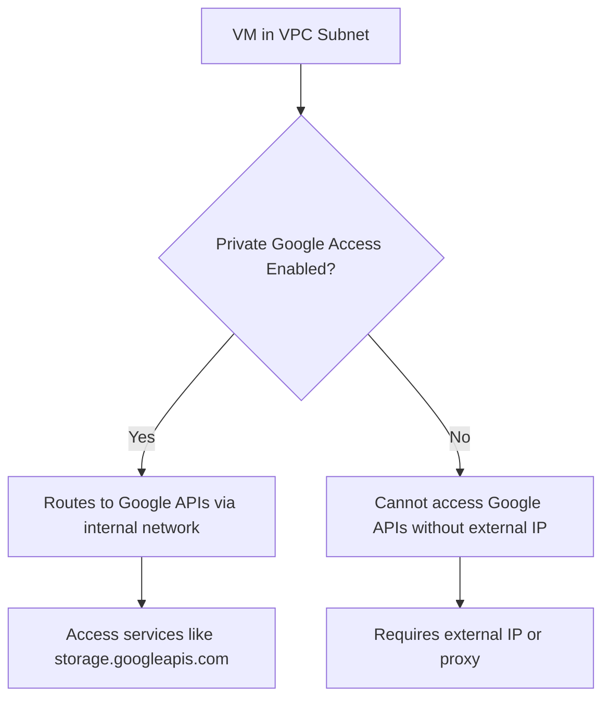

# Session 006: How to use Private Google Access in GCP

<details open>
<summary><b>006-How-To-use-Private-Google-Access-GCP-in-Hindi.txt (KK-CS45-script-v2)</b></summary>

## Table of Contents
- [Overview](#overview)
- [Key Concepts/Deep Dive](#key-conceptsdeep-dive)
  - [Understanding Private Google Access](#understanding-private-google-access)
  - [How Private Google Access Works](#how-private-google-access-works)
  - [Requirements and Restrictions](#requirements-and-restrictions)
  - [Routing and DNS Considerations](#routing-and-dns-considerations)
- [Lab Demo: Setting up and Testing Private Google Access](#lab-demo-setting-up-and-testing-private-google-access)
- [Summary](#summary)
  - [Key Takeaways](#key-takeaways)
  - [Quick Reference](#quick-reference)
  - [Expert Insight](#expert-insight)

## Overview
This session explains Private Google Access (PGA) in Google Cloud Platform (GCP), a feature that allows virtual machines (VMs) in a Virtual Private Cloud (VPC) network to access Google Cloud services privately without requiring external IP addresses. The session covers the concept, setup, and practical demonstration through a lab. Private Google Access ensures secure, internal access to Google services like Cloud Storage, BigQuery, and Compute Engine APIs, routing traffic through Google's internal network instead of the public internet.



## Key Concepts/Deep Dive

### Understanding Private Google Access
Private Google Access is a GCP feature that enables VMs with only internal IP addresses to access Google Cloud services securely. Without PGA, such VMs are isolated to internal network resources and cannot reach external Google APIs. With PGA enabled on a subnet, these VMs can reach select Google services using Google's private network infrastructure.

- **Benefit**: Eliminates the need for external IPs on VMs for accessing cloud services, enhancing security and reducing exposure.
- **Scope**: Applies per subnet; you can enable PGA on specific subnets within a VPC.
- **Supported Services**: Includes APIs for Compute Engine, Cloud Storage, BigQuery, and other Google Cloud services. Accesses services like `storage.googleapis.com`, `compute.googleapis.com`, etc.

### How Private Google Access Works
Private Google Access works by routing traffic from VMs in enabled subnets to Google Cloud APIs through Google's internal network. This routing is transparent and automatic once PGA is enabled.

- **Traffic Path**: Traffic destined for Google APIs uses private IP ranges (e.g., 199.36.153.8/30) and is routed via Google's backbone rather than the public internet.
- **DNS Resolution**: VMs must use internal DNS to resolve public hostnames of Google services to private IP addresses. Custom DNS configurations can affect this.
- **Firewall Rules**: By default, PGA allows access to Google APIs; additional firewall rules may be needed for custom restrictions.
- **Subnet-Level Configuration**: PGA is configured at the subnet level, allowing fine-grained control over which VMs can access private Google services.

> [!NOTE]
> Private Google Access does not provide internet access. VMs with PGA enabled still cannot reach non-Google services on the internet without an external IP or proxy.

### Requirements and Restrictions
- **Subnet Configuration**: PGA must be enabled on the subnet where the VM resides.
- **VM Configuration**: VMs must have only internal IPs (no external IP assigned).
- **Region Considerations**: PGA is available in all GCP regions where Google Cloud services are accessible.
- **Not a Replacement for External Access**: PGA only covers Google Cloud services, not arbitrary internet access.
- **Limitation**: Does not work with Shared VPC or across different GCP projects without additional setup.

### Routing and DNS Considerations
- **Automatic Routes**: GCP automatically adds routes for Google API traffic when PGA is enabled.
- **Custom Routes**: You can view and modify routes, but PGA uses default advertised routes.
- **DNS**: Internal DNS resolvers handle the mappings. Ensure your network uses GCP's default DNS (169.254.169.254).

Command to list advertised routes:
```bash
gcloud compute routes list --filter="nextHopType:PEERING"
```

## Lab Demo: Setting up and Testing Private Google Access

This lab demonstrates creating a VPC, configuring a subnet with Private Google Access, and testing access from a VM with only internal IP.

### Step 1: Create VPC and Subnet
1. Navigate to VPC Networks in GCP Console.
2. Create a custom VPC (e.g., `private-access-vpc`).
3. Create a subnet in the VPC:
   - Name: `private-subnet`
   - IP range: `192.168.1.0/24`
   - Region: Your preferred region
   - Private Google Access: **Enabled** (check the box)

### Step 2: Create VM Instance
1. In Compute Engine, create a new VM.
2. Configuration:
   - Name: `private-vm`
   - Network: Select the VPC created above
   - Subnet: Select the subnet with PGA enabled
   - External IP: **None** (important for testing PGA)
   - Other settings: Default (no custom routes needed)

### Step 3: Verify Configuration
1. Connect to the VM via SSH (Cloud Console option).
2. Test DNS resolution:
   ```bash
   nslookup storage.googleapis.com
   ```
   - Should return a private IP address (e.g., in 199.36.153.0/30 range).

3. Attempt to access Google Cloud services:
   - Without PGA: This should fail or require external IP.
   - With PGA: Use curl to test API access:
     ```bash
     curl https://storage.googleapis.com
     ```

> [!IMPORTANT]
> If PGA is disabled on the subnet, the curl command will fail. Ensure PGA is enabled at the subnet level before testing.

### Step 4: Compare with and without PGA
- **Disable PGA**: Go to subnet settings, uncheck PGA.
- Test access: Commands should fail.
- **Re-enable PGA**: Check PGA, and retest access.

### Additional Testing
- Ping an external site (e.g., google.com):
  ```bash
  ping google.com
  ```
  - Will fail, as PGA doesn't provide full internet access.

- Access other GCP services:
  - Try APIs for Compute, Storage, etc., all should work privately.

## Summary

### Key Takeaways
```diff
+ Private Google Access allows VMs with internal-only IPs to securely access Google Cloud services through Google's private network.
+ Enable PGA at the subnet level for targeted access control.
+ PGA routes traffic privately, enhancing security by avoiding public internet exposure.
- PGA does not provide full internet access; VMs still need external IPs or proxies for non-Google services.
- DNS resolution must point to private IPs for Google APIs to work.
! Ensure subnet configuration is correct; PGA won't apply to VMs in subnets without it enabled.
```

### Quick Reference
- **Enable PGA on Subnet**: VPC Networks > Subnet > Edit > Private Google Access
- **Test DNS**: `nslookup storage.googleapis.com`
- **Test API Access**: `curl https://storage.googleapis.com`
- **Route Filter**: `gcloud compute routes list --filter="nextHopType:PEERING"`

### Expert Insight
#### Real-world Application
In production environments, use PGA to secure internal workloads accessing GCP services without exposing IPs. Ideal for backend services in VPCs that need Cloud Storage backup or BigQuery analytics.

#### Expert Path
- Study VPC peering and private service connect for more advanced networking.
- Experiment with custom routes and firewall rules to fine-tune access.
- Integrate with IAM for service-level access controls.

#### Common Pitfalls
- Forgetting to enable PGA on the subnet; verify configuration post-VM creation.
- Assuming PGA provides internet access; it only covers Google services.
- DNS misconfigurations; always check resolution to private IPs.
- Routing conflicts with custom routes; review VPC route tables.

</details>