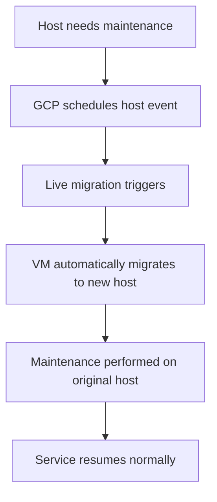

# Session 009: Simulating a Host Maintenance Event in GCP

<details open>
<summary><b>Simulating a Host Maintenance Event in GCP (KK-CS45-script-v2)</b></summary>

## Table of Contents
- [Overview](#overview)
- [Host Maintenance Events](#host-maintenance-events)
- [Live Migration](#live-migration)
- [Maintenance Behaviors](#maintenance-behaviors)
- [Preemption and Spot VMs](#preemption-and-spot-vms)
- [Practical Demonstration](#practical-demonstration)
- [Summary](#summary)

## Overview

This session focuses on host maintenance events in Google Cloud Platform (GCP) and how virtual machines (VMs) handle scheduled infrastructure maintenance. Host maintenance events occur when GCP needs to perform updates or repairs on the underlying physical host machine that VMs are running on. Understanding these events is crucial for ensuring application availability and planning for maintenance windows.

The session covers the different types of maintenance events, how Compute Engine handles them through live migration, and includes a hands-on demonstration of simulating these events.

## Host Maintenance Events

### What are Host Maintenance Events?
Host maintenance events are scheduled activities performed by GCP to maintain the physical infrastructure hosting your VMs. These events include:
- Hardware updates and patches
- Operating system updates
- Infrastructure repairs
- Security updates

> [!IMPORTANT]
> Host maintenance events are non-negotiable - they occur on Google's schedule, not yours. However, GCP provides tools to manage how your VMs respond to these events.

### Types of Maintenance Policies
VM instances can be configured with different maintenance behaviors:

1. **MIGRATE** - Live migration (default)
2. **TERMINATE** - VM termination
3. **PROACTIVE** - Reserved for future use

### Live Migration Explained



**What happens during live migration:**
- VM instance is automatically moved to a healthy host
- Minimal downtime (typically seconds)
- Memory and disk state preserved
- All running processes continue
- Existing connections maintained when possible

> [!NOTE]
> Live migration uses advanced virtualization techniques that can move running VMs between physical servers without stopping them, similar to how a magician moves objects while keeping the show running.

### Maintenance Behaviors

#### 1. **Terminate on Host Maintenance** (Available only for Standard VMs)
```yaml
maintenancePolicy: TERMINATE
```

- When maintenance begins, VM receives ACPI shutdown signal
- Graceful shutdown with 30-60 seconds warning
- VM stops and restarts on new host after maintenance
- **Use case**: Batch processing, jobs that can handle restarts

#### 2. **Migrate on Host Maintenance** (Default behavior)
```yaml
maintenancePolicy: MIGRATE
```

- Automatic live migration during maintenance window
- No user intervention required
- Maintains service availability
- **Use case**: Web services, databases, always-on applications

### Preemption and Spot VMs

**Spot VMs** (formerly preemptible VMs) are designed for cost optimization:

```yaml
scheduling:
  preemptible: true
```

**Key characteristics:**
- Can be preempted at any time with 30-second warning
- Much lower cost (up to 79% discount)
- No availability guarantees
- Cannot migrate - only terminate

**Preemption brings benefits:**
- Significant cost savings
- Helps absorb compute capacity fluctuation
- Ideal for fault-tolerant, batch workloads

> [!WARNING]
> Never use Spot VMs for production workloads requiring high availability. They can be terminated by GCP at any time when capacity is needed elsewhere.

## Practical Demonstration

### Setting Up the Environment

1. **Create a Compute Engine VM**:
```bash
gcloud compute instances create demo-vm \
  --zone=us-central1-a \
  --machine-type=e2-medium \
  --image-family=debian-11 \
  --image-project=debian-cloud \
  --boot-disk-size=10GB
```

2. **Install monitoring tools**:
```bash
# Connect to VM
gcloud compute ssh demo-vm --zone=us-central1-a

# Install required packages
sudo apt update
sudo apt install -y htop stress-ng curl

# Start monitoring script
watch -n 2 uptime
```

### Simulating Host Maintenance Event

**Method 1: Using gcloud command**
```bash
gcloud compute instances simulate-maintenance-event demo-vm --zone=us-central1-a
```

**Method 2: Via GCP Console**
- Go to Compute Engine → VM instances
- Select your VM
- Click "Simulate maintenance event" under the actions menu

### Observational Steps

1. **Monitor system during simulation**:
```bash
# Watch system load
htop

# Check uptime before, during, and after
uptime

# Monitor network connectivity
ping -c 10 8.8.8.8
```

2. **During live migration, observe**:
   - Brief connectivity interruption
   - Automatic resumption
   - IP address preservation
   - Process continuity

> [!TIP]
> Run `stress-ng --cpu 1 --timeout 300` on your VM during the simulation to create observable CPU load that will help you track the migration process.

### Post-Migration Verification

```bash
# Check instance metadata
curl -H "Metadata-Flavor: Google" \
  "http://metadata.google.internal/computeMetadata/v1/instance/hostname"

# Verify uptime continuity
uptime

# Check system logs
sudo journalctl --since "5 minutes ago" | grep -i migration
```

## Summary

### Key Takeaways

```diff
+ Live migration ensures VM availability during GCP infrastructure maintenance
+ Spot VMs offer significant cost savings but can be preempted anytime
+ Choose maintenance policy based on your application requirements
+ Always test maintenance scenarios in staging environments first
! Remember: Host maintenance events happen on GCP's schedule, not yours
- Spot VMs are not suitable for production workloads needing high availability
```

### Quick Reference

**Maintenance Policy Commands:**
```bash
# Check current policy
gcloud compute instances describe demo-vm --format="value(scheduling.maintenanceInterval)"

# Set migration policy
gcloud compute instances set-scheduling demo-vm \
  --maintenance-policy=MIGRATE \
  --zone=us-central1-a

# Set termination policy (Standard VMs only)
gcloud compute instances set-scheduling demo-vm \
  --maintenance-policy=TERMINATE \
  --zone=us-central1-a

# Simulate maintenance event
gcloud compute instances simulate-maintenance-event demo-vm --zone=us-central1-a
```

**Spot VM Creation:**
```bash
gcloud compute instances create spot-vm \
  --preemptible \
  --machine-type=n1-standard-1 \
  --zone=us-central1-a
```

### Expert Insight

**Real-world Application:**
- Use live migration for production web services and databases
- Leverage Spot VMs for CI/CD pipelines, data processing, and development environments
- Set up monitoring dashboards to track maintenance events across your fleet
- Use managed instance groups for automatic recovery when termination is preferred

**Expert Path:**
- Master GCP's maintenance window scheduling to plan application updates
- Implement chaos engineering practices to regularly test resilience
- Use BigQuery audit logs to analyze historical maintenance patterns:
  ```sql
  SELECT timestamp, resource_name, operation_type
  FROM `your-project.audit.compute_engine_logs`
  WHERE operation_type LIKE '%maintenance%'
  ORDER BY timestamp DESC
  ```

**Common Pitfalls:**
- Assuming live migration means zero downtime (brief interruptions occur)
- Using Spot VMs for stateful applications without proper checkpointing
- Failing to test maintenance behavior in staging environments
- Not monitoring GCP status pages for planned maintenance windows
- Running critical batch jobs on Spot VMs without interruption handling

</details>