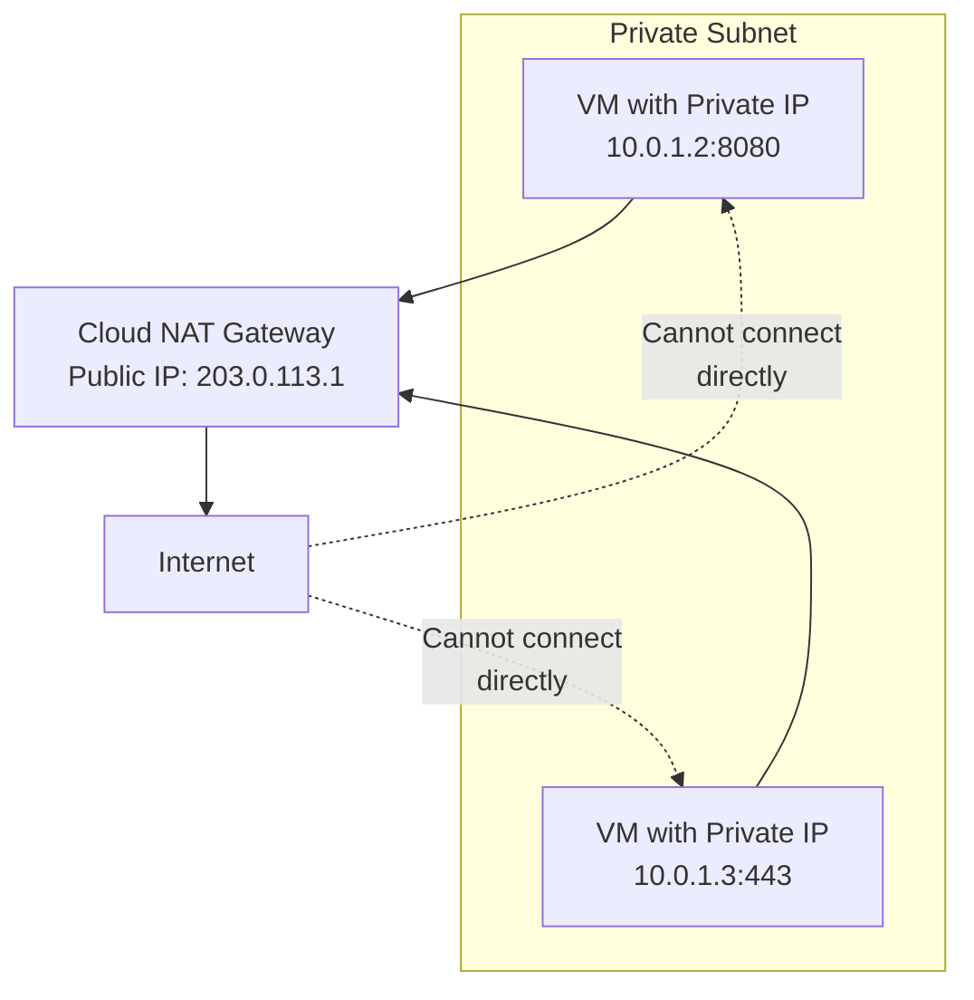

<details open>
<summary><b>Session 003: How to Create Cloud NAT in GCP (KK-CS45-script-v3)</b></summary>

# Session 003: How to Create Cloud NAT in GCP

## Table of Contents
- [Overview](#overview)
- [Key Concepts and Deep Dive](#key-concepts-and-deep-dive)
  - [What is Cloud NAT?](#what-is-cloud-nat)
  - [When to Use Cloud NAT](#when-to-use-cloud-nat)
  - [Cloud NAT Architecture](#cloud-nat-architecture)
  - [Network Address Translation (NAT) Fundamentals](#network-address-translation-nat-fundamentals)
- [Creating Cloud NAT Gateway](#creating-cloud-nat-gateway)
  - [Prerequisites](#prerequisites)
  - [GCP Console Configuration](#gcp-console-configuration)
  - [NAT Gateway Options](#nat-gateway-options)
  - [IP Address Allocation](#ip-address-allocation)
  - [Advanced Options](#advanced-options)
- [Network Tags and Access Control](#network-tags-and-access-control)
- [Summary](#summary)
  - [Key Takeaways](#key-takeaways)
  - [Quick Reference](#quick-reference)
  - [Expert Insights](#expert-insights)

## Overview

This session covers Google Cloud Platform's Cloud NAT (Network Address Translation) service, which enables private VMs without external IP addresses to securely access the internet while preventing inbound connections. Cloud NAT acts as a managed NAT gateway that translates outbound traffic from private subnets to public IP addresses, providing outbound connectivity while maintaining security.

```bash
# Example: Cloud NAT allows outbound traffic but blocks inbound
VM (Private IP: 10.0.0.5) → Cloud NAT → Internet
Internet cannot establish direct connection back to VM
```

## Key Concepts and Deep Dive

### What is Cloud NAT?

Cloud NAT is a managed service in Google Cloud Platform that performs **Network Address Translation** for outbound traffic from private VMs. Unlike traditional NAT devices, Cloud NAT provides:

- **Scalable outbound connectivity**: Handles thousands of concurrent connections
- **Managed service**: No infrastructure to maintain
- **Regional service**: Available at the VPC network level
- **Integration with Cloud Router**: Uses existing networking infrastructure

### When to Use Cloud NAT

Cloud NAT is essential when you have VMs that need outbound internet access but should not be directly accessible from the internet. Key use cases include:

1. **Security requirements**: VMs in private subnets need to download updates, access APIs, or connect to external services
2. **Cost optimization**: Avoid assigning external IPs to VMs that don't need inbound connections
3. **Compliance**: Meet security standards that prohibit direct internet exposure
4. **Microservices**: Internal services need external API access without exposing endpoints

### Cloud NAT Architecture

Cloud NAT operates at the subnet level within a VPC network and provides outbound NAT translation for the entire subnet.



### Network Address Translation (NAT) Fundamentals

NAT translates private IP addresses to public IP addresses for internet communication. Cloud NAT specifically handles **Outbound NAT**:

- **Source NAT (SNAT)**: Changes source IP from private to public
- **Port Address Translation**: Maps internal ports to external ports
- **Connection tracking**: Maintains state for return traffic

> [!IMPORTANT]
> Cloud NAT only provides **outbound connectivity**. VMs cannot receive unsolicited inbound connections through Cloud NAT.

## Creating Cloud NAT Gateway

### Prerequisites

Before creating Cloud NAT, ensure you have:

1. **VPC Network**: An existing VPC network with private subnets
2. **Cloud Router**: A Cloud Router in the same region as your VMs
3. **Private VMs**: VMs without external IP addresses in the subnet

```bash
# Example VPC and subnet creation (if needed)
gcloud compute networks create my-vpc --subnet-mode custom
gcloud compute networks subnets create my-subnet \
  --network my-vpc \
  --range 10.0.0.0/24 \
  --region us-central1
```

### GCP Console Configuration

To create a Cloud NAT gateway using the GCP Console:

1. **Navigate to VPC Network → NAT**
2. **Click "Create NAT gateway"**
3. **Configure gateway name**: Choose a descriptive name (e.g., `my-nat-gateway`)
4. **Select VPC network**: Choose the VPC containing your private subnets
5. **Select Cloud Router**: 
   - Choose an existing router or create a new one
   - Router must be in the same region as your subnets

### NAT Gateway Options

Cloud NAT provides several configuration options:

#### IP Address Allocation
- **Automatic**: GCP automatically allocates and manages IP addresses
- **Manual**: Specify custom IP addresses from your pool

**Automatic Allocation Benefits:**
- No manual management required
- Scales dynamically based on usage
- Lower maintenance overhead

**Manual Allocation Benefits:**
- Predictable IP addresses
- Better integration with external systems
- Explicit IP pool management

> [!NOTE]
> When using manual allocation, Cloud NAT can exhaust available IPs if you have many concurrent connections. Monitor usage and add more IPs as needed.

### Advanced Options

#### NAT IP Address Ranges
- **Primary subnet ranges only**: NAT translates IPs from primary subnet ranges
- **Custom subnet ranges**: Specify specific subnets for NAT translation
- **All subnet ranges**: Include both primary and secondary ranges

#### Port Allocation (Endpoints per VM)
- **Minimum ports per VM**: Default is 64 ports
- **Maximum ports per VM**: Configure based on connection requirements

```diff
+ Best Practice: Increase minimum ports for high-connection workloads
- Warning: Too many concurrent connections will exhaust port allocations
```

#### Connection Timeouts
- **UDP mapping timeout**: Default 30 seconds
- **TCP established connection timeout**: Default 60 minutes
- **TCP transitory connection timeout**: Default 60 seconds

## Network Tags and Access Control

Cloud NAT can be restricted to specific VMs using network tags:

1. **Add network tags** to target VMs
2. **Configure NAT gateway** with specific tags
3. **Apply tags** during VM creation or update existing VMs

```bash
# Example: Create VM with network tags
gcloud compute instances create my-vm \
  --network my-vpc \
  --subnet my-subnet \
  --no-address \
  --tags allow-nat
```

This configuration ensures only tagged VMs can use the NAT gateway for outbound traffic.

## Summary

### Key Takeaways

```diff
+ Cloud NAT enables secure outbound internet access for private VMs
+ Eliminates need for external IP addresses on VMs requiring internet access
+ Managed service that scales automatically with your traffic
+ Only supports outbound connections - blocks unsolicited inbound traffic
+ Integrated with Cloud Router for regional networking
+ Supports both automatic and manual IP address allocation
! Network tags provide fine-grained access control
! Monitor port allocation and IP address usage for high-traffic deployments
```

### Quick Reference

#### Console Navigation
```
VPC Network → NAT → Create NAT gateway
```

#### Common Commands
```bash
# Create Cloud Router (prerequisite)
gcloud compute routers create my-router \
  --network my-vpc \
  --region us-central1

# Create NAT gateway
gcloud compute routers nats create my-nat \
  --router my-router \
  --auto-allocate-nat-external-ips \
  --nat-all-subnet-ip-ranges
```

#### Configuration Checklist
- [ ] VPC network with private subnets exists
- [ ] Cloud Router created in correct region  
- [ ] VMs have no external IP addresses
- [ ] Network tags applied (if needed)
- [ ] Subnet routes configured for internet gateway

### Expert Insights

#### Real-world Application
In production environments, Cloud NAT is commonly used for:
- **Application servers** that need to fetch dependencies or updates
- **Database servers** requiring time synchronization or logging services
- **Containerized workloads** accessing external APIs
- **Bastion host architectures** where jump servers access cloud services

#### Expert Path
- Master **network tagging strategies** for multi-tenant environments
- Learn **Cloud Router** configuration patterns for complex topologies  
- Understand **IP exhaustion monitoring** using Cloud Monitoring
- Study **firewall rule interactions** with NAT gateways
- Practice **regional failover** scenarios for NAT configurations

#### Common Pitfalls
- **IP exhaustion**: Automatic allocation can fail during traffic spikes
- **Region mismatch**: Cloud Router must be in same region as subnets
- **Over-restrictive tags**: Tagging prevents legitimate outbound traffic
- **Firewall misconfiguration**: Additional firewall rules can block NAT traffic
- **Secondary range exclusion**: Important subnets missed in custom NAT configuration

</details>
