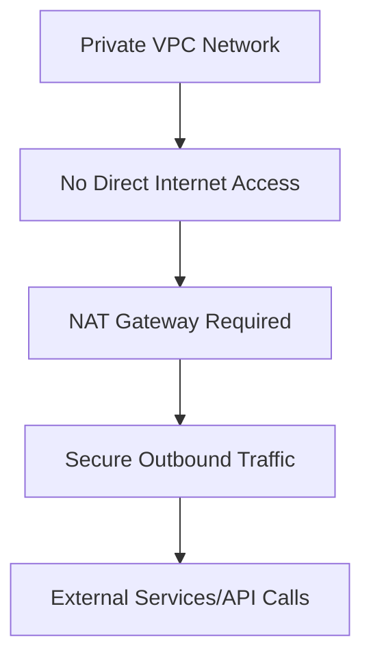
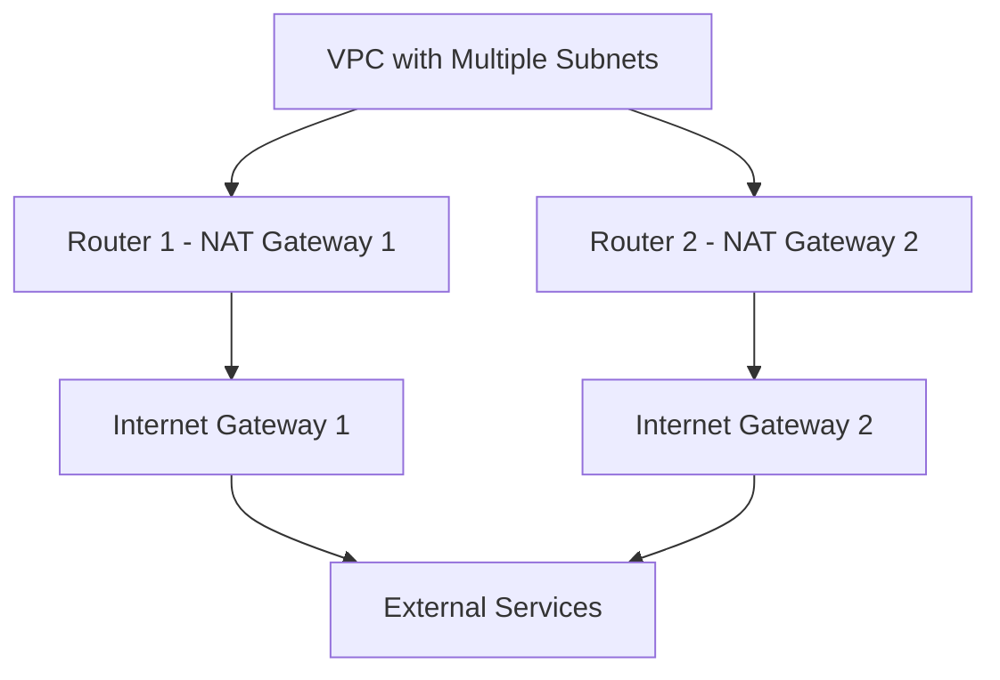

# Session 3: How to Create Cloud NAT GCP

<details open>
<summary><b>How to Create Cloud NAT GCP (KK-CS45-script-v3)</b></summary>

## Table of Contents
- [Overview](#overview)
- [Key Concepts/Deep Dive](#key-conceptsdeep-dive)
- [NAT Gateway in GCP](#nat-gateway-in-gcp)
- [Lab Demo: Creating Cloud NAT in GCP](#lab-demo-creating-cloud-nat-in-gcp)
- [NAT Configuration Options](#nat-configuration-options)
- [Troubleshooting NAT Issues](#troubleshooting-nat-issues)
- [Best Practices](#best-practices)
- [Summary](#summary)

## Overview
This session covers Network Address Translation (NAT) fundamentals and provides a hands-on guide for creating and configuring Cloud NAT in Google Cloud Platform (GCP). Attendees learn how NAT enables private instance communication with external services while maintaining security, and walk through the complete GCP Console workflow for NAT Gateway setup.

The training emphasizes understanding NAT necessity in cloud environments, different NAT types, and practical implementation with step-by-step configuration.

## Key Concepts/Deep Dive

### Understanding Network Address Translation (NAT)

NAT (Network Address Translation) is a networking technique that modifies network address information in packet headers while they're in transit across routing devices. It enables private network instances to communicate with external networks.

#### Types of NAT

| NAT Type | Description | Use Case |
|----------|-------------|----------|
| **Static NAT** | Maps one private IP directly to one public IP | Servers requiring predictable public IP |
| **Dynamic NAT** | Assigns public IPs from a pool dynamically | Temporary outbound connections |
| **Port Address Translation (PAT)** | Overloads multiple private IPs to one public IP using ports | Most common in cloud environments |

#### How NAT Works

Inside private network -> NAT Gateway -> Internet

**Inbound Traffic**: External requests -> Public IP -> NAT translates -> Private IP -> Internal instance

**Outbound Traffic**: Private instance -> NAT Gateway assigns public IP/port -> External resource

### Why NAT is Essential in Cloud



**Key Benefits:**
- **Security**: Private instances remain hidden from direct internet access
- **IP Conservation**: Multiple private IPs share limited public IPs
- **Cost Optimization**: No need for static public IPs on all instances
- **Convenient Egress**: Allow patches, updates, API calls without exposing instances

### GCP NAT Gateway Architecture

Google Cloud NAT runs on Google's infrastructure, not on VMs. It automatically:

- Translates instance IPs to external IPs
- Manages port allocation
- Provides logging and monitoring
- High availability without manual setup

## Lab Demo: Creating Cloud NAT in GCP

### Prerequisites
- GCP Project with VPC Network
- Private subnet (without external IP instances)
- Google Cloud Console access

### Step-by-Step NAT Creation

#### Step 1: Access VPC Network Menu

1. Navigate to **Google Cloud Console**
2. Select your project
3. Go to **VPC network** → **NAT**

#### Step 2: Create NAT Gateway

```
Navigation: VPC network → NAT → Create NAT gateway
```

**Configuration Details:**
- **Gateway name**: `my-nat-gateway`
- **VPC network**: Select your VPC
- **Region**: Choose region (asia-south1 for India)

#### Step 3: Configure NAT Mapping

**Cloud Router Selection:**
- Use existing router or create new one
- Router links NAT Gateway to physical network

**NAT Mapping:**
```yaml
# NAT Configuration YAML
natMapping:
  subnetwork: all  # or specific subnets
  sourceIPRangesToNat: all  # all instances in selected subnets
```

#### Step 4: IP Address Assignment

**NAT IP Options:**
- **Auto-allocate**: GCP assigns ephemeral public IPs
- **Manual**: Use reserved static IPs from your project

#### Step 5: Logging Configuration

**Cloud Logging Enabled:**
```bash
# Enable NAT logging for troubleshooting
natRules:
  logConfig:
    enable: true
    filter: TRANSLATIONS_ONLY  # or ALL
```

#### Step 6: Review and Create

**Final NAT Gateway Configuration:**
- Name: my-nat-gateway
- Network: my-vpc
- Region: asia-south1
- Router: my-router
- NAT IP allocation: Auto
- NAT mapping: All subnets
- Logging: Enabled

### Testing NAT Functionality

#### Test 1: Outbound Internet Access

```bash
# SSH to private instance (no external IP)
ssh private-instance

# Test internet connectivity
curl ifconfig.me  # Should return external IP assigned by NAT
```

Expected Output:
- Receives public IP address
- Confirms NAT translation working

#### Test 2: API Calls

```bash
# Test external API access
curl https://api.github.com/user  # Returns API response

# Update system packages (if allowed)
apt-get update
```

#### Test 3: Verify NAT Logs

```bash
# Check Cloud Logging for NAT operations
gcloud logging read "resource.type=cloud_nat_gateway"
```

## NAT Configuration Options

### Minimum Ports per VM Instance

```yaml
# Recommended minimum ports for NAT
minimumPortsPerVmInstance: 32  # default: 64
maximumPortsPerVmInstance: 2048
```

**Why Port Configuration Matters:**
- Default 64 ports per VM (can be adjusted)
- Determines maximum concurrent outbound connections
- Too few ports = connection exhaustion

### Subnet Targeting

- **All subnets**: NAT applies to entire VPC
- **Specific subnets**: Selective NAT application
- **Exclude subnets**: Create NAT exceptions

## Troubleshooting NAT Issues

### Common Problems

#### Issue 1: No Outbound Connectivity

**Symptoms:** Instance cannot reach internet despite NAT configuration

**Troubleshooting Steps:**
```bash
# Check firewall rules
gcloud compute firewall-rules list --filter="network=my-vpc"

# Verify subnet configuration
gcloud compute networks subnets describe my-subnet --region=asia-south1

# Check NAT status
gcloud compute routers nats describe my-nat-gateway --router=my-router --region=asia-south1
```

#### Issue 2: Port Exhaustion

**Indicators:**
- Connection timeouts
- Slow API responses
- Cloud Monitoring alerts

**Resolution:**
- Increase minimum ports per VM instance
- Implement connection pooling
- Use regional NAT (multiple gateways)

#### Issue 3: NAT Not Translating Traffic

**Validation Commands:**
```bash
# Check router status
gcloud compute routers describe my-router --region=asia-south1

# Verify NAT configuration
gcloud compute routers nats list --router=my-router --region=asia-south1

# Test from instance
curl -v google.com
```

### Monitoring NAT Health

**Key Metrics to Monitor:**
- Active connections
- Port utilization
- Throughput
- Error rates

**Cloud Monitoring Queries:**
```bash
# NAT Port Usage
fetch cloud_nat_gateway
| metric 'nat/port_usage'
| group_by 1m, [value_port_usage_mean: mean(value.port_usage)]

# NAT Allocations
fetch cloud_nat_gateway
| metric 'nat/allocations_succeeded_count'
| group_by 1m, [value_allocations_succeeded_count_sum: sum(value.allocations_succeeded_count)]
```

## Best Practices

### Architecture Recommendations

> [!IMPORTANT]
> Always use Private Google Access for Google Cloud APIs to minimize NAT routing and reduce costs.

**Network Design:**
- Separate production/staging environments with dedicated NAT
- Use regional NAT for high-traffic scenarios
- Implement manual NAT for predictable public IPs

### Security Considerations

**NAT with Firewall Rules:**
- NAT doesn't replace firewall rules
- Still need proper egress rules
- Consider Cloud Armor for additional protection

### Cost Optimization

**IP Management:**
- Use auto-allocated IPs for development
- Reserve static IPs only for production with fixed IP requirements
- Monitor unused reserved IPs

### Scalability Guidelines

**Multi-NAT Setup for High Traffic:**


## Summary

### Key Takeaways

```diff
+ NAT enables secure outbound connectivity for private cloud instances
+ GCP NAT runs on Google's infrastructure (not VMs)
+ Always configure logging for troubleshooting
+ Use minimum 64 ports per VM instance as default
+ Test NAT by attempting outbound connections from private instances
+ Monitor port utilization to prevent exhaustion
+ Implement Private Google Access for efficient API routing

! Remember to create NAT gateway in same region as your VMs
- Avoid using NAT for inbound traffic (use Load Balancer instead)
- Don't configure security groups thinking they replace firewalls
```

### Quick Reference

**NAT Creation Command:**
```bash
# CLI Create NAT (alternative to Console)
gcloud compute routers nats create my-nat-gateway \
  --router=my-router \
  --region=asia-south1 \
  --auto-allocate-nat-external-ips \
  --nat-all-subnet-ip-ranges
```

**Verification Commands:**
```bash
# Check NAT status
gcloud compute routers nats describe my-nat-gateway --router=my-router --region=asia-south1

# Test connectivity
ssh private-instance "curl ifconfig.me"
```

**Common Configuration Parameters:**
| Parameter | Default | Recommended | Purpose |
|-----------|---------|-------------|---------|
| minimumPortsPerVmInstance | 64 | 64-1024 | Concurrent connections |
| enableDynamicPortAllocation | true | true | Automatic port management |
| enableEndpointIndependentMapping | true | true | Packet consistency |
| logConfigFilter | TRANSLATIONS_ONLY | ALL | Detailed logging |

### Expert Insights

**Real-world Application:**
In production environments, combine NAT with Cloud VPN/Interconnect for hybrid architectures where on-premises systems need controlled access to cloud APIs while maintaining internal IP space privacy.

**Expert Path to Mastery:**
- Study TCP connection states and port allocation algorithms
- Learn GCP network peering and custom routes with NAT
- Experiment with NAT + HTTP(S) Load Balancers for selective exposure
- Master Cloud Monitoring custom dashboards for NAT KPIs
- Understand how NAT interacts with Google Cloud Armor and Identity-Aware Proxy

**Common Pitfalls to Avoid:**
- Forgetting to enable Private Google Access for Google APIs
- Configuring NAT in wrong region (must match VM region)
- Ignoring port exhaustion warnings
- Testing NAT only with simple HTTP rather than real application traffic
- Assuming NAT provides inbound access (it's outbound-only)
- Not monitoring NAT costs when using manual IP allocation

</details>