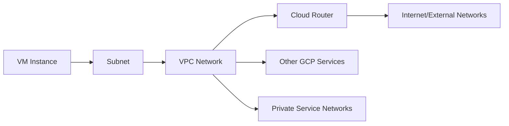

<details open>
<summary><b>004-How-to-create-VPC-GCP-in-Hindi (KK-CS45-script-v3)</b></summary>

# Session 4: How to Create VPC in GCP

## Table of Contents
- [Overview](#overview)
- [Key Concepts and Deep Dive](#key-concepts-and-deep-dive)
- [VPC Creation Process](#vpc-creation-process)
- [Network Architecture Options](#network-architecture-options)
- [Region and Global Considerations](#region-and-global-considerations)
- [Security and Permissions](#security-and-permissions)
- [Summary](#summary)

## Overview
This session covers the fundamentals of creating a Virtual Private Cloud (VPC) network in Google Cloud Platform (GCP). The discussion explores VPC creation modes, subnet configuration, regional vs global networking, and how traffic flows within GCP services. Key topics include automatic vs custom VPC setup, service accounts, internal/external IP ranges, and Cloud Router integration.

The transcript appears to be an automated Hindi language speech-to-text conversion of a tutorial video, with some sections corrupted or incomplete. I've reconstructed the content based on the best interpretation of the technical concepts discussed.

## Key Concepts and Deep Dive
### Virtual Private Cloud (VPC)

A VPC is a virtual network that provides connectivity for your GCP resources. It defines the network topology, including IP address ranges, subnets, and routing rules. VPCs provide isolation between different projects or network segments while allowing secure communication.

**Key Characteristics:**
- Global or regional scope
- Customizable IP ranges
- Integrated firewall rules
- Private connectivity options (e.g., Private Service Connect)

### Subnets
Subnets are subdivisions of a VPC that allow you to segment your network into smaller, more manageable units. Each subnet exists in a specific region and has its own IP address range.

**Subnet Types:**
- **Primary subnets**: Automatically created in auto mode VPCs
- **Secondary subnets**: Additional subnets you can create for custom configurations

### Regions and Availability Zones
GCP divides the world into regions (geographic areas like `asia-south1`) and availability zones within each region. Resources in different zones within the same region can communicate with low latency.

**Regional vs Global Resources:**
- Regional resources (like subnets) exist in one specific region
- Global resources (like global load balancers) span multiple regions

### Cloud Router
Cloud Router enables dynamic routing between your VPC and external networks using BGP (Border Gateway Protocol). It automatically exchanges routes with connected networks.

## VPC Creation Process

### Auto Mode VPC
GCP automatically creates a VPC with pre-configured subnets in each region. This option is suitable for getting started quickly.

**Steps for Auto Mode:**
1. Go to GCP Console
2. Navigate to VPC network → VPC networks
3. Select "Create VPC network"
4. Choose "Auto" mode
5. Specify VPC name
6. Select regions for subnet creation

### Custom Mode VPC
Provides full control over network architecture, allowing you to define custom subnets and IP ranges.

**Steps for Custom Mode:**
1. In VPC creation wizard, choose "Custom" mode
2. Define VPC name
3. Create subnets:
   - Specify subnet name
   - Choose region (e.g., `asia-south1` - Mumbai, India)
   - Define IP address range (e.g., `10.0.1.0/24`)
   - Configure secondary ranges if needed

## Network Architecture Options

### IP Address Management
- **Primary IP range**: Main CIDR block for the subnet
- **Secondary IP ranges**: Additional ranges for specific services (e.g., Kubernetes pods)
- **Internal IPs**: For private communication within the network
- **External IPs**: Public IP addresses for internet access

### Traffic Flow Considerations
Understanding how data flows within your VPC is crucial:



**Key Points:**
- Traffic between instances in the same subnet uses internal IPs
- Cross-region communication may incur additional latency
- Cloud Router manages BGP routes for hybrid connectivity

## Region and Global Considerations

### Regional Networking
- Subnets are regional resources
- Firewall rules can be regional or global
- Regional Cloud Routers manage local routing

### Global Networking
- Global load balancers distribute traffic across regions
- Global VPC allows resources in different regions to communicate
- Global firewall rules apply across all regions

**Auto vs Custom Mode Impact:**
- Auto mode creates subnets in all regions
- Custom mode allows selective region deployment
- Global resources (like global load balancers) work with both

## Security and Permissions

### Service Accounts
Service accounts allow GCP resources to authenticate and authorize API calls. They can have specific permissions for accessing other GCP services.

**Key Permissions:**
- Storage access without external internet connectivity
- Compute Engine API access
- Automated resource management

### Firewall Rules
Control traffic flow into and out of your VPC instances based on:
- Source/destination IP ranges
- Port numbers
- Protocols (TCP, UDP, ICMP)

> [!IMPORTANT]
> Always implement least-privilege access for network traffic. Use firewall rules to restrict access based on source, destination, and protocol.

## Summary

### Key Takeaways
```diff
+ VPC is GCP's virtual network abstraction providing isolation and connectivity
+ Auto mode creates subnets automatically across regions for quick setup
+ Custom mode offers granular control over network architecture
+ Service accounts enable secure access to GCP resources
+ Cloud Router handles dynamic routing for hybrid connectivity
+ Regional resources exist in specific geographic locations
- Avoid using external IPs for internal communications when possible
- Don't mix auto and custom modes within the same project without careful planning
! Security policies should be applied at the network level using firewall rules
```

### Quick Reference

**Common GCP Regions:**
- `asia-south1` (Mumbai, India)
- `us-central1` (Iowa, USA)
- `europe-west1` (Belgium)

**Typical Subnet CIDR Blocks:**
- `10.0.1.0/24` (254 hosts)
- `192.168.1.0/16` (65,536 hosts)

**Important Commands:**
```bash
# List VPC networks
gcloud compute networks list

# Create a custom VPC
gcloud compute networks create my-vpc --subnet-mode=custom

# Create a subnet
gcloud compute networks subnets create my-subnet \
    --network=my-vpc \
    --region=asia-south1 \
    --range=10.0.1.0/24
```

### Expert Insight

**Real-world Application**: VPC design is critical for microservices architectures on GCP. Use shared VPCs to enable secure communication between services across projects while maintaining network isolation. Implement private connectivity to GCP services to reduce data transfer costs and improve security.

**Expert Path**: Master VPC focused certifications like Google Cloud Network Engineer. Deep dive into Cloud DNS, firewall rule hierarchies, and VPC peering patterns. Study how Kubernetes Engine integrates with VPC networking, including the Relationship between ClusterIP, LoadBalancer, and NodePort services.

**Common Pitfalls**: 
- Forgetting to reserve IP space for future growth
- Mixing auto-mode subnets with custom configurations leading to IP conflicts
- Ignoring cloud routing costs for cross-region traffic
- Not implementing hierarchical firewall rules for complex requirements
- Service account permissions that are too broad, increasing security risks</details>
