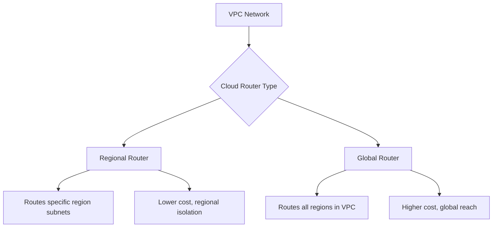

# Session 004: How to Create VPC in GCP

<details open>
<summary><b>How to Create VPC in GCP (KK-CS45-script-v3)</b></summary>

## Table of Contents
- [Overview](#overview)
- [Key Concepts](#key-concepts)
- [VPC Components](#vpc-components)
- [Creating a Custom VPC](#creating-a-custom-vpc)
- [Subnet Configuration](#subnet-configuration)
- [Cloud Router Setup](#cloud-router-setup)
- [Service Account Permissions](#service-account-permissions)
- [Summary](#summary)

## Overview
This session covers the step-by-step process of creating a Virtual Private Cloud (VPC) network in Google Cloud Platform (GCP) using the console. The tutorial demonstrates creating a custom VPC with subnets, configuring regional settings, and setting up cloud routers for network communication. It emphasizes the importance of proper subnet ranges, internal vs external IP addressing, and regional vs global routing configurations.

The session focuses on practical GCP Console navigation and configuration options for VPC creation, with considerations for security, scalability, and service communication within the cloud environment.

## Key Concepts

### Virtual Private Cloud (VPC)
A Virtual Private Cloud (VPC) is a virtual network dedicated to your Google Cloud project. It provides logically isolated networking resources, allowing you to define your own IP address range, subnets, routing tables, and network gateway.

> [!IMPORTANT]
> VPCs are global resources, while subnets are regional. Plan your network architecture carefully as VPCs cannot span multiple projects directly.

### Subnets
Subnets are subdivisions of your VPC's IP address range. GCP offers two subnet creation modes:
- **Automatic subnets**: GCP automatically creates subnets in each region with predefined IP ranges
- **Custom subnets**: You manually define subnet names, regions, and IP address ranges

### Cloud Router
A Cloud Router is a fully distributed router that connects your VPC to other networks (like on-premises networks). Key considerations:
- **Regional**: Manages routes for subnets in a specific region
- **Global**: Manages routes across all regions in your VPC

## VPC Components

### IP Addressing
VPC uses CIDR notation for IP address ranges:
- **Primary IP range**: The main address space for your subnet
- **Secondary IP ranges**: Additional ranges for Pods in GKE or other secondary services

### Firewall Rules
Firewall rules control traffic flow between instances:
- **Ingress rules**: Control inbound traffic
- **Egress rules**: Control outbound traffic
- **Implicit allow**: Within same VPC/subnet, traffic is allowed by default

### Resources Isolation
VPC resources are isolated from other GCP projects unless explicitly configured otherwise.

### Dynamic Routing
Cloud Routers support dynamic routing for hybrid connectivity.

## Creating a Custom VPC

### Prerequisites
- Active Google Cloud project
- Sufficient permissions (Compute Network Admin or Owner role)
- Basic understanding of IP address ranges

### Step-by-Step Lab Demo

1. **Access Google Cloud Console**
   ```bash
   # Navigate to the GCP Console
   # URL: console.cloud.google.com
   ```

2. **Navigate to VPC Networks**
   - Click on "Navigation menu" (three lines)
   - Select "Networking" → "VPC network" → "VPC networks"

3. **Create New VPC Network**
   - Click "CREATE VPC NETWORK"
   - Choose creation mode: **Custom**
   - Enter VPC name (e.g., `my-vpc-network`)

   ```yaml
   # VPC Configuration Example
   name: my-vpc-network
   description: Custom VPC for demo
   auto_create_subnets: false
   ```

4. **Configure Subnets**
   - Click "Add subnet"
   - Fill subnet details:

   | Field | Value Example |
   |-------|---------------|
   | Name | subnet-1 |
   | Region | asia-south1 (Mumbai) |
   | IP address range | 10.0.1.0/24 |
   | Private Google Access | Enabled |

   ```yaml
   subnets:
     - name: subnet-1
       region: asia-south1
       ip_range: 10.0.1.0/24
       purpose: PRIVATE
       private_access: true
   ```

5. **Add Additional Subnets (Optional)**
   - Repeat step 4 for more subnets in different regions
   - Ensure IP ranges don't overlap

6. **Configure Cloud Router**
   - Region selection: Choose specific region (regional) or global
   - Cloud router name: auto-generated or custom

   ```yaml
   cloud_router:
     name: my-router
     network: my-vpc-network
     region: asia-south1  # Use empty string for global
   ```

## Subnet Configuration

### IP Range Planning
- Use RFC 1918 private ranges: 10.0.0.0/8, 172.16.0.0/12, 192.168.0.0/16
- Avoid reserved ranges like 169.254.0.0/16
- Plan for future growth (don't use /30 or /31 subnets unless necessary)

### Regional Selection
Consider latency, compliance, and cost:
- Choose regions close to end users or data
- Multi-region setups for disaster recovery

### Flow Logs
Enable flow logs for monitoring traffic patterns.

## Cloud Router Setup

### Regional vs Global Routing


### Key Configuration Options
- **ASN**: Autonomous System Number (auto-assigned or custom)
- **Advertisement**: Control which routes are advertised
- **BGP**: Configure BGP sessions for hybrid connectivity

## Service Account Permissions

### Internal Service Communication
Services like Compute Engine VMs can access other services through service accounts:
- Grant appropriate IAM roles
- Use least privilege principle
- Enable private access for internal-only services

### External Access Control
- Configure firewall rules for internet access
- Use external IPs judiciously (cost and security considerations)
- Implement NAT gateways for outbound traffic

> [!NOTE]
> Always review service account permissions regularly to maintain security.

## Summary

### Key Takeaways
```diff
+ VPC provides isolated networking in Google Cloud Platform
+ Custom subnets offer fine-grained IP range control
+ Regional routers cost less but serve single regions
+ Global routers enable inter-region communication
+ Proper IP planning prevents range overlaps
+ Firewall rules control traffic flow by default allow internal communication
- Avoid using automatic subnets for production environments
- Don't overlook service account permissions for internal services
- Never expose unnecessary services to public internet
```

### Quick Reference

#### VPC Creation Commands (gcloud CLI)
```bash
# Create custom VPC
gcloud compute networks create my-vpc-network \
    --subnet-mode=custom

# Create subnet
gcloud compute networks subnets create subnet-1 \
    --network=my-vpc-network \
    --region=asia-south1 \
    --range=10.0.1.0/24

# Create cloud router (regional)
gcloud compute routers create my-router \
    --network=my-vpc-network \
    --region=asia-south1
```

#### Firewall Rule Template
```bash
# Allow HTTP/HTTPS from anywhere
gcloud compute firewall-rules create allow-http-https \
    --network=my-vpc-network \
    --allow=tcp:80,tcp:443 \
    --source-ranges=0.0.0.0/0
```

#### Common IP Ranges
- Subnet 1: 10.0.1.0/24
- Subnet 2: 10.0.2.0/24
- Subnet 3: 10.0.3.0/24

### Expert Insight

**Real-world Application**:
In production environments, create separate VPCs for different teams or applications to achieve network isolation. Use shared VPCs for centralized management while maintaining security boundaries.

**Expert Path**:
Master advanced networking features like VPC peering, VPN connectivity, and Cloud Interconnect. Learn to implement network security best practices including zero-trust architecture and micro-segmentation.

**Common Pitfalls**:
- Overlapping IP ranges across subnets cause routing issues
- Forgetting to enable private Google access blocks API calls
- Using global routers unnecessarily increases costs
- Not securing service accounts leads to privilege escalation risks

</details>