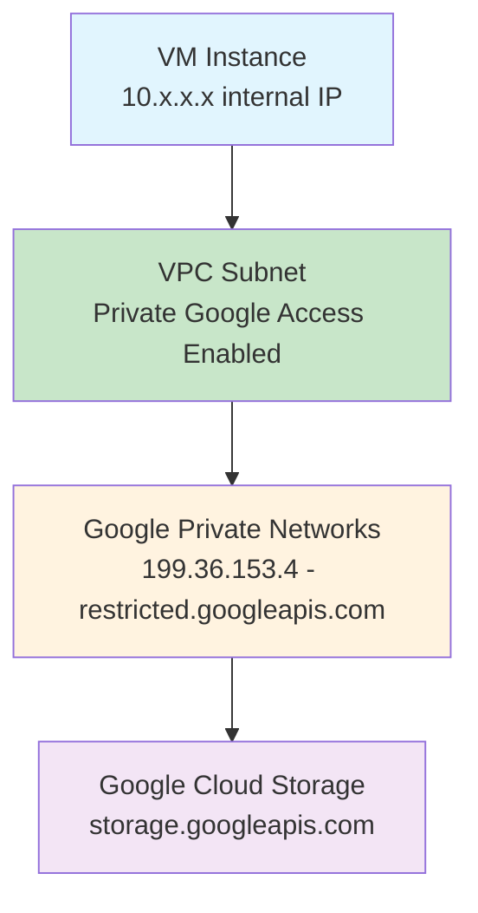

# Session 006: How To Use Private Google Access GCP

<details open>
<summary><b>How To Use Private Google Access GCP (KK-CS45-script-v3)</b></summary>

## Table of Contents
- [Overview](#overview)
- [Key Concepts and Deep Dive](#key-concepts-and-deep-dive)
  - [What is Private Google Access?](#what-is-private-google-access)
  - [Private vs Public Access in GCP](#private-vs-public-access-in-gcp)
  - [Subnet Configuration](#subnet-configuration)
- [Lab Demo: Enabling Private Google Access](#lab-demo-enabling-private-google-access)
- [Summary](#summary)

## Overview

This session demonstrates how to configure and use Private Google Access in Google Cloud Platform (GCP). Private Google Access allows your VM instances in a VPC network to reach Google APIs and services without requiring external IP addresses. This is particularly useful for securing your cloud resources by eliminating the need for public IP exposure while maintaining access to essential Google services.

The session covers a practical demonstration of enabling Private Google Access on a subnet and verifying connectivity to Google Cloud Storage (GCS) using internal network endpoints.

## Key Concepts and Deep Dive

### What is Private Google Access?

Private Google Access is a GCP feature that enables VM instances without external IP addresses to access Google APIs and services through private IP addresses. This provides a secure way to access Google services like:

- Google Cloud Storage (GCS)
- Google Cloud BigQuery
- Google Cloud Pub/Sub
- Other Google Cloud APIs

#### Key Benefits:
- **Enhanced Security**: No external IP addresses needed
- **Cost Efficiency**: Eliminates public IP address charges
- **Network Isolation**: Traffic stays within Google's private network

### Private vs Public Access in GCP

| Aspect | Private Google Access | Public External IP Access |
|--------|----------------------|---------------------------|
| IP Address Requirement | Internal IP only | External IP required |
| Network Path | Direct to Google APIs via private endpoints | Routes through public internet |
| Security Level | Higher (no external exposure) | Lower (external IP exposure) |
| Cost | Potentially lower (no external IP costs) | Higher (external IP charges) |
| Use Case | Secure, internal network access | Public-facing services |

### Subnet Configuration

Private Google Access is configured at the subnet level in a VPC network. When enabled on a subnet, all VM instances created in that subnet can access Google APIs through private IP addresses.

> [!IMPORTANT]
> Private Google Access only provides access to Google APIs and services. It does not provide general internet access.

## Lab Demo: Enabling Private Google Access

### Prerequisites
- GCP project with VPC network
- IAM permissions to create and manage VM instances
- IAM permissions to configure subnets

### Step-by-Step Procedure

1. **Create VM Instance without External IP**
   ```bash
   # VM configuration with only internal IP
   gcloud compute instances create test-vm \
     --zone=<ZONE> \
     --subnet=<SUBNET_NAME> \
     --no-address  # This disables external IP allocation
   ```

2. **Attempt Initial Connection (Expected Failure)**
   ```bash
   # Try to list GCS bucket - this will fail initially
   gsutil ls gs://your-bucket-name/
   ```
   **Expected Error:**
   ```
   Connection refused or timeout error
   ```

3. **Enable Private Google Access on Subnet**
   ```bash
   # Update subnet to enable Private Google Access
   gcloud compute networks subnets update <SUBNET_NAME> \
     --region=<REGION> \
     --enable-private-ip-google-access
   ```

   Alternatively, through the GCP Console:

   - Navigate to **VPC Network > VPC networks**
   - Select your VPC network
   - Click on the subnet
   - In **Private Google Access** section, check **Enable Private Google Access**
   - Click **Save**

4. **Verify Private Google Access Configuration**
   ```bash
   # Check subnet configuration
   gcloud compute networks subnets describe <SUBNET_NAME> --region=<REGION>
   ```
   Look for: `privateIpGoogleAccess: true`

5. **Test Connection After Enabling**
   ```bash
   # Should now work after enabling Private Google Access
   gsutil ls gs://your-bucket-name/
   ```

6. **Optional: Service Account Permissions**
   If encountering permission errors, ensure your service account has appropriate IAM roles:
   ```bash
   # Grant Storage Object Viewer role
   gcloud storage buckets add-iam-policy-binding gs://your-bucket-name/ \
     --member=serviceAccount:<SERVICE_ACCOUNT>@<PROJECT>.iam.gserviceaccount.com \
     --role=roles/storage.objectViewer
   ```

### Network Flow Diagram



## Summary

### Key Takeaways

```diff
+ Private Google Access enables secure internal communication with Google APIs
+ Configuration is done at the subnet level in VPC networks
+ Eliminates need for external IP addresses on VM instances
+ Most suitable for applications requiring Google service access without public internet exposure
- Does not provide general internet access - only Google APIs
- Requires specific service account permissions for GCS access
- Subnet updates may require VM restart for changes to take effect

> [!IMPORTANT]
> Private Google Access is essential for secure, cost-effective GCP edge deployments where external IP addresses are unnecessary but Google service communication is required.

> [!NOTE]
> Monitor your Google Cloud Storage access logs to ensure proper connectivity after enabling Private Google Access.
```

### Quick Reference

#### Enable Private Google Access via CLI
```bash
gcloud compute networks subnets update <SUBNET_NAME> \
  --region=<REGION> \
  --enable-private-ip-google-access
```

#### Create VM with Private Google Access Subnet
```bash
gcloud compute instances create <VM_NAME> \
  --zone=<ZONE> \
  --subnet=<SUBNET_NAME> \
  --no-address
```

#### Test GCS Access
```bash
gsutil ls gs://<BUCKET_NAME>/
```

#### Check Subnet Configuration
```bash
gcloud compute networks subnets describe <SUBNET_NAME> --region=<REGION>
```

### Expert Insight

**Real-world Application**: In production environments, use Private Google Access for:
- Data processing pipelines accessing BigQuery
- Containerized applications needing Cloud Storage
- Hybrid cloud setups with Google Hybrid Connectivity
- Secure development environments behind firewalls

**Expert Path**:
- Combine with Cloud NAT for general internet access needs
- Use private Google access with Cloud Interconnect/VPN for hybrid scenarios
- Implement VPC Service Controls for additional security layers
- Monitor network traffic using VPC Flow Logs

**Common Pitfalls**:
- Forgetting service account permissions for specific services
- Assuming all Google services are accessible (some require external APIs)
- Not planning for subnet usage patterns before enabling the feature
- Missing DNS configurations for private Google access ranges

> [!NOTE]
> Always test your configuration in a staging environment before applying to production workloads.

</details>