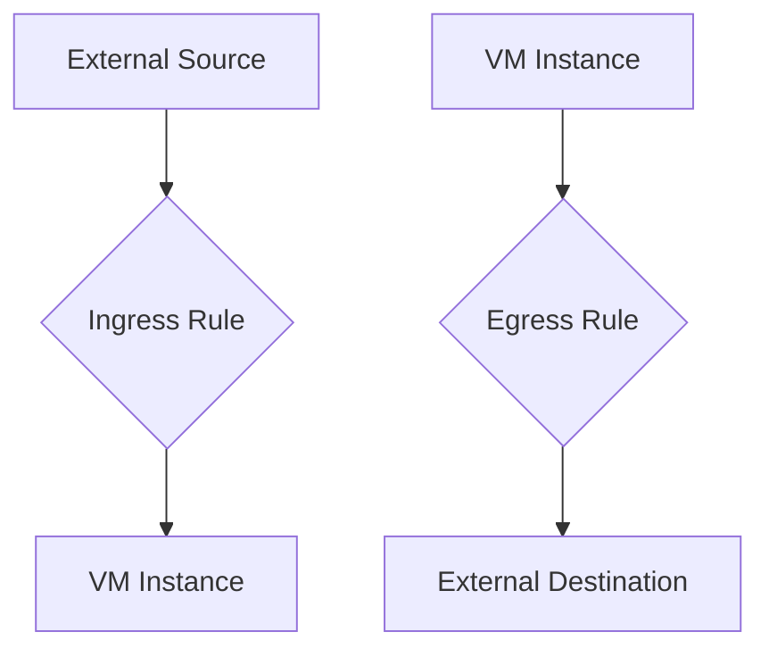

<details open>
<summary><b>[007-How-to-create-Firewall-rule-and-use-them-GCP-in-Hindi] (KK-CS45-script-v3)</b></summary>

# Session 7: How to Create Firewall Rules and Use Them in GCP

## Table of Contents
- [Overview](#overview)
- [Key Concepts Deep Dive](#key-concepts-deep-dive)
  - [Firewall Rule Components](#firewall-rule-components)
  - [Priority System](#priority-system)
  - [Traffic Direction](#traffic-direction)
  - [Action Types](#action-types)
  - [Target Specifications](#target-specifications)
  - [Source Filtering](#source-filtering)
  - [Protocols and Ports](#protocols-and-ports)
- [Lab Demos](#lab-demos)
  - [Demo 1: Creating Ingress Rule for Ping Testing](#demo-1-creating-ingress-rule-for-ping-testing)
  - [Demo 2: Creating Egress Rule to Block Google DNS](#demo-2-creating-egress-rule-to-block-google-dns)
- [Summary](#summary)

## Overview
This session covers Google Cloud Platform (GCP) firewall rule creation and management. Firewall rules act as security controls that determine which traffic is allowed or denied to/from virtual machine instances within GCP's VPC networks. The session demonstrates both ingress (inbound) and egress (outbound) rules through practical examples, including ping testing and DNS traffic blocking.

## Key Concepts Deep Dive

### Firewall Rule Components
Firewall rules in GCP consist of several critical components:

- **Name**: User-defined identifier for the rule (e.g., "firewall-testing")
- **Description**: Optional field for rule documentation
- **Logs**: Optional logging capability to capture traffic that matches the rule
- **Network**: VPC network where the rule applies
- **Priority**: Numeric value determining rule evaluation order

### Priority System
```diff
+ Firewall rules are evaluated in order of priority
+ Lower numeric values = Higher priority (0 is maximum)
- Higher numeric values = Lower priority (65535 is minimum)
! When two rules have same priority, DENY rules take precedence over ALLOW rules
```

Priority determines which rule is checked first when multiple rules could apply to the same traffic. This prevents unintentional security holes.

### Traffic Direction
Firewall rules have two directions:

- **Ingress**: Traffic coming INTO the VPC network (inbound traffic)
- **Egress**: Traffic going OUT of the VPC network (outbound traffic)

Traffic flow visualization:


### Action Types
When traffic matches a rule, two actions are possible:

- **Allow**: Permits traffic to reach its destination
- **Deny**: Drops/bloocks the traffic

### Target Specifications
Three targeting options control which instances the rule applies to:

1. **All instances in the network**: Applies to every VM in the selected VPC
2. **Target tags**: Uses network tags to target specific instances
3. **Service accounts**: Targets instances based on associated service accounts

> [!IMPORTANT]
> Google recommends using service accounts over target tags for better security, as service account permissions are more restrictive than network tag editing permissions.

### Source Filtering
Source filtering determines which traffic sources the rule applies to:

- **IP Ranges**: IPv4/IPv6 address ranges (e.g., `0.0.0.0/0` for all addresses)
- **Source Tags**: References network tags from other instances in the same project

### Protocols and Ports
The rule specifies which network protocols and ports are affected:

| Protocol | Common Use Cases |
|----------|------------------|
| TCP | HTTP/HTTPS (port 80/443), SSH (port 22) |
| UDP | DNS (port 53), DHCP |
| ICMP | Ping testing, network diagnostics |
| All protocols | Complete exposure (not recommended) |

> [!NOTE]
> "Allow all protocols" should be avoided in production as it completely exposes instances to the internet.

## Lab Demos

### Demo 1: Creating Ingress Rule for Ping Testing

#### Steps to Create Ingress Firewall Rule

1. **Navigate to VPC Network**:
   ```bash
   # Go to Google Cloud Console → VPC network → Firewall
   ```

2. **Create New Firewall Rule**:
   ```yaml
   Name: firewall-testing
   Description: Allow ping testing
   Logs: Disabled
   Network: default  # Match your VM's VPC
   Priority: 1000
   Direction: Ingress
   Action: Allow
   Target: Target tags
   Target tags: allow-internet-traffic
   Source filter: IPv4 ranges
   Source IPv4 ranges: 0.0.0.0/0
   Protocols and ports: icmp
   ```

3. **Apply Target Tag to VM**:
   - Go to VM instance → Edit
   - Under Network tags, add: `allow-internet-traffic`
   - Save changes

4. **Test the Rule**:
   ```bash
   # Copy external IP from VM instance
   # Use online ping tool: https://ping.eu/
   # Ping should succeed
   ```

### Demo 2: Creating Egress Rule to Block Google DNS

#### Steps to Create Egress Firewall Rule

1. **Create New Firewall Rule for Blocking**:
   ```yaml
   Name: block-google-dns
   Description: Block access to Google DNS
   Network: default
   Priority: 1000
   Direction: Egress
   Action: Deny
   Target: Target tags
   Target tags: block-google-traffic
   Destination filter: IPv4 ranges
   Destination IPv4 ranges: 8.8.8.8/32
   Protocols and ports: icmp
   ```

2. **Apply Target Tag to VM**:
   ```bash
   # Add network tag: block-google-traffic
   # (Can have multiple tags on one VM)
   ```

3. **Test the Rule**:
   ```bash
   # Try pinging 8.8.8.8 - should fail/timeout
   ping 8.8.8.8  # This should be blocked
   
   # Try pinging different IP - should work
   ping 8.8.4.4  # Google DNS alternative, should work
   ```

> [!NOTE]
> The blocking only affects the specific IP range (8.8.8.8) while allowing traffic to other destinations.

## Summary

### Key Takeaways
```diff
+ Understand traffic direction: Ingress (in) vs Egress (out)
+ Priority system: Lower numbers = Higher precedence
+ Target properly: Use service accounts or specific tags, avoid "all instances"
+ Filter precisely: Use specific IP ranges instead of 0.0.0.0/0 when possible
+ Test thoroughly: Verify rules work as expected before production use
- Never use "Allow all protocols" in production environments
- Don't rely on target tags alone for security (use service accounts when possible)
- Avoid same-priority rules if possible (DENY always wins over ALLOW at same priority)
```

### Quick Reference

#### Common Firewall Rule Templates

**Allow SSH from anywhere (Ingress)**:
```yaml
Name: allow-ssh
Direction: Ingress
Action: Allow
Source ranges: 0.0.0.0/0
Protocols: tcp:22
```

**Allow HTTP/HTTPS (Ingress)**:
```yaml
Name: allow-web
Direction: Ingress
Action: Allow
Protocols: tcp:80,443
```

**Block outbound to specific IP (Egress)**:
```yaml
Direction: Egress
Action: Deny
Destination ranges: [block-range]
```

#### VM Network Tag Application
```bash
# In VM Edit page:
# Network interfaces → Network tags
# Add comma-separated tags: web-server,allow-ssh
```

#### Rule Verification Commands
```bash
# Check if ping works (ICMP)
ping [VM-external-IP]

# Test SSH connection
ssh user@[VM-external-IP]

# Test web access
curl http://[VM-external-IP]
```

### Expert Insights

#### Real-world Application
In production environments:
- Use service accounts over target tags for better access control
- Implement least-privilege by specifying exact IP ranges and ports
- Enable logging on critical rules for security monitoring
- Test rules in staging environments before production deployment
- Use network tags strategically (e.g., `web-tier`, `app-tier`, `database-tier`)

#### Expert Path
To master GCP firewall management:
1. Learn GCP network architecture (VPC peering, shared VPC, Cloud Router)
2. Study Google Cloud Armor for advanced web application firewall features
3. Implement Infrastructure as Code (IaC) with Terraform for firewall rule management
4. Monitor firewall logs in Cloud Logging with custom metrics and alerts
5. Design micro-segmentation strategies for complex applications

#### Common Pitfalls
```diff
- Forgetting to apply target tags to VMs after creating rules
- Using 0.0.0.0/0 when more restrictive IP ranges would work
! Assuming rules are active immediately (may take 30-60 seconds)
- Creating overlapping rules with conflicting actions at same priority
- Not testing all permitted protocols/ports after rule creation
- Failing to enable logs for troubleshooting production issues
```

</details>
