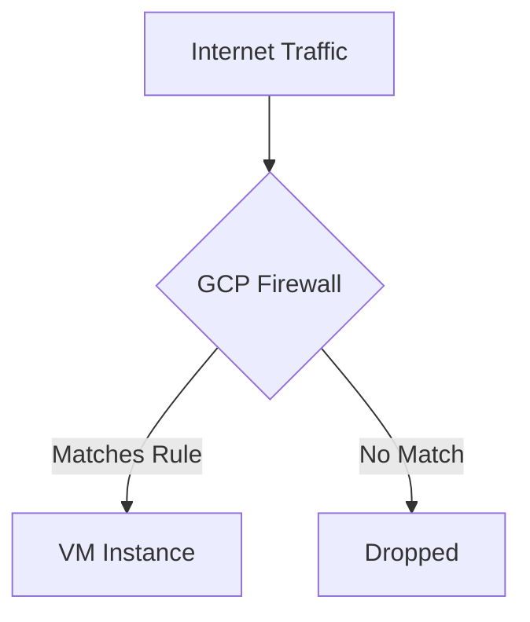
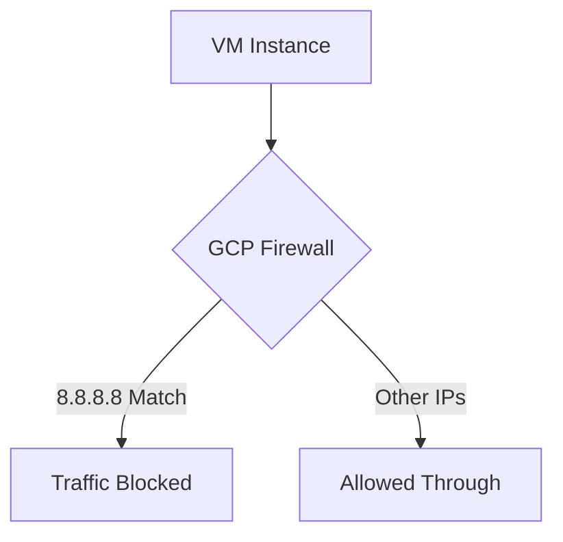

# Session 7: How to Create Firewall Rules and Use Them in GCP

<details open>
<summary><b>How to Create Firewall Rules and Use Them in GCP (KK-CS45-script-v3)</b></summary>

## Table of Contents
- [Overview](#overview)
- [Key Concepts and Deep Dive](#key-concepts-and-deep-dive)
- [Lab Demo: Creating Ingress Firewall Rule](#lab-demo-creating-ingress-firewall-rule)
- [Lab Demo: Creating Egress Firewall Rule](#lab-demo-creating-egress-firewall-rule)
- [Summary](#summary)

## Overview
This session demonstrates how to create and configure firewall rules in Google Cloud Platform (GCP) using the VPC Network console. Firewall rules control traffic flow into (ingress) and out of (egress) your virtual machine instances. The session covers key options including priority levels, targets, source/destination filters, and practical examples for both allowing and blocking traffic.

## Key Concepts and Deep Dive

### Firewall Rules in GCP
Firewall rules are security controls that allow or deny traffic to/from VM instances in your GCP network. They are configured at the VPC network level and can apply to all instances or specific targeted groups.

#### Core Components
- **Name**: Descriptive identifier for the rule
- **Description**: Optional documentation
- **Logs**: Enable/disable traffic logging for monitoring
- **Network**: The VPC network where the rule applies
- **Priority**: Execution order (lower numbers have higher priority, 0 is highest)
- **Direction**: Ingress (inbound) vs Egress (outbound)
- **Action**: Allow or Deny matching traffic
- **Target**: Specifies which instances the rule applies to
- **Source/Destination Filters**: IP ranges, tags, or service accounts
- **Protocols and Ports**: Specific network protocols and port numbers

#### Priority Rules
```diff
+ Lower priority numbers are processed first (0 = highest priority)
+ Range: 0-65535 (65535 = lowest priority)
- Same priority: Deny rules take precedence over Allow rules
+ If multiple rules match, the first matching rule is applied
```

#### Direction Types
- **Ingress**: Controls inbound traffic to your instances
- **Egress**: Controls outbound traffic from your instances

#### Target Options
1. **All instances in network**: Applies to every VM in the VPC
2. **Target tags**: Uses network tags on VMs to selectively apply rules
3. **Service accounts**: Targets VMs based on their service account identity
   ```diff
   + Service accounts are Google Cloud's recommended approach
   + Limits firewall rule management access compared to target tags
   ! Target tags provide more granular instance-level control
   ```

#### Source/Destination Filters
- **IPv4/IPv6 ranges**: CIDR notation (e.g., `0.0.0.0/0` for all addresses)
- **Source/Destination Tags**: Match VMs within the same project that have matching network tags
- **Service Accounts**: For cross-project VM communication

#### Protocols and Security Considerations
```diff
! Never use "Allow all protocols" in production environments
+ Always specify exact protocols and ports needed
- Common protocols: TCP, UDP, ICMP
```
- **TCP**: Connection-oriented protocol (e.g., port 22 for SSH, 80/443 for HTTP/S)
- **UDP**: Connectionless protocol (e.g., port 53 for DNS)
- **ICMP**: Network diagnostic protocol (e.g., ping requests)

## Lab Demo: Creating Ingress Firewall Rule

### Step-by-Step Guide
1. Navigate to VPC Network → Firewall Rules → Create Firewall Rule

2. **Basic Configuration**
   - Name: `firewall-testing`
   - Description: Testing ingress rule for VM access
   - Logs: Off (or On for monitoring)
   - Network: default
   - Priority: 1000

3. **Traffic Direction & Action**
   - Direction: Ingess
   - Action: Allow

4. **Target Configuration**
   - Target: Target tags
   - Target tags: `allow-internet-traffic`

5. **Source Filters**
   - Source filter: IPv4 ranges
   - Source IPv4 ranges: `0.0.0.0/0` (all IPs)

6. **Protocol and Ports**
   ```
   icmp
   ```

7. **Apply to VM**
   - Edit VM → Networking → Network tags: `allow-internet-traffic`
   - Save changes

8. **Verification**
   - Use online ping tool with VM's external IP
   - Expected: Ping succeeds

### Diagram: Ingress Rule Flow


## Lab Demo: Creating Egress Firewall Rule

### Step-by-Step Guide
1. Create new firewall rule for blocking specific traffic

2. **Configuration**
   - Name: `block-google-dns`
   - Network: default
   - Priority: 1000

3. **Traffic Direction & Action**
   - Direction: Egress
   - Action: Deny

4. **Target**
   - Target: Target tags
   - Target tags: `block-google-ip`

5. **Destination Filters**
   - Destination filter: IPv4 ranges
   - Destination IPv4 ranges: `8.8.8.8/32`

6. **Protocol and Ports**
   ```
   icmp
   ```

7. **Apply to VM**
   - Add network tag `block-google-ip` to VM

8. **Verification**
   - Ping 8.8.8.8: Should timeout/fail
   - Ping other IPs: Should succeed

### Diagram: Egress Rule Flow


## Summary

### Key Takeaways
```diff
+ Firewall rules are configured at the VPC network level
+ Priority determines rule evaluation order (lower = higher priority)
+ Target tags provide granular control over which VMs are affected
+ Ingress controls inbound, Egress controls outbound traffic
+ Always specify exact protocols/ports instead of allowing all traffic
+ Service accounts are preferred over target tags for security
! Deny rules take precedence over Allow rules at the same priority level
+ Logs can be enabled for traffic monitoring and troubleshooting
```

### Quick Reference

**Common Firewall Rule Templates:**

```bash
# Allow SSH access from anywhere
Name: allow-ssh
Direction: Ingress
Action: Allow
Targets: Target tags = "ssh-enabled"
Source: 0.0.0.0/0
Protocol: tcp:22

# Allow HTTP/HTTPS from anywhere
Name: allow-web
Direction: Ingress
Action: Allow
Targets: Target tags = "web-server"
Source: 0.0.0.0/0
Protocol: tcp:80,443

# Block all outgoing traffic (except allowed)
Name: default-egress-deny
Direction: Egress
Action: Deny
Targets: All instances in network
Protocol: all
Priority: 65535
```

**CLI Commands for Firewall Management:**
```bash
# List firewall rules
gcloud compute firewall-rules list

# Create ingress rule
gcloud compute firewall-rules create RULE_NAME \
    --direction=INGRESS \
    --priority=1000 \
    --network=default \
    --action=ALLOW \
    --rules=tcp:22 \
    --source-ranges=0.0.0.0/0 \
    --target-tags=TAG_NAME

# Delete firewall rule
gcloud compute firewall-rules delete RULE_NAME
```

### Expert Insight

**Real-world Application:**
Firewall rules are essential for securing GCP deployments. Use target tags to organize VMs by function (web-servers, database-servers, etc.). For multi-project setups, service account-based rules provide better access control. Always follow least-privilege: only open necessary ports and restrict source ranges to specific IP blocks.

**Expert Path:**
Master hierarchical firewall policies for more complex network security. Combine firewall rules with Identity-Aware Proxy (IAP) for zero-trust security. Learn to use Firewall Rules Logging to create monitoring dashboards and detect anomalous traffic patterns.

**Common Pitfalls:**
- Over-using "Allow all protocols" which creates security vulnerabilities
- Forgetting to apply network tags to VMs after creating rules
- Setting same priorities for competing Allow/Deny rules (Deny wins)
- Not considering implicit deny-all rules at priority 65535
- Using ephemeral external IPs without corresponding ingress rules

---

</details>