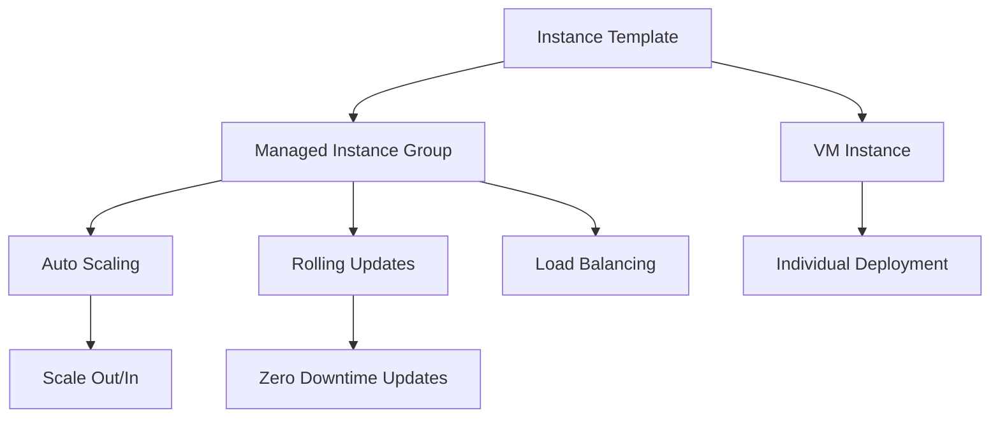

# Session 8: How to Create an Instance Template in GCP (Part 1)

<details open>
<summary><b>[Session: How to Create an Instance Template in GCP (Part 1)] (KK-CS45-script-v3)</b></summary>

## Table of Contents
- [Overview](#overview)
- [Key Concepts/Deep Dive](#key-conceptsdeep-dive)
  - [What is an Instance Template?](#what-is-an-instance-template)
  - [Navigating to Instance Templates in GCP Console](#navigating-to-instance-templates-in-gcp-console)
  - [Instance Template Configuration Options](#instance-template-configuration-options)
  - [Immutable Nature of Instance Templates](#immutable-nature-of-instance-templates)
  - [Using Templates to Create VM Instances](#using-templates-to-create-vm-instances)
  - [Instance Groups and Scaling](#instance-groups-and-scaling)
- [Lab Demo: Creating an Instance Template](#lab-demo-creating-an-instance-template)
- [Lab Demo: Using Template to Create VM Instance](#lab-demo-using-template-to-create-vm-instance)
- [Summary](#summary)

## Overview
This session covers the fundamentals of creating and using Instance Templates in Google Cloud Platform (GCP). Instance Templates are reusable configurations that define the properties of Virtual Machine (VM) instances, making it easier to create multiple identical VMs for scaling and management purposes. The session demonstrates the GCP Console interface for template creation, configuration options, and practical usage scenarios.

## Key Concepts/Deep Dive

### What is an Instance Template?
An **Instance Template** is a predefined configuration blueprint for creating Virtual Machines (VMs) in Google Cloud Platform. It encapsulates all the necessary settings and specifications that define a VM instance, including:

- **Machine Type**: CPU, memory specifications
- **Boot Disk**: Operating system and size
- **Network Configuration**: VPC, subnet, firewall rules
- **Security Settings**: Service accounts, access scopes
- **Metadata**: Custom metadata and startup scripts
- **Labels**: For organization and billing

### Navigating to Instance Templates in GCP Console
Instance Templates are accessed through the Google Cloud Console under the Compute Engine service.

**Navigation Path:**
```
Google Cloud Console → Compute Engine → Instance Templates
```

> [!NOTE]
> Ensure you have appropriate IAM permissions (compute.instanceTemplates.*) to create and manage instance templates in your GCP project.

### Instance Template Configuration Options

#### Machine Configuration
- **Machine Type**: Select from predefined configurations (e.g., n1-standard-1, n2-highcpu-2) or custom CPU/memory combinations
- **Boot Disk**: Choose OS image, disk type (SSD/HDD), and size
- **Confidential VM**: Enable for enhanced security (if available in your region)

#### Networking
- **Network Interface**: Define VPC network, subnet, and external/internal IP allocation
- **Network Tags**: For firewall rule application
- **HTTP/HTTPS Traffic**: Enable for web serving instances

#### Security & Identity
- **Service Account**: Assign identity for API access and resource permissions
- **Access Scopes**: Define OAuth scopes for resource access
- **Shielded VM**: Enable secure boot, vTPM, and integrity monitoring

#### Storage
- **Additional Disks**: Attach persistent disks beyond the boot disk
- **Local SSD**: For high-performance temporary storage

#### Advanced Options
- **Metadata**: Key-value pairs for configuration
- **Labels**: For resource organization and cost allocation
- **Deletion Protection**: Prevent accidental deletion of deployed instances

### Immutable Nature of Instance Templates

```diff
+ Key Point: Instance Templates cannot be edited after creation
- Limitation: Direct editing is not supported through the GCP Console
- Workaround: Use "Create Similar" option to modify and recreate
- Cost: Template creation itself is free (no compute resources allocated)
```

> [!IMPORTANT]
> Once an instance template is created, you cannot modify its configuration directly. This ensures consistency and prevents accidental changes. Use the "Create Similar" feature to make modifications.

### Using Templates to Create VM Instances
Instance templates serve as blueprints for creating individual VM instances or managed instance groups.

**Deployment Methods:**
- Direct VM creation using templates
- Creating Managed Instance Groups (MIGs) for auto-scaling
- Rolling updates for MIGs

### Instance Groups and Scaling
Managed Instance Groups (MIGs) use instance templates to maintain identical VM configurations and enable:
- **Auto-scaling**: Dynamic instance count based on load
- **Rolling Updates**: Gratuitous configuration changes across groups
- **Health Checks**: Automatic instance replacement on failures
- **Load Balancing**: Distribution of traffic across instances

## Lab Demo: Creating an Instance Template

Follow these steps to create your first instance template:

### Step 1: Access Instance Templates
1. Navigate to **Google Cloud Console**
2. Go to **Compute Engine** → **Instance Templates**
3. Click **Create Instance Template**

### Step 2: Basic Configuration
```yaml
# Instance Template Configuration
name: "my-first-template"
machine-type: "n1-standard-1"
region: "us-central1"
zone: "us-central1-a"
```

### Step 3: Machine Configuration
- **Name**: Provide a descriptive name (e.g., `production-web-template`)
- **Machine family**: Select appropriate family (General purpose, Compute optimized, etc.)
- **Series**: Choose series (N1, N2, etc.)
- **Machine type**: Select CPU/memory combination

### Step 4: Boot Disk Setup
```bash
# Boot Disk Configuration
OS: Ubuntu 20.04 LTS
Disk type: SSD
Size: 10 GB
```

### Step 5: Advanced Configurations

#### Service Account Setup
- Choose service account or use default
- Set access scopes appropriately for your use case

#### Networking Configuration
```yaml
network-interface:
  network: default
  subnetwork: default
  external-ip: ephemeral
  http-traffic: enabled
  https-traffic: enabled
```

#### Security Settings
- Enable **IP Forwarding** if needed
- Configure **Deletion Protection** for production environments

### Step 6: Create Template
- Review all configurations
- Click **Create** to save the template

> [!NOTE]
> Template creation is instantaneous and free of charge since no actual VM resources are allocated.

## Lab Demo: Using Template to Create VM Instance

### Method 1: Direct VM Creation from Template
1. Go to **Compute Engine** → **VM Instances**
2. Click **Create Instance**
3. Select **New VM instance from template**
4. Choose your created template
5. Override any necessary settings (name, zone, etc.)
6. Click **Create**

### Method 2: Creating Instance Group
1. Navigate to **Compute Engine** → **Instance Groups**
2. Click **Create Instance Group**
3. Select **New managed instance group**
4. Choose your instance template
5. Specify instance count and auto-scaling policies
6. Click **Create**

### Verification Steps
```bash
# Check template creation
gcloud compute instance-templates list

# Check instances created from template
gcloud compute instances list

# Verify instance group status
gcloud compute instance-groups list-instances [GROUP_NAME] --region [REGION]
```

## Summary

### Key Takeaways
```diff
+ Instance Templates are immutable blueprints for VM configurations
+ Creating templates is free and provides consistency across deployments
+ Templates enable easy scaling through Managed Instance Groups
+ Network and security configurations are defined at template level
+ Use "Create Similar" feature for template modifications
+ Templates support auto-scaling, rolling updates, and load balancing
```

### Quick Reference

**Template Creation Command:**
```bash
gcloud compute instance-templates create [TEMPLATE_NAME] \
  --machine-type=n1-standard-1 \
  --network=default \
  --maintenance-policy=MIGRATE \
  --image-family=ubuntu-2004-lts \
  --image-project=ubuntu-os-cloud \
  --boot-disk-size=10GB \
  --boot-disk-type=pd-ssd
```

**Create VM from Template:**
```bash
gcloud compute instances create [INSTANCE_NAME] \
  --source-instance-template=[TEMPLATE_NAME] \
  --zone=[ZONE]
```

**Create Managed Instance Group:**
```bash
gcloud compute instance-groups managed create [GROUP_NAME] \
  --base-instance-name=[BASE_NAME] \
  --size=[INITIAL_SIZE] \
  --template=[TEMPLATE_NAME] \
  --region=[REGION]
```

### Expert Insight

**Real-World Application:**
Instance Templates are essential for production environments requiring consistent infrastructure. Use them to:
- Deploy application fleets with identical configurations
- Implement blue-green deployments through template versioning
- Create disaster recovery environments with pre-defined specs
- Manage development, staging, and production environments uniformly

**Expert Path:**
- Master template versioning strategies for configuration management
- Implement Infrastructure as Code (IaC) using Terraform for template automation
- Use template metadata for application-specific configurations
- Combine with IAM and resource policies for comprehensive governance

**Common Pitfalls:**
- Avoid over-customization; keep templates simple and reusable
- Remember templates are immutable - plan configurations carefully
- Test templates in non-production environments before production use
- Monitor costs when deploying large instance groups from templates
- Ensure service accounts have minimal required permissions



</details>