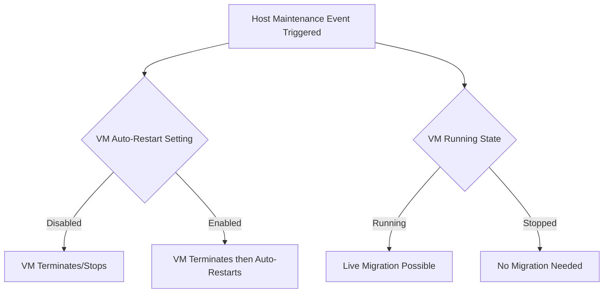

# Session 009: Simulating a Host Maintenance Event in GCP

<details open>
<summary><b>Simulating a Host Maintenance Event in GCP (KK-CS45-script-v3)</b></summary>

## Table of Contents
- [Overview](#overview)
- [Key Concepts](#key-concepts)
  - [Host Maintenance Events](#host-maintenance-events)
  - [VM Behavior Options During Maintenance](#vm-behavior-options-during-maintenance)
  - [Live Migration](#live-migration)
  - [Shutdown Signals and Scripts](#shutdown-signals-and-scripts)
- [Lab Demo: Simulating Host Maintenance](#lab-demo-simulating-host-maintenance)
  - [Creating a VM Instance](#creating-a-vm-instance)
  - [Configuring Automatic Restart](#configuring-automatic-restart)
  - [Simulating Maintenance with Termination](#simulating-maintenance-with-termination)
  - [Simulating Maintenance with Auto-Restart](#simulating-maintenance-with-auto-restart)
- [Summary](#summary)
  - [Key Takeaways](#key-takeaways)
  - [Quick Reference](#quick-reference)
  - [Expert Insights](#expert-insights)

## Overview

This session covers how to simulate and understand host maintenance events in Google Cloud Platform (GCP). Host maintenance involves physical server updates that may require virtual machines (VMs) to be migrated or temporarily stopped. The session demonstrates different VM behavior options during these events and shows live testing scenarios.

The demonstration uses GCP Console to create VM instances and configure their maintenance behavior, showing scenarios where VMs automatically restart or remain stopped during maintenance events.

## Key Concepts

### Host Maintenance Events

Host maintenance events occur when Google Cloud Platform needs to perform hardware updates or maintenance on the physical servers hosting virtual machines. These events can trigger:

- **Live Migration**: VMs are moved to new hosts without interruption
- **Termination**: VMs are stopped, then must be manually restarted
- **Automatic Restart**: VMs stop during maintenance but restart automatically afterward



### VM Behavior Options During Maintenance

GCP VMs have two primary settings for host maintenance behavior:

1. **Terminate VM**: Stops the VM during maintenance
2. **Automatic Restart**: Determines if the VM restarts automatically after being terminated

> [!IMPORTANT]
> These settings are fixed once an instance is created. To test different combinations, create separate VM instances with different configurations.

### Live Migration

During live migration, GCP automatically moves running VMs from one physical host to another. This process:

- Takes approximately 30-60 seconds
- Maintains VM uptime
- Requires no user intervention
- Preserves all running processes and memory state

Live migration occurs when:
- The VM is running during a maintenance event
- Maintenance window allows time for migration
- No manual shutdown is required

### Shutdown Signals and Scripts

Before termination, VMs receive shutdown signals that can trigger custom scripts:

- **Shutdown Signal**: Sent to the OS before termination
- **Custom Scripts**: Can be configured to backup data, save memory state, or perform cleanup
- **Documentation**: Shutdown signals and scripts are logged in system events

## Lab Demo: Simulating Host Maintenance

### Creating a VM Instance

1. Navigate to GCP Console > Compute Engine > VM instances
2. Click "Create Instance"
3. Configure basic VM settings (machine type, OS, etc.)
4. Under "Advanced options" > "Availability policies"

### Configuring Automatic Restart

```
Location: VM Instance Details > Edit
Setting: Availability policies > Automatic restart

Options:
- On: VM restarts automatically after maintenance termination
- Off: VM remains stopped after maintenance termination
```

### Simulating Maintenance with Termination

**Scenario 1: Stop During Maintenance (Auto-Restart Disabled)**

1. Create VM with "Automatic restart: Off"
2. Navigate to VM details > Operations > Simulate maintenance event
3. Select "Terminate and simulate maintenance"
4. Observe VM status changes:
   ```
   Running → Terminating → Stopped
   ```
5. VM remains stopped (manual restart required)

**Expected Results:**
- VM terminates during simulated maintenance
- No automatic restart occurs
- Manual intervention needed to restart VM

### Simulating Maintenance with Auto-Restart

**Scenario 2: Stop and Restart During Maintenance (Auto-Restart Enabled)**

1. Edit VM settings to enable "Automatic restart"
2. Trigger maintenance simulation again
3. Observe complete cycle:
   ```
   Running → Terminating → Stopped → Starting → Running
   ```
4. VM automatically recovers post-maintenance

**Expected Results:**
- VM terminates during maintenance
- Automatic restart occurs
- Service continuity maintained
- Events logged in Operations history

**Scenario 3: Live Migration (VM Running During Maintenance)**

When VMs remain running during maintenance:

1. Maintenance event detects running VM
2. Live migration initiated
3. VM automatically moved to new host
4. Brief connectivity interruption (~30-60 seconds)
5. All processes and memory preserved

> [!NOTE]
> Live migration provides seamless experience for running workloads, while termination scenarios help test application recovery procedures.

## Summary

### Key Takeaways

```diff
+ Host maintenance events are unavoidable in cloud environments
+ Live migration provides minimal downtime for running VMs
+ Termination settings allow testing different recovery scenarios
+ Automatic restart policies affect operational continuity
+ Pre-termination signals enable graceful shutdown procedures
- Incorrect maintenance settings can cause service disruptions
- Not monitoring maintenance events leads to unexpected outages
! Always test maintenance behavior in non-production environments first
```

### Quick Reference

**GCP Console Navigation:**
- VM Instances → Instance name → Operations → Simulate maintenance event

**Maintenance Options:**
```yaml
Availability Policies:
  automatic_restart: [true/false]  # Enables post-termination restart
  on_host_maintenance: terminate   # Fixed setting - always terminates
```

**Behavior Matrix:**
| Auto-Restart | During Maintenance | After Maintenance |
|-------------|-------------------|------------------|
| Disabled | VM Terminates | Remains Stopped |
| Enabled | VM Terminates | Auto-Restarts |

### Expert Insights

**Real-world Application:**
In production environments, configure VMs based on application requirements:
- Critical services: Enable auto-restart for high availability
- Stateless apps: Use auto-restart to minimize downtime
- Stateful apps: Configure shutdown scripts for data persistence
- Batch jobs: May tolerate longer downtime periods

**Expert Path:**
- Master GCP monitoring and alerting for maintenance events
- Integrate maintenance notifications with incident management systems
- Implement automated backup triggers on maintenance events
- Develop comprehensive maintenance testing strategies

**Common Pitfalls:**
- Forgetting that maintenance policies are immutable after VM creation
- Not accounting for the ~60-second live migration window
- Failing to capture and handle shutdown signals properly
- Over-relying on auto-restart without testing manual recovery procedures

</details>