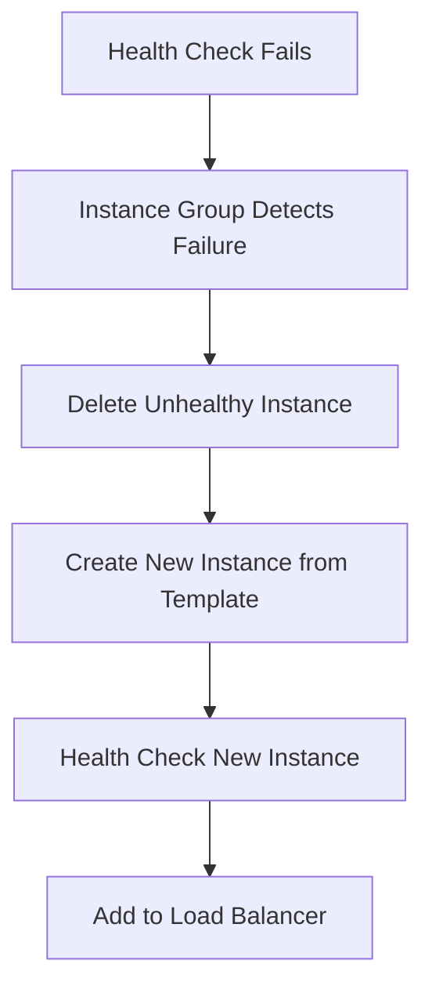

<details open>
<summary><b>[Session/Section Name] (KK-CS45-script-v3)</b></summary>

# Session 010: How to Create Instance Group in GCP

## Table of Contents
- [Overview](#overview)
- [Key Concepts](#key-concepts)
- [Instance Group Types](#instance-group-types)
- [Zone Selection Strategies](#zone-selection-strategies)
- [Auto-scaling Configuration](#auto-scaling-configuration)
- [Health Checks and Auto-healing](#health-checks-and-auto-healing)
- [Lab Demo: Creating a Managed Instance Group](#lab-demo-creating-a-managed-instance-group)
- [Summary](#summary)

## Overview
This session covers Google Cloud Platform (GCP) Instance Groups, which provide autoscaling, auto-healing, and load balancing capabilities for virtual machines (VMs). We'll explore managed instance groups using instance templates, zone distribution options, and configuration for production workloads.

## Key Concepts

### Instance Groups in GCP

Instance Groups are collections of VM instances that can be managed as a single unit. They provide:

- **Autoscaling**: Automatic scaling based on traffic demands
- **Auto-healing**: Self-repairing instances when they fail
- **Load Balancing**: Distributing traffic across healthy instances
- **Rolling Updates**: Updating instances without downtime

Instance Groups come in two main types:

- **Managed Instance Groups (MIGs)**: GCP manages the instances lifecycle
- **Unmanaged Instance Groups**: You manually manage individual instances

### Instance Templates

Instance Templates define the configuration for VMs created by managed instance groups:
- Machine type, disk configuration, network settings
- Startup scripts and metadata
- OS images and software configurations

Templates are immutable once created but can be versioned for updates.

## Instance Group Types

### Stateless Instance Groups
Default configuration where instances don't store persistent data:
- No local disk persistence
- Traffic handled through backend services (databases, APIs)
- Auto-healing replaces failed instances without data preservation

### Stateful Instance Groups
Instances maintain persistent state across restarts:
- Disks and IP addresses preserved
- Suitable for stateful applications requiring data persistence

### Unmanaged Instance Groups
Existing VMs grouped manually:
- No autoscaling or auto-healing
- For pre-existing instances needing load balancing

## Zone Selection Strategies

### Single Zone
- All instances in one zone
- Simple configuration
- Risk: Zone failure impacts entire group

### Multi-zone (Recommended)
- Instances distributed across multiple zones
- High availability and fault tolerance
- Target distribution options:

#### Even Distribution
- Distributes instances evenly across all selected zones
- Example: 12 instances across 4 zones = 3 instances per zone

#### Balanced Distribution
- Places instances in zones with available capacity
- Optimizes resource utilization
- Similar to Even but considers current zone capacity

#### Any Single Zone (Preview)
- All instances in one randomly selected zone
- Not recommended for production workloads

## Auto-scaling Configuration

### Scale Out Mode
- Only increases instance count
- Manual reduction required
- Suitable for minimum instance guarantees

### Autoscaling On (Full Mode)
- Automatic increase and decrease
- Based on defined metrics

### Autoscaling Off
- Fixed instance count
- No automatic adjustments

### Autoscaling Metrics
- **CPU Utilization** (default): Scales when average CPU > threshold
- **Load Balancer**: Based on backend service load
- **Cloud Monitoring**: Custom metrics
- **Cloud Pub/Sub**: Message queue metrics

### Predictive Autoscaling (Preview)
- Uses machine learning to predict future load
- Based on historical usage patterns
- Prevents scaling delays for periodic traffic spikes

## Health Checks and Auto-healing

Health checks continuously monitor instance health:
- HTTP/HTTPS endpoints
- TCP connections
- SSL certificates

Auto-healing workflow:


> [!IMPORTANT]
> Ensure health checks can reach instances. Firewall rules must allow health check traffic, or infinite replacement loops will occur.

## Lab Demo: Creating a Managed Instance Group

Follow these steps to create a managed instance group:

### Step 1: Navigate to Instance Groups
1. Go to GCP Console → Compute Engine → Instance Groups
2. Click "Create Instance Group"

### Step 2: Configure Basic Settings
```
Name: my-new-ig
Location: Choose region and zones
  - Recommended: Multi-zone for high availability
  - Distribution: Even (distributes instances equally)
```

### Step 3: Select Instance Template
- Choose from existing templates
- Or create new template inline

### Step 4: Configure Autoscaling
```yaml
Minimum instances: 2
Maximum instances: 5
Autoscaling mode: On
Metric: CPU utilization > 60%
Predictive autoscaling: Enabled
```

### Step 5: Configure Auto-healing
- Enable auto-healing
- Select or create health check
- Ensure health check endpoints are accessible

### Step 6: Port Mapping (Optional)
- Configure key-value pairs for load balancing
- Advanced feature for API-based management

### Step 7: Create the Instance Group
- Click "Create"
- Wait for instances to be created and become healthy

### Verification
```bash
# Check instance group details
gcloud compute instance-groups list

# View instances in group
gcloud compute instance-groups list-instances my-new-ig
```

## Summary

### Key Takeaways
```diff
+ Instance Groups enable autoscaling and auto-healing for VM fleets
+ Multi-zone deployment provides high availability and fault tolerance
+ Autoscaling based on CPU, load balancer, or custom metrics
+ Health checks prevent infinite replacement loops
+ Instance Templates ensure consistent VM configuration
- Single zone groups risk complete service outage on zone failure
- Ensure health check traffic is allowed through firewalls
- Stateless groups lose data on instance replacement
```

### Quick Reference

**Basic Instance Group Creation:**
```bash
gcloud compute instance-groups managed create my-new-ig \
  --template=my-template \
  --size=2 \
  --zone=us-central1-a
```

**Autoscaling Configuration:**
```bash
gcloud compute instance-groups managed set-autoscaling my-new-ig \
  --min-num-replicas=2 \
  --max-num-replicas=5 \
  --target-cpu-utilization=0.6
```

### Expert Insight

**Real-world Application**: Use managed instance groups for web applications, microservices, and API backends requiring elasticity. Combine with load balancers for external traffic and health checks for self-healing infrastructure.

**Expert Path**: Master instance templates versioning, custom metrics for autoscaling, and rolling update strategies. Learn integration with Cloud Deployment Manager and Terraform for infrastructure as code.

**Common Pitfalls**: 
- Misconfigured health checks causing replacement loops
- Single-zone deployments risking availability 
- Autoscaling metrics not aligned with actual bottlenecks
- Forgetting to configure network security for health checks

</details>
