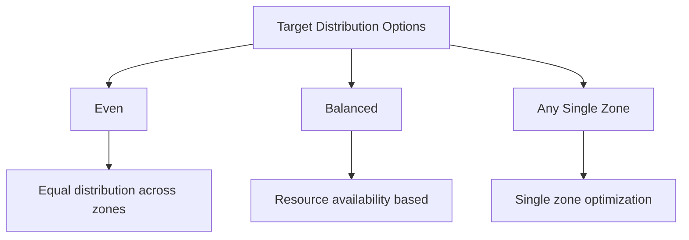

# How to Create Instance Group in GCP (In Hindi)

<details open>
<summary><b>How to Create Instance Group in GCP (KK-CS45-script-v3)</b></summary>

# Session 010: How to Create Instance Group in GCP

## Table of Contents
- [Overview](#overview)
- [Instance Templates and Groups](#instance-templates-and-groups)
- [Zone Selection (Single vs Multi-Zone)](#zone-selection-single-vs-multi-zone)
- [Target Distribution Options](#target-distribution-options)
- [Auto Scaling Configuration](#auto-scaling-configuration)
- [Auto Healing with Health Checks](#auto-healing-with-health-checks)
- [Stateless vs Stateful Instance Groups](#stateless-vs-stateful-instance-groups)
- [Unmanaged Instance Groups](#unmanaged-instance-groups)
- [Instance Group Monitoring and Management](#instance-group-monitoring-and-management)
- [Summary](#summary)

## Overview
This session demonstrates how to create Instance Groups in Google Cloud Platform (GCP) using Instance Templates. It covers configuration options including zone selection, auto-scaling, auto-healing, and the differences between stateless and stateful instance groups. The instructor walks through creating a managed instance group and explains various distribution strategies and monitoring options.

## Instance Templates and Groups
### Instance Templates as Building Blocks
Instance Groups are created from Instance Templates that define the VM configuration. When creating an instance group:
1. Access the Instance Groups section in GCP Console
2. Choose an existing template or create a new one inline
3. Configure the desired number of instances

### Key Relationship
- **Instance Template**: Defines the base configuration for VMs (machine type, OS, disks, networking)
- **Instance Group**: Creates and manages multiple VM instances based on the template

## Zone Selection (Single vs Multi-Zone)

### Single Zone Deployment
- Deploys all instances in one availability zone
- **Advantage**: Simple configuration and lower costs
- **Risk**: If the zone goes down, all instances become unavailable

### Multi-Zone Deployment
- Distributes instances across multiple availability zones
- **Advantage**: High availability - survives zone-level outages
- **Consideration**: Use when traffic is geographically distributed or HA is critical

> [!IMPORTANT]
> Always evaluate your redundancy requirements. Single-zone is simpler but less resilient.

## Target Distribution Options

The instance group offers three distribution strategies:

### Even Distribution
- Distributes instances evenly across selected zones
- **Example**: 12 instances across 4 zones = 3 instances per zone
- Best for balanced load and resource utilization

### Balanced Distribution
- Places instances in zones with available capacity
- Similar to even but prioritizes available resources
- Useful when zones have different capacity levels

### Any Single Zone
- Places all instances in one optimal zone (currently in preview)
- Not recommended for production HA requirements



## Auto Scaling Configuration

### Scale Out Only vs Auto Scale
- **Scale Out Only**: Increases instances based on rules but never decreases them
- **Auto Scale**: Increases and decreases instances automatically based on metrics

### Configuration Steps
1. Enable auto-scaling in instance group settings
2. Set minimum and maximum instance counts
3. Define scaling metrics (CPU utilization, custom metrics, etc.)
4. Configure cooldown periods

### Scaling Metrics
- **CPU Utilization**: Primary metric, typically set to 60%
- **Cloud Load Balancing**: Request rates and latency
- **Custom Metrics**: Via Cloud Monitoring
- **Predictive Auto Scaling**: Uses ML to predict future load based on historical data

## Auto Healing with Health Checks

### Health Check Functionality
- Monitors instance health continuously
- Replaces unhealthy instances automatically
- Requires successful health check probes

### Configuration Considerations
- Ensure health checks can reach instances (firewall rules, ports)
- Correct protocol configuration (HTTP/HTTPS vs TCP)
- Prevent infinite replacement loops

> [!WARNING]
> Improper health check configuration can cause instance groups to continuously recreate instances, leading to resource waste and potential downtime.

## Stateless vs Stateful Instance Groups

### Stateless Instance Groups
- **Characteristics**:
  - No persistent state or data
  - Instances can be replaced freely
  - Ideal for web servers, application servers
- **Behavior**: Auto-scaling replaces unhealthy instances seamlessly
- **Data Management**: Application communicates with external databases, caches

### Stateful Instance Groups
- **Characteristics**:
  - Preserves persistent disks and static IPs
  - Explicit state management required
  - Suitable for databases, file servers with local storage

### Key Difference Table

| Aspect | Stateless | Stateful |
|--------|-----------|----------|
| Data Persistence | None (external) | Yes (disks, IPs) |
| Instance Replacement | Automatic | Managed |
| Use Cases | Web servers, APIs | Databases, file servers |
| Complexity | Low | High |

## Unmanaged Instance Groups

### Use Case
- For existing VMs that need group functionality
- Manual addition of instances (can be heterogeneous)
- Useful for legacy deployments or custom instance management

### Creation Process
1. Select "Unmanaged" type
2. Add existing VM instances manually
3. Can be attached to load balancers

### Limitations
- No auto-scaling built-in
- Less automation compared to managed groups
- Manual instance management required

## Instance Group Monitoring and Management

### Monitoring Features
- Traffic patterns and error analysis
- Instance health status
- CPU, memory, and network utilization

### Management Operations
- **Update VMs**: Deploy new templates, rolling updates
- **Rolling Restart**: Graceful instance restarts
- **Rolling Replace**: Instance replacement with new configurations
- **Canary Testing**: Gradual deployment of changes

### Instance Details
- Random instance names with timestamps
- Public/external IPs assigned automatically
- Zone distribution visible in console

## Summary

### Key Takeaways
```diff
+ Instance Groups create and manage VM instances from templates
+ Choose multi-zone deployment for high availability
+ Auto-scaling adapts to traffic patterns using various metrics
+ Health checks enable automatic healing of unhealthy instances
+ Stateless groups are ideal for applications without persistent data needs
+ Stateful groups preserve disk and IP state for database workloads
+ Unmanaged groups work with existing VMs for group functionality
```

### Quick Reference

**Instance Group Types:**
- **Managed Stateless**: Auto-scaling, auto-healing, load balancing
- **Managed Stateful**: Persistent state, manual scaling
- **Unmanaged**: Existing VMs grouped together

**Common Configuration Settings:**
- Minimum/Maximum instances: 2-5 (typical baseline)
- CPU threshold: 60% utilization
- Scaling metrics: CPU, request rates, custom monitoring

**Zone Distribution Options:**
- Even: Balanced across zones
- Balanced: Based on zone capacity
- Any Single Zone: Single zone focus (preview)

### Expert Insight

#### Real-World Application
In production environments, managed instance groups are commonly used behind load balancers for web applications. For example, a microservices architecture might deploy stateless API servers across multiple zones with auto-scaling enabled, automatically handling traffic spikes during peak hours while maintaining cost efficiency during low periods.

#### Expert Path
To master instance groups, study deployment patterns for different application types. Focus on canary deployments, blue-green deployments using instance group updates, and integrating with Cloud Monitoring for comprehensive observability. Practice with different auto-scaling metrics and health check configurations.

#### Common Pitfalls
- **Improper Health Checks**: Leading to infinite replacement loops - always test connectivity
- **Over-Provisioning**: Setting too high maximums increases costs unnecessarily
- **Single Zone Deployment**: For critical applications, causing failure during zone outages
- **Underestimating Stateful Needs**: Choosing stateless when persistent storage is required
- **Ignoring Cooldown Periods**: Rapid scaling causing instability

</details>