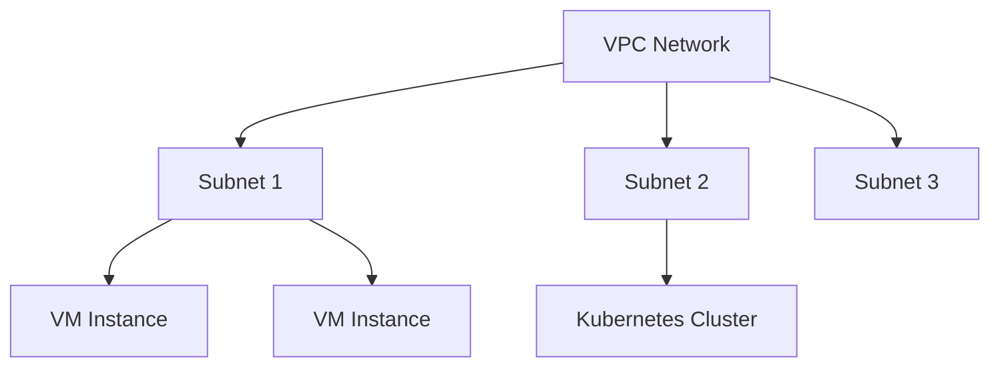

<details open>
<summary><b>Session 011: Expanding a Subnet GCP in Hindi (KK-CS45-script-v3)</b></summary>

# Session 011: Expanding a Subnet GCP in Hindi

## Table of Contents
- [Overview](#overview)
- [Key Concepts/Deep Dive](#key-conceptsdeep-dive)
  - [Understanding VPC Networks](#understanding-vpc-networks)
  - [Subnet Fundamentals](#subnet-fundamentals)
  - [When to Expand a Subnet](#when-to-expand-a-subnet)
  - [Expansion Process](#expansion-process)
- [Lab Demo: Expanding a Subnet](#lab-demo-expanding-a-subnet)
- [Summary](#summary)

## Overview

This session covers the process of expanding subnet ranges within Google Cloud Platform's Virtual Private Cloud (VPC) networks. We'll explore subnet fundamentals, limitations, and the step-by-step process to safely expand subnet CIDR ranges to accommodate growing infrastructure needs.

### What You'll Learn
- VPC and subnet architecture in GCP
- Subnet expansion requirements and constraints
- Practical steps to expand subnet CIDR ranges
- Best practices for network planning

## Key Concepts/Deep Dive

### Understanding VPC Networks

Google Cloud VPC (Virtual Private Cloud) provides networking functionality to Compute Engine virtual machine (VM) instances, Kubernetes Engine clusters, and other GCP resources.



#### VPC Components
- **Network**: A virtual version of a physical network, isolated from other networks
- **Subnet**: A regional segment within a VPC network
- **Routes**: Define paths for network traffic within VPC
- **Firewall Rules**: Control inbound and outbound traffic

### Subnet Fundamentals

A subnet in GCP is a regional resource that defines a range of IP addresses within a VPC network.

**Key Characteristics:**
- Regional scope (not global)
- Defined by CIDR notation (e.g., 10.0.1.0/24)
- Secondary IP ranges can be defined for different purposes
- Primary and secondary ranges can be expanded independently

**Primary vs Secondary Ranges:**
- **Primary Range**: Used by VM instances for internal communication
- **Secondary Range**: Reserved for specific services (e.g., Kubernetes pods)

### When to Expand a Subnet

Subnet expansion becomes necessary when:
- Current IP address range is nearly exhausted
- Planning for infrastructure growth
- Adding new services that require more IP addresses
- Optimizing network architecture

> [!IMPORTANT]
> Subnet CIDR ranges can only be expanded, never shrunk, due to potential IP conflicts and service disruptions.

### Expansion Process

#### Requirements and Constraints
- Expansion must be within the VPC network's IP range
- Can only expand to unused IP space in the VPC
- Secondary ranges have same expansion rules
- Process requires careful planning to avoid conflicts

#### Expansion Rules
- **Primary Range**: Can expand within VPC network boundaries
- **Secondary Range**: Can expand independently but within VPC limits
- **Automatic Expansion**: GKE clusters can auto-expand node pools
- **Manual Expansion**: Requires explicit subnet update commands

## Lab Demo: Expanding a Subnet

### Scenario
You have a VPC network `my-network` with subnet `my-subnet` in region `us-central1`. The current primary range is `10.0.1.0/24` and you need to expand it to accommodate 500+ VMs.

### Step-by-Step Process

#### Step 1: Verify Current Subnet Configuration
```bash
# Check current VPC and subnet details
gcloud compute networks subnets describe my-subnet \
    --region=us-central1 \
    --format="table(name,network,ipCidrRange,secondaryIpRanges.rangeName,secondaryIpRanges.ipCidrRange)"
```

#### Step 2: Plan the Expansion
```bash
# Calculate required IP addresses
# Current: 10.0.1.0/24 = 256 IP addresses
# Required: 512 IP addresses = /23 (10.0.0.0/23 has 512 IPs)
# New range: 10.0.0.0/23 (covers both 10.0.0.0/24 and 10.0.1.0/24)
```

#### Step 3: Verify VPC Network Range
```bash
# Check VPC network IP range
gcloud compute networks describe my-network \
    --format="get(ipv4Range)"
```

> [!WARNING]
> Ensure the new subnet range fits within the VPC network's allocated IP space.

#### Step 4: Expand the Subnet
```bash
# Expand the subnet to new CIDR range
gcloud compute networks subnets expand-ip-range my-subnet \
    --region=us-central1 \
    --prefix-length=23

# Alternative: specify exact range
gcloud compute networks subnets expand-ip-range my-subnet \
    --region=us-central1 \
    --ip-cidr-range=10.0.0.0/23
```

#### Step 5: Verify the Expansion
```bash
# Confirm the new subnet configuration
gcloud compute networks subnets describe my-subnet \
    --region=us-central1 \
    --format="table(name,ipCidrRange,creationTimestamp)"
```

#### Step 6: Update Firewall Rules (if needed)
```bash
# Review and update firewall rules if necessary
gcloud compute firewall-rules list \
    --filter="network:my-network" \
    --format="table(name,targetTags,sourceRanges,direction,allowed)"
```

### Common Issues and Solutions

**Issue: Expansion fails due to overlapping ranges**
```bash
# Check for overlapping subnets in the region
gcloud compute networks subnets list \
    --regions=us-central1 \
    --filter="network:my-network" \
    --format="table(name,ipCidrRange,region)"
```

**Solution:** Choose a non-overlapping IP range within VPC boundaries

## Summary

### Key Takeaways
```diff
+ VPC networks provide isolated networking for GCP resources
+ Subnets are regional resources defining IP address ranges
+ Subnet expansion allows accommodating infrastructure growth
+ Primary and secondary ranges can be expanded independently
+ Expansion requires careful planning to avoid IP conflicts
+ gcloud compute networks subnets expand-ip-range is the primary command
+ Process is irreversible - ranges can only be expanded, not shrunk
+ Always verify VPC network boundaries before expansion
```

### Quick Reference

**Essential Commands:**
```bash
# Check subnet details
gcloud compute networks subnets describe SUBNET_NAME --region=REGION

# Expand subnet CIDR range
gcloud compute networks subnets expand-ip-range SUBNET_NAME \
    --region=REGION \
    --prefix-length=NEW_PREFIX

# List all subnets in VPC
gcloud compute networks subnets list --network=VPC_NAME
```

**CIDR Calculation Guide:**
- /24 = 256 IP addresses
- /23 = 512 IP addresses
- /22 = 1024 IP addresses
- /21 = 2048 IP addresses

### Expert Insight

#### Real-world Application
In enterprise environments, subnet expansion is critical for:
- **Scaling applications** during traffic spikes
- **Kubernetes cluster growth** requiring more pod IPs
- **Multi-tenant architectures** needing larger address spaces
- **Disaster recovery** scenarios with dynamic resource allocation

#### Expert Path
- **Monitor IP utilization** using Cloud Monitoring metrics
- **Implement IP address management (IPAM)** solutions for large deployments
- **Design subnet hierarchies** considering future expansion needs
- **Use secondary ranges** strategically for services like GKE pods
- **Automate expansion** with Infrastructure as Code (IaC) tools

#### Common Pitfalls
```diff
- Don't expand subnets without proper planning
- Avoid overlapping IP ranges with existing subnets
- Don't forget to update firewall rules after expansion
- Beware of service dependencies that might break during expansion
- Never assume expansion is instantaneous - allow time for propagation
```

</details>
