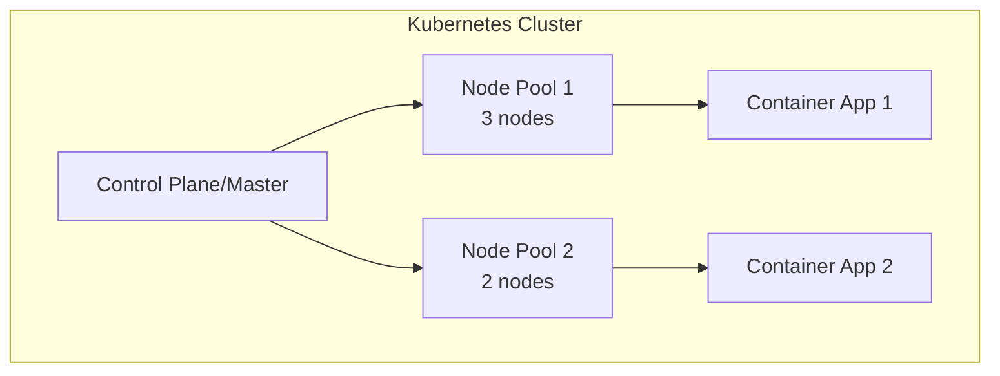

# Session 12: Creating a Kubernetes Cluster in GCP

<details open>
<summary><b>Session 12: Creating a Kubernetes Cluster in GCP (KK-CS45-script-v3)</b></summary>

## Table of Contents
- [Overview](#overview)
- [Key Concepts and Deep Dive](#key-concepts-and-deep-dive)
  - [Kubernetes Cluster Types](#kubernetes-cluster-types)
  - [Node Pools and Workers](#node-pools-and-workers)
  - [Auto-Scaling Configuration](#auto-scaling-configuration)
  - [Machine Types and Spot Instances](#machine-types-and-spot-instances)
  - [Geographic Distribution](#geographic-distribution)
  - [Networking and Pod Limits](#networking-and-pod-limits)
- [Lab Demo: Creating a Kubernetes Cluster](#lab-demo-creating-a-kubernetes-cluster)
- [Summary](#summary)

## Overview

This session covers the fundamental steps for creating a Kubernetes (K8s) cluster on Google Cloud Platform (GCP). You'll learn about the different cluster modes (Autopilot vs Standard), configuration options for node pools, auto-scaling, machine types, and networking considerations. The session demonstrates a hands-on approach to cluster creation through the GCP console, taking approximately 5 minutes to complete.

The demo focuses on creating a production-ready cluster suitable for running containerized applications, with emphasis on understanding the trade-offs between cost, availability, and performance.

## Key Concepts and Deep Dive

### Kubernetes Cluster Types

**Autopilot Mode:**
```diff
+ Pay-per-use pricing: Only pay for the compute resources your workloads actually consume
+ Fully managed: GCP handles node management, scaling, and upgrades automatically
- Higher complexity for networking and storage configurations
- Less control over underlying infrastructure compared to Standard mode
```

**Standard Mode:**
```diff
+ Full control: Customize nodes, networking, and storage to exact specifications
+ Predictable pricing: Pay for control-plane even when workloads are idle
+ More advanced features available for enterprise deployments
- Manual management required for scaling and maintenance
- Higher cost for development/test environments with variable workload
```

Choose Autopilot for:
- Variable workloads
- Cost optimization is critical
- You prefer GCP-manged operations

Choose Standard for:
- Predictable workloads
- Need full control over infrastructure
- Advanced networking/storage requirements

### Node Pools and Workers

**Node Pools** are groups of worker nodes with identical configurations that run your containerized applications. Each node in a Kubernetes cluster runs containers and is managed by the master/control plane.

**Architecture Overview:**


> [!IMPORTANT]
> The control plane (master node) is fully managed by GCP and not directly accessible. Worker nodes run your applications and are visible in Compute Engine.

### Auto-Scaling Configuration

Auto-scaling automatically adjusts the number of nodes based on workload demands:

**Scaling Parameters:**
- **Minimum nodes**: Base capacity maintained even during low load
- **Maximum nodes**: Upper limit to control costs and prevent over-provisioning
- **Scale-up trigger**: Resource utilization thresholds (CPU/Memory)
- **Scale-down conditions**: How long nodes remain idle before removal

```yaml
# Example scaling configuration
autoScaling:
  enabled: true
  minNodeCount: 2
  maxNodeCount: 10
```

### Machine Types and Spot Instances

**Machine Types Comparison:**

| Machine Type | vCPUs | Memory | Use Case |
|-------------|-------|--------|----------|
| e2-micro | 0.2 | 1GB | Development, small services |
| e2-small | 0.5 | 2GB | Light workloads, microservices |
| e2-medium | 1 | 4GB | Standard workloads |
| n2-standard-2 | 2 | 8GB | Higher performance applications |
| n2-highmem-4 | 4 | 32GB | Memory-intensive applications |

**Spot Instances:**
```diff
+ Up to 90% cost savings compared to regular instances
- Google Cloud can terminate instances with short notice (milliseconds)
- Not suitable for critical workloads or databases
! Perfect for batch processing, analytics, CI/CD pipelines
```

### Geographic Distribution

**Region vs Zone Selection:**
- **Regions**: Geographic areas (e.g., us-central1, asia-south1)
- **Zones**: Specific data centers within regions (e.g., us-central1-a, us-central1-b)

**Best Practices:**
- Choose regions close to users for lower latency
- Use multi-zone deployment for high availability
- Consider data sovereignty requirements

### Networking and Pod Limits

**Pod Limits:**
- **Maximum pods per node**: 110 (hard limit)
- **Default range**: Based on machine type family

**IP Address Management:**
```yaml
# Default networking configuration
networking:
  podsPerNode: 110
  servicesPerCluster: 30000
  nodesPerCluster: 15000
```

## Lab Demo: Creating a Kubernetes Cluster

Follow these steps to create a production-ready Kubernetes cluster:

### Step 1: Navigate to Kubernetes Engine
1. Access GCP Console
2. Go to "Kubernetes Engine" → "Clusters"
3. Click "Create" button

### Step 2: Choose Cluster Mode
**Option A: Autopilot Mode**
```bash
# Pay-per-use - only for consumed resources
# Recommended for: Cost-conscious deployments, variable workloads
```
- Select "Autopilot" for managed operations

**Option B: Standard Mode**  
```bash
# Fixed control-plane cost + usage-based worker costs  
# Recommended for: Full control, predictable workloads
```
- Select "Standard" for maximum configurability

### Step 3: Configure Cluster Settings
```bash
# Cluster Details
Name: my-k8s-cluster
Location: 
  - Region: asia-south1 (Mumbai) [Choose based on users]
  - Zone: asia-south1-a [Primary zone]

# Control Plane Version
Kubernetes Version: 1.29.x (latest stable)
Release Channel: Regular [balanced between stability and features]
```

### Step 4: Node Pool Configuration
```bash
# Default Node Pool
Node Pool Name: default-pool
Number of Nodes: 3 [For high availability]

# Auto-scaling (Recommended)
Enable auto-scaling: Yes
Min nodes: 1 [Maintain minimum capacity]
Max nodes: 5 [Scale up to 5 nodes during peak load]
```

### Step 5: Machine Type Selection
```bash
# Choose based on workload requirements
Machine Type: e2-medium [1 vCPU, 4GB RAM]
# Alternative options:
# - e2-small (0.5 vCPU, 2GB) - for light workloads
# - n2-standard-2 (2 vCPU, 8GB) - for heavier applications
```

### Step 6: Cost Optimization Options
```bash
# Spot Instances - NOT recommended for critical applications
Enable Spot VMs: No [Can be shut down anytime]

# Preemptible VMs
Enable Preemptible VMs: No [For non-critical workloads only]
```

### Step 7: Networking Configuration
```bash
# Network: default
# Subnetwork: default
# Max pods per node: 110 [Hard limit in GKE]

# Service Account
Service Account: Default Compute Engine service account
```

### Step 8: Create the Cluster
1. Click "Create" button
2. Wait approximately 5 minutes for cluster provisioning
3. Verify cluster creation in the console

**Verification Commands:**
```bash
# Connect to cluster
gcloud container clusters get-credentials my-k8s-cluster --region asia-south1

# Verify nodes
kubectl get nodes
# Output shows 3 worker nodes created

# Check cluster info
kubectl cluster-info
```

## Summary

### Key Takeaways
```diff
+ Understand Autopilot vs Standard modes: Autopilot for cost-optimized variable workloads, Standard for full control and predictability
+ Always enable auto-scaling in Standard mode to adapt to workload changes and optimize costs
+ Choose appropriate machine types based on application CPU/memory requirements
+ Spot instances offer massive cost savings but risk termination for non-critical workloads only
+ Multi-zone deployment within a region provides better availability than single-zone
+ Default pod limit is 110 per node - consider this when designing applications
- Avoid using Spot instances for stateful applications, databases, or production-critical services
! Control plane is fully managed - you only manage worker nodes in Standard mode
! Always test cluster configurations in non-production environments first
```

### Quick Reference
```bash
# List clusters
gcloud container clusters list

# Get cluster credentials
gcloud container clusters get-credentials CLUSTER_NAME --region REGION

# Check node status
kubectl get nodes

# View cluster events
kubectl get events

# Scale node pool manually
gcloud container clusters resize CLUSTER_NAME --num-nodes=5 --region=REGION
```

### Expert Insights

**Real-world Application:**
- **Microservices**: Use Autopilot for teams focusing on application logic rather than infrastructure
- **CI/CD Pipelines**: Leverage Spot instances for cost-effective build agents and testing environments  
- **Production Deployments**: Standard mode with regional clusters and proper backup strategies for enterprise workloads

**Expert Path:**
- **Master Networking**: Deep dive into GKE networking (VPC-native clusters, Cloud DNS integration)
- **Security Hardening**: Implement Workload Identity, Binary Authorization, and network policies
- **Multi-cluster Management**: Learn GKE Hub for managing multiple clusters across environments
- **Cost Optimization**: Implement node auto-provisioning, resource quotas, and vertical pod autoscaling
- **Observability**: Set up Cloud Monitoring, Logging, and custom metrics for cluster health

**Common Pitfalls:**
- **Zone vs Region Confusion**: Always verify the selected location matches your availability requirements
- **Machine Type Undersizing**: Starting too small leads to performance issues and forced migrations
- **Spot Instance Abuse**: Using Spot VMs for critical workloads causing unexpected outages
- **Pod Limits**: Ignoring the 110 pod per node limit leading to scheduling failures
- **Service Account Permissions**: Incorrect IAM roles preventing workloads from accessing GCP services
- **Control Plane Version**: Running outdated versions missing security patches

</details>
