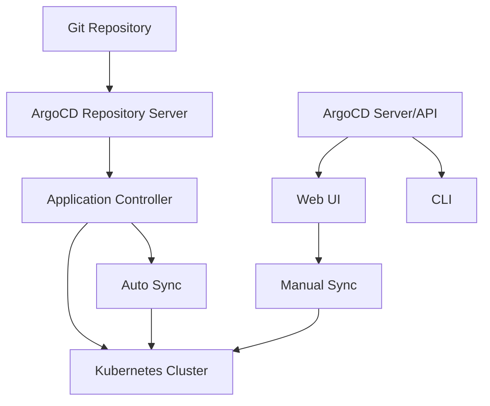

# Session 013: Installing ArgoCD on Google Kubernetes Engine (GCP)

<details open>
<summary><b>Session 013: Installing ArgoCD on Google Kubernetes Engine (GCP) (KK-CS45-script-v3)</b></summary>

## Table of Contents
- [Overview](#overview)
- [Prerequisites](#prerequisites)
- [Installing ArgoCD](#installing-argocd)
- [Accessing ArgoCD UI](#accessing-argocd-ui)
- [Configuring Repositories](#configuring-repositories)
- [Creating Applications](#creating-applications)
- [Automatic Synchronization](#automatic-synchronization)
- [Application Updates and Rollbacks](#application-updates-and-rollbacks)
- [Summary](#summary)

## Overview

This session covers the installation and configuration of ArgoCD on Google Kubernetes Engine (GKE). ArgoCD is a declarative GitOps continuous delivery tool for Kubernetes that uses Git repositories as the source of truth for defining the desired application state.

### Key Concepts

#### What is ArgoCD?
ArgoCD is a GitOps tool that:
- Uses Git as the single source of truth for application definitions
- Provides continuous deployment capabilities
- Enables automatic synchronization of applications
- Supports multiple deployment strategies including blue-green and canary deployments

#### GitOps Workflow
1. **Source Repository**: Contains Kubernetes manifests and application configurations
2. **ArgoCD Monitoring**: Continuously monitors repositories for changes
3. **Sync Operations**: Automatically deploys changes to Kubernetes clusters
4. **Approval Gates**: Supports manual or automatic approval workflows

#### Core Components
- **ArgoCD Server**: Web UI and API server
- **Repository Server**: Clones Git repositories and generates manifests
- **Application Controller**: Compares desired state vs actual state and performs sync operations

### ArgoCD Architecture



## Prerequisites

Before installing ArgoCD, you need:
- A running GKE (Google Kubernetes Engine) cluster
- kubectl configured to access your cluster
- Basic understanding of Kubernetes concepts

> [!NOTE]
> For creating a GKE cluster, refer to the video mentioned in the transcript (previous video in the series).

### Cluster Requirements
- Kubernetes version 1.14+
- Access to create deployments and services
- Network connectivity to Git repositories

## Installing ArgoCD

ArgoCD can be installed using several methods including Helm, kubectl manifests, or using the provided installation script.

### Using kubectl (Recommended for this demo)

```bash
kubectl create namespace argocd
kubectl apply -n argocd -f https://raw.githubusercontent.com/argoproj/argo-cd/stable/manifests/install.yaml
```

### Verifying Installation

After installation, check if ArgoCD pods are running:

```bash
kubectl get pods -n argocd
```

Expected output should show pods like:
- argocd-application-controller
- argocd-dex-server
- argocd-redis
- argocd-repo-server
- argocd-server

### Service Configuration

Check the services created:

```bash
kubectl get services -n argocd
```

ArgoCD creates:
- Internal service for cluster communication
- LoadBalancer service for external access (if configured)

## Accessing ArgoCD UI

### Getting Admin Password

By default, ArgoCD creates an `argocd-initial-admin-secret` with the admin password:

```bash
kubectl get secret argocd-initial-admin-secret -n argocd -o jsonpath="{.data.password}" | base64 -d
```

### Port Forwarding for Local Access

For development/testing, port forward the ArgoCD server:

```bash
kubectl port-forward svc/argocd-server -n argocd 8080:443
```

Then access at: https://localhost:8080

**Username**: admin
**Password**: [from the secret above]

### Updating Admin Password

> [!IMPORTANT]
> After first login, change the default admin password in Settings > Accounts.

### Creating LoadBalancer Service

For production access, modify the service type:

```bash
kubectl patch svc argocd-server -n argocd -p '{"spec": {"type": "LoadBalancer"}}'
```

Get the external IP:

```bash
kubectl get svc argocd-server -n argocd
```

## Configuring Repositories

ArgoCD supports both public and private Git repositories.

### Adding a Repository

1. Navigate to **Settings** > **Repositories** in ArgoCD UI
2. Click **Connect Repository**
3. Choose connection method:
   - **HTTPS**: For public repositories
   - **SSH**: For private repositories (requires SSH key)

### Repository Configuration

```yaml
# Example repository configuration
type: git
repo: https://github.com/your-username/your-repo.git
username: your-username
password: your-password  # Or personal access token
insecure: false
enableLfs: false
```

> [!NOTE]
> For private repositories, you'll need to provide authentication credentials or SSH keys.

### Repository Types Supported
- Git (GitHub, GitLab, Bitbucket)
- Helm Charts
- Kustomize applications
- Directory structures

## Creating Applications

Applications in ArgoCD represent deployments managed through GitOps.

### Application Creation Steps

1. Go to **Applications** tab
2. Click **New App**
3. Configure application details:
   - **Application Name**: Unique identifier (e.g., test-app)
   - **Project**: Default or custom project
   - **Sync Policy**: Manual or Automatic
   - **Repository URL**: Git repository URL
   - **Path**: Directory containing manifests
   - **Cluster**: Target cluster URL
   - **Namespace**: Target namespace

### Example Application Configuration

```yaml
apiVersion: argoproj.io/v1alpha1
kind: Application
metadata:
  name: my-test-app
  namespace: argocd
spec:
  project: default
  source:
    repoURL: https://github.com/my-org/my-app
    targetRevision: HEAD
    path: kubernetes/
  destination:
    server: https://kubernetes.default.svc
    namespace: default
  syncPolicy:
    automated: true  # Enable automatic sync
```

## Automatic Synchronization

### Sync Policies

**Manual Sync**:
- Requires manual approval for each deployment
- Provides control over when changes are applied
- Suitable for production environments

**Automatic Sync**:
- Automatically deploys changes when Git repository is updated
- Reduces manual intervention
- Requires careful testing in development/QA environments

### Sync Options

When creating applications, you can choose:
- **Manual**: No automatic synchronization
- **Automatic**: Syncs automatically on Git changes

### Auto-Create Namespace

ArgoCD can automatically create target namespaces:

```yaml
# In application yaml
syncPolicy:
  automated:
    prune: true
    selfHeal: true
    allowEmpty: false
  syncOptions:
    - CreateNamespace=true  # Auto-create namespace
```

> [!IMPORTANT]
> Automatic synchronization should be carefully configured in production environments to avoid unexpected deployments.

## Application Updates and Rollbacks

### Updating Applications

1. **Git-First Approach**:
   - Make changes in Git repository
   - ArgoCD detects changes automatically (if auto-sync enabled)
   - Deploys new version

2. **Example: Updating Image Version**

   In your Git repository, update the deployment manifest:

   ```yaml
   # Change from
   image: nginx:1.21.0
   # To
   image: nginx:1.21.6
   ```

   Commit and push the changes.

### Monitoring Sync Status

ArgoCD provides visibility into deployment status:
- **Synced**: Application matches Git state
- **OutOfSync**: Changes detected in Git
- **Unknown**: Connection or health issues

### Diff View

Before syncing changes, ArgoCD shows:
- What will be added/modified
- What will be removed
- Detailed diff of all changes

### Rollback Operations

**Using ArgoCD UI**:
1. Navigate to Application > History
2. Select previous deployment
3. Click **Rollback**

**Using CLI**:

```bash
argocd app rollback [application-name] [deployment-id]
```

### History and Tracking

ArgoCD maintains:
- Complete deployment history
- Who triggered each deployment
- Time stamps for all operations
- Ability to rollback to any previous state

## Summary

### Key Takeaways
```diff
+ ArgoCD is a powerful GitOps tool for Kubernetes deployments
+ Git repositories serve as the single source of truth
+ Supports both manual and automatic synchronization
+ Provides rollback capabilities and deployment history
+ Integrates seamlessly with GKE and other Kubernetes platforms
+ Handles both simple and complex application deployments
```

### Quick Reference

#### Installation Commands
```bash
# Install ArgoCD
kubectl create namespace argocd
kubectl apply -n argocd -f https://raw.githubusercontent.com/argoproj/argo-cd/stable/manifests/install.yaml

# Get admin password
kubectl get secret argocd-initial-admin-secret -n argocd -o jsonpath="{.data.password}" | base64 -d

# Port forward for local access
kubectl port-forward svc/argocd-server -n argocd 8080:443
```

#### Important Ports and URLs
- **ArgoCD UI**: https://[load-balancer-ip] or https://localhost:8080 (port-forwarded)
- **Default Username**: admin
- **Namespace**: argocd

#### Common Operations
```bash
# Check ArgoCD pods
kubectl get pods -n argocd

# Check services
kubectl get services -n argocd

# View application status
kubectl get applications -n argocd
```

### Expert Insights

#### Real-world Application
In production environments:
- Use Git branch protection and code reviews
- Set up automated testing pipelines before deployment
- Use ArgoCD projects for multi-team environments
- Configure RBAC for team access control
- Implement monitoring and alerting for deployment failures

#### Expert Path
**Mastering ArgoCD:**
1. **Learn Advanced Features**: Custom resource definitions, webhook integrations
2. **Security Best Practices**: SSL/TLS configuration, authentication methods
3. **Multi-cluster Management**: Managing applications across multiple Kubernetes clusters
4. **CI/CD Integration**: Combining with tools like Jenkins, GitHub Actions
5. **Operator Patterns**: Understanding GitOps operators and custom controllers

#### Common Pitfalls
```diff
- Using automatic sync in production without proper testing
- Not configuring proper RBAC and access controls
- Ignoring resource synchronization conflicts
- Forgetting to update Git repository URLs after migrations
- Not monitoring ArgoCD resource usage in large clusters
- Ignoring ArgoCD upgrade procedures
```

</details>