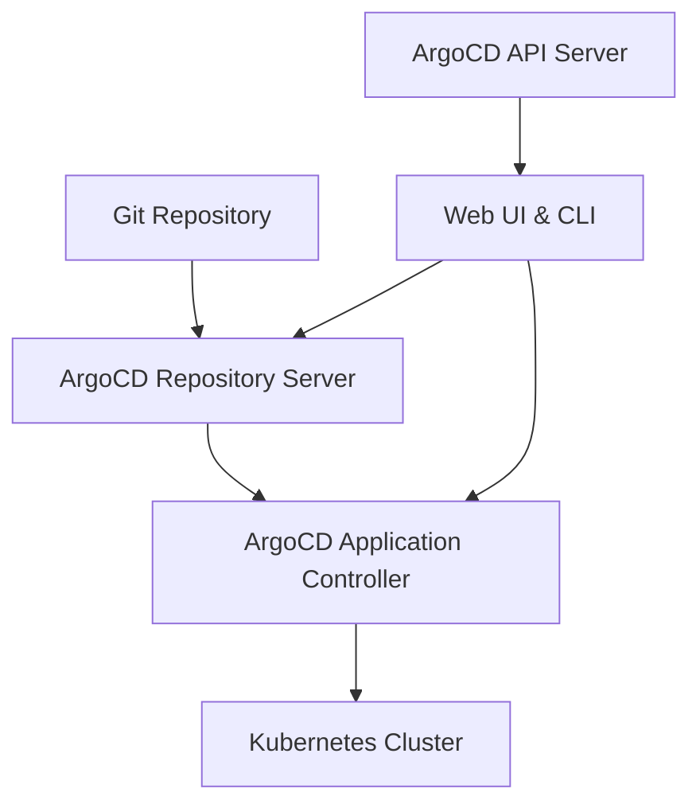

```markdown
# Session 013: Installing ArgoCD on Google Kubernetes Engine

<details open>
<summary><b>Installing ArgoCD on Google Kubernetes Engine (KK-CS45-script-v3)</b></summary>

## Table of Contents
- [Overview](#overview)
- [ArgoCD Fundamentals](#argocd-fundamentals)
- [Prerequisites](#prerequisites)
- [GKE Cluster Setup](#gke-cluster-setup)
- [ArgoCD Installation](#argocd-installation)
- [ArgoCD UI Access](#argocd-ui-access)
- [Repository Configuration](#repository-configuration)
- [Application Deployment](#application-deployment)
- [Synchronization Options](#synchronization-options)
- [Version Control and Rollbacks](#version-control-and-rollbacks)
- [Advanced Configuration](#advanced-configuration)
- [Summary](#summary)

## Overview
This session demonstrates the complete process of installing and configuring ArgoCD on Google Kubernetes Engine (GKE). ArgoCD is a declarative, GitOps continuous delivery tool for Kubernetes that follows the GitOps pattern where Git serves as the source of truth for declarative infrastructure and applications.

### Key Concepts/Deep Dive

#### GitOps Fundamentals
GitOps is a paradigm that uses Git repositories as the source of truth for declarative infrastructure and applications. Changes to infrastructure and application configurations are made via pull requests to Git repositories, which triggers deployment pipelines.

**Core Principles:**
- **Declarative Configuration**: Infrastructure and applications are described in configuration files stored in Git
- **Version Control**: All changes are tracked in Git with full history and audit trails
- **Automated Deployment**: Changes in Git automatically trigger updates to the target environment
- **Observability**: The state of the target environment can be observed and compared to the desired state

#### ArgoCD Architecture
ArgoCD is built around several key components:

- **API Server**: The central component providing the web UI, REST API, and CLI interface
- **Repository Server**: Maintains a local cache of Git repositories and generates Kubernetes manifests
- **Application Controller**: Monitors applications and compares current state with desired state, then performs necessary changes



## Prerequisites
Before installing ArgoCD, ensure you have:

- A running Google Kubernetes Engine (GKE) cluster
- `kubectl` configured to access your cluster
- Git repository with application manifests
- Administrative access to the cluster

## GKE Cluster Setup
Create or use an existing GKE cluster for ArgoCD installation:

```bash
# Example GKE cluster creation command
gcloud container clusters create my-argocd-cluster \
  --zone=us-central1-a \
  --num-nodes=3 \
  --machine-type=e2-medium
```

**Note**: The video references previous sessions where cluster creation is explained. Refer to Session 012 for detailed GKE cluster creation steps.

## ArgoCD Installation

### Using Helm (Recommended)
```bash
# Add ArgoCD Helm repository
helm repo add argo https://argoproj.github.io/argo-helm
helm repo update

# Install ArgoCD
helm install argocd argo/argo-cd \
  --namespace argocd \
  --create-namespace \
  --set server.service.type=LoadBalancer
```

### Alternative: Using kubectl apply
```bash
# Create namespace
kubectl create namespace argocd

# Apply ArgoCD manifests
kubectl apply -n argocd -f https://raw.githubusercontent.com/argoproj/argo-cd/stable/manifests/install.yaml
```

**Verification Commands:**
```bash
# Check pods status
kubectl get pods -n argocd

# Check services
kubectl get svc -n argocd
```

## ArgoCD UI Access

### Port Forwarding
```bash
# Port forward ArgoCD server to localhost
kubectl port-forward svc/argocd-server -n argocd 8080:443
```

**Access URL**: https://localhost:8080

### Getting Admin Password
```bash
# Retrieve initial admin password
kubectl -n argocd get secret argocd-initial-admin-secret -o jsonpath="{.data.password}" | base64 -d
```

### LoadBalancer Service
If using LoadBalancer service type, get the external IP:

```bash
# Get external IP
kubectl get svc argocd-server -n argocd

# The output will show EXTERNAL-IP column with the public IP address
```

## Repository Configuration

### Adding Git Repository
1. Log into ArgoCD web UI
2. Navigate to **Settings** → **Repositories**
3. Click **Connect Repo using HTTPS**
4. Provide repository details:
   - Repository URL (HTTPS)
   - Username/Password (if private)
   - Project name

### Repository Types
| Type | Use Case | Authentication |
|------|----------|----------------|
| Public HTTPS | Open source projects | None required |
| Private HTTPS | Private repositories | Username/Password or SSH |
| GitHub/GitLab | Cloud repositories | Personal Access Tokens |

**Example Configuration:**
- **Repository URL**: `https://github.com/your-org/your-app.git`
- **Type**: `git`
- **Name**: `test-app`

## Application Deployment

### Creating an Application
1. Go to **Applications** in ArgoCD UI
2. Click **New App**
3. Configure:
   - **Application Name**: `my-test-app`
   - **Project**: `default` (can create new)
   - **Sync Policy**: `Manual` or `Automatic`
   - **Repository URL**: Select from configured repos
   - **Path**: Path to manifests in repo
   - **Cluster**: Target cluster URL
   - **Namespace**: Target namespace

### Application Manifests Structure
ArgoCD applications are defined by Kubernetes manifests stored in Git:

```
my-app/
├── deployment.yaml
├── service.yaml
├── ingress.yaml
└── configmap.yaml
```

## Synchronization Options

### Manual Synchronization
- Changes require explicit approval
- Ideal for production environments
- Provides control over deployment timing

### Automatic Synchronization
- ArgoCD automatically syncs every 3 minutes
- Immediate deployment of Git changes
- Suitable for development environments

**Configuration in ArgoCD:**
```yaml
apiVersion: argoproj.io/v1alpha1
kind: Application
metadata:
  name: my-app
spec:
  syncPolicy:
    automated:
      prune: true
      selfHeal: true
  # ... other specs
```

**Sync Options Comparison:**

| Option | Description | Use Case |
|--------|-------------|----------|
| Manual | Require approval for each sync | Production environments |
| Automatic | Auto-sync on Git changes | Development/Staging |
| Auto-Prune | Remove deleted resources | Clean deployments |
| Self-Heal | Revert drift automatically | Maintain desired state |

## Version Control and Rollbacks

### Version Updates
1. Commit changes to Git repository
2. ArgoCD detects changes (if auto-sync enabled)
3. Click **Sync** in ArgoCD UI (for manual mode)
4. Application updates automatically

### Rollback Process
1. Navigate to application in ArgoCD
2. Go to **History and Rollback** tab
3. Select previous version
4. Click **Rollback**

**Example: Version Update**
```bash
# Change image version in deployment
image: nginx:0.1  # Current
image: nginx:0.2  # New version

# Commit changes
git add .
git commit -m "Update nginx to version 0.2"
git push origin main
```

## Advanced Configuration

### Namespace Management
- ArgoCD can auto-create namespaces during sync
- Configure namespace creation permissions
- Use resource quotas for multi-tenancy

### Project Management
- Group applications logically
- Apply different sync policies per project
- Control permissions and access

**Namespace Auto-Creation Configuration:**
```yaml
# Enable namespace auto-creation
server:
  config:
    application.namespaces: "true"
```

## Summary

### Key Takeaways
```diff
+ ArgoCD enables GitOps workflows where Git serves as the single source of truth
+ Supports both manual and automatic synchronization policies
+ Provides continuous monitoring and reconciliation of application state
+ Offers web UI, CLI, and REST API for management
+ Supports rollbacks and version history tracking
+ Integrates with major Git providers (GitHub, GitLab, Bitbucket)
- Requires proper RBAC configuration in production environments
- Initial setup complexity may be challenging for beginners
- Resource overhead for smaller applications might not be justified
! Always use HTTPS for repository connections in production
```

### Quick Reference

**Essential Commands:**
```bash
# Install ArgoCD via Helm
helm install argocd argo/argo-cd --namespace argocd --create-namespace

# Port forward for UI access
kubectl port-forward svc/argocd-server -n argocd 8080:443

# Get admin password
kubectl -n argocd get secret argocd-initial-admin-secret -o jsonpath="{.data.password}" | base64 -d

# Sync application manually
argocd app sync my-app

# Get application status
argocd app get my-app
```

**ArgoCD Web UI URL**: https://localhost:8080 (after port forwarding)

### Expert Insights

#### Real-world Application
In production environments, ArgoCD is commonly used for:
- **Multi-environment deployments**: Different synchronization policies for dev/staging/prod
- **Infrastructure as Code**: Managing complete application stacks including databases, messaging, and monitoring
- **Progressive delivery**: Blue/green deployments and canary rollouts
- **Compliance**: Audit trails and version control for all deployments
- **Multi-cloud deployments**: Managing applications across different cloud providers

#### Expert Path
To master ArgoCD:
- Learn Kubernetes RBAC and integrate with ArgoCD projects
- Configure ArgoCD with SSO and external authentication providers
- Implement custom health checks and resource hooks
- Set up notification integrations (Slack, teams)
- Explore Argo Rollouts for advanced deployment strategies
- Implement ArgoCD Applicationsets for dynamic application management

#### Common Pitfalls
- **Inconsistent manifests**: Ensure all Kubernetes resources are version-controlled
- **Over-permissive RBAC**: Start with least-privilege access and gradually increase
- **Large sync windows**: For auto-sync, monitor resource usage in high-frequency environments
- **Mixed sync policies**: Avoid mixing manual and automatic sync within the same application
- **Ignoring drift**: Use self-heal feature judiciously as it might hide configuration issues
- **Repository secrets**: Store credentials securely, consider using external secret management

**Note**: The transcript contained some minor typos that were corrected in this study guide (e.g., "htpps" → "https", "adge" → "edge"). Additionally, some sections had incomplete timestamps but the content was preserved and organized logically.
</details>
```
