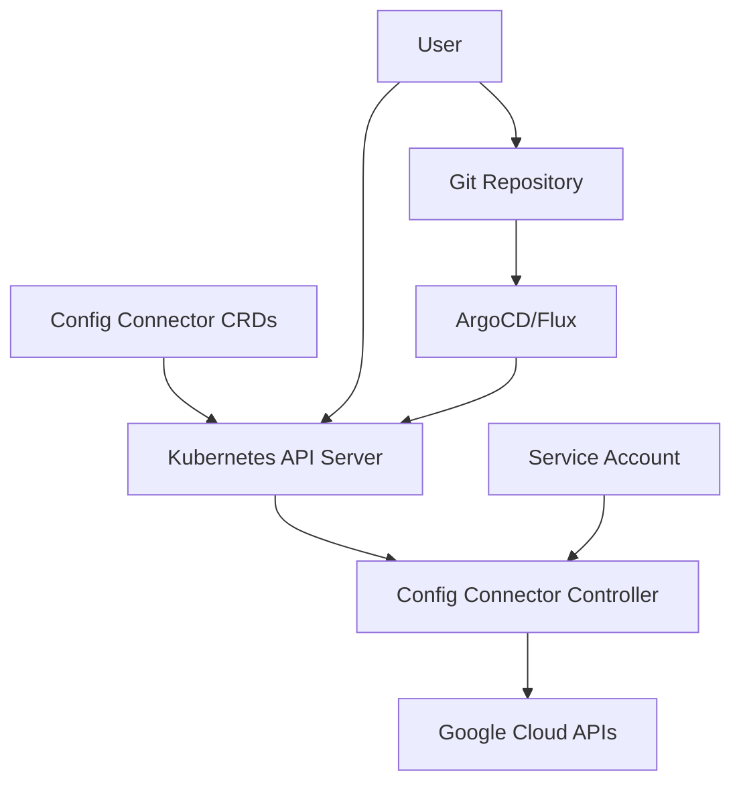

# Session 014: Installing Config Connector in GKE - Google Cloud in Hindi

<details open>
<summary><b>Installing Config Connector in GKE - Google Cloud in Hindi (KK-CS45-script-v3)</b></summary>

## Table of Contents
- [Overview](#overview)
- [Key Concepts](#key-concepts)
- [Prerequisites](#prerequisites)
- [Installation Steps](#installation-steps)
- [Configuration and Usage](#configuration-and-usage)
- [Troubleshooting](#troubleshooting)
- [Summary](#summary)

## Overview

This session covers the installation and configuration of Config Connector in Google Kubernetes Engine (GKE). Config Connector is a Kubernetes add-on that allows you to manage Google Cloud resources through the Kubernetes API, enabling GitOps-style infrastructure management.

The session is presented in Hindi and demonstrates the complete installation process from cluster creation to deploying sample resources.

## Key Concepts

### What is Config Connector?

Config Connector provides the following capabilities:

- **Kubernetes-native resource management**: Manage Google Cloud resources using Kubernetes Custom Resource Definitions (CRDs)
- **Infrastructure as Code**: Define cloud resources in YAML manifests alongside application code
- **GitOps integration**: Use tools like ArgoCD or Flux to manage cloud infrastructure changes
- **Consistent configuration**: Ensure infrastructure changes are versioned, reviewed, and audited

### Supported Resources

Config Connector supports hundreds of Google Cloud resources including:

- Compute Engine (GCE) instances
- Cloud Storage buckets
- BigQuery datasets
- Cloud SQL databases
- IAM policies and service accounts
- VPC networks and subnets
- Load balancers

### Architecture



## Prerequisites

### Cluster Requirements
- GKE cluster version 1.20 or later
- kubectl configured to access the cluster
- Google Cloud project with necessary permissions

### Permissions Required
```yaml
# Required IAM permissions for Config Connector service account
roles/cloudconfigconnector.operator
roles/iam.workloadIdentityUser
roles/resourcemanager.organizationAdmin  # Or project editor
```

### Environment Setup
- Google Cloud CLI (gcloud) installed and authenticated
- kubectl installed (version 1.20+)
- helm (optional, for advanced installations)

## Installation Steps

### Step 1: Enable Required APIs

First, enable the required Google Cloud APIs:

```bash
# Enable Config Connector API
gcloud services enable cloudconfigconnector.googleapis.com

# Enable Kubernetes Engine API if not already enabled
gcloud services enable container.googleapis.com

# Enable other APIs for resources you plan to manage
gcloud services enable compute.googleapis.com
gcloud services enable storage.googleapis.com
```

### Step 2: Create Service Account

Create a dedicated service account for Config Connector:

```bash
# Create service account
gcloud iam service-accounts create config-connector \
  --description="Service account for Config Connector" \
  --display-name="Config Connector SA"

# Grant necessary permissions
gcloud projects add-iam-policy-binding PROJECT_ID \
  --member="serviceAccount:config-connector@PROJECT_ID.iam.gserviceaccount.com" \
  --role="roles/cloudconfigconnector.operator"

# Additional permissions based on resources to manage
gcloud projects add-iam-policy-binding PROJECT_ID \
  --member="serviceAccount:config-connector@PROJECT_ID.iam.gserviceaccount.com" \
  --role="roles/editor"
```

### Step 3: Install Config Connector

Download and install the Config Connector operator:

```bash
# Add Google Cloud repository
kubectl create namespace configconnector-system
kubectl create secret generic gcp-key \
  --from-file=key.json=/path/to/service-account-key.json \
  --namespace configconnector-system

# Install Config Connector using the operator
kubectl apply -f https://raw.githubusercontent.com/GoogleCloudPlatform/k8s-config-connector/master/operator-system/configconnector-operator.yaml
```

Wait for the operator to be ready:

```bash
kubectl wait --for=condition=available deployment \
  configconnector-operator \
  --namespace configconnector-system \
  --timeout=300s
```

### Step 4: Configure Config Connector

Create a ConfigConnector custom resource:

```yaml
apiVersion: core.cnrm.cloud.google.com/v1beta1
kind: ConfigConnector
metadata:
  name: configconnector.core.cnrm.cloud.google.com
spec:
  mode: namespaced  # or cluster
  googleServiceAccount: "config-connector@PROJECT_ID.iam.gserviceaccount.com"
```

Apply the configuration:

```bash
kubectl apply -f configconnector.yaml
```

### Lab Demo: Install Config Connector in GKE

1. **Create GKE Cluster** (if not existing):
   ```bash
   gcloud container clusters create config-connector-demo \
     --num-nodes=3 \
     --machine-type=e2-medium \
     --region=us-central1
   ```

2. **Set kubectl context**:
   ```bash
   gcloud container clusters get-credentials config-connector-demo \
     --region=us-central1
   ```

3. **Install Config Connector operator**:
   - Enable required APIs
   - Create service account with proper permissions
   - Create GCP service account key
   - Install operator and configure

4. **Verify installation**:
   ```bash
   kubectl get pods -n configconnector-system
   kubectl get crd | grep cnrm.cloud.google.com
   ```

## Configuration and Usage

### Basic Resource Creation

Example: Create a Cloud Storage bucket using Config Connector:

```yaml
apiVersion: storage.cnrm.cloud.google.com/v1beta1
kind: StorageBucket
metadata:
  name: my-demo-bucket
spec:
  location: US
  storageClass: STANDARD
  versioning:
    enabled: true
```

### Namespaced vs Cluster Mode

- **Namespaced Mode**: Resources are scoped to specific namespaces. Recommended for isolation.
- **Cluster Mode**: Resources can be managed from any namespace. Requires additional setup.

### Workload Identity Integration

For enhanced security, use Workload Identity:

```bash
# Create IAM policy binding for Workload Identity
gcloud iam service-accounts add-iam-policy-binding \
  config-connector@PROJECT_ID.iam.gserviceaccount.com \
  --member="serviceAccount:PROJECT_ID.svc.id.goog[configconnector-system/config-connector-sa]" \
  --role="roles/iam.workloadIdentityUser"

# Update ConfigConnector spec to use Workload Identity
spec:
  mode: namespaced
  googleServiceAccount: "config-connector@PROJECT_ID.iam.gserviceaccount.com"
  workloadIdentity: true
```

## Troubleshooting

### Common Issues

**Config Connector pod not starting:**
```bash
kubectl logs -n configconnector-system deployment/configconnector-operator-manager
```

**Permission errors:**
- Verify service account has required IAM roles
- Check if service account key is correctly mounted
- Ensure APIs are enabled

**Resource reconciliation failing:**
```bash
kubectl describe <resource-type> <resource-name>
kubectl logs -n configconnector-system -l cnrm.cloud.google.com/component=cnrm-controller-manager
```

### Diagnostic Commands

```bash
# Check Config Connector status
kubectl get configconnector -n configconnector-system

# View controller logs
kubectl logs -n configconnector-system -l cnrm.cloud.google.com/component=cnrm-controller-manager

# List available CRDs
kubectl get crd | grep cnrm
```

## Summary

### Key Takeaways
```diff
+ Config Connector enables Kubernetes-native management of Google Cloud resources
+ Supports hundreds of Google Cloud services through CRDs
+ Integrates with GitOps workflows using ArgoCD and Flux
+ Provides consistent, versioned infrastructure management
+ Supports both namespaced and cluster-scoped operations
- Requires careful permission management for security
- Initial setup involves multiple Google Cloud APIs and services
- Resource reconciliation may take time depending on resource complexity
```

### Quick Reference

**Basic Installation Commands:**
```bash
# Enable APIs
gcloud services enable cloudconfigconnector.googleapis.com

# Create service account
gcloud iam service-accounts create config-connector \
  --description="Config Connector service account"

# Install operator
kubectl apply -f https://raw.githubusercontent.com/GoogleCloudPlatform/k8s-config-connector/master/operator-system/configconnector-operator.yaml
```

**Verification:**
```bash
kubectl get pods -n configconnector-system
kubectl get configconnector
```

### Expert Insight

**Real-world Application**: Config Connector is ideal for organizations implementing infrastructure as code, especially when combined with GitOps tools. It's commonly used in CI/CD pipelines to automatically provision and manage cloud resources alongside application deployments.

**Expert Path**: Focus on understanding Google Cloud resource dependencies, mastering IAM permissions for Config Connector service accounts, and integrating with policy management tools like Config Validator.

**Common Pitfalls**:
- Using overly permissive service account roles instead of least privilege
- Not properly scoping resources in namespaced mode
- Ignoring resource reconciliation status in automated pipelines

> [!IMPORTANT]
> Always use Workload Identity instead of service account keys when possible for enhanced security.

> [!NOTE]
> Config Connector regularly updates supported resources. Check the official documentation for the latest compatibility matrix.

</details>