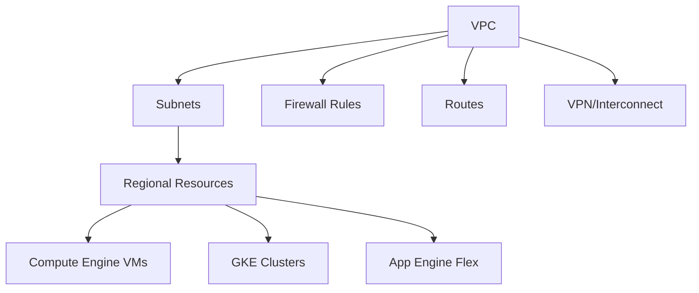

# Session 19: Creating a VPC in Google Cloud Platform

## Table of Contents
- [Overview](#overview)
- [Key Concepts and Deep Dive](#key-concepts-and-deep-dive)
  - [What is a Virtual Private Cloud (VPC)?](#what-is-a-virtual-private-cloud-vpc)
  - [Default VPC Network](#default-vpc-network)
  - [Creating a Custom VPC Network](#creating-a-custom-vpc-network)
  - [Subnets in VPC](#subnets-in-vpc)
  - [IPv4 and IPv6 Support](#ipv4-and-ipv6-support)
  - [Firewall Rules](#firewall-rules)
  - [Additional VPC Options](#additional-vpc-options)
  - [Subnet Management](#subnet-management)
- [Lab Demo: Creating a VPC with Subnet](#lab-demo-creating-a-vpc-with-subnet)
- [Summary](#summary)

## Overview
This session covers the fundamentals of creating and managing Virtual Private Clouds (VPCs) in Google Cloud Platform. A VPC is a virtual version of a traditional physical network, implemented within Google's global infrastructure using the Andromeda networking stack. The session explains VPC architecture, default network configuration, custom VPC creation, subnet management, IPv4/IPv6 support, firewall rules, and configuration options. You'll learn how VPCs enable secure connectivity for Compute Engine VMs, Kubernetes Engine (GKE), App Engine flexible environments, and load balancers while providing isolation and communication control across GCP services.

## Key Concepts and Deep Dive

### What is a Virtual Private Cloud (VPC)?
A Virtual Private Cloud (VPC) in Google Cloud Platform is a global resource that provides virtualized networking functionality, mimicking a physical private network in your data center or home/office environment. Key characteristics include:

- **Global Scope**: VPCs span across all Google Cloud regions and are accessible worldwide
- **Andromeda Implementation**: Powered by Google's Andromeda networking technology for high performance and scalability
- **Service Connectivity**: Enables secure communication between GCP services including:
  - Compute Engine virtual machines (VMs)
  - Google Kubernetes Engine (GKE) clusters
  - App Engine flexible environments
  - Cloud Load Balancers (TCP and UDP variants)
- **Hybrid Connectivity**: Supports connection to on-premises networks via Cloud VPN and Cloud Interconnect
- **Isolation**: Provides network isolation between different coexistence VPCs

VPCs allow you to create isolated network environments in the cloud, controlling how resources communicate internally and externally while leveraging Google's global infrastructure.

Transit modes


### Default VPC Network
When you create a new GCP project, Google automatically provisions a default VPC network with predefined configurations. Key aspects include:

- **Automatic Creation**: Enabled by default in new projects
- **Auto-mode Subnets**: Creates a subnet in each of the 35 Google Cloud regions with a /20 CIDR block
- **Firewall Rules**: Pre-configured rules including:
  - `default-allow-internal`: Permits all traffic between subnets
  - `default-allow-ssh`: Allows SSH access (port 22) for Linux VMs
  - `default-allow-rdp`: Allows RDP access (port 3389) for Windows VMs
  - `default-allow-icmp`: Permits ICMP traffic for diagnostics
- **Routing**: Default route for internet access (0.0.0.0/0)
- **Disable Option**: Can be disabled via Organization Policies to prevent automatic VPC creation in new projects

> [!NOTE]
> The default VPC provides a quick-start networking setup but may not be suitable for production environments requiring custom isolation or compliance configurations.

### Creating a Custom VPC Network
For production or specific use cases, you can create custom VPC networks with precise control over subnets and configurations:

#### Basic Creation Steps
1. Navigate to VPC Networks in the Google Cloud Console
2. Click "Create VPC network"
3. Provide network name and optional description
4. Configure IPv6 settings (optional)

#### Key Configuration Options
- **IPv4-only or Dual-stack**: Choose between single-stack (IPv4) or dual-stack (IPv4 + IPv6)
- **Subnet Creation Mode**:
  - **Automatic**: Google creates subnets in all regions (similar to default VPC)
  - **Custom**: Manual subnet definition per region

IPv6 allocation methods:
```diff
+ Automatic: Google assigns a /48 range from its pool
- Manual: Specify your own IPv6 range (requires ULA addressing)
```

#### Creation Command Example
```bash
gcloud compute networks create my-custom-vpc \
  --subnet-mode=custom \
  --bgp-routing-mode=regional
```

### Subnets in VPC
Subnets divide VPCs into regional network segments, enabling precise control over IP allocation and resource placement:

- **Regional Resources**: Each subnet belongs to a specific Google Cloud region
- **Zone Span**: Subnets exist across all zones within a region
- **IP Address Ranges**:
  - IPv4 ranges (e.g., 10.0.0.0/24, 192.168.0.0/16)
  - IPv6 ranges (/64 prefixes for external, /64 for internal)
- **Dynamic Routing**: Supports regional or global BGP-based routing

#### Subnet Creation Parameters
- **Name and Region**: Required identifiers
- **IP Stack**: Single-stack (IPv4 only) or dual-stack (IPv4 + IPv6)
- **Internal vs External IPv6**:
  - Internal: Routed within VPC only
  - External: Internet-routable IPs
- **Private Google Access**: Enables private access to Google APIs and services
- **Flow Logs**: Optional traffic capture for monitoring (incurs costs)
- **Secondary IP Ranges**: Additional ranges for GKE services and pods

#### IPv4 and IPv6 Support Comparison

| Feature | IPv4 | IPv6 |
|---------|------|------|
| Address Format | 32-bit dotted decimal | 128-bit hexadecimal |
| Subnet Prefix | Variable (/8 to /29 typically) | /64 preferred |
| Global Internet Addresses | IPv4 exhaustion expected | Abundant address space |
| Routing | Standard CIDR ranges | ULA or PI address spaces |
| VM Assignment | Automatic or manual | Automatic allocation |
| External Availability | Full support | External ranges available |
| Stack Configuration | Single or dual | Must be dual for IPv6 |

### Firewall Rules
Firewall rules control traffic flow within VPC networks, providing security at the network layer:

#### Rule Types and Hierarchies
- **Ingress Rules**: Control inbound traffic to VMs
- **Egress Rules**: Control outbound traffic from VMs
- **Implicit Rules** (cannot be deleted):
  - `default-deny-all-ingress`: Blocks all inbound unless explicitly allowed
  - `default-allow-all-egress`: Permits all outbound traffic

#### Pre-configured Rules
Custom VPC creation provides optional default rules:
- `test-allow-custom`: Allows all internal traffic between subnets
- ICMP allowance
- RDP and SSH access rules

#### Rule Priorities
- Lower numeric values = higher priority
- Default rules use priority 65535 (lowest precedence)
- Custom rules override defaults with priority < 65535

> [!IMPORTANT]
> Always test firewall rules thoroughly as misconfigurations can lead to security vulnerabilities or service outages.

### Additional VPC Options
Several advanced options enhance VPC functionality:

#### Dynamic Routing Mode
- **Regional**: Routes from specified region only exported to hybrid connections
- **Global**: Routes from all regions available through single cloud router connection

#### Maximum Transmission Unit (MTU)
- Default: 1460 bytes
- Options: 1460 or 1500 bytes
- Affects maximum packet sizes between VMs

> [!NOTE]
> MTU settings should match your existing infrastructure and VM configurations to avoid fragmentation issues.

### Subnet Management
Effective subnet management involves creation, expansion, and configuration changes:

#### Subnet Expansion
- Select subnet → Edit → Modify CIDR range
- Expand within your VPC's allocated range
- Auto-mode subnets limited to /16 maximum expansion
- Cannot shrink subnets after expansion

> [!WARNING]
> Subnet expansion is irreversible. Plan IP ranges carefully to avoid exhaustion requiring redesign.

#### Stack Type Conversion
- Convert dual-stack to single-stack via gcloud CLI:
```bash
gcloud compute networks subnets update test --stack-type=IPV4_ONLY --region=asia-south1
```

- Available for external IPv6 ranges only (not internal)
- Existing resources retain assigned IPs but new resources use single stack

## Lab Demo: Creating a VPC with Subnet

### Step-by-Step VPC and Subnet Creation
1. Navigate to **VPC Networks** in Google Cloud Console
2. Click **Create VPC Network**
3. Configure basic settings:
   - Name: `test-vpc` (alphanumeric and hyphens only)
   - IPv6: Enabled (automatic assignment)
   - Subnet mode: Custom

4. Create subnet configuration:
   - Name: `test-subnet`
   - Region: `asia-south1` (Mumbai)
   - IP Stack: Dual-stack
   - IPv4 Range: `192.168.10.0/24`
   - IPv6 Access Type: External

5. Optional configurations:
   - Enable Private Google Access
   - Configure flow logs (sample rate: 50%, interval: 5 seconds)
   - Add secondary IP ranges (for GKE workloads)

6. Click **Create**

### Creating a VM in the VPC
1. Go to **Compute Engine** → **VM instances**
2. Click **Create instance**
3. Configure basic settings as desired
4. Navigate to **Networking** section:
   - Network: Select your custom VPC (`test-vpc`)
   - Subnet: Select your subnet (`test-subnet`)
   - Network interfaces will show both IPv4 and IPv6 addresses

5. Complete VM creation and verify IP assignments

### Changing Subnet from Dual-stack to Single-stack
Using Cloud Shell:
```bash
gcloud compute networks subnets update test-subnet \
  --stack-type=IPV4_ONLY \
  --region=asia-south1
```

Verify the change in the GCP Console in the subnet details page.

## Summary

### Key Takeaways
```diff
+ VPCs are global Google Cloud resources providing virtualized network isolation using Andromeda technology
+ Default VPCs auto-create subnets in all regions with predefined firewall rules; custom VPCs offer full control
+ Subnets are regional resources spanning all zones, supporting both IPv4 (/8-/29) and IPv6 (/64 external/internal) ranges
+ Firewall rules follow deny-all-by-default for ingress with explicit allow rules taking precedence via priority
+ Subnet expansion possible but irreversible; dual-stack to single-stack conversion requires gcloud CLI for external IPv6
- Auto-mode subnets limited to /16 expansion due to VPC-wide IP planning; custom mode allows more flexibility
+ IPv6 availability requires VPC-level enablement with subnet-specific configuration
- Organization policies control automatic default VPC creation for compliance requirements
```

### Quick Reference
**Common VPC Commands:**
```bash
# Create VPC
gcloud compute networks create my-vpc --subnet-mode=custom

# Create subnet with dual-stack
gcloud compute networks subnets create my-subnet \
  --network=my-vpc \
  --region=asia-south1 \
  --range=10.0.1.0/24 \
  --stack-type=IPV4_IPV6

# Update subnet to single-stack
gcloud compute networks subnets update my-subnet \
  --stack-type=IPV4_ONLY \
  --region=asia-south1
```

**Firewall Rule Priorities:**
- Custom rules: 0-65534 (lower = higher priority)
- Default allow rules: 65535
- Implicit deny: Always lowest priority

**Subnet Expansion Limits:**
- Auto-mode subnets: Maximum /16
- Custom subnets: Limited by VPC allocation only

### Expert Insight

**Real-world Application**: VPCs form the foundation of secure Google Cloud deployments. Enterprise customers use custom VPCs to implement network segmentation, separating development, staging, and production environments. Large organizations leverage shared VPCs for multi-project architectures, centralizing network policy management while distributing resource ownership.

**Expert Path**: Begin with default VPCs for prototyping, then progression to custom VPCs. Study VPC peering and Shared VPC patterns for complex enterprise topologies. Master Cloud Router and natively configured ranges for hybrid cloud connectivity. Implement VPC Service Controls for data perimeter protection and gain familiarity with Network Intelligence Center for observability.

**Common Pitfalls**: 
- Underestimating IP address requirements leads to costly subnet expansions or redesigns
- Allowing overly permissive firewall rules during initial setup creates security gaps
- Forgetting that subnet expansion is irreversible requires careful capacity planning
- Not enabling IPv6 from VPC level prevents subnet IPv6 configuration
- Auto-mode VPCs prevent converting to custom mode after project creation, limiting future flexibility
- Ignoring MTU settings can cause performance issues with certain applications requiring jumbo frames

<details open>
<summary><b>Creating a VPC in GCP (KK-CS45-script-v3)</b></summary>
# Session 19: Creating a VPC in Google Cloud Platform

## Table of Contents
- [Overview](#overview)
- [Key Concepts and Deep Dive](#key-concepts-and-deep-dive)
  - [What is a Virtual Private Cloud (VPC)?](#what-is-a-virtual-private-cloud-vpc)
  - [Default VPC Network](#default-vpc-network)
  - [Creating a Custom VPC Network](#creating-a-custom-vpc-network)
  - [Subnets in VPC](#subnets-in-vpc)
  - [IPv4 and IPv6 Support](#ipv4-and-ipv6-support)
  - [Firewall Rules](#firewall-rules)
  - [Additional VPC Options](#additional-vpc-options)
  - [Subnet Management](#subnet-management)
- [Lab Demo: Creating a VPC with Subnet](#lab-demo-creating-a-vpc-with-subnet)
- [Summary](#summary)

## Overview
This session covers the fundamentals of creating and managing Virtual Private Clouds (VPCs) in Google Cloud Platform. A VPC is a virtual version of a traditional physical network, implemented within Google's global infrastructure using the Andromeda networking stack. The session explains VPC architecture, default network configuration, custom VPC creation, subnet management, IPv4/IPv6 support, firewall rules, and configuration options. You'll learn how VPCs enable secure connectivity for Compute Engine VMs, Kubernetes Engine (GKE), App Engine flexible environments, and load balancers while providing isolation and communication control across GCP services.

## Key Concepts and Deep Dive

### What is a Virtual Private Cloud (VPC)?
A Virtual Private Cloud (VPC) in Google Cloud Platform is a global resource that provides virtualized networking functionality, mimicking a physical private network in your data center or home/office environment. Key characteristics include:

- **Global Scope**: VPCs span across all Google Cloud regions and are accessible worldwide
- **Andromeda Implementation**: Powered by Google's Andromeda networking technology for high performance and scalability
- **Service Connectivity**: Enables secure communication between GCP services including:
  - Compute Engine virtual machines (VMs)
  - Google Kubernetes Engine (GKE) clusters
  - App Engine flexible environments
  - Cloud Load Balancers (TCP and UDP variants)
- **Hybrid Connectivity**: Supports connection to on-premises networks via Cloud VPN and Cloud Interconnect
- **Isolation**: Provides network isolation between different coexisting VPCs

VPCs allow you to create isolated network environments in the cloud, controlling how resources communicate internally and externally while leveraging Google's global infrastructure.


### Default VPC Network
When you create a new GCP project, Google automatically provisions a default VPC network with predefined configurations. Key aspects include:

- **Automatic Creation**: Enabled by default in new projects
- **Auto-mode Subnets**: Creates a subnet in each of the 35 Google Cloud regions with a /20 CIDR block
- **Firewall Rules**: Pre-configured rules including:
  - `default-allow-internal`: Permits all traffic between subnets
  - `default-allow-ssh`: Allows SSH access (port 22) for Linux VMs
  - `default-allow-rdp`: Allows RDP access (port 3389) for Windows VMs
  - `default-allow-icmp`: Permits ICMP traffic for diagnostics
- **Routing**: Default route for internet access (0.0.0.0/0)
- **Disable Option**: Can be disabled via Organization Policies to prevent automatic VPC creation in new projects

> [!NOTE]
> The default VPC provides a quick-start networking setup but may not be suitable for production environments requiring custom isolation or compliance configurations.

### Creating a Custom VPC Network
For production or specific use cases, you can create custom VPC networks with precise control over subnets and configurations:

#### Basic Creation Steps
1. Navigate to VPC Networks in the Google Cloud Console
2. Click "Create VPC network"
3. Provide network name and optional description
4. Configure IPv6 settings (optional)

#### Key Configuration Options
- **IPv4-only or Dual-stack**: Choose between single-stack (IPv4) or dual-stack (IPv4 + IPv6)
- **Subnet Creation Mode**:
  - **Automatic**: Google creates subnets in all regions (similar to default VPC)
  - **Custom**: Manual subnet definition per region

IPv6 allocation methods:
```diff
+ Automatic: Google assigns a /48 range from its pool
- Manual: Specify your own IPv6 range (requires ULA addressing)
```

#### Creation Command Example
```bash
gcloud compute networks create my-custom-vpc \
  --subnet-mode=custom \
  --bgp-routing-mode=regional
```

### Subnets in VPC
Subnets divide VPCs into regional network segments, enabling precise control over IP allocation and resource placement:

- **Regional Resources**: Each subnet belongs to a specific Google Cloud region
- **Zone Span**: Subnets exist across all zones within a region
- **IP Address Ranges**:
  - IPv4 ranges (e.g., 10.0.0.0/24, 192.168.0.0/16)
  - IPv6 ranges (/64 prefixes for external, /64 for internal)
- **Dynamic Routing**: Supports regional or global BGP-based routing

#### Subnet Creation Parameters
- **Name and Region**: Required identifiers
- **IP Stack**: Single-stack (IPv4 only) or dual-stack (IPv4 + IPv6)
- **Internal vs External IPv6**:
  - Internal: Routed within VPC only
  - External: Internet-routable IPs
- **Private Google Access**: Enables private access to Google APIs and services
- **Flow Logs**: Optional traffic capture for monitoring (incurs costs)
- **Secondary IP Ranges**: Additional ranges for GKE services and pods

#### IPv4 and IPv6 Support Comparison

| Feature | IPv4 | IPv6 |
|---------|------|------|
| Address Format | 32-bit dotted decimal | 128-bit hexadecimal |
| Subnet Prefix | Variable (/8 to /29 typically) | /64 preferred |
| Global Internet Addresses | IPv4 exhaustion expected | Abundant address space |
| Routing | Standard CIDR ranges | ULA or PI address spaces |
| VM Assignment | Automatic or manual | Automatic allocation |
| External Availability | Full support | External ranges available |
| Stack Configuration | Single or dual | Must be dual for IPv6 |

### Firewall Rules
Firewall rules control traffic flow within VPC networks, providing security at the network layer:

#### Rule Types and Hierarchies
- **Ingress Rules**: Control inbound traffic to VMs
- **Egress Rules**: Control outbound traffic from VMs
- **Implicit Rules** (cannot be deleted):
  - `default-deny-all-ingress`: Blocks all inbound unless explicitly allowed
  - `default-allow-all-egress`: Permits all outbound traffic

#### Pre-configured Rules
Custom VPC creation provides optional default rules:
- `test-allow-custom`: Allows all internal traffic between subnets
- ICMP allowance
- RDP and SSH access rules

#### Rule Priorities
- Lower numeric values = higher priority
- Default rules use priority 65535 (lowest precedence)
- Custom rules override defaults with priority < 65535

> [!IMPORTANT]
> Always test firewall rules thoroughly as misconfigurations can lead to security vulnerabilities or service outages.

### Additional VPC Options
Several advanced options enhance VPC functionality:

#### Dynamic Routing Mode
- **Regional**: Routes from specified region only exported to hybrid connections
- **Global**: Routes from all regions available through single cloud router connection

#### Maximum Transmission Unit (MTU)
- Default: 1460 bytes
- Options: 1460 or 1500 bytes
- Affects maximum packet sizes between VMs

> [!NOTE]
> MTU settings should match your existing infrastructure and VM configurations to avoid fragmentation issues.

### Subnet Management
Effective subnet management involves creation, expansion, and configuration changes:

#### Subnet Expansion
- Select subnet → Edit → Modify CIDR range
- Expand within your VPC's allocated range
- Auto-mode subnets limited to /16 maximum expansion
- Cannot shrink subnets after expansion

> [!WARNING]
> Subnet expansion is irreversible. Plan IP ranges carefully to avoid exhaustion requiring redesign.

#### Stack Type Conversion
- Convert dual-stack to single-stack via gcloud CLI:
```bash
gcloud compute networks subnets update test --stack-type=IPV4_ONLY --region=asia-south1
```

- Available for external IPv6 ranges only (not internal)
- Existing resources retain assigned IPs but new resources use single stack

## Lab Demo: Creating a VPC with Subnet

### Step-by-Step VPC and Subnet Creation
1. Navigate to **VPC Networks** in Google Cloud Console
2. Click **Create VPC Network**
3. Configure basic settings:
   - Name: `test-vpc` (alphanumeric and hyphens only)
   - IPv6: Enabled (automatic assignment)
   - Subnet mode: Custom

4. Create subnet configuration:
   - Name: `test-subnet`
   - Region: `asia-south1` (Mumbai)
   - IP Stack: Dual-stack
   - IPv4 Range: `192.168.10.0/24`
   - IPv6 Access Type: External

5. Optional configurations:
   - Enable Private Google Access
   - Configure flow logs (sample rate: 50%, interval: 5 seconds)
   - Add secondary IP ranges (for GKE workloads)

6. Click **Create**

### Creating a VM in the VPC
1. Go to **Compute Engine** → **VM instances**
2. Click **Create instance**
3. Configure basic settings as desired
4. Navigate to **Networking** section:
   - Network: Select your custom VPC (`test-vpc`)
   - Subnet: Select your subnet (`test-subnet`)
   - Network interfaces will show both IPv4 and IPv6 addresses

5. Complete VM creation and verify IP assignments

### Changing Subnet from Dual-stack to Single-stack
Using Cloud Shell:
```bash
gcloud compute networks subnets update test-subnet \
  --stack-type=IPV4_ONLY \
  --region=asia-south1
```

Verify the change in the GCP Console in the subnet details page.

## Summary

### Key Takeaways
```diff
+ VPCs are global Google Cloud resources providing virtualized network isolation using Andromeda technology
+ Default VPCs auto-create subnets in all regions with predefined firewall rules; custom VPCs offer full control
+ Subnets are regional resources spanning all zones, supporting both IPv4 (/8-/29) and IPv6 (/64 external/internal) ranges
+ Firewall rules follow deny-all-by-default for ingress with explicit allow rules taking precedence via priority
+ Subnet expansion possible but irreversible; dual-stack to single-stack conversion requires gcloud CLI for external IPv6
- Auto-mode subnets limited to /16 expansion due to VPC-wide IP planning; custom mode allows more flexibility
+ IPv6 availability requires VPC-level enablement with subnet-specific configuration
- Organization policies control automatic default VPC creation for compliance requirements
```

### Quick Reference
**Common VPC Commands:**
```bash
# Create VPC
gcloud compute networks create my-vpc --subnet-mode=custom

# Create subnet with dual-stack
gcloud compute networks subnets create my-subnet \
  --network=my-vpc \
  --region=asia-south1 \
  --range=10.0.1.0/24 \
  --stack-type=IPV4_IPV6

# Update subnet to single-stack
gcloud compute networks subnets update my-subnet \
  --stack-type=IPV4_ONLY \
  --region=asia-south1
```

**Firewall Rule Priorities:**
- Custom rules: 0-65534 (lower = higher priority)
- Default allow rules: 65535
- Implicit deny: Always lowest priority

**Subnet Expansion Limits:**
- Auto-mode subnets: Maximum /16
- Custom subnets: Limited by VPC allocation only

### Expert Insight

**Real-world Application**: VPCs form the foundation of secure Google Cloud deployments. Enterprise customers use custom VPCs to implement network segmentation, separating development, staging, and production environments. Large organizations leverage shared VPCs for multi-project architectures, centralizing network policy management while distributing resource ownership.

**Expert Path**: Begin with default VPCs for prototyping, then progression to custom VPCs. Study VPC peering and Shared VPC patterns for complex enterprise topologies. Master Cloud Router and natively configured ranges for hybrid cloud connectivity. Implement VPC Service Controls for data perimeter protection and gain familiarity with Network Intelligence Center for observability.

**Common Pitfalls**: 
- Underestimating IP address requirements leads to costly subnet expansions or redesigns
- Allowing overly permissive firewall rules during initial setup creates security gaps
- Forgetting that subnet expansion is irreversible requires careful capacity planning
- Not enabling IPv6 from VPC level prevents subnet IPv6 configuration
- Auto-mode VPCs prevent converting to custom mode after project creation, limiting future flexibility
- Ignoring MTU settings can cause performance issues with certain applications requiring jumbo frames

</details>
