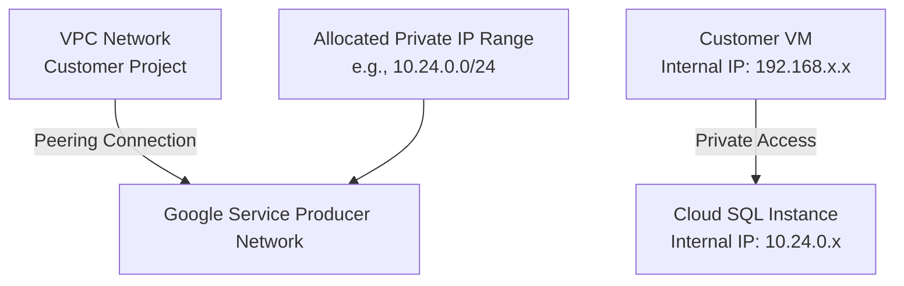

# Session 028: Creating Private Services Access in GCP

## Table of Contents

- [Overview](#overview)
- [Key Concepts and Deep Dive](#key-concepts-and-deep-dive)
  - [What is Private Service Access?](#what-is-private-service-access)
  - [Supported Services](#supported-services)
  - [Network Peering Behind the Scenes](#network-peering-behind-the-scenes)
- [Lab Demo: Setting Up Private Service Access](#lab-demo-setting-up-private-service-access)
  - [Allocating IP Range](#allocating-ip-range)
  - [Creating Private Service Connection](#creating-private-service-connection)
  - [Testing with Cloud SQL](#testing-with-cloud-sql)
- [Summary](#summary)
  - [Key Takeaways](#key-takeaways)
  - [Quick Reference](#quick-reference)
  - [Expert Insight](#expert-insight)

## Overview

Private Service Access in Google Cloud Platform (GCP) enables private connectivity between your Virtual Private Cloud (VPC) network and Google-managed services using internal IP addresses. This allows resources within your VPC to communicate with Google services like Cloud SQL, Cloud Storage, and Memorystore without exposing traffic to the public internet. The session demonstrates the creation of Private Service Access and testing it with a Cloud SQL instance.

## Key Concepts and Deep Dive

### What is Private Service Access?

Private Service Access creates a private connection between your VPC network and Google's service producer networks. It enables your virtual machines (VMs) and other resources to access Google-managed services using internal IP addresses from a dedicated IP range.

**Key Characteristics:**
- Eliminates need for public IP addresses for service access
- Provides secure, private connectivity within your VPC
- Service producer (Google) offers services through internal IP addresses
- One Private Service Connection can access multiple supported services
- Multiple connections can be created if needed for different configurations

**Important Considerations:**
- Allocate a dedicated internal IPv4 address range (no IPv6 support yet)
- Ensure the assigned range doesn't overlap with existing VPC subnet ranges
- Ranges are managed within your VPC networking configuration
- Private Service Access is configured per VPC network

### Supported Services

Not all Google services currently support Private Service Access. The following services are commonly supported:

- Cloud SQL
- Cloud Storage (Filestore)
- Memorystore (Redis/Memcached)
- NetApp Cloud Volumes
- Cloud Build

### Network Peering Behind the Scenes

When Private Service Access is enabled, VPC Network Peering is automatically established between your VPC and Google's service producer network:



This peering relationship enables private routing between your VPC and Google-managed services, ensuring traffic stays within GCP's private network infrastructure.

## Lab Demo: Setting Up Private Service Access

### Allocating IP Range

First, allocate a private IP range for your VPC network:

1. Navigate to **VPC networks** > **Private service access**
2. Click on **ALLOCATED IP RANGES** tab
3. Click **ALLOCATE IP RANGE**
4. Provide a name (e.g., "private-range")
5. Specify an IPv4 range that doesn't conflict with existing subnets (e.g., 192.168.6.0/24)
6. Alternatively, use **Automatic assignment** with desired prefix length (/24)

**IP Range Allocation Parameters:**
- Purpose: Private Service Connection
- IP version: IPv4 only
- Prefix length: /24 (recommended for initial setup)

```bash
# Example IP range allocation (console-based):
gcloud compute addresses create ADDRESS_NAME \
    --global \
    --purpose=VPC_PEERING \
    --addresses=192.168.6.0 \
    --prefix-length=24 \
    --network=NETWORK_NAME
```

### Creating Private Service Connection

After allocating the IP range:

1. Go to **Private connections to services**
2. Click **CREATE PRIVATE CONNECTION**
3. Select **Google Cloud Platform** as the Service Producer
4. Choose your allocated IP range
5. Click **CONNECT**

**Private Connection Configuration:**
- Name: Auto-generated or custom
- Service Producer: Google Cloud Platform
- Allocated Range: Your selected IP range
- Peering Routes: Automatically configured (exported and imported)

The connection will show:
- Peering name: `psa-connection-[network]-[timestamp]`
- Peerings: `servicenetworking-googleapis-com` (Google's side)

### Testing with Cloud SQL

Create a Cloud SQL instance and test the private connection:

1. Navigate to **Cloud SQL**
2. Click **CREATE INSTANCE**
3. Choose PostgreSQL/MySQL/SQL Server
4. Configure basic settings:
   - Instance ID: "testing-psa-sql"
   - Root password: [Secure password]
   - Region: us-central1
   - Zone: Single zone (cost optimization)
   - Machine type: e2-micro or 2 vCPU (for testing)

5. In **Connectivity** section:
   - Uncheck **Public IP**
   - Check **Private IP**
   - Select your VPC network (e.g., second-vpc)
   - The allocated Private Service Access range will be automatically selected

6. Create the instance (takes ~5 minutes)

**Testing Private Connectivity:**
Connect from a VM in the same VPC using internal IP:

```bash
# Install MySQL client on VM
sudo apt update
sudo apt install mysql-client

# Connect to Cloud SQL instance
mysql -h [SQL_PRIVATE_IP] -u root -p
```

**Example Connection Command:**
```bash
# Replace [SQL_PRIVATE_IP] with actual private IP from Cloud SQL console
mysql -h 10.24.0.3 -u root -p
```

**Additional Configuration Options:**

1. **Custom Peering Routes:** Enable for more granular route control
2. **Multiple IP Ranges:** Add additional ranges for different services or environments
3. **Deleting Services:** Remember the 4-day retention period for Google's service producer network

**Managing Multiple Ranges:**
```bash
# Add additional IP range (e.g., auto-assigned)
# 1. Allocate new range in Private service access
# 2. Update private connection to include new range
# 3. Services created after update will have option to use new ranges

# Example: Allocate auto-assigned range with /24 prefix
gcloud compute addresses create ADDRESS_NAME \
    --global \
    --purpose=VPC_PEERING \
    --prefix-length=24 \
    --network=NETWORK_NAME
```

## Summary

### Key Takeaways

```diff
+ Private Service Access enables secure, private connectivity to Google-managed services using internal IPs
+ One Private Service Connection supports multiple supported Google services
+ Allocate dedicated non-overlapping IPv4 ranges for each VPC network
+ Network peering is automatically established between your VPC and Google's service network
- IPv6 is not currently supported
- Public IP addresses are not needed when using Private Service Access
- Supports Cloud SQL, Cloud Storage (Filestore), Memorystore, and other managed services
```

### Quick Reference

**Key Commands and Configurations:**

1. **Allocate IP Range:**
   ```bash
   gcloud compute addresses create RANGE_NAME \
       --global \
       --purpose=VPC_PEERING \
       --addresses=192.168.6.0 \
       --prefix-length=24 \
       --network=YOUR_NETWORK
   ```

2. **Create Private Connection:**
   ```bash
   gcloud services vpc-peerings connect \
       --service=servicenetworking.googleapis.com \
       --ranges=RANGE_NAME \
       --network=YOUR_NETWORK
   ```

3. **Cloud SQL with Private IP:**
   ```bash
   mysql -h [PRIVATE_IP] -u root -p
   ```

**Important GCP Console Paths:**
- VPC networks > Private service access
- Private connections to services
- Cloud SQL > Instance details > Connectivity

### Expert Insight

**Real-world Application:**
In production environments, Private Service Access is essential for secure database connectivity. Use it for microservices architectures where applications need to access Cloud SQL, Redis, or Filestore without exposing services to the internet. It's particularly valuable in regulated industries requiring data residency and network isolation.

**Expert Path:**
- Master multiple IP range allocation patterns for service isolation
- Implement custom peering routes for advanced network control
- Use with Cloud Load Balancing for production-grade applications  
- Study network peering best practices and traffic flow optimization
- Learn Terraform/Google Cloud Deployment Manager for infrastructure as code

**Common Pitfalls:**
- Forgetting IP range overlap checks leading to connectivity issues
- Attempting to delete active IP ranges before 4-day service producer retention period
- Mixing public and private access on same Cloud SQL instances unnecessarily
- Not updating private connections after adding new IP ranges
- Ignoring that IPv6 connectivity is not supported yet
- Assuming all Google services support Private Service Access (check documentation per service)
