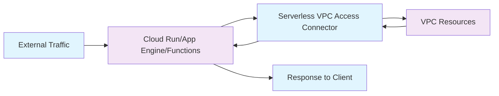

# Session 029: Creating Serverless VPC Access in GCP

<details open>
<summary><b>Creating Serverless VPC Access in GCP (KK-CS45-script-v3)</b></summary>

## Table of Contents
- [Overview](#overview)
- [Key Concepts and Deep Dive](#key-concepts-and-deep-dive)
- [How Serverless VPC Access Works](#how-serverless-vpc-access-works)
- [Creating a Serverless VPC Access Connector](#creating-a-serverless-vpc-access-connector)
- [Configuration Options](#configuration-options)
- [Using Serverless VPC Access with Different Services](#using-serverless-vpc-access-with-different-services)
- [Lab Demonstration](#lab-demonstration)
- [Summary](#summary)

## Overview

This session explores Serverless VPC Access in Google Cloud Platform (GCP), which enables communication between serverless environments (Cloud Run, App Engine, Cloud Functions) and Virtual Private Cloud (VPC) resources using private IP addresses. The presentation covers the creation and configuration of VPC connectors, scaling considerations, and practical usage across different GCP serverless services.

Serverless VPC Access acts as a bridge, allowing serverless applications to securely access VPC resources through internal IP addresses and DNS resolution, eliminating the need for public IP exposure.

## Key Concepts and Deep Dive

### Serverless Environments
Serverless computing refers to cloud services where users only pay for actual resource usage without managing underlying infrastructure. GCP serverless services include:
- Cloud Run: Containerized applications that run on-demand
- App Engine: Platform-as-a-Service (PaaS) for web applications
- Cloud Functions: Event-driven serverless functions

### Virtual Private Cloud (VPC)
A VPC is a virtual network within GCP that provides secure, isolated networking. Key components include:
- Subnets: IP address ranges within regions (e.g., /28 subnets for connectors)
- Firewall rules: Control inbound and outbound traffic
- Internal DNS: Resolves private IP addresses

### VPC Connectors
A serverless VPC access connector is a managed service that enables secure communication between serverless environments and VPC resources:

**Characteristics:**
- Runs on Google-managed VMs with specific machine types (F1-micro, E2-micro, E2-standard-4)
- Uses /28 subnets (16 IP addresses) 
- Handles traffic routing between serverless applications and VPC resources
- Supports scaling based on traffic needs

### Internal IP Communication
- Serverless applications communicate via **internal/private IP addresses**
- Traffic flows through **internal DNS** resolution
- No public internet exposure for VPC resources
- Bypasses typical NAT requirements for serverless-to-VPC communication

### Machine Types and Throughput
Connector throughput scales with machine type selection:

| Machine Type | CPU | Memory | Throughput Characteristics |
|--------------|-----|--------|---------------------------|
| F1-micro | 0.2 | 128MB | Low throughput, cost-effective for light traffic |
| E2-micro | 0.5 | 1GB | Moderate throughput for medium traffic |
| E2-standard-4 | 2 | 16GB | High throughput for heavy traffic |

### Scaling Behavior
**Important Scaling Limitations:**
- Minimum instances: Always 2 (non-configurable)
- Maximum instances: Up to 10
- **Auto-scaling:** Only scales UP, never scales DOWN automatically
- Manual scaling requires creating a new connector with fewer instances

### Network Tags
GCP automatically creates network tags for connectors:
- Universal tag: `vpc-connector` (blocks all connector communication)
- Specific tag: `vpc-connector-[REGION]-[CONNECTOR-NAME]` (blocks specific connector instances)

## How Serverless VPC Access Works



**Communication Flow:**
1. External request hits serverless service (Cloud Run, Functions, etc.)
2. Serverless application issues request to VPC resource via private IP
3. Connector forwards traffic internally within VPC
4. Response flows back through connector
5. Serverless service returns result to client

All communication occurs via private IP addresses, providing security and avoiding internet routing.

## Creating a Serverless VPC Access Connector

### Prerequisites
- GCP project with VPC network
- Appropriate IAM permissions (compute.networkAdmin or serverlessVPCAccessAdmin)
- Available /28 subnet or ability to create one

### Console Creation Steps

1. Navigate to **VPC Network → Serverless VPC Access**
2. Click **Create connector**
3. Configure basic settings:
   - **Name:** Choose descriptive identifier (e.g., `vpc-access-connector`)
   - **Region:** Select deployment region (cannot be changed later)
   - **Network:** Choose target VPC network
4. Configure subnet:
   - Select existing unused /28 subnet, or
   - Create new subnet with /28 IP range (e.g., `192.168.9.0/28`)
5. Configure scaling:
   - **Min instances:** Fixed at 2
   - **Max instances:** 3-10 (based on traffic requirements)
6. Select machine type:
   - F1-micro (cheapest, lowest throughput)
   - E2-micro (balanced)  
   - E2-standard-4 (highest throughput)
7. Click **Create**

**Note:** Connector creation may take several minutes. Monitor via VPC Network console.

## Configuration Options

### Scaling Considerations
```nginx
# Scaling configuration cannot be modified after creation
min_instances: 2    # Fixed, cannot reduce
max_instances: 3-10 # Choose based on traffic patterns
```

**Pricing Impact:** Higher maximum instances increases costs. Consider conservative scaling since auto-downscaling is not available.

### Firewall Rules
GCP automatically creates implicit firewall rules:
- Priority: 1000 (can be overridden with >1000 priority rules)
- Allows: All traffic from connector IP range to VPC destinations
- Security: Restrict specific traffic by creating higher-priority rules

### Network Security Tags
Use tags to control connector communication:
- **Universal restriction:** `vpc-connector` tag blocks all serverless VPC traffic
- **Specific restriction:** Region/connector-specific tags for granular control

## Using Serverless VPC Access with Different Services

### Cloud Run Integration

```yaml
# Docker configuration for testing
# Example: Cloud Run service configuration
service:
  name: private-ip-service
  region: us-central1
  vpc_access:
    connector: vpc-access-connector
  image: gcr.io/project-id/private-ip-app
```

**Key Steps:**
1. Create Cloud Run service
2. Select custom container image
3. Configure **Networking** tab
4. Select VPC connector from dropdown
5. Deploy service

### Cloud Functions Integration

```python
# Example Python function code
import requests
import functions_framework

@functions_framework.http
def vpc_access_function(request):
    # Curl private IP resource
    private_ip = '192.168.1.3'
    response = requests.get(f'http://{private_ip}')
    
    # Store result in Cloud Storage
    # Implementation depends on specific requirements
    return f'VPC Communication: {response.text}'
```

**Configuration:**
1. Create HTTP-triggered function
2. Configure **Runtime** settings
3. Add **VPC connector** in **Connections** tab
4. Deploy function with VPC access enabled

### App Engine Integration

```yaml
# app.yaml configuration
runtime: python39
instance_class: F2
vpc_access_connector:
  name: projects/PROJECT_ID/locations/REGION/connectors/CONNECTOR_NAME
env_variables:
  PRIVATE_IP: '192.168.1.3'
```

**Setup Requirements:**
- Add VPC connector configuration in `app.yaml`
- Specify project ID, region, and connector name
- Deploy app with `--promote` flag

## Lab Demonstration

### Creating VPC Connector

1. Access GCP Console → VPC Network → Serverless VPC Access
2. Create connector:
   - Name: `vpc-access`
   - Region: (selected region)
   - Network: `second-vpc`
   - Subnet: Custom IP range `192.168.9.0/28`
   - Min instances: 2
   - Max instances: 3
   - Machine type: F1-micro

```bash
# Command equivalent (via gcloud CLI)
gcloud compute networks vpc-access connectors create vpc-access \
  --region=us-central1 \
  --subnet=subnet-name \
  --subnet-project=project-id \
  --machine-type=f1-micro \
  --min-instances=2 \
  --max-instances=3
```

### Cloud Run Demo

1. Navigate to Cloud Run
2. Create service with private IP access container
3. Configure Network settings:
   - Select VPC connector: `vpc-access`
4. Deploy and test connectivity to `192.168.1.3`

### Cloud Functions Demo

1. Create HTTP function with Python runtime
2. Configure VPC connector in function settings
3. Implement function to access private IP and store results in Cloud Storage
4. Test via function URL trigger

**Test Results:**
- **With VPC connector:** Successful communication with private VM
- **Without VPC connector:** Connection fails with "Not Found" errors

## Summary

### Key Takeaways
```diff
+ Serverless VPC Access enables private IP communication between serverless services and VPC resources
+ Connectors use managed VMs with specific machine types for traffic routing
+ Auto-scaling only increases instances; no automatic downscaling capability
+ All communication occurs via internal IP addresses for enhanced security
+ Firewall rules are automatically created with priority 1000
- Once created, connector configuration cannot be modified
- Minimum 2 instances requirement impacts cost optimization
- Regional limitation prevents cross-region connectivity within single connector
```

### Quick Reference

```bash
# Create VPC connector
gcloud compute networks vpc-access connectors create CONNECTOR_NAME \
  --region=REGION \
  --subnet=SUBNET_NAME \
  --machine-type=f1-micro \
  --min-instances=2 \
  --max-instances=5

# List connectors
gcloud compute networks vpc-access connectors list --region=REGION

# Describe connector
gcloud compute networks vpc-access connectors describe CONNECTOR_NAME --region=REGION
```

### Expert Insight

#### Real-world Application
Serverless VPC Access is crucial for:
- Microservices architectures where serverless functions need to access databases within VPC
- Web applications requiring private API gateways or internal service meshes
- Data processing pipelines connecting serverless triggers to internal data lakes
- Hybrid cloud scenarios integrating serverless workloads with on-premises resources via VPC peering

#### Expert Path to Mastery
- Start with F1-micro connectors for development/testing environments
- Implement comprehensive monitoring with Cloud Logging/Monitoring for connector metrics
- Design applications with connection pooling to optimize connector usage
- Consider multi-connector architecture for complex regional deployments
- Master subnet planning - reserve /28 ranges specifically for connectors
- Integrate with advanced networking features like Private Google Access

#### Common Pitfalls
- **Ignoring scaling limits:** Setting max instances too high increases costs unnecessarily
- **Wrong subnet selection:** Using subnets with existing resources causes deployment failures
- **Forgetting connector configuration:** Deploying serverless apps without VPC access leads to connectivity issues
- **Region mismatch:** Attempting to use connectors across regions (each connector is regional)
- **Underestimating costs:** F1-micro connectors seem cheap but accumulate costs with multiple instances
- **Network tag confusion:** Incorrect application of network tags can block legitimate traffic
- **No backup strategy:** Since auto-downscaling doesn't exist, plan for manual intervention

</details>
