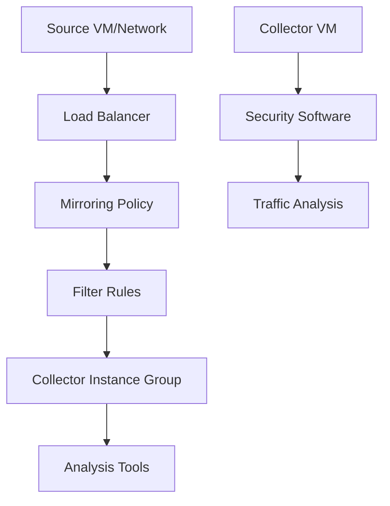

<details open>
<summary><b>Session 30: Creating Mirroring Policy GCP in Hindi (KK-CS45-script-v3)</b></summary>

# Session 30: Creating Mirroring Policy GCP in Hindi

## Table of Contents
- [Overview](#overview)
- [Key Concepts/Deep Dive](#key-conceptsdeep-dive)
  - [What is Packet Mirroring?](#what-is-packet-mirroring)
  - [Use Cases](#use-cases)
  - [How Packet Mirroring Works](#how-packet-mirroring-works)
  - [GCP Implementation Details](#gcp-implementation-details)
- [Lab Demos](#lab-demos)
  - [Creating Load Balancer](#creating-load-balancer)
  - [Creating Mirroring Policy](#creating-mirroring-policy)
  - [Testing the Mirroring](#testing-the-mirroring)
- [Summary](#summary)

## Overview
This session demonstrates how to create and use Packet Mirroring policies in Google Cloud Platform (GCP). Packet Mirroring allows you to capture and analyze network traffic by sending copies of packets from a source (like a load balancer) to a collector instance group for inspection. Use cases include security analysis, performance monitoring, and troubleshooting. The session covers creating load balancers, mirroring policies, filtering traffic, and testing across different projects.

## Key Concepts/Deep Dive

### What is Packet Mirroring?
Packet Mirroring is a network traffic copying mechanism that intercepts packets at the network layer and forwards copies to collector destinations. This non-intrusive traffic duplication enables monitoring, analysis, and diagnostics without disrupting actual traffic flow.

> [!NOTE]
> Packet mirroring operates in both ingress and egress directions, capturing full packets including headers and payloads.

### Use Cases
Packet Mirroring serves various network analysis requirements:

- **Security Monitoring**: Analyze traffic patterns for anomalies, threats, or policy violations
- **Performance Testing**: Examine packet loss, latency, and application behavior
- **Troubleshooting**: Deep packet inspection to identify bandwidth issues, protocol problems, or misconfigurations

### How Packet Mirroring Works


The process involves three key components:
- **Source**: Network endpoint or load balancer sending traffic
- **Mirroring Policy**: Rules defining what traffic to mirror and where to send it
- **Collector**: Destination instance group that receives duplicated packets

Packets are duplicated at the virtual network interface level, ensuring zero performance impact on production traffic.

### GCP Implementation Details

#### Mirroring Policy Scope
- Policies are created within a specific GCP project
- Source and destination networks can be in the same or different projects
- Auto-scaling: New instances in mirrored VM groups are automatically included

#### Traffic Filtering Options
Packet Mirroring supports filtering by:
- Protocol (TCP, UDP, ICMP)
- Port ranges
- IP ranges
- Direction (ingress/egress)

#### Collector Requirements
- Collector instances must be behind a load balancer
- Session affinity must be enabled
- Instances can run in different projects than the source

> [!IMPORTANT]
> Collector load balancers must not have session affinity disabled - this is a requirement for proper packet mirroring operation.

## Lab Demos

### Creating Load Balancer
Follow these steps to create a load balancer for the collector instances:

1. Navigate to GCP Console → Network Services → Load Balancing

2. Create new load balancer:
   - Name: Provide descriptive name
   - Backend type: Instance group
   - Protocol: TCP/UDP (both needed)

3. Configure backend service:
   - Select instance group
   - Enable session affinity (required)
   - Add health checks

4. Configure frontend:
   - Select network and subnet
   - Port: Default or custom

> [!NOTE]
> Session affinity ensures consistent routing to collector instances during analysis.

### Creating Mirroring Policy
To create a mirroring policy in GCP:

1. Go to VPC Network → Packet Mirroring

2. Click "Create Policy"
   - Policy Name: Descriptive name
   - Region: Select appropriate region
   - Mirror source: Choose load balancer or network
   - Enable mirroring

3. Configure source and destination:
   - Source network: VPC network containing mirrored traffic
   - Collector load balancer: Select previously created LB

4. Configure filtering:
   - Protocol: TCP, UDP, ICMP (or specific filter rules)
   - IP ranges: Optional subnet restrictions

5. Create the policy

```bash
# CLI equivalent (conceptual - actual commands vary)
gcloud compute packet-mirrorings create POLICY_NAME \
  --region=REGION \
  --network=SOURCE_NETWORK \
  --collector-ilb=COLLECTOR_LB \
  --mirrored-subnets=all \
  --no-enable \
  --direction=ingress
```

### Testing the Mirroring
Test the mirroring policy using standard network utilities:

1. Install TCPDump on collector instances:
   ```bash
   sudo apt update
   sudo apt install tcpdump
   ```

2. Start traffic capture:
   ```bash
   sudo tcpdump -i eth0 -n
   ```

3. Generate test traffic from another instance:
   ```bash
   ping -c 5 COLLECTOR_IP
   # Or use curl for HTTP traffic
   curl http://COLLECTOR_IP
   ```

4. Verify in collector that traffic is mirrored (you should see incoming packets even without direct connection)

> [!TIP]
> When testing ICMP traffic, you may only see reply packets if not filtering properly. Adjust filter rules to capture both directions.

## Summary

### Key Takeaways
```diff
+ Packet Mirroring enables non-intrusive traffic analysis in GCP
+ Requires load balancer configuration with session affinity enabled
+ Supports cross-project mirroring between different GCP projects
+ Filtering capabilities allow for targeted traffic inspection
+ Useful for security monitoring, performance analysis, and troubleshooting
```

### Quick Reference
**Common Commands:**
```bash
# Install packet capture tool
sudo apt update && sudo apt install tcpdump

# Start traffic capture
sudo tcpdump -i eth0 -n

# Check network interfaces
ip addr show
```

**GCP Resources:**
- Packet Mirroring: VPC Network → Packet Mirroring
- Load Balancing: Network Services → Load Balancing
- Instance Groups: Compute Engine → Instance Groups

### Expert Insight

#### Real-world Application
In production environments, Packet Mirroring powers next-generation network observability platforms. Enterprises use it for:
- Zero-trust security policies with real-time traffic inspection
- Cloud migration validation by comparing traffic patterns
- Compliance auditing by analyzing data flows between regions

#### Expert Path
Master advanced Packet Mirroring configurations by exploring:
- Custom filter rules based on IP ranges and protocols
- Integration with Google Cloud's network security tools
- Automated policy deployment using Terraform/Infrastructure as Code
- Performance optimization for high-throughput environments

#### Common Pitfalls
- **Session Affinity Disabled**: Collector load balancers must have session affinity enabled, or mirroring will fail silently
- **Wrong Network Selection**: Ensure source and destination networks are properly paired, especially in cross-project scenarios
- **Inadequate Filtering**: Over-broad mirroring can overwhelm collector resources; use specific filter rules
- **Region Mismatches**: Source and collector must be in compatible regions for GCP's inter-region peering
</details>
