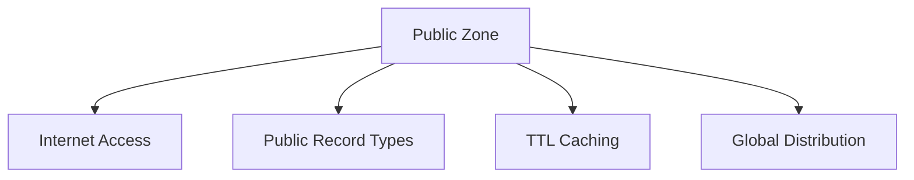
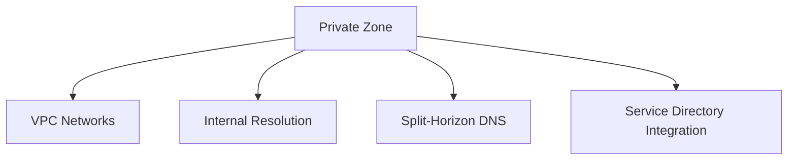

<details open>
<summary><b>031-Working-With-Cloud-DNS-GCP-in-Hindi (KK-CS45-script-v3)</b></summary>

# Session 31: Working with Cloud DNS in Google Cloud (GCP)

## Table of Contents
- [Overview](#overview)
- [Key Concepts and Deep Dive](#key-concepts-and-deep-dive)
  - [DNS Fundamentals](#dns-fundamentals)
  - [Cloud DNS Zones](#cloud-dns-zones)
  - [DNS Records](#dns-records)
  - [Name Servers](#name-servers)
- [Zone Types in Cloud DNS](#zone-types-in-cloud-dns)
- [Creating and Managing DNS Zones](#creating-and-managing-dns-zones)
- [Working with DNS Records](#working-with-dns-records)
- [Best Practices and Troubleshooting](#best-practices-and-troubleshooting)
- [Lab Demonstrations](#lab-demonstrations)
- [Summary](#summary)

## Overview

This session covers Google Cloud DNS, a scalable, reliable, and managed authoritative Domain Name System (DNS) service. Cloud DNS translates domain names into IP addresses, enabling users and services to access applications deployed on Google Cloud or external networks. The session explores zone management, record types, and practical implementations using both console and command-line tools.

> [!IMPORTANT]
> Cloud DNS is production-ready, handles millions of queries per second with 100% SLA uptime, and integrates seamlessly with other GCP services.

## Key Concepts and Deep Dive

### DNS Fundamentals

DNS (Domain Name System) serves as the internet's phone book, converting human-readable domain names to machine-readable IP addresses. In Google Cloud, DNS resolution involves:
- **Authoritative DNS**: Provides definitive answers for domain names
- **Recursive DNS**: Queries multiple name servers to resolve names
- **Caching**: Stores resolved names to improve performance

Cloud DNS specifically handles authoritative DNS, allowing you to create and manage DNS zones containing resource records that map domain names to IP addresses and other resources.

### Cloud DNS Zones

A DNS zone represents a portion of the DNS namespace managed by Cloud DNS. Zones contain resource records that define how domain names should be resolved.

**Key Zone Properties:**
- **Zone Name**: Unique identifier within your GCP project
- **DNS Name**: The domain name suffix (e.g., `example.com.`)
- **Name Servers**: Authoritative servers assigned to the zone
- **Visibility**: Public or private (internal to GCP networks)

### DNS Records

Resource records are the fundamental data units in DNS zones. Cloud DNS supports all standard record types:

**Common Record Types:**
| Record Type | Purpose | Example |
|-------------|---------|---------|
| A | Maps domain to IPv4 address | `www.example.com. IN A 192.0.2.1` |
| AAAA | Maps domain to IPv6 address | `www.example.com. IN AAAA 2001:db8::1` |
| CNAME | Creates alias for domain | `www.example.com. IN CNAME web.example.com.` |
| MX | Defines mail servers | `example.com. IN MX 10 mail.example.com.` |
| TXT | Stores text strings | `example.com. IN TXT "verification=value"` |
| PTR | Reverse DNS lookup | `1.0.0.192.in-addr.arpa. IN PTR example.com.` |
| SRV | Specifies service locations | `_sip._tcp.example.com. IN SRV 10 5 5060 sip.example.com.` |
| NS | Delegates subdomains | `subdomain.example.com. IN NS ns1.example.com.` |
| SOA | Zone authority information | Contains zone metadata |

### Name Servers

Cloud DNS automatically assigns name servers to zones. These servers handle DNS queries for your domains.

**Default Name Servers:** `ns-cloud-{a,b,c,d}.googledomains.com`

Name servers are globally distributed and configured in the zone's SOA (Start of Authority) record.

## Zone Types in Cloud DNS

### Public Zones


Public zones resolve DNS queries from anywhere on the internet. They're ideal for public-facing applications and services.

**Characteristics:**
- Accessible from the public internet
- Support all DNS record types except PTR records
- Configurable TTL (Time to Live) for caching
- Global Anycast IP addresses for fast resolution

### Private Zones


Private zones provide DNS resolution within Google Cloud networks, enabling internal service discovery and custom domain resolution.

**Characteristics:**
- Resolution limited to authorized VPC networks
- Support for private record types (PTR records supported)
- Integration with Cloud DNS forwarding
- Support for Shared VPC architectures

## Creating and Managing DNS Zones

### Creating Public Zones

**Using gcloud:**
```bash
# Create a public DNS zone
gcloud dns managed-zones create my-zone \
  --dns-name=example.com. \
  --description="Public zone for example.com"

# Verify zone creation
gcloud dns managed-zones list
```

**Zone Configuration Parameters:**
- `--dns-name`: Domain suffix (must end with dot)
- `--description`: Human-readable description
- `--labels`: Key-value labels for organization
- `--visibility`: public (default) or private

### Creating Private Zones

**Using gcloud:**
```bash
# Create a private DNS zone
gcloud dns managed-zones create private-zone \
  --dns-name=internal.example.com. \
  --visibility=private \
  --networks=default \
  --description="Private zone for internal services"
```

**Network Association:**
```bash
# Add additional networks to private zone
gcloud dns managed-zones update private-zone \
  --add-network=projects/my-project/global/networks/my-vpc
```

### Zone Management Operations

**Listing Zones:**
```bash
gcloud dns managed-zones list
```

**Describing Zone:**
```bash
gcloud dns managed-zones describe my-zone
```

**Deleting Zone:**
```bash
gcloud dns managed-zones delete my-zone
```

## Working with DNS Records

### Record Set Operations

**Adding Records:**
```bash
# Add A record
gcloud dns record-sets create www.example.com. \
  --ttl=300 \
  --type=A \
  --zone=my-zone \
  --rrdatas="192.0.2.100"

# Add CNAME record  
gcloud dns record-sets create alias.example.com. \
  --ttl=3600 \
  --type=CNAME \
  --zone=my-zone \
  --rrdatas="www.example.com."
```

**Updating Records:**
```bash
# Update existing record
gcloud dns record-sets update www.example.com. \
  --ttl=600 \
  --type=A \
  --zone=my-zone \
  --rrdatas="192.0.2.101"
```

**Deleting Records:**
```bash
# Remove specific record
gcloud dns record-sets delete www.example.com. \
  --type=A \
  --zone=my-zone
```

### Bulk Record Operations

**Transaction-based Updates:**
```bash
# Start transaction
gcloud dns record-sets transaction start --zone=my-zone

# Add multiple records  
gcloud dns record-sets transaction add --name=api.example.com. --type=A --ttl=300 192.0.2.10
gcloud dns record-sets transaction add --name=www.example.com. --type=CNAME --ttl=300 api.example.com.

# Execute transaction
gcloud dns record-sets transaction execute
```

## Best Practices and Troubleshooting

### Performance Optimization

1. **Configure Appropriate TTL Values:**
   ```diff
   + Low TTL (60-300 seconds): Dynamic environments, faster updates
   - High TTL (86400+ seconds): Static content, reduced query load
   + Balanced TTL (3600-7200 seconds): Good compromise for most use cases
   ```

2. **Use Multiple Nameservers:** Cloud DNS provides multiple nameservers for redundancy and performance.

3. **Geographic Distribution:** Leverage global anycast IPs for faster resolution worldwide.

### Common Pitfalls

> [!NOTE]
> **Avoid Common Mistakes:**
> - Forgetting the trailing dot in domain names (`.example.com.` vs `example.com`)
> - Using private zones for public-facing services
> - Not configuring proper PTR records for reverse DNS
> - Setting overly aggressive TTL values

### Troubleshooting Techniques

**DNS Resolution Testing:**
```bash
# Test DNS resolution
nslookup www.example.com 8.8.8.8

# Query specific record types
nslookup -type=mx example.com

# Check zone delegation
dig example.com ns +short
```

**Cloud DNS Logging:**
```bash
# Enable query logging
gcloud dns managed-zones update my-zone \
  --enable-logging
```

**Common Issues Resolution:**
1. **Propagation Delays**: DNS changes can take up to 72 hours globally
2. **CNAME Issues**: Cannot have other records at CNAME location
3. **Zone Authority**: Only one SOA record per zone
4. **Record Conflicts**: Cannot have duplicate records

## Lab Demonstrations

### Lab 1: Creating Public DNS Zone and Records

**Objective:** Set up a public DNS zone and configure basic records

**Steps:**
1. Create public DNS zone for `example.com`
2. Add A record for `www.example.com` pointing to web server IP
3. Add MX records for email routing
4. Add TXT record for domain verification
5. Test resolution globally

### Lab 2: Private DNS Zone for Internal Services

**Objective:** Implement private DNS for microservices discovery

**Steps:**
1. Create private DNS zone for `internal.cloud.`
2. Associate zone with VPC network
3. Add A records for internal services
4. Configure DNS forwarding for external domains
5. Test private resolution from VPC instances

### Lab 3: DNS Analytics and Optimization

**Objective:** Monitor DNS performance and optimize configuration

**Steps:**
1. Enable Cloud DNS logging
2. Configure Cloud Monitoring dashboards
3. Analyze query patterns and performance metrics
4. Optimize TTL values based on usage patterns
5. Set up alerts for DNS failures

## Summary

### Key Takeaways
```diff
+ Cloud DNS provides 100% SLA uptime with global anycast distribution
+ Supports both public and private zones for different use cases  
+ Integrates seamlessly with GCP services (VPC, Cloud Load Balancing)
+ Transaction-based updates ensure atomic changes
+ Extensive logging and monitoring capabilities for troubleshooting
+ Supports all standard DNS record types with advanced features
```

### Quick Reference

**Essential Commands:**
```bash
# Create public zone
gcloud dns managed-zones create ZONE_NAME --dns-name=DOMAIN.com.

# Add A record  
gcloud dns record-sets create NAME --type=A --rrdatas=IP --zone=ZONE

# List zones
gcloud dns managed-zones list

# Query zone records
gcloud dns record-sets list --zone=ZONE_NAME
```

**Console Navigation:** Network Services → Cloud DNS → Zones

### Expert Insight

**Real-world Application:**
In production environments, Cloud DNS powers microservices discovery, enabling service-to-service communication with automatic IP resolution updates as services scale and relocate across zones.

**Expert Path:**
1. Master private zones for service mesh architectures
2. Implement DNS-based load balancing with weighted records
3. Use Cloud DNS APIs for programmatic infrastructure management
4. Configure DNSSEC for enhanced security
5. Monitor and optimize based on query analytics

**Common Pitfalls:**
- Incorrect TTL configuration causing slow updates
- Missing trailing dots leading to resolution failures  
- Private zone configuration without proper VPC association
- CNAME record conflicts with other record types
- Zone delegation issues with domain registrars

🥴 Generated with [Claude Code](https://claude.com/claude-code)

Co-Authored-By: Claude <noreply@anthropic.com>

</details>
