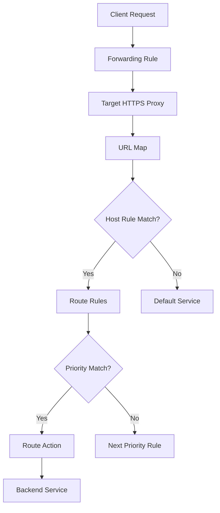

# 037-Create-an-External-Global-Load-Balancer-GCP-Part-3

<details open>
<summary><b>037-Create-an-External-Global-Load-Balancer-GCP-Part-3 (KK-CS45-script-v3)</b></summary>

---

## Table of Contents

1. [Overview](#overview)
2. [Key Concepts and Deep Dive](#key-concepts-and-deep-dive)
   - [Traffic Management Features](#traffic-management-features)
   - [Traffic Steering](#traffic-steering)
   - [Weighted Traffic Splitting](#weighted-traffic-splitting)
   - [Traffic Policies and Mirroring](#traffic-policies-and-mirroring)
   - [HTTP to HTTPS Redirects](#http-to-https-redirects)
   - [Simple vs Advanced Host and Path Rules](#simple-vs-advanced-host-and-path-rules)
3. [Advanced Routing Configuration](#advanced-routing-configuration)
   - [Route Rules and Priorities](#route-rules-and-priorities)
   - [Load Balancing Flow](#load-balancing-flow)
   - [Fault Injection](#fault-injection)
4. [Lab Demos](#lab-demos)
5. [Summary](#summary)
   - [Key Takeaways](#key-takeaways)
   - [Quick Reference](#quick-reference)
   - [Expert Insight](#expert-insight)

---

## Overview

This session covers advanced traffic management capabilities in Google Cloud Platform's (GCP) external global load balancers. Unlike classic load balancers, global load balancers support sophisticated traffic routing features including steering, weighted splitting, mirroring, and fault injection. These features enable canary deployments, A/B testing, and advanced routing based on HTTP parameters.

The session demonstrates practical implementation through GCP console configuration and CLI commands, highlighting the complexity and importance of priority-based routing rules.

## Key Concepts and Deep Dive

### Traffic Management Features

Global load balancers support three main advanced traffic management features not available in classic load balancers:

1. **Traffic Steering**: Route traffic based on HTTP parameters (device type, location, etc.)
2. **Weighted Traffic Splitting**: Distribute traffic across backends by percentage
3. **Traffic Policies**: Create specialized routing rules including mirroring and fault injection

### Traffic Steering

Traffic steering allows directing traffic to specific backends based on HTTP request characteristics:

- **Use Case**: Send Android users to Android-optimized backends, iPhone users to iOS-optimized backends
- **Implementation**: Based on HTTP headers like User-Agent, request parameters, or geographic origin
- **Benefit**: Deliver device-specific or region-specific experiences

```yaml
# Example traffic steering rule
httpRequest:
  headers:
  - headerName: "User-Agent"
    contains: "Android"
    -> routeTo: android-backend

  - headerName: "User-Agent"
    contains: "iPhone"
    -> routeTo: ios-backend
```

### Weighted Traffic Splitting

Weighted traffic splitting enables percentage-based traffic distribution for canary testing and gradual rollouts:

- **Canary Testing**: Send 10% of traffic to new version, 90% to stable version
- **Blue-Green Deployments**: Gradually shift traffic from old to new backend services
- **Risk Mitigation**: Test new features with controlled traffic exposure

```yaml
# Example weighted splitting (canary testing)
backendService:
  - name: stable-backend
    weight: 90%
  - name: canary-backend
    weight: 10%
```

### Traffic Policies and Mirroring

Traffic mirroring creates duplicate traffic streams for monitoring and testing:

- **One-way Traffic**: Mirroring sends traffic copies but doesn't wait for responses
- **Monitoring**: Observe how new backends handle production traffic
- **Debugging**: Test backend behavior without affecting live traffic

```yaml
trafficPolicy:
  - action: mirror
    destination: monitoring-backend
    responseExpected: false
```

### HTTP to HTTPS Redirects

Automatic HTTP-to-HTTPS redirection ensures secure communication:

- **Requirement**: SSL certificate must be configured for HTTPS backend
- **Mechanism**: Separate load balancer handles HTTP traffic redirect to HTTPS
- **Shared IP**: Both HTTP and HTTPS balancers can use same external IP address

### Simple vs Advanced Host and Path Rules

#### Simple Host and Path

- Uses longest path matching
- No priority system
- Limited to host and path matching

#### Advanced Host and Path

- Implements priority-based routing
- Supports complex conditional logic
- Enables traffic manipulation and fault injection
- Requires careful rule ordering due to priority matching

```yaml
# Advanced route rule structure
routeRules:
  - priority: 100
    matchRules:
      - prefixMatch: "/api/v1/"
    action:
      - weightedBackendServices:
        - backend: v1-service
          weight: 80
        - backend: v2-service
          weight: 20
```

## Advanced Routing Configuration

### Route Rules and Priorities

Route rules determine traffic flow through priority-based matching:

- **Priority Logic**: Lower numeric values have higher priority (1 > 100)
- **Matching**: First matching rule processes traffic
- **Fallback**: Traffic without matches routes to default service

### Load Balancing Flow

The load balancing process follows this sequence:



### Fault Injection

Fault injection simulates backend failures for testing resilience:

```yaml
faultInjectionPolicy:
  - delay:
      fixedDelay: 10s
      percentage: 25%
  - abort:
      httpStatus: 503
      percentage: 50%
```

> [!WARNING]
> Fault injection can significantly impact application response times and should only be used for testing purposes.

## Lab Demos

### HTTP to HTTPS Redirect Setup

1. **Create Redirect Load Balancer**:
   - Navigate to GCP Console > Network Services > Load balancing
   - Click "Create load balancer" > "Start configuration"
   - Choose protocol: HTTP
   - Use existing HTTPS load balancer's external IP
   - Enable "HTTP to HTTPS redirect"
   - Configure routing: Advanced host and path rules

2. **Routing Rule Configuration**:
   ```bash
   # Create new load balancer with redirect
   gcloud compute url-maps import redirect-map \
     --source redirect-policy.yaml \
     --global
   ```

### Weighted Traffic Splitting Demo

Configuration for 90%-10% traffic splitting:

- **Route Rule Priority**: 101
- **Match Rule**: Prefix match `/`
- **Backend Services**:
  - Instance Group 1: 90% weight
  - Instance Group 2: 10% weight

### Advanced Routing with Priorities

Example multi-backend configuration:

```yaml
defaultService: instance-group-1

routeRules:
  - priority: 101
    matchRules:
      prefixMatch: "/canary"
    routeAction:
      weightedBackendServices:
        - backendService: instance-group-2
          weight: 10
        - backendService: instance-group-1
          weight: 90

  - priority: 102
    matchRules:
      prefixMatch: "/hello"
    routeAction:
      weightedBackendServices:
        - backendService: cloud-run-hello
          weight: 70
        - backendService: cloud-run-hello2
          weight: 30
```

### CLI Validation and Deployment

**Validate URL Map**:
```bash
gcloud compute url-maps validate \
  --source route-config.yaml \
  --global
```

**Import and Update Load Balancer**:
```bash
gcloud compute url-maps import final-lb \
  --source updated-config.yaml \
  --global
```

**Export Existing Configuration**:
```bash
gcloud compute url-maps export final-lb \
  --destination backup-config.yaml \
  --global
```

## Summary

### Key Takeaways

```diff
+ Global load balancers provide advanced traffic management features like steering, weighted splitting, and mirroring
+ HTTP redirects ensure automatic secure communication flow
+ Advanced routing uses priority-based rules (lower numbers = higher priority)
+ Traffic mirroring enables one-way monitoring without response dependencies
+ Fault injection helps test application resilience under failure conditions
+ CLI tools provide validation and safe configuration deployment
+ Export configurations before major changes to prevent service disruption
- Complex priority matching requires careful rule ordering
- Fault injection can impact real user experience if misconfigured
- Mixing console and CLI changes may overwrite existing configurations
```

### Quick Reference

**CLI Commands**:
```
# Validate URL map configuration
gcloud compute url-maps validate --source config.yaml --global

# Import URL map to load balancer
gcloud compute url-maps import lb-name --source config.yaml --global

# Export existing configuration
gcloud compute url-maps export lb-name --destination backup.yaml --global
```

**Traffic Splitting Rules**:
- Prefix matching: `/canary/` for canary testing paths
- Host matching: `api.example.com` for service-specific routing
- Weight distribution: 10% canary / 90% stable for gradual rollouts

### Expert Insight

**Real-world Application**
In production environments, these advanced features enable sophisticated deployment strategies like blue-green rollouts and gradual feature releases. Enterprises use traffic mirroring to validate new backend versions against production traffic patterns before full rollouts.

**Expert Path**
Begin with weighted traffic splitting for canary deployments, then progress to HTTP-based steering for device-specific content delivery. Learn CLI deployment for infrastructure-as-code integration and master priority rule precedence through systematic testing.

**Common Pitfalls**
1. **Priority Confusion**: Higher priority numbers actually have lower precedence - priority 1 executes before priority 100
2. **Configuration Conflicts**: Overlapping rules can cause unexpected traffic routing
3. **Fault Injection Impact**: Always test in staging; production fault injection can degrade user experience
4. **CLI/Console Mixing**: Avoid switching between console configuration and CLI updates to prevent configuration overwrites
5. **URL Map Complexity**: For complex routing needs, prefer CLI deployment after thorough validation rather than point-and-click UI changes

</details>
