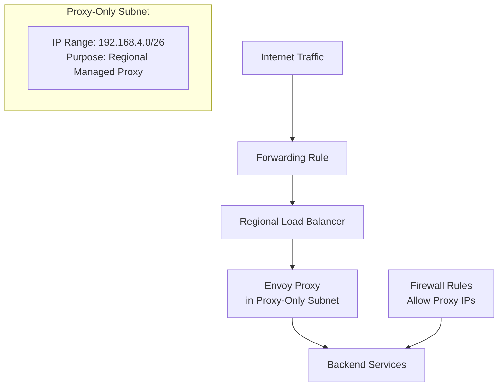
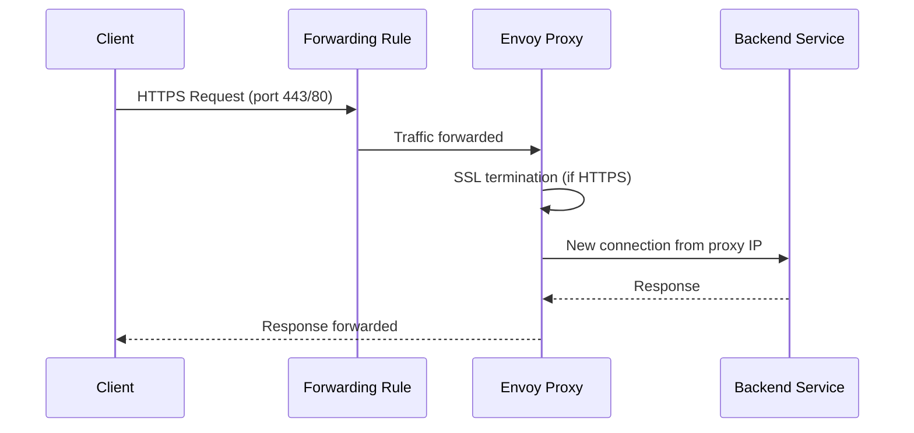
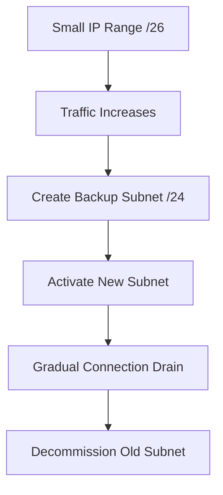

# Session 39: Creating Regional External Load Balancer in GCP

<details open>
<summary><b>039-Creating-Regional-External-Load-Balancer-GCP (KK-CS45-script-v3)</b></summary>

## Table of Contents
- [Overview](#overview)
- [Key Concepts](#key-concepts)
- [Architecture Components](#architecture-components)
- [Regional vs Global Load Balancers](#regional-vs-global-load-balancers)
- [Proxy-Only Subnet](#proxy-only-subnet)
- [Lab Demo: Load Balancer Creation](#lab-demo-load-balancer-creation)
- [Firewall Rules Configuration](#firewall-rules-configuration)
- [Active/Backup Proxy Subnet Management](#activebackup-proxy-subnet-management)
- [Summary](#summary)

## Overview

This session covers the **Regional External Application Load Balancer** in Google Cloud Platform (GCP). Unlike the global external load balancer, the regional version operates within a single region and requires specific configuration components like proxy-only subnets. The load balancer is a Layer 7 proxy-based service that distributes HTTP/HTTPS traffic to backend services using advanced routing rules.

**Key Prerequisites:**
- GCP project with necessary permissions
- VPC network and subnet configured
- Backend instances or instance groups
- Understanding of basic load balancing concepts

## Key Concepts

### Regional External Application Load Balancer

The Regional External Application Load Balancer is a Layer 7 proxy that:
- Distributes traffic across multiple backends in a single region
- Supports HTTP and HTTPS protocols
- Uses Envoy proxies for traffic termination and forwarding
- Provides advanced routing capabilities (host/path-based routing)
- Supports IPv4 only (IPv6 not available yet)

**Use Cases:**
- Applications requiring regional failover within single geography
- Compliance requirements mandating data residency in specific regions
- Cost optimization for single-region deployments
- Network tier must be "Standard" (not "Premium")

### Proxy-Only Subnet Architecture

Proxy-only subnets are specialized subnets reserved exclusively for load balancer proxies:



**Key Characteristics:**
- Required specifically for regional external application load balancers
- Per-region resource (one proxy-only subnet per region)
- IP addresses allocated automatically from reserved subnet ranges
- Shared pool of Envoy proxies across multiple load balancers in same region
- Backends connect to proxy IPs, not original client IPs

## Architecture Components

### Core Components Flow

1. **Forwarding Rule**: Regional rule that captures incoming traffic
2. **Target Proxy**: Envoy-based proxy for SSL termination and traffic forwarding
3. **SSL Certificate**: Regional certificate (Google-managed not available)
4. **URL Map**: Advanced routing rules based on host/path patterns
5. **Backend Services**: Pool of backend instances or groups
6. **Health Checks**: Regional health checks to monitor backend availability

### Traffic Flow



## Regional vs Global Load Balancers

| Aspect | Regional External | Global External |
|--------|-------------------|-----------------|
| **Scope** | Single region | Global (multi-regional) |
| **IP Support** | IPv4 only | IPv4 and IPv6 |
| **SSL Certificates** | Regional certificates only | Global certificates supported |
| **Network Tier** | Standard only | Premium preferred |
| **Compliance** | Regional data residency | Global compliance challenges |
| **Proxy Management** | Proxy-only subnet required | Built-in proxy infrastructure |

## Proxy-Only Subnet

### Purpose and Requirements

Proxy-only subnets provide dedicated IP address ranges for Envoy proxies:
- **Required**: Mandatory for regional external application load balancers
- **Exclusive**: Used only by proxies, not backend instances
- **Per Region**: Minimum one proxy-only subnet per region
- **Shared**: Multiple load balancers in same region share same proxy pool

### Configuration Parameters

```yaml
# VPC Subnet Configuration Example
name: proxy-subnet-1
region: us-central1
purpose: REGIONAL_MANAGED_PROXY
ip_cidr_range: 192.168.4.0/26  # Minimum /26
role: ACTIVE  # ACTIVE or BACKUP
```

**Minimum IP Range Requirements:**
- Small deployments: `/26` (64 IPs)
- Medium deployments: `/24` (256 IPs)
- Large deployments: `/22` or larger for future scaling

### Active/Backup Roles

Proxy-only subnets support active/backup configurations for seamless scaling:

```yaml
# Switching from Backup to Active
backup_subnet: proxy-subnet-backup
active_subnet: current-proxy-subnet
drain_timeout: 300  # seconds for connection migration
```

## Lab Demo: Load Balancer Creation

### Step 1: Create Proxy-Only Subnet

```bash
# VPC Network > Subnets > Create Subnet
subnet_name: "proxy-1"
region: "us-central1"
purpose: "Regional managed proxy"
ip_range: "192.168.4.0/26"  # Minimum /26
role: "ACTIVE"
```

**GCP Console Navigation:**
1. VPC network → Subnets
2. Click "ADD SUBNET"
3. Fill subnet details with proxy-specific purpose

### Step 2: Load Balancer Configuration

```bash
# Cloud Load Balancing > Create Load Balancer
load_balancer_type: "Application Load Balancer (HTTP/HTTPS)"
load_balancer_type: "Regional external application load balancer"

# Configuration Details
name: "my-reg-lb"
region: "us-central1"
network: "lb-network"
proxy_subnet: "proxy-1"

# Frontend Configuration
protocol: "HTTP"  # or HTTPS with custom cert
port: 80
ip_address: "Ephemeral"  # or reserve static regional IP
```

### Step 3: Backend Service Setup

```bash
# Backend Service Configuration
backend_service: 
  name: "my-backend-service"
  protocol: "HTTP"
  port: "80"
  balancing_mode: "RATE"  # or UTILIZATION
  capacity_scaler: 1.0

# Instance Group Backend
backends:
  - group: "my-instance-group"
    port: 80

# Health Checks
health_check:
  protocol: "HTTP"
  port: 80
  request_path: "/"
  check_interval: 5
  timeout: 5
  healthy_threshold: 2
  unhealthy_threshold: 2
```

### Step 4: Routing Rules

```yaml
# URL Map Configuration
url_map:
  name: "my-url-map"
  default_service: "my-backend-service"
  
# Host and Path Rules (Advanced Routing)
host_rules:
  - hosts: ["api.example.com"]
    path_matcher: "api-paths"
    
path_matchers:
  - name: "api-paths"
    route_rules:
      - priority: 1
        match_rules:
          - prefix_match: "/v1/"
        service: "api-backend-service"
      - priority: 2
        match_rules:
          - exact_match: "/health"
        service: "health-backend-service"
```

## Firewall Rules Configuration

### Essential Firewall Rules Required

Two firewall rules are critical for proper operation:

```bash
# Firewall Rule 1: Health Check Access
# Required for load balancer health checks
name: "lb-health-check"
network: "lb-network"
direction: "INGRESS"
priority: 1000
source_ranges: ["130.211.0.0/22", "35.191.0.0/16"]  # Google's health check ranges
target_tags: ["lb-backend"]
allowed:
  - protocol: "tcp"
    ports: ["80"]  # Application port

# Firewall Rule 2: Proxy-to-Backend Access
# Required for traffic from proxy-only subnet
name: "proxy-to-backend"
network: "lb-network"
direction: "INGRESS" 
priority: 900
source_ranges: ["192.168.4.0/26"]  # Your proxy-only subnet range
target_tags: ["lb-backend"]
allowed:
  - protocol: "tcp"
    ports: ["80"]
```

**Critical Security Notes:**
- Proxy-only subnet IPs must be explicitly allowed
- Without these rules, backends won't receive traffic
- Use specific target tags, not "all instances" in production

## Active/Backup Proxy Subnet Management

### Scaling Strategy



### Activation Process

```bash
# Step 1: Create backup subnet
new_subnet: "proxy-2"
range: "192.168.5.0/24"
role: "BACKUP"

# Step 2: Create firewall rule for new range
firewall_rule: "proxy-to-backend-2"
source_ranges: ["192.168.5.0/24"]

# Step 3: Activate new subnet (immediate effect)
activate_target: "proxy-2"
drain_timeout: 300  # 5 minutes for existing connections

# Result: New connections use new subnet, old connections drain
```

**Important Warnings:**
- Activation takes effect immediately for new connections
- Always create firewall rules BEFORE activation
- Monitor traffic during drain period
- Set appropriate drain timeouts (avoid very short timeouts in production)

## Summary

### Key Takeaways
```diff
+ Regional load balancers require proxy-only subnets for Envoy proxy management
- IPv6 is not supported; IPv4 only with standard network tier
+ Firewall rules must explicitly allow proxy subnet IP ranges to backends
+ Active/backup proxy subnets enable seamless scaling without downtime
+ Google-managed SSL certificates are not available; regional certificates only
+ Single-region scope ideal for compliance and regional data residency requirements
```

### Quick Reference

**Proxy-Only Subnet Creation:**
```bash
# Minimum specification
IP Range: /26 or larger
Purpose: Regional managed proxy
Role: ACTIVE (initially)
```

**Essential Firewall Rules:**
- Health check ranges: `130.211.0.0/22`, `35.191.0.0/16`
- Proxy subnet range: *[your-proxy-cidr]*

**Scaling Command:**
```bash
# Switch active proxy subnet
activate new_proxy_subnet --drain-timeout=300
```

**Verification Steps:**
1. Check backend health status
2. Verify proxy subnet allocation
3. Test firewall rule application
4. Monitor load balancer metrics

### Expert Insight

**Real-world Application:**
- Use regional load balancers in multi-cloud scenarios where you need GCP-specific regional services
- Deploy for legacy applications requiring single-region database connectivity
- Implement for cost-effective regional HA without global distribution overhead
- Choose when CDN integration through global load balancers isn't required

**Expert Path:**
- Monitor proxy IP exhaustion trends; plan subnet expansion before hitting limits
- Use Infrastructure as Code (Terraform/Cloud Deployment Manager) for replicable deployments
- Implement comprehensive monitoring for connection draining during subnet switches
- Design for regional failover by replicating backends across zones within the region

**Common Pitfalls:**
- Forgetting to create firewall rules from proxy subnet ranges causes traffic blackholing
- Using `/29` or smaller subnets leads to rapid IP exhaustion with multiple load balancers
- Premature activation of backup subnets without firewall preparation causes service disruption
- Assuming Google-managed certificates work like global load balancers (they don't for regional)
- Not adjusting drain timeouts based on application connection persistence requirements

</details>
