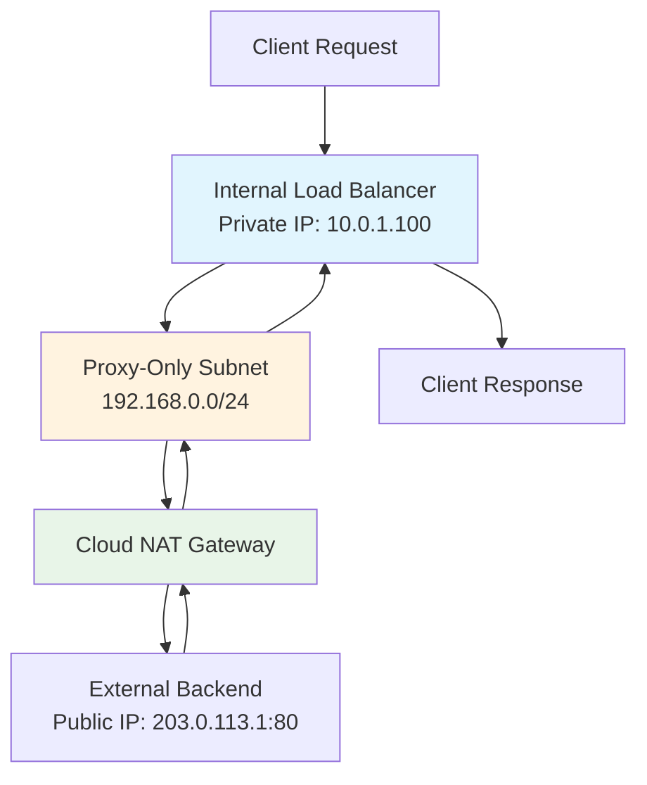

# Session 42: Creating Regional Internal Application Load Balancer with an External Backend GCP

<details open>
<summary><b>Creating Regional Internal Application Load Balancer with an External Backend GCP (KK-CS45-script-v3)</b></summary>

## Table of Contents
- [Overview](#overview)
- [Key Concepts/Deep Dive](#key-conceptsdeep-dive)
  - [What is a Regional Internal Application Load Balancer?](#what-is-a-regional-internal-application-load-balancer)
  - [External Backend Architecture](#external-backend-architecture)
  - [Proxy-Only Subnet](#proxy-only-subnet)
  - [Cloud NAT Gateway](#cloud-nat-gateway)
  - [Internet Network Endpoint Groups](#internet-network-endpoint-groups)
  - [Traffic Flow Architecture](#traffic-flow-architecture)
  - [Prerequisites](#prerequisites)
  - [Step-by-Step Implementation](#step-by-step-implementation)
- [Summary](#summary)
  - [Key Takeaways](#key-takeaways)
  - [Quick Reference](#quick-reference)
  - [Expert Insight](#expert-insight)

## Overview

This session demonstrates how to create a regional internal application load balancer in Google Cloud Platform (GCP) that routes traffic to external backends located over the internet. The setup allows users to access external services through a private IP address while maintaining the scalability and reliability of Google Cloud Load Balancing.

The key challenge addressed is connecting private VPC resources to public internet backends using proxy-only subnets and Cloud NAT Gateway, enabling secure and controlled access to external services.

## Key Concepts/Deep Dive

### What is a Regional Internal Application Load Balancer?

Regional internal application load balancers are Layer 7 (HTTP/HTTPS) load balancers that distribute traffic within a GCP region using private IP addresses. They provide:

- **High Availability**: Automatic failover and load distribution across backend services
- **Scalability**: Handle variable traffic loads automatically
- **Security**: Traffic remains within private networks
- **Performance**: Optimized routing with minimal latency

### External Backend Architecture

> [!IMPORTANT]
> External backends allow load balancers to route traffic to services outside GCP, accessible via public IP addresses or Fully Qualified Domain Names (FQDNs). This enables hybrid architectures where private cloud resources communicate with public internet services.

Key components:
- **Backend Services**: Groups of external endpoints (IP:port or FQDN:port combinations)
- **Internet Network Endpoint Groups (NEGs)**: Collections of external endpoints
- **Health Checks**: Monitor endpoint availability and routing decisions

### Proxy-Only Subnet

> [!NOTE]
> Proxy-only subnets are specialized subnets used exclusively by Google Cloud load balancers. They provide a pool of IP addresses that GCP uses to run proxy instances on your behalf.

#### Key Characteristics:
- **Region-Specific**: One proxy-only subnet per region per VPC network
- **Shared Resources**: Multiple load balancers in the same region share the same proxy subnet
- **No VM Attachments**: Never attach proxy-only subnets to backend VMs
- **IP Range**: Typically uses /24 or /23 CIDR blocks (example: 192.168.0.0/24)

```bash
# Create proxy-only subnet using gcloud
gcloud compute networks subnets create proxy-subnet \
  --network=my-vpc \
  --region=us-central1 \
  --range=192.168.0.0/24 \
  --purpose=REGIONAL_MANAGED_PROXY \
  --role=ACTIVE
```

### Cloud NAT Gateway

Cloud NAT (Network Address Translation) enables private subnet resources to initiate connections to the internet while preventing unsolicited inbound connections.

```bash
# Create Cloud Router
gcloud compute routers create nat-router \
  --network=my-vpc \
  --region=us-central1

# Create NAT Gateway
gcloud compute routers nats create nat-gateway \
  --router=nat-router \
  --region=us-central1 \
  --nat-all-subnet-ip-ranges \
  --nat-external-ip-pool=auto-allocate
```

| NAT Type | IP Allocation | Use Case |
|----------|---------------|----------|
| Auto-allocated | GCP assigns IPs automatically | Simple setups, no IP restrictions |
| Manual | Pre-reserved static IPs | Specific IP whitelisting requirements |

### Internet Network Endpoint Groups

Internet NEGs are collections of external endpoints that can be used as backends for load balancers. They support:

- **IP and Port**: Direct IP address with port number
- **FQDN and Port**: Domain names with port numbers
- **Multiple Endpoints**: Up to 256 endpoints per NEG
- **Regional Scope**: Must match load balancer region

```bash
# Create Internet NEG
gcloud compute network-endpoint-groups create my-neg \
  --network-endpoint-group-type=internet-ip-port \
  --region=us-central1 \
  --network=my-vpc \
  --default-port=80

# Add endpoints to NEG
gcloud compute network-endpoint-groups update my-neg \
  --region=us-central1 \
  --add-endpoint="ip=203.0.113.1,port=80"
```

### Traffic Flow Architecture



### Prerequisites

Before implementation, ensure you have:

1. **GCP Project** with appropriate permissions
2. **VPC Network** and standard subnets for VMs
3. **External Backend** accessible via public IP or FQDN
4. **Reserved Internal IP** for load balancer frontend
5. **Health Check Configuration** for backend monitoring

### Step-by-Step Implementation

#### 1. Create Proxy-Only Subnet

```bash
# Navigate to VPC Networks in GCP Console
# Or use gcloud command above
```

#### 2. Configure Cloud NAT Gateway

```bash
# Commands provided in transcript
gcloud compute routers create external-router \
  --network=lb-network \
  --region=us-central1

gcloud compute routers nats create external-net-gateway \
  --router=external-router \
  --region=us-central1 \
  --nat-all-subnet-ip-ranges \
  --nat-external-ip-pool=auto-allocate \
  --enable-endpoint-independent-mapping
```

#### 3. Create Internet Network Endpoint Group

```bash
gcloud compute network-endpoint-groups create external-neg \
  --network-endpoint-group-type=internet-ip-port \
  --region=us-central1 \
  --network=lb-network \
  --default-port=80

gcloud compute network-endpoint-groups update external-neg \
  --region=us-central1 \
  --add-endpoint="ip=EXTERNAL_IP,port=80"
```

#### 4. Configure Load Balancer

**Backend Service Configuration:**
- Create backend service pointing to Internet NEG
- Configure health checks for external endpoints

**Frontend Configuration:**
- HTTP protocol (HTTPS requires certificates)
- Select proxy-only subnet
- Reserve internal IP address
- Enable global access for cross-region connectivity

## Summary

### Key Takeaways

```diff
+ Regional internal load balancers can route traffic to external internet backends
+ Proxy-only subnets enable Google-managed proxy instances
+ Cloud NAT Gateway allows private subnets to reach internet services
+ Internet Network Endpoint Groups connect load balancers to external endpoints
+ Traffic flows: Client → Private IP → Proxy Subnet → NAT Gateway → External Backend
- External backends must be accessible via public IP or FQDN
- Proxy-only subnets cannot be attached to VMs or used for other purposes
! Global access enables cross-region communication within the same VPC
```

### Quick Reference

**Proxy-Only Subnet Creation:**
```bash
gcloud compute networks subnets create proxy-subnet \
  --network=my-vpc \
  --region=us-central1 \
  --range=192.168.0.0/24 \
  --purpose=REGIONAL_MANAGED_PROXY \
  --role=ACTIVE
```

**NAT Gateway Setup:**
```bash
gcloud compute routers create nat-router --network=my-vpc --region=us-central1
gcloud compute routers nats create nat-gateway \
  --router=nat-router \
  --region=us-central1 \
  --nat-all-subnet-ip-ranges
```

**Internet NEG Commands:**
```bash
gcloud compute network-endpoint-groups create my-neg \
  --network-endpoint-group-type=internet-ip-port \
  --region=us-central1 \
  --network=my-vpc \
  --default-port=80

gcloud compute network-endpoint-groups update my-neg \
  --region=us-central1 \
  --add-endpoint="ip=EXTERNAL_IP,port=80"
```

### Expert Insight

**Real-world Application:**
This architecture is commonly used for hybrid cloud scenarios where GCP workloads need to communicate with:
- Third-party SaaS applications
- Legacy on-premises systems exposed via public IPs
- Partner APIs requiring private-to-public connectivity
- Secure access to public APIs without exposing private infrastructure

**Expert Path:**
- Implement proper monitoring and alerting for NAT Gateway usage
- Use manual IP allocation for NAT when external services require IP whitelisting
- Configure health checks with appropriate timeouts and thresholds
- Implement backup internet NEGs for high availability
- Use Cloud Armor for additional security controls

**Common Pitfalls:**
- Forgetting to create proxy-only subnets before load balancer deployment
- Misconfiguring NAT Gateway IP allocation, leading to connectivity issues
- Using global NEGs instead of regional ones, causing routing failures
- Not enabling global access when cross-region access is required
- Assuming external backends support all HTTP methods without verification

</details>
