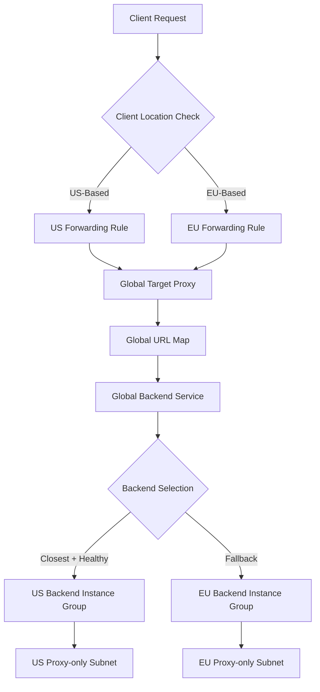

# Session 043: Creating Cross-region Internal Application Load Balancer in GCP

<details open>
<summary><b>043: Creating Cross-region Internal Application Load Balancer in GCP (KK-CS45-script-v3)</b></summary>

## Table of Contents
- [Overview](#overview)
- [Key Concepts and Deep Dive](#key-concepts-and-deep-dive)
- [Architecture](#architecture)
- [Proxy-only Subnets](#proxy-only-subnets)
- [Traffic Flow and Failover](#traffic-flow-and-failover)
- [Lab Demo: Implementation Steps](#lab-demo-implementation-steps)
- [DNS Policy Configuration](#dns-policy-configuration)
- [Testing and Validation](#testing-and-validation)
- [Summary Section](#summary-section)

## Overview

This session covers the implementation of **Cross-region Internal Application Load Balancer** in Google Cloud Platform (GCP). Cross-region internal load balancers enable intelligent traffic distribution across globally distributed backend services, providing high availability through automatic failover and proximity-based routing. Unlike traditional regional load balancers, this solution ensures traffic is directed to the nearest healthy backends regardless of geographic distance.

The demo showcases a complete setup with backends in multiple regions (US Central and Europe West), demonstrating automatic failover, global accessibility, and integration with Cloud DNS for intelligent routing policies.

## Key Concepts and Deep Dive

### What is Cross-region Internal Load Balancer

Cross-region internal application load balancers (CRILB) are advanced load balancing solutions in GCP that distribute traffic across backend services deployed in multiple regions. They represent the evolution of traditional internal load balancers from regional to global distribution scopes.

Unlike regional internal load balancers that operate within a single zone or region, CRILBs maintain global visibility and can route traffic based on:

- **Geographic proximity**: Directing clients to the nearest backend
- **Health status**: Automatically avoiding unhealthy backends
- **Load capacity**: Distributing requests across all healthy backends
- **Availability**: Providing seamless failover across regions

### Key Benefits

✅ **Low-latency routing**: Traffic directed to geographically closest backends  
✅ **High availability**: Automatic failover when regions/backends become unavailable  
✅ **Global accessibility**: Clients from any GCP region can access the load balancer  
✅ **Global backends**: Support for backend services across multiple regions  
✅ **Automatic failover**: Seamless traffic redirection during regional outages  

### Architecture

The cross-region internal load balancer utilizes a sophisticated global architecture:

- **Global forwarding rules**: Two IP addresses (one per region) serve as entry points
- **Global target proxy**: Routes traffic to appropriate backend services
- **Global URL map**: Defines routing logic for URL-based distribution
- **Global backend service**: Manages traffic distribution across regions
- **Regional proxy-only subnets**: Dedicated subnets for load balancer proxies in each region



### Proxy-only Subnets

Proxy-only subnets represent specialized network segments reserved exclusively for Google's proxy infrastructure during load balancing operations.

Created via Cloud Shell commands, these subnets serve two critical functions:
1. Hosting Google's proxy servers for request processing
2. Enabling inter-region communication within the load balancer ecosystem

> [!IMPORTANT]  
> Cross-regional load balancers mandate dedicated proxy-only subnets in each operational region, with regional variants being incompatible.

### Traffic Flow and Failover

Traffic processing follows a systematic progression through global components:

1. **NASA Entry Point**: Client connections arrive at region-specific forwarding rules
2. **Global Processing**: Traffic gets routed through global proxy infrastructure
3. **Backend Selection**: Based on proximity and health status
4. **Automatic Failover**: Traffic dynamically redirected to available regions during outages

Key characteristic involves intelligent backend preference, prioritizing geographically closest healthy instances while maintaining seamless failover mechanisms.

## Lab Demo: Implementation Steps

### Step 1: Prepare VPC and Subnets

Begin with a custom VPC network containing regional subnets for backend instances:

```bash
# Example VPC network configuration
LB Network: 10.0.0.0/8
US-Central Subnet: 10.0.0.0/16  
Europe-West Subnet: 10.0.0.0/16
```

### Step 2: Create Proxy-only Subnets

Execute Cloud Shell commands to establish proxy-only subnets:

```bash
# Create proxy-only subnet in US Central region
gcloud beta compute networks subnets create proxy-only-us-central \
    --purpose=GLOBAL_MANAGED_PROXY \
    --role=ACTIVE \
    --network=lb-network \
    --region=us-central1 \
    --range=10.2.0.0/23

# Create proxy-only subnet in Europe West region  
gcloud beta compute networks subnets create proxy-only-europe-west \
    --purpose=GLOBAL_MANAGED_PROXY \
    --role=ACTIVE \
    --network=lb-network \
    --region=europe-west1 \
    --range=10.3.0.0/23
```

### Step 3: Configure Firewall Rules

Establish ingress rules permitting proxy traffic:

```bash
# SSH access to backends
gcloud compute firewall-rules create allow-ssh \
    --network=lb-network \
    --allow=tcp:22 \
    --source-ranges=0.0.0.0/0 \
    --target-tags=lb-backends

# Health check traffic
gcloud compute firewall-rules create allow-health-checks \
    --network=lb-network \
    --allow=tcp:80 \
    --source-ranges=35.191.0.0/16,130.211.0.0/22 \
    --target-tags=lb-backends

# Proxy traffic access
gcloud compute firewall-rules create allow-proxy \
    --network=lb-network \
    --allow=tcp:80 \
    --source-ranges=10.2.0.0/23,10.3.0.0/23 \
    --target-tags=lb-backends
```

### Step 4: Create Managed Instance Groups

Develop instance templates and create regional instance groups:

```bash
# Create instance template
gcloud compute instance-templates create lb-backend-template-1 \
    --machine-type=e2-micro \
    --network=lb-network \
    --subnet=lb-subnet-us-central \
    --tags=lb-backends \
    --image-family=debian-11 \
    --image-project=debian-cloud \
    --metadata=startup-script='#!/bin/bash
      sudo apt update
      sudo apt install -y apache2
      sudo systemctl start apache2
      echo "US Central Backend" > /var/www/html/index.html'

# Create regional instance groups
gcloud compute instance-groups managed create us-central-ig \
    --template=lb-backend-template-1 \
    --size=2 \
    --region=us-central1 \
    --target-distribution-shape=EVEN

gcloud compute instance-groups managed create europe-west-ig \
    --template=lb-backend-template-1 \
    --size=2 \
    --region=europe-west1 \
    --target-distribution-shape=EVEN
```

### Step 5: Configure the Load Balancer

Implement global load balancer through Cloud Shell command sequence:

**Health Check:**
```bash
gcloud compute health-checks create http global-health-check \
    --port=80 \
    --request-path=/ \
    --check-interval=30s \
    --timeout=10s \
    --healthy-threshold=2 \
    --unhealthy-threshold=3
```

**Backend Service:**
```bash
gcloud compute backend-services create global-backend-service \
    --global \
    --protocol=HTTP \
    --health-checks=global-health-check \
    --health-checks-region=us-central1 \
    --load-balancing-scheme=INTERNAL_MANAGED \
    --timeout=30s
```

**Add Backends:**
```bash
# Add US Central backend
gcloud compute backend-services add-backend global-backend-service \
    --instance-group=us-central-ig \
    --instance-group-region=us-central1 \
    --global

# Add Europe West backend
gcloud compute backend-services add-backend global-backend-service \
    --instance-group=europe-west-ig \
    --instance-group-region=europe-west1 \
    --global
```

**URL Map:**
```bash
gcloud compute url-maps create global-url-map \
    --default-service=global-backend-service
```

**Target Proxy:**
```bash
gcloud compute target-http-proxies create global-target-proxy \
    --url-map=global-url-map \
    --url-map-region=us-central1
```

**Forwarding Rules:**
```bash
# US Central forwarding rule
gcloud compute forwarding-rules create us-central-forwarding-rule \
    --global \
    --target-http-proxy=global-target-proxy \
    --target-http-proxy-region=us-central1 \
    --network=lb-network \
    --subnet=lb-subnet-us-central \
    --address=10.0.10.100 \
    --ports=80 \
    --ip-protocol=TCP \
    --load-balancing-scheme=INTERNAL_MANAGED

# Europe West forwarding rule
gcloud compute forwarding-rules create europe-west-forwarding-rule \
    --global \
    --target-http-proxy=global-target-proxy \
    --target-http-proxy-region=us-central1 \
    --network=lb-network \
    --subnet=lb-subnet-europe-west \
    --address=10.0.20.100 \
    --ports=80 \
    --ip-protocol=TCP \
    --load-balancing-scheme=INTERNAL_MANAGED
```

## DNS Policy Configuration

Implement intelligent routing through Cloud DNS geolocation policies:

1. Create private DNS zone within `lb-network`
2. Establish A records with geolocation routing:
   - `us-central-example.com` → US Central forwarding rule (10.0.10.100)
   - `europe-west-example.com` → Europe West forwarding rule (10.0.20.100)

Geolocation policies intelligently direct traffic based on source region proximity.

## Testing and Validation

### Basic Routing Test
Execute curl commands to validate regional affinity:

```bash
# Test from US-based client
curl 10.0.10.100
# Expected: Response from US Central backend

# Test from EU-based client  
curl 10.0.20.100
# Expected: Response from Europe West backend
```

### Failover Testing
Simulate regional outage to verify automatic failover:

```bash
# Stop Apache on EU backends
sudo systemctl stop apache2

# Test continued accessibility through US region
curl 10.0.20.100
# Expected: Fallback to US Central backend response
```

### DNS Policy Validation
Confirm geolocation routing effectiveness:

```bash
# From EU region
curl europe-west-example.com
# Expected: Direct routing to EU backend

# When EU backends unhealthy
curl europe-west-example.com  
# Expected: Automatic failover to US backend
```

## Summary Section

### Key Takeaways

```diff
+ Cross-region internal load balancers enable global traffic distribution across multiple GCP regions
+ Automatic proximity-based routing ensures optimal latency for geographically distributed clients  
+ Built-in failover capabilities maintain high availability during regional outages
+ Global accessibility allows clients from any region to reach internal services
+ Mandatory proxy-only subnets in each operational region for proxy infrastructure
- Command-line only deployment (beta features currently unavailable in GCP Console)
- Complex configuration requiring precise firewall rule management for proxy traffic
- Additional Cloud DNS configuration needed for intelligent geolocation-based routing
```

### Quick Reference

**Core Commands:**
```nginx
# Health check creation
gcloud compute health-checks create http global-health-check --port=80

# Backend service with global scope
gcloud compute backend-services create global-backend-service --global --protocol=HTTP

# Forwarding rules for each region
gcloud compute forwarding-rules create [NAME] --global --target-http-proxy=[PROXY] --address=[IP]
```

**Firewall Essentials:**
- Health check ranges: `35.191.0.0/16, 130.211.0.0/22`
- Allow proxy subnets access to backend instances
- Configure URL-based routing through global URL maps

### Expert Insight

**Real-world Application**  
Deploy cross-region internal load balancers for enterprise applications requiring global reach with local performance optimization. Perfect for multinational organizations with distributed user bases needing consistent internal service access across continents.

**Expert Path**  
Master complex multi-region architectures by:
- Implementing comprehensive health check strategies beyond basic HTTP checks
- Designing sophisticated URL mapping for microservices architectures  
- Automating deployment through Infrastructure as Code (IaC) tools
- Monitoring cross-region metrics for performance optimization

**Common Pitfalls**
- Forgetting proxy-only subnet requirements in each region
- Incorrect firewall rules blocking essential proxy traffic
- Not testing failover scenarios comprehensively before production deployment
- Using regional instead of global backend services
- Neglecting DNS geolocation policies for optimal routing

</details>
