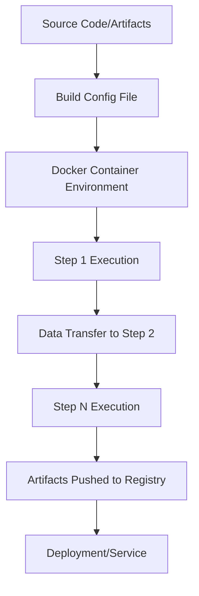
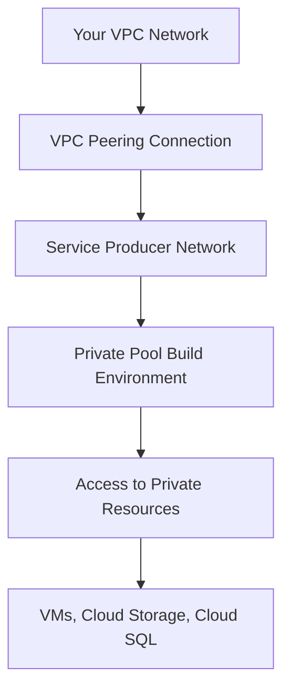

# Session 45: Working with Cloud Build and Private Pools in GCP (Part 1)

<details open>
<summary><b>Session 45: Working with Cloud Build and Private Pools in GCP (Part 1) (KK-CS45-script-v3)</b></summary>

## Table of Contents
- [Overview](#overview)
- [Key Concepts & Deep Dive](#key-concepts--deep-dive)
- [Lab Demos](#lab-demos)
  - [Creating Docker Images with Cloud Build](#creating-docker-images-with-cloud-build)
  - [Deploying to Cloud Run](#deploying-to-cloud-run)
  - [Setting Up Private Pools](#setting-up-private-pools)
- [Summary](#summary)

## Overview

This session introduces Google Cloud Build as a serverless continuous integration and continuous delivery (CI/CD) platform. Cloud Build allows you to execute builds using Docker containers, supporting various programming languages and frameworks including Python, Node.js, Java, and Go. The session covers build configuration using cloudbuild.yaml files, artifact management with Artifact Registry, and the concept of private pools for enhanced security and private network access.

Key demonstrations include building Docker images, deploying to Cloud Run, and configuring private pools with VPC peering for accessing private GCP resources securely.

## Key Concepts & Deep Dive

### Cloud Build Fundamentals

Google Cloud Build is a managed CI/CD service that executes your build steps inside Docker containers. Each build can consume multiple steps, with data automatically passed between containerized environments for secure, isolated execution.

**Build Execution Flow:**


### Build Configuration Files

Cloud Build uses either `cloudbuild.yaml` or `cloudbuild.json` configuration files to define build steps. These files specify the sequence of operations that will be executed during the build process.

**Essential Configuration Components:**

1. **Steps Array**: Each step represents a container execution
   - **name**: Docker image/container to use
   - **args**: Commands to execute within the container
   - **dir**: Working directory (optional)

2. **Automatic Substitutions**:
   - `$PROJECT_ID`: Automatically replaces with your GCP project ID
   - `$BUILD_ID`: Unique identifier for the build
   - `$COMMIT_SHA`: Git commit hash

3. **Images Section**: Defines artifacts to push to Artifact Registry
4. **Options**: Build-specific configuration (timeout, machine type, etc.)

### Docker Image Building vs. Build Configuration

Cloud Build offers two primary approaches for container image creation:

**Built-in Docker Support**: Simplifies Docker image creation without explicitly defining build steps:

```bash
gcloud builds submit --tag gcr.io/$PROJECT_ID/quickstart-image .
```

**Custom Build Configuration**: Provides granular control through cloudbuild.yaml:

```yaml
steps:
- name: gcr.io/cloud-builders/docker
  args: ['build', '-t', 'gcr.io/$PROJECT_ID/quickstart-image:$COMMIT_SHA', '.']
images:
- gcr.io/$PROJECT_ID/quickstart-image:$COMMIT_SHA
```

### Context-Aware Substitutions

Cloud Build supports numerous automatic substitutions that adapt based on your source and build context. These reduce configuration complexity and enable dynamic build behavior.

### Artifact Registry Integration

Artifacts generated during builds are automatically pushed to Google Artifact Registry, supporting multiple formats:
- Docker container images
- Java archives (JAR/WAR)
- Python packages
- Node.js packages
- Go modules

### Private Pools vs. Default Pools

**Key Advantages of Private Pools:**

- **Customizable Machine Types**: 30+ machine type options vs. 5 in default pools
- **Network Control**: Ability to disable public IPs and configure internet access
- **Resource Access**: Connect to private GCP resources via VPC network peering
- **Regional Deployment**: Builds execute in the specified region
- **Enhanced Security**: Isolated infrastructure for compliance requirements

**Comparison Matrix:**

| Feature | Default Pool | Private Pool |
|---------|-------------|--------------|
| Management | Fully Managed | Fully Managed |
| Autoscaling | Yes | Yes |
| Public Internet Access | Yes | Configurable |
| Private Network Access | Limited | Yes (via VPC peering) |
| Concurrent Builds | 100 max | 100 max |
| Machine Types | 5 types | 30+ types |
| Regions | Global | Supported regions only |
| Public IP Control | N/A | Yes |

### Service Producer Networks

Private pools operate within Google's service producer networks that provide:
- Internal IP-only connectivity
- Network isolation from public internet
- VPC peering capability for private resource access

### Private Service Access Setup

To enable private resource connectivity:

1. **Enable Service Networking API**
2. **Allocate IP Range**: Reserve CIDR block for network peering
3. **Create Private Service Connection**: Establish secure tunnel
4. **VPC Peering**: Connect customer VPC to service producer network

**Private Service Access Flow:**


## Lab Demos

### Creating Docker Images with Cloud Build

**Objective**: Build a Docker image using both Dockerfile approach and cloudbuild.yaml configuration.

**Prerequisites**:
- Artifact Registry repository created
- Source code with Dockerfile and application files

**Steps for Dockerfile Method**:

1. **Create Dockerfile**:
```bash:5,9:workspace
# Use the official Alpine Linux image as the base image
FROM alpine:3.18.4

# Copy the Quickstart.sh script into the workspace directory
COPY quickstart.sh /workspace/

# Make the script executable and run it
RUN chmod +x /workspace/quickstart.sh
CMD ["/workspace/quickstart.sh"]
```

2. **Submit Build via gcloud**:
```bash
gcloud builds submit --tag us-west1-docker.pkg.dev/PROJECT_ID/quickstart-docker-repo/quickstart-image:v1 --region us-west1 .
```

3. **Verification**: Check Artifact Registry for the created image

**Steps for cloudbuild.yaml Method**:

1. **Create cloudbuild.yaml**:
```yaml:1,8:cloudbuild.yaml
steps:
- name: gcr.io/cloud-builders/docker
  args:
  - build
  - -t
  - us-west1-docker.pkg.dev/$PROJECT_ID/quickstart-docker-repo/quickstart-image:v2
  - .
images:
- us-west1-docker.pkg.dev/$PROJECT_ID/quickstart-docker-repo/quickstart-image:v2
```

2. **Submit Build**:
```bash
gcloud builds submit --config cloudbuild.yaml --region us-west1 .
```

3. **Alternate Command Without Region**:
```bash
gcloud builds submit --config cloudbuild.yaml .
```

### Deploying to Cloud Run

**Objective**: Demonstrate automated deployment from Cloud Build to Cloud Run.

**Configuration Steps**:

1. **Enable Cloud Run API**: Ensure Cloud Run is accessible from service accounts

2. **Create cloudbuild.yaml for Cloud Run Deployment**:
```yaml:1,16:cloudbuild.yaml
steps:
- name: gcr.io/cloud-builders/docker
  args:
  - build
  - -t
  - us-west1-docker.pkg.dev/$PROJECT_ID/quickstart-docker-repo/hello-image
  - .
- name: gcr.io/cloud-builders/gcloud
  args:
  - run
  - deploy
  - hello-cloud-run-service
  - --image=us-west1-docker.pkg.dev/$PROJECT_ID/quickstart-docker-repo/hello-image
  - --region=us-central1
  - --platform=managed
  - --allow-unauthenticated
images:
- us-west1-docker.pkg.dev/$PROJECT_ID/quickstart-docker-repo/hello-image
```

3. **Submit Build**:
```bash
gcloud builds submit --config cloudbuild.yaml --region us-central1 .
```

4. **Verification**: Confirm Cloud Run service creation and accessibility

### Setting Up Private Pools

**Objective**: Create and configure private pools for secure builds with private resource access.

**Pre-configuration Requirements**:

1. **Enable Service Networking API**:
   - Navigate to Google Cloud Console → APIs & Services
   - Enable "Service Networking API"

2. **Configure Private Service Access**:
   ```bash
   # Allocate IP range for peering
   gcloud compute addresses create cloud-build-range \
     --global \
     --purpose=VPC_PEERING \
     --addresses=192.168.4.0 \
     --prefix-length=24 \
     --network=my-network
   ```

3. **Create VPC Peering Connection**:
   ```bash
   gcloud services vpc-peerings connect \
     --service=servicenetworking.googleapis.com \
     --ranges=cloud-build-range \
     --network=my-network \
     --project=my-project
   ```

**Private Pool Creation**:

1. **Access Cloud Build Console**: Navigate to Cloud Build → Settings → Worker Pools

2. **Configuration Parameters**:
   - **Name**: `private-pool-demo`
   - **Region**: `asia-northeast1` (or preferred region)
   - **Machine Type**: `e2-medium`
   - **Disk Size**: 100 GB (default)
   - **Network**: Private VPC network
   - **IP Range**: Google-managed or custom range

3. **Submit Build Using Private Pool**:
```bash
gcloud builds submit --config cloudbuild.yaml --region asia-northeast1 --worker-pool private-pool-demo
```

**Private Resource Access Testing**:

1. **Create cloudbuild.yaml for Network Testing**:
```yaml:1,10:cloudbuild.yaml
steps:
- name: gcr.io/cloud-builders/gcloud
  script: |
    #!/usr/bin/env bash
    echo "Testing connectivity to private VM at 10.1.11.4"
    if ping -c 4 10.1.11.4; then
      echo "SUCCESS: Can access private VM"
    else
      echo "FAILURE: Cannot access private VM"
      exit 1
    fi
```

2. **Execute Test**: Run build and observe connectivity status

**Key Differences Observance**:
- **Default Pool**: 100% packet loss to private IPs
- **Private Pool**: Successful connectivity to peered VPC resources

## Summary

### Key Takeaways
```diff
+ Cloud Build provides serverless, containerized CI/CD execution with automatic scaling and artifact management
+ Private pools enable secure access to private GCP resources though VPC peering and service networking
+ Build configurations can use either Dockerfile simplicity or cloudbuild.yaml for complex multi-step builds
+ Automatic substitutions reduce configuration overhead and enable dynamic build behavior
+ Artifact Registry integration provides unified artifact management across programming languages
- Default pools operate on shared infrastructure without private network access capabilities
- Private pool setup requires additional networking configuration and API enablement
```

### Quick Reference

**Basic Build Submission**:
```bash
# Using Dockerfile
gcloud builds submit --tag REGION-docker.pkg.dev/PROJECT_ID/REPO/image:tag --region REGION .

# Using configuration file
gcloud builds submit --config cloudbuild.yaml --region REGION .

# Using private pool
gcloud builds submit --config cloudbuild.yaml --worker-pool POOL_NAME --region POOL_REGION .
```

**Private Pool Setup**:
```bash
# Enable required APIs
gcloud services enable servicenetworking.googleapis.com

# Create private connection range
gcloud compute addresses create BUILD_RANGE --global --purpose=VPC_PEERING --prefix-length=24 --network=YOUR_NETWORK

# Establish peering
gcloud services vpc-peerings connect --service=servicenetworking.googleapis.com --ranges=BUILD_RANGE --network=YOUR_NETWORK
```

**Configuration Substitutions**:
- `$PROJECT_ID`: GCP project identifier
- `$BUILD_ID`: Unique build identifier
- `$COMMIT_SHA`: Git commit hash
- `$BRANCH_NAME`: Current branch name

### Expert Insight

**Real-world Application**: Private pools are essential for enterprise environments with compliance requirements, enabling secure integration with private databases, internal APIs, and restricted storage resources. They're particularly valuable for healthcare and finance industries requiring network isolation.

**Expert Path**: Master advanced Cloud Build features including custom Cloud Builders development, secret management integration, and trigger-based automated deployments. Study parallel build steps, environment variable management, and build context optimization for complex application architectures.

**Common Pitfalls**: 
- Forgetting region specification when using private pools (builds execute in pool region)
- Improper VPC peering configuration preventing private resource access
- Overlooking artifact registry permissions for automated deployments
- Mixing public and private pool builds without considering networking requirements
- Ignoring build step execution order and data transfer between containers

</details>
