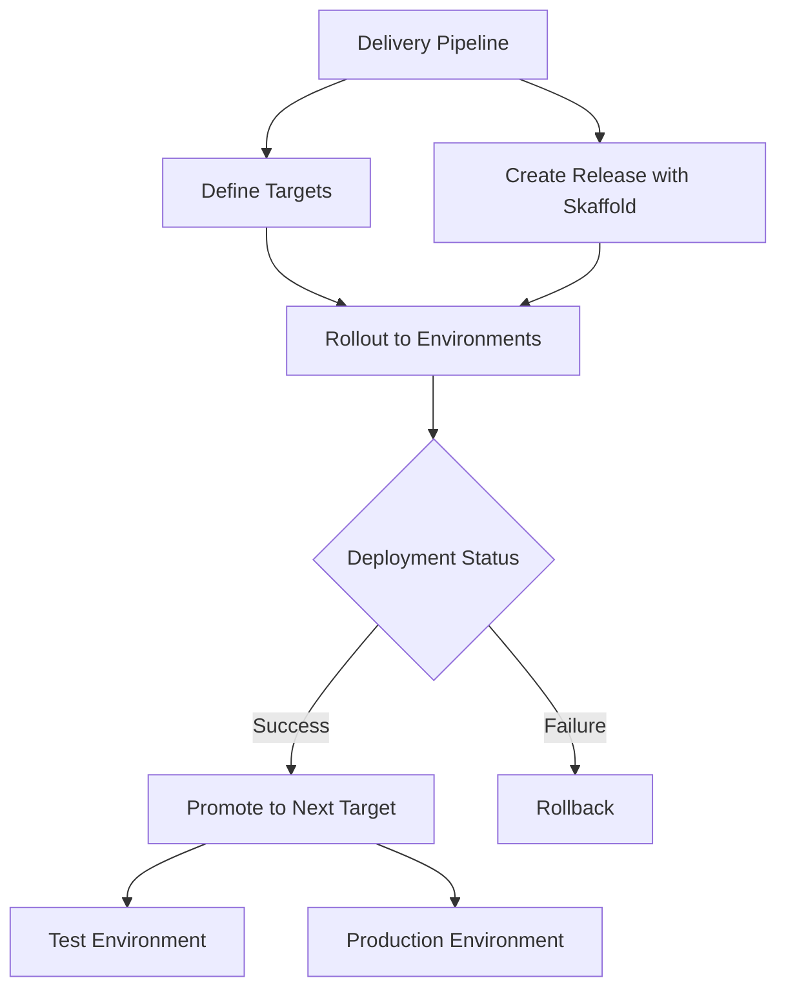

# Session 48: Working with Cloud Deploy GCP Part 1

<details open>
<summary><b>048-Working-With-Cloud-Deploy-GCP-Part-1 (KK-CS45-script-v3)</b></summary>

## Table of Contents
- [Overview](#overview)
- [Key Concepts and Architecture](#key-concepts-and-architecture)
  - [What is Cloud Deploy?](#what-is-cloud-deploy)
  - [Cloud Deploy Architecture](#cloud-deploy-architecture)
  - [Skaffold Integration](#skaffold-integration)
  - [Delivery Pipelines](#delivery-pipelines)
  - [Targets and Environments](#targets-and-environments)
- [Lab Demos](#lab-demos)
  - [Demo 1: Deploy to Kubernetes Engine using CLI](#demo-1-deploy-to-kubernetes-engine-using-cli)
  - [Demo 2: Deploy to Cloud Run using CLI](#demo-2-deploy-to-cloud-run-using-cli)
  - [Demo 3: Multi-Stage Pipeline using Console](#demo-3-multi-stage-pipeline-using-console)
- [Summary](#summary)

## Overview

Cloud Deploy is Google's fully managed continuous delivery service designed to automate application deployment to multiple target environments including Google Kubernetes Engine (GKE) and Cloud Run. This session introduces the fundamental concepts of Cloud Deploy, its architecture, and practical deployment workflows using both CLI and console interfaces.

The tutorial demonstrates how Cloud Deploy streamlines the delivery pipeline, provides rollback capabilities, and integrates with popular CI/CD tools like Cloud Build and Jenkins. It covers creating delivery pipelines, defining targets, managing releases and rollouts, and implementing approval workflows.

## Key Concepts and Architecture

### What is Cloud Deploy?

Cloud Deploy is a managed service that automates the delivery of applications to target environments through a streamlined, fully manageable continuous delivery process. It enables one-click rollouts of new images, provides rollback capabilities when issues occur, and integrates with existing GCP services.

> [!IMPORTANT]
Key Features:
- **Managed Service**: Fully managed by Google Cloud Platform
- **Multi-Target Support**: Deploy to GKE clusters and Cloud Run services
- **One-Click Operations**: Simple rollout and rollback through console or CLI
- **Integration**: Works with Cloud Build, Jenkins, and API access
- **Automation**: Supports automated deployment workflows

### Cloud Deploy Architecture

Cloud Deploy follows a structured workflow:

1. **Delivery Pipeline Creation**: Defines the sequence of target environments
2. **Target Definition**: Specifies where applications will be deployed (GKE or Cloud Run)
3. **Release Creation**: Packages application configurations using Skaffold
4. **Rollout Execution**: Deploys to targets in the defined sequence



### Skaffold Integration

Skaffold is the configuration management tool used by Cloud Deploy for Kubernetes-native applications. It manages all deployment configurations including:

- Kubernetes manifests
- Cloud Run service configurations
- Profile-based deployments (development, staging, production)

**Skaffold Configuration Structure:**
- **API Version**: Defines Skaffold version compatibility
- **Kind**: Specifies configuration type (Config)
- **Metadata**: Naming and labeling information
- **Profiles**: Environment-specific configurations
- **Manifests**: References to application manifests

### Delivery Pipelines

Delivery pipelines define the progression from one target environment to another. Key components:

- **Serial Pipelines**: Linear progression (Dev → Staging → Production)
- **Stages**: Named deployment stages within the pipeline
- **Profiles**: Environment-specific configurations within Skaffold

### Targets and Environments

Cloud Deploy supports multiple target types:

#### Kubernetes Engine (GKE) Targets
- **Regional Clusters**: Multi-zone availability
- **Zonal Clusters**: Single-zone deployment
- **Cluster Requirements**: Existing GKE cluster with proper permissions

#### Cloud Run Targets
- **Serverless Deployment**: Fully managed container execution
- **Region-Specific**: Deploy to specific GCP regions
- **Authentication**: Configurable access controls

## Lab Demos

### Demo 1: Deploy to Kubernetes Engine using CLI

#### Prerequisites
Ensure you have:
- Active Google Cloud Project
- Existing GKE cluster
- Cloud Deploy API enabled
- gcloud CLI installed and authenticated

#### Steps

1. **Create Cloud Deploy YAML Configuration**
   Create `cloud-deploy.yaml` for delivery pipeline:

   ```yaml:cloud-deploy.yaml
   apiVersion: deploy.cloud.google.com/v1
   kind: DeliveryPipeline
   metadata:
     name: gke-demo-pipeline
   description: Basic pipeline for GKE deployment
   serialPipeline:
     stages:
     - targetId: gke-cluster-target
   ```

2. **Create Target Configuration**
   Create `cloud-deploy-target.yaml`:

   ```yaml:target.yaml
   apiVersion: deploy.cloud.google.com/v1
   kind: Target
   metadata:
     name: gke-cluster-target
   description: GKE cluster target for deployment
   gke:
     cluster: projects/[PROJECT-ID]/locations/us-central1-c/clusters/[CLUSTER-NAME]
   ```

3. **Deploy Delivery Pipeline**
   ```bash
   gcloud deploy apply --file cloud-deploy.yaml --region us-central1 --project [PROJECT-ID]
   ```

4. **Deploy Target Configuration**
   ```bash
   gcloud deploy apply --file target.yaml --region us-central1 --project [PROJECT-ID]
   ```

5. **Create Sample Pod YAML**
   Create `k8s-pod.yaml`:

   ```yaml:k8s-pod.yaml
   apiVersion: v1
   kind: Pod
   metadata:
     name: getting-started
   spec:
     containers:
     - name: my-container
       image: gcr.io/google-samples/hello-app:1.0
   ```

6. **Create Skaffold Configuration**
   Create `skaffold.yaml`:

   ```yaml:skaffold.yaml
   apiVersion: skaffold/v2beta29
   kind: Config
   metadata:
     name: gke-deploy
   deploy:
     kubectl:
       manifests:
       - k8s-pod.yaml
   ```

7. **Create Release**
   ```bash
   gcloud deploy releases create release-gke \
     --delivery-pipeline gke-demo-pipeline \
     --region us-central1 \
     --project [PROJECT-ID]
   ```

8. **Verify Deployment**
   Access Kubernetes cluster:
   ```bash
   gcloud container clusters get-credentials [CLUSTER-NAME] \
     --region us-central1-c --project [PROJECT-ID]
   
   kubectl get pods
   ```

### Demo 2: Deploy to Cloud Run using CLI

#### Prerequisites
- Google Cloud Project with Cloud Run API enabled
- Properly configured service account permissions

#### Steps

1. **Create Cloud Run Delivery Pipeline**
   `cloud-deploy-run.yaml`:

   ```yaml:cloud-deploy-run.yaml
   apiVersion: deploy.cloud.google.com/v1
   kind: DeliveryPipeline
   metadata:
     name: cloud-run-demo-pipeline
   description: Pipeline for Cloud Run deployment
   serialPipeline:
     stages:
     - targetId: cloud-run-target
   ```

2. **Create Cloud Run Target**
   `cloud-deploy-run-target.yaml`:

   ```yaml:target-run.yaml
   apiVersion: deploy.cloud.google.com/v1
   kind: Target
   metadata:
     name: cloud-run-target
   description: Cloud Run target configuration
   run:
     location: projects/[PROJECT-ID]/locations/us-central1
   ```

3. **Create Cloud Run Service**
   `run-service.yaml`:

   ```yaml:run-service.yaml
   apiVersion: serving.knative.dev/v1
   kind: Service
   metadata:
     name: getting-started-run
   spec:
     template:
       spec:
         containers:
         - image: gcr.io/google-samples/hello-app:1.0
   ```

4. **Create Skaffold for Cloud Run**
   `skaffold-run.yaml`:

   ```yaml:skaffold-run.yaml
   apiVersion: skaffold/v2beta29
   kind: Config
   metadata:
     name: cloud-run-deploy
   profiles:
   - name: dev
     deploy:
       cloudrun: {}
   deploy:
     cloudrun: {}
   manifests:
     rawYaml:
     - run-service.yaml
   ```

5. **Apply Configurations**
   ```bash
   gcloud deploy apply --file cloud-deploy-run.yaml --region us-central1 --project [PROJECT-ID]
   gcloud deploy apply --file target-run.yaml --region us-central1 --project [PROJECT-ID]
   ```

6. **Create Release**
   ```bash
   gcloud deploy releases create release-run \
     --delivery-pipeline cloud-run-demo-pipeline \
     --region us-central1 \
     --project [PROJECT-ID]
   ```

7. **Verify Cloud Run Service**
   Check the Cloud Run console for the deployed service and access the URL.

### Demo 3: Multi-Stage Pipeline using Console

#### Prerequisites
- GCP Console access
- Permissions for Cloud Deploy operations

#### Steps

1. **Access Cloud Deploy Console**
   - Navigate to GCP Console → Cloud Deploy
   - Click "Create Delivery Pipeline"

2. **Configure Multi-Stage Pipeline**
   - Name: `test-to-prod-pipeline`
   - Region: `us-central1`

3. **Add First Target (Test Environment)**
   - Target Type: Cloud Run
   - Location: `us-central1`
   - Target ID: `test-target`

4. **Add Second Target (Production)**
   - Target Type: Cloud Run
   - Location: `us-central1`
   - Target ID: `prod-target`
   - Enable: Require approval for rollouts

5. **Advanced Options (Optional)**
   - Enable Canary deployments (10% traffic initially)
   - Configure automatic promotion on successful rollout

6. **Create Pipeline**
   - Review configuration
   - Click "Create"

7. **Create Release**
   - Click "Create Release"
   - Release Name: `test-to-prod`
   - Select sample image or use container registry image
   - Configure service names for test and prod environments

8. **Monitor Deployment**
   - Track rollout progress
   - Approve production deployment when ready

9. **Test Promotion and Rollback**
   - Promote from test to production
   - Test rollback functionality

## Summary

### Key Takeaways

```diff
+ Cloud Deploy enables automated application delivery to GKE and Cloud Run targets
+ Skaffold manages Kubernetes-native deployment configurations
+ Delivery pipelines define target environment sequences
+ Rollouts can be promoted or rolled back with console or CLI
+ Multi-target pipelines support approval workflows and canary deployments
+ Integration with Cloud Build provides automated build-to-deploy workflows
+ Console interface provides guided workflow creation
+ CLI offers scriptable, programmable deployment operations
```

### Quick Reference

**Common Commands:**
```bash
# Create delivery pipeline
gcloud deploy apply --file cloud-deploy.yaml --region REGION --project PROJECT

# Create release
gcloud deploy releases create RELEASE-NAME --delivery-pipeline PIPELINE-NAME --region REGION --project PROJECT

# Check cluster connectivity
gcloud container clusters get-credentials CLUSTER-NAME --region ZONE --project PROJECT
kubectl get pods
```

**Configuration Structure:**
- `cloud-deploy.yaml`: Pipeline definition
- `target.yaml`: Target environment specification  
- `skaffold.yaml`: Application deployment configuration
- `k8s-*.yaml`: Kubernetes manifests
- `run-service.yaml`: Cloud Run service definition

**Pricing Information:**
- Single-target pipelines: Free
- Multi-target pipelines: $5 per additional pipeline per region per month
- Reuse pipeline names to avoid additional charges

### Expert Insight

#### Real-world Application
Cloud Deploy excels in enterprise environments requiring:
- **Controlled Deployments**: Approval workflows for production releases
- **Multi-Environment Pipelines**: Test → Staging → Production progression
- **Rollback Capabilities**: Quick recovery from deployment failures
- **Integration with CI/CD**: Automated triggers from Cloud Build

#### Expert Path
- Master Skaffold profiles for complex multi-environment configurations
- Implement canary deployments for gradual traffic shifting
- Set up approval notifications using Cloud Monitoring alerts
- Create reusable pipeline templates for consistent deployments
- Integrate with Google Cloud IAM for granular access controls

#### Common Pitfalls
- **Pipeline Naming**: Reusing names across multiple targets prevents additional charges but can cause confusion
- **Skaffold Configuration**: Incorrect manifest paths or profile configurations lead to deployment failures
- **Permissions**: Insufficient IAM permissions cause target application failures
- **Resource Deletion**: Deleting and recreating pipelines may incur additional costs
- **Console vs CLI**: Production deployments should use CLI for versioning and audit trails

</details>
